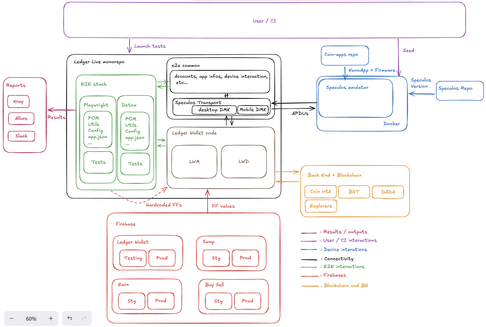

# PART 1 -- FOUNDATIONS

<div class="chapter-intro">
Welcome to the Ledger Live QA Automation team. This first part builds the mental model you need before touching any code. By the end, you will understand what you are testing, what technologies power it, how the entire E2E test architecture works, how the monorepo is organized, and how to set up your machine. Take your time here — everything that follows depends on these foundations.
</div>

---

## What Is Ledger Live?

<div class="chapter-intro">
Before you can test software effectively, you need to understand what it does and who it serves. This chapter introduces Ledger Live as a product, its platform architecture, and your role as a QA Automation Engineer within the team. This is the "why" behind everything you will build.
</div>

### 1.1 The Product

Ledger Live is Ledger's official companion application for managing crypto assets. It allows users to:

- **Send and receive** cryptocurrencies (Bitcoin, Ethereum, Solana, 80+ coins)
- **View their portfolio** with real-time balances and countervalues (EUR, USD, etc.)
- **Stake and earn** rewards on proof-of-stake networks
- **Swap** between assets via integrated decentralized exchanges
- **Buy and sell** crypto through partner providers
- **Manage their Ledger hardware wallet** (install apps, update firmware)
- **Access Web3 dApps** through the Discover section and WalletConnect

The application is developed and maintained by multiple teams at Ledger, each owning different features. The **QAA squad** (QA & Automation) is your team — maintained by the [QAA squad Slack channel](https://ledger.enterprise.slack.com/archives/C081T58FFHA).

### 1.2 The Platforms

| Platform | Tech | Location in Repo | Abbreviation |
|----------|------|------------------|-------------|
| **Desktop** (Windows, macOS, Linux) | Electron + React | `apps/ledger-live-desktop/` | LLD |
| **Mobile** (iOS, Android) | React Native | `apps/ledger-live-mobile/` | LLM |
| **CLI** (developer tool) | Node.js | `apps/cli/` | CLI |
| **Web Tools** | Next.js | `apps/web-tools/` | — |

The **Desktop** and **Mobile** apps are the primary products. The **CLI** is used internally and in E2E tests to populate test data (create accounts, generate addresses). **Web Tools** are developer utilities.

You will see these abbreviations throughout the codebase and wiki: **LLD** (Ledger Live Desktop), **LLM** (Ledger Live Mobile), **LLC** (Ledger Live Common — the shared library layer).

### 1.3 What Does QA Automation Do Here?

As a QA Automation Engineer, you will:

1. **Write E2E tests** that simulate real user journeys (sending crypto, adding accounts, swapping)
2. **Use Speculos** (a hardware wallet simulator) to test device interactions without a physical Ledger
3. **Maintain test infrastructure** (page objects, fixtures, helpers)
4. **Analyze CI reports** (Allure) to identify flaky tests and regressions
5. **Collaborate with dev teams** to ensure new features have test coverage

Your team is **`@ledgerhq/qaa`** (QA & Automation). You own the `e2e/` directory, the Speculos transport library, and the E2E test infrastructure. Currently, the team maintains **150+ UI end-to-end test scenarios** executed using Speculos in conjunction with Playwright (desktop) and Detox (mobile).

### 1.4 Key Concept: Hardware Wallet Testing

Unlike testing a regular web app, Ledger Live requires a **hardware device** to sign transactions. In E2E tests, we use **Speculos** — a software emulator that runs real Ledger device firmware inside Docker. This lets us test the full flow (app -> device -> blockchain) without physical hardware.

```
[Ledger Live App] <--APDU--> [Speculos (Docker)] <--Emulated--> [Device Firmware + Coin App]
```

**APDU** = Application Protocol Data Unit. The low-level binary protocol used to communicate with Ledger devices. Every command sent to the device (sign transaction, get address, open app) is an APDU message.

**Why not use real devices in automated tests?**
- Real devices require USB/Bluetooth (not available in CI runners)
- Cannot be parallelized (one device per test)
- Need manual button presses (cannot automate)
- Not scalable (limited hardware)

Speculos solves all of these: it runs in Docker, can be parallelized, and exposes a REST API to simulate button presses.

### 1.5 The Testing Strategy

The team follows a strategy designed to be as close to real user interactions as possible:

- **Speculos is a launcher**: In the E2E context, Speculos is instantiated with the correct Nano app libraries needed for the test scenario
- **Spawning**: For each cryptocurrency, a dedicated Speculos instance is spawned to emulate the specific Nano app
- **Test data preparation**: Before running tests, the CLI creates required test data (accounts, addresses) using the same logic as Ledger Live itself
- **Transaction broadcasting**: On CI, real blockchain transactions are only broadcast on Monday nightly runs to control costs. Other runs use `DISABLE_TRANSACTION_BROADCAST=1`
- **Teardown**: Speculos instances are terminated after tests to free resources

This strategy removes mocks and conducts tests that closely mimic real user interactions, providing more reliable results than purely mocked E2E tests.

<div class="chapter-outro">
You now understand what Ledger Live is, what platforms it runs on, and what your role involves. The key takeaway: you are testing a security-critical financial application that requires hardware device simulation. This is what makes your work unique compared to standard web QA.
</div>

<div class="resource-box">
<h4>Additional Resources</h4>
<ul>
<li><a href="https://www.ledger.com/ledger-live">Ledger Live Product Page</a> — See the product from the user's perspective</li>
<li><a href="https://github.com/LedgerHQ/ledger-live">GitHub Repository</a> — The monorepo you will work in daily</li>
<li><a href="https://github.com/LedgerHQ/speculos">Speculos Repository</a> — The device emulator source code</li>
<li><a href="https://github.com/LedgerHQ/ledger-live/wiki">Ledger Live Wiki</a> — Internal team documentation</li>
</ul>
</div>

### 1.6 Quiz

<!-- Chapter 1 Quiz -->
<div class="quiz-container" id="quiz-ch1" data-pass-threshold="80">
<h3>Quiz</h3>
<p class="quiz-subtitle">Test your understanding of Ledger Live fundamentals. Click an answer to check it.</p>
<div class="quiz-progress"><div class="quiz-progress-bar"></div></div>

<div class="quiz-question" data-correct="C">
<p><strong>Q1.</strong> How many cryptocurrencies does Ledger Live support natively?</p>
<div class="quiz-choices">
<button class="quiz-choice" data-value="A">A) 10</button>
<button class="quiz-choice" data-value="B">B) 30</button>
<button class="quiz-choice" data-value="C">C) 80+</button>
<button class="quiz-choice" data-value="D">D) 200+</button>
</div>
<p class="quiz-explanation">Ledger Live supports over 80 cryptocurrencies natively, plus thousands of ERC-20 and other chain-specific tokens.</p>
</div>

<div class="quiz-question" data-correct="A">
<p><strong>Q2.</strong> Which of these is NOT a feature of Ledger Live?</p>
<div class="quiz-choices">
<button class="quiz-choice" data-value="A">A) Mining cryptocurrencies</button>
<button class="quiz-choice" data-value="B">B) Swapping between assets</button>
<button class="quiz-choice" data-value="C">C) Staking for rewards</button>
<button class="quiz-choice" data-value="D">D) Managing hardware wallet firmware</button>
</div>
<p class="quiz-explanation">Ledger Live does not mine cryptocurrencies. It is a wallet management application, not a mining tool.</p>
</div>

<div class="quiz-question" data-correct="B">
<p><strong>Q3.</strong> Which technology powers the Desktop version of Ledger Live?</p>
<div class="quiz-choices">
<button class="quiz-choice" data-value="A">A) React Native</button>
<button class="quiz-choice" data-value="B">B) Electron + React</button>
<button class="quiz-choice" data-value="C">C) Next.js</button>
<button class="quiz-choice" data-value="D">D) Flutter</button>
</div>
<p class="quiz-explanation">The desktop app wraps a React UI inside Electron, which provides Chromium + Node.js for cross-platform desktop support.</p>
</div>

<div class="quiz-question" data-correct="B">
<p><strong>Q4.</strong> What tool does the QA team use to simulate hardware wallet interactions?</p>
<div class="quiz-choices">
<button class="quiz-choice" data-value="A">A) Jest</button>
<button class="quiz-choice" data-value="B">B) Speculos</button>
<button class="quiz-choice" data-value="C">C) Detox</button>
<button class="quiz-choice" data-value="D">D) Playwright</button>
</div>
<p class="quiz-explanation">Speculos is a software emulator that runs real Ledger device firmware inside Docker, enabling automated testing without physical hardware.</p>
</div>

<div class="quiz-question" data-correct="D">
<p><strong>Q5.</strong> Why can't the team use real Ledger devices in CI pipelines?</p>
<div class="quiz-choices">
<button class="quiz-choice" data-value="A">A) Real devices are too expensive</button>
<button class="quiz-choice" data-value="B">B) Real devices only work on Windows</button>
<button class="quiz-choice" data-value="C">C) CI runners cannot install device firmware</button>
<button class="quiz-choice" data-value="D">D) CI runners lack USB/Bluetooth, cannot parallelize, and cannot automate button presses</button>
</div>
<p class="quiz-explanation">CI runners are headless Linux machines without USB/Bluetooth. Physical devices can only run one test at a time and require manual button presses — none of which works in an automated pipeline.</p>
</div>

<div class="quiz-score"></div>
</div>

---

## The Tech Stack

<div class="chapter-intro">
Ledger Live is built on a modern JavaScript/TypeScript stack with specific choices for each platform. Understanding the tech stack helps you read code, write tests, and debug failures. This chapter maps every technology to its purpose in the project.
</div>

### 3.1 Language & Runtime

| Technology | Version | Purpose | Docs |
|-----------|---------|---------|------|
| **TypeScript** | 5.x | Primary language for all code | [typescriptlang.org](https://www.typescriptlang.org/) |
| **Node.js** | 20+ (managed via Proto) | Runtime for build tools, CLI, and main process | [nodejs.org](https://nodejs.org/) |
| **Hermes** | (bundled) | JavaScript engine for React Native on mobile | [hermesengine.dev](https://hermesengine.dev/) |

### 3.2 Frontend Frameworks

| Technology | Where Used | Purpose | Docs |
|-----------|-----------|---------|------|
| **React** 18 | Desktop (renderer process) | UI component library | [react.dev](https://react.dev/) |
| **React Native** 0.76+ | Mobile (iOS + Android) | Cross-platform native mobile UI | [reactnative.dev](https://reactnative.dev/) |
| **Electron** 33+ | Desktop (shell) | Cross-platform desktop app framework | [electronjs.org](https://www.electronjs.org/) |

### 3.3 State Management & Routing

| Technology | Where Used | Purpose | Docs |
|-----------|-----------|---------|------|
| **Redux Toolkit** | Desktop + Mobile | Global state management | [redux-toolkit.js.org](https://redux-toolkit.js.org/) |
| **RTK Query** | Desktop + Mobile | API data fetching and caching | [redux-toolkit.js.org/rtk-query](https://redux-toolkit.js.org/rtk-query/overview) |
| **React Router** 6 | Desktop | Page navigation | [reactrouter.com](https://reactrouter.com/) |
| **React Navigation** 6 | Mobile | Native navigation (stacks, tabs, drawers) | [reactnavigation.org](https://reactnavigation.org/) |

### 3.4 Styling & UI

| Technology | Where Used | Purpose | Docs |
|-----------|-----------|---------|------|
| **Styled-Components** | Desktop | CSS-in-JS component styling | [styled-components.com](https://styled-components.com/) |
| **Lumen UI (React)** | Desktop | Ledger's design system for web | (internal) |
| **Lumen UI (RN)** | Mobile | Ledger's design system for native | (internal) |
| **Tailwind CSS** | Internal tools | Utility-first CSS | [tailwindcss.com](https://tailwindcss.com/) |
| **i18next** | Desktop + Mobile | Internationalization (18 languages) | [i18next.com](https://www.i18next.com/) |

### 3.5 Build & Package Tools

| Technology | Purpose | Docs |
|-----------|---------|------|
| **pnpm** | Fast, disk-efficient package manager | [pnpm.io](https://pnpm.io/) |
| **Turborepo** | Monorepo build orchestration + caching | [turbo.build](https://turbo.build/) |
| **Rspack** | Rust-based bundler for Desktop (replaces webpack) | [rspack.dev](https://rspack.dev/) |
| **Metro** | JavaScript bundler for React Native (Mobile) | [metrobundler.dev](https://metrobundler.dev/) |
| **ESLint** + **Oxlint** | Linting (Oxlint in Rust for speed, ESLint for depth) | [eslint.org](https://eslint.org/) / [oxc.rs](https://oxc.rs/) |

### 3.6 Testing Tools

| Tool | Layer | Used For | Docs |
|------|-------|----------|------|
| **Playwright** | E2E (Desktop) | Browser automation in Electron | [playwright.dev](https://playwright.dev/) |
| **Detox** | E2E (Mobile) | Native app automation (iOS/Android) | [wix.github.io/Detox](https://wix.github.io/Detox/) |
| **Jest** | Unit + Integration | Test runner, assertions, mocks | [jestjs.io](https://jestjs.io/) |
| **MSW** | Integration | Network API mocking at service-worker level | [mswjs.io](https://mswjs.io/) |
| **Testing Library** | Integration | User-centric DOM/component querying | [testing-library.com](https://testing-library.com/) |
| **Allure** | Reporting | Rich interactive test reports | [allurereport.org](https://allurereport.org/) |
| **Xray** | Test Management | Jira-integrated test case management | [getxray.app](https://www.getxray.app/) |
| **Speculos** | E2E | Hardware wallet emulation | [GitHub](https://github.com/LedgerHQ/speculos) |

### 3.7 DevOps & CI

| Technology | Purpose | Docs |
|-----------|---------|------|
| **GitHub Actions** | CI/CD (73+ workflow files) | [docs.github.com/actions](https://docs.github.com/en/actions) |
| **Docker** | Containerization (Speculos, builds) | [docker.com](https://www.docker.com/) |
| **Changesets** | Version management and changelogs | [GitHub](https://github.com/changesets/changesets) |
| **hk** | Git hooks runner | [GitHub](https://github.com/jdx/hk) |
| **Gitleaks** | Secret detection in commits | [gitleaks.io](https://gitleaks.io/) |

<div class="chapter-outro">
This is a large stack, but you do not need to master everything at once. As a QA engineer, your primary tools are Playwright, Detox, Speculos, Jest, and Allure. Part 3 covers the cross-cutting tools (Speculos, Allure, feature flags); Part 4 walks Playwright zero-to-advanced for desktop; Part 5 does the same for Detox on mobile.
</div>

<div class="resource-box">
<h4>Additional Resources</h4>
<ul>
<li><a href="https://www.typescriptlang.org/play">TypeScript Playground</a> — Try TypeScript in the browser</li>
<li><a href="https://react.dev/learn">React Official Tutorial</a> — Interactive React learning</li>
<li><a href="https://playwright.dev/docs/intro">Playwright Documentation</a> — Your primary desktop E2E tool</li>
<li><a href="https://wix.github.io/Detox/docs/introduction/getting-started">Detox Documentation</a> — Your primary mobile E2E tool</li>
</ul>
</div>

### 3.8 Quiz

<!-- Chapter 2 Quiz -->
<div class="quiz-container" id="quiz-ch2" data-pass-threshold="80">
<h3>Quiz</h3>
<p class="quiz-subtitle">Verify you know the stack components. Click an answer to check it.</p>
<div class="quiz-progress"><div class="quiz-progress-bar"></div></div>

<div class="quiz-question" data-correct="A">
<p><strong>Q1.</strong> What is the primary programming language used across the Ledger Live codebase?</p>
<div class="quiz-choices">
<button class="quiz-choice" data-value="A">A) TypeScript</button>
<button class="quiz-choice" data-value="B">B) JavaScript (no types)</button>
<button class="quiz-choice" data-value="C">C) Kotlin</button>
<button class="quiz-choice" data-value="D">D) Swift</button>
</div>
<p class="quiz-explanation">TypeScript 5.x is used throughout: desktop app, mobile app, shared libraries, and tests.</p>
</div>

<div class="quiz-question" data-correct="C">
<p><strong>Q2.</strong> Which bundler does Ledger Live Desktop use, and why?</p>
<div class="quiz-choices">
<button class="quiz-choice" data-value="A">A) Webpack — it is the industry standard</button>
<button class="quiz-choice" data-value="B">B) Vite — it is the fastest</button>
<button class="quiz-choice" data-value="C">C) Rspack — it is webpack-compatible but 5-10x faster (written in Rust)</button>
<button class="quiz-choice" data-value="D">D) Metro — it is designed for React</button>
</div>
<p class="quiz-explanation">Rspack provides near-identical webpack configuration compatibility but with dramatically faster build times. Metro is for React Native (mobile).</p>
</div>

<div class="quiz-question" data-correct="B">
<p><strong>Q3.</strong> What is the difference between Playwright and Detox in this project?</p>
<div class="quiz-choices">
<button class="quiz-choice" data-value="A">A) Playwright tests mobile, Detox tests desktop</button>
<button class="quiz-choice" data-value="B">B) Playwright tests desktop (Electron), Detox tests mobile (React Native)</button>
<button class="quiz-choice" data-value="C">C) They are interchangeable</button>
<button class="quiz-choice" data-value="D">D) Playwright is for unit tests, Detox for E2E</button>
</div>
<p class="quiz-explanation">Playwright automates the Chromium renderer in Electron (desktop). Detox automates native iOS/Android apps (mobile). Different platforms, different tools.</p>
</div>

<div class="quiz-question" data-correct="D">
<p><strong>Q4.</strong> What does MSW (Mock Service Worker) do in integration tests?</p>
<div class="quiz-choices">
<button class="quiz-choice" data-value="A">A) It replaces the test runner</button>
<button class="quiz-choice" data-value="B">B) It mocks React components</button>
<button class="quiz-choice" data-value="C">C) It replaces the `fetch` function directly</button>
<button class="quiz-choice" data-value="D">D) It intercepts HTTP requests at the network level, so application code works unchanged</button>
</div>
<p class="quiz-explanation">MSW intercepts requests before they leave the application. Unlike mocking `fetch` directly, MSW works transparently with any HTTP client (fetch, axios, RTK Query).</p>
</div>

<div class="quiz-question" data-correct="C">
<p><strong>Q5.</strong> Why does the project use BOTH ESLint and Oxlint?</p>
<div class="quiz-choices">
<button class="quiz-choice" data-value="A">A) They lint different languages</button>
<button class="quiz-choice" data-value="B">B) ESLint is deprecated in favor of Oxlint</button>
<button class="quiz-choice" data-value="C">C) Oxlint (Rust) handles common rules very fast; ESLint provides deep plugin-based analysis</button>
<button class="quiz-choice" data-value="D">D) Oxlint only runs in CI, ESLint only runs locally</button>
</div>
<p class="quiz-explanation">Oxlint runs ~20x faster for common rules. ESLint provides the full rule set including React, TypeScript, and import plugins. Together: fast feedback + comprehensive coverage.</p>
</div>

<div class="quiz-score"></div>
</div>

---

## E2E Test Architecture

<div class="chapter-intro">
This is the most important chapter in Part 1. Understanding the full end-to-end test architecture — every component, how data flows, and where failures can occur — is the foundation for everything you will build. Study the diagram carefully; you will reference it constantly.
</div>

### 4.1 The Full Architecture Diagram



### 4.2 Component Breakdown

**1. User/CI Trigger**
Tests are triggered either locally by a developer or via GitHub Actions (on PR, on schedule, or manually via `workflow_dispatch`). The CI workflows handle building the app, pulling Docker images, and orchestrating test execution across sharded runners.

**2. Desktop E2E (Playwright)**
Playwright launches the Electron app and controls the Chromium renderer process. Test code uses **page objects** (with `@step` decorators for Allure reporting) and **fixtures** (which set up Speculos, load userdata profiles, and provide the `app` object). See Chapters 8 and 13 for details.

**3. Mobile E2E (Detox)**
Detox launches the React Native app on an iOS Simulator or Android Emulator. A **WebSocket bridge** enables communication between the test process and the running app for state injection and mock device actions. See Chapters 9 and 15 for details.

**4. e2e/common/**
Shared infrastructure used by both desktop and mobile tests. Contains the Speculos transport layer, device model definitions, coin app configurations, and APDU helpers. This ensures both platforms use identical device emulation logic.

**5. Speculos Emulator**
A Docker container running real Ledger firmware with a Nano app (e.g., Bitcoin, Ethereum). Exposes a REST API on port 5000 for sending commands, reading responses, and simulating user input (button presses for Nano S/X, touch/swipe for Stax/Flex).

**6. Coin-Apps Repository**
A separate GitHub repository (`LedgerHQ/coin-apps`) containing `.elf` binaries for every Nano app. Structured as `<device>/<firmware>/<appName>/app_<version>.elf`. For swap tests, multiple apps may be loaded (e.g., ETH + Exchange app).

**7. Firebase Remote Config**
Feature flags that control runtime behavior (enable/disable features, staged rollouts, A/B tests). Tests can override these via environment variables or `app.json` userdata files. See Chapter 11 for details.

**8. Backend APIs**
Ledger's backend services providing market rates, account data, blockchain explorers, and partner integrations. In E2E tests, some are hit live (Speculos tests) while others are mocked.

**9. Blockchain Networks**
The actual blockchain networks (Bitcoin, Ethereum, Solana, etc.) that Speculos-based tests interact with. Transactions are only broadcast on weekly Monday nightly runs to control costs.

**10. Reporting**
Test results flow to **Allure** (rich HTML reports with steps, screenshots, videos), **Xray** (Jira test management with TMS links like B2CQA-1234), and **Slack** (the `#live-repo-health` channel receives automated nightly results).

### 4.3 Data Flow Lifecycle

Here is what happens when an E2E test runs a "Send Bitcoin" scenario:

```
1. Test fixture starts Speculos container with Bitcoin app (.elf)
2. Test fixture loads userdata (skip-onboarding, 1-account-bitcoin)
3. Test navigates: Portfolio → Send → Select BTC
4. Test fills: recipient address, amount (0.001 BTC)
5. Test clicks "Continue" → app sends APDU to Speculos
6. Speculos shows "Review transaction" on emulated screen
7. Test calls Speculos REST API: POST /button (approve)
8. Device signs transaction → returns signed APDU to app
9. App broadcasts to Bitcoin network (or skips if DISABLE_TRANSACTION_BROADCAST=1)
10. Test asserts: "Transaction sent" confirmation message
11. Allure captures: screenshots, step trace, timing
12. Results uploaded: Allure artifact + optional Xray export
```

<div class="chapter-outro">
This architecture is what makes Ledger Live E2E testing unique. Every test involves three communicating systems: the app (Electron/RN), the emulated device (Speculos), and the blockchain. When a test fails, the bug could be in any of these layers — understanding the full picture is how you debug effectively.
</div>

<div class="resource-box">
<h4>Additional Resources</h4>
<ul>
<li><a href="https://github.com/LedgerHQ/speculos">Speculos GitHub</a> — Emulator source code and API documentation</li>
<li><a href="https://github.com/LedgerHQ/ledger-live/wiki/LLD:E2ETesting">LLD E2E Testing Wiki</a> — The team's internal E2E testing guide</li>
<li><a href="https://github.com/LedgerHQ/ledger-live/wiki/LLM:End-to-end-testing">LLM E2E Testing Wiki</a> — Mobile E2E testing guide</li>
<li><a href="https://developers.ledger.com/docs/device-app/architecture/io/apdu">APDU Protocol Documentation</a> — Learn the device communication protocol</li>
</ul>
</div>

### 4.4 Quiz

<!-- Chapter 3 Quiz -->
<div class="quiz-container" id="quiz-ch3" data-pass-threshold="80">
<h3>Quiz</h3>
<p class="quiz-subtitle">Test your understanding of the E2E architecture. This is critical knowledge.</p>
<div class="quiz-progress"><div class="quiz-progress-bar"></div></div>

<div class="quiz-question" data-correct="C">
<p><strong>Q1.</strong> Which component runs the actual Ledger device firmware in E2E tests?</p>
<div class="quiz-choices">
<button class="quiz-choice" data-value="A">A) Playwright</button>
<button class="quiz-choice" data-value="B">B) The Electron main process</button>
<button class="quiz-choice" data-value="C">C) Speculos (running in a Docker container)</button>
<button class="quiz-choice" data-value="D">D) The coin-apps repository</button>
</div>
<p class="quiz-explanation">Speculos is a Docker container that runs real firmware with Nano app .elf binaries. The coin-apps repo provides the binaries; Speculos runs them.</p>
</div>

<div class="quiz-question" data-correct="B">
<p><strong>Q2.</strong> What protocol does Ledger Live use to communicate with the device (or Speculos)?</p>
<div class="quiz-choices">
<button class="quiz-choice" data-value="A">A) HTTP REST</button>
<button class="quiz-choice" data-value="B">B) APDU (Application Protocol Data Unit)</button>
<button class="quiz-choice" data-value="C">C) WebSocket</button>
<button class="quiz-choice" data-value="D">D) gRPC</button>
</div>
<p class="quiz-explanation">APDU is the low-level binary protocol for all Ledger device communication. Speculos wraps this in a REST API, but the underlying protocol is APDU.</p>
</div>

<div class="quiz-question" data-correct="D">
<p><strong>Q3.</strong> Where does `e2e/common/` fit in the architecture?</p>
<div class="quiz-choices">
<button class="quiz-choice" data-value="A">A) It contains only desktop tests</button>
<button class="quiz-choice" data-value="B">B) It is the Speculos Docker image</button>
<button class="quiz-choice" data-value="C">C) It contains the Allure reporter</button>
<button class="quiz-choice" data-value="D">D) It is shared infrastructure (Speculos transport, device models, coin configs) used by both desktop and mobile tests</button>
</div>
<p class="quiz-explanation">The e2e/common/ layer ensures both Playwright (desktop) and Detox (mobile) tests use identical device emulation logic, preventing platform-specific inconsistencies.</p>
</div>

<div class="quiz-question" data-correct="A">
<p><strong>Q4.</strong> Why are blockchain transactions only broadcast on Monday nightly CI runs?</p>
<div class="quiz-choices">
<button class="quiz-choice" data-value="A">A) Broadcasting daily would deplete the test seed's funds too quickly due to transaction fees</button>
<button class="quiz-choice" data-value="B">B) The blockchain networks are only available on Mondays</button>
<button class="quiz-choice" data-value="C">C) Speculos cannot broadcast transactions</button>
<button class="quiz-choice" data-value="D">D) The backend APIs are rate-limited to once per week</button>
</div>
<p class="quiz-explanation">Broadcasting real transactions costs real cryptocurrency (gas/fees). Doing this every day would exhaust the test seed funds. Weekly broadcasts balance coverage with cost control.</p>
</div>

<div class="quiz-question" data-correct="C">
<p><strong>Q5.</strong> A test fails with "APDU error 6985" after clicking "Send". Where in the architecture is the problem?</p>
<div class="quiz-choices">
<button class="quiz-choice" data-value="A">A) The Playwright locator is wrong</button>
<button class="quiz-choice" data-value="B">B) Firebase feature flags are blocking the feature</button>
<button class="quiz-choice" data-value="C">C) The test did not simulate pressing "Approve" on Speculos — the device rejected the transaction</button>
<button class="quiz-choice" data-value="D">D) The blockchain network is down</button>
</div>
<p class="quiz-explanation">APDU error 6985 means "Conditions not satisfied" — the user cancelled/rejected on the device. The test needs to call Speculos REST API to press the approve button before the app can proceed.</p>
</div>

<div class="quiz-score"></div>
</div>

---

## Monorepo Structure & Team Ownership

<div class="chapter-intro">
The Ledger Live monorepo is one of the largest JavaScript monorepos you will encounter. Understanding its directory structure and team ownership model is essential for navigating the codebase, knowing where to make changes, and understanding code review workflows.
</div>

### 5.1 Top-Level Directory Structure

```
ledger-live/
├── apps/
│   ├── ledger-live-desktop/     # LLD — Electron + React desktop app
│   ├── ledger-live-mobile/      # LLM — React Native mobile app
│   ├── cli/                     # CLI developer tool
│   └── web-tools/               # Next.js developer utilities
├── libs/
│   ├── ledger-live-common/      # LLC — Shared business logic
│   ├── coin-modules/            # Coin-specific logic (Bitcoin, Ethereum, etc.)
│   ├── device-core/             # Device communication
│   ├── live-countervalues-react/# Currency conversion hooks
│   ├── client-ids/              # Privacy-protected ID management
│   └── ...                      # 50+ shared packages
├── e2e/
│   ├── desktop/                 # Playwright E2E tests for LLD
│   ├── mobile/                  # Detox E2E tests for LLM
│   └── common/                  # Shared E2E infrastructure
├── domain/
│   ├── entity/                  # Domain entity packages
│   └── api/                     # Domain API packages (RTK Query)
├── shared/                      # Shared utility packages
├── tools/                       # Build tools, scripts, CI actions
├── .github/
│   ├── workflows/               # 73+ GitHub Actions workflow files
│   └── actions/                 # Reusable composite actions
├── .claude/                     # Claude Code AI configuration
├── .cursor/                     # Cursor IDE AI configuration
├── CLAUDE.md                    # AI agent project instructions
├── turbo.json                   # Turborepo task configuration
├── pnpm-workspace.yaml          # pnpm workspace definition
└── CODEOWNERS                   # Team ownership mapping
```

### 5.2 The E2E Directory (Your Home)

```
e2e/
├── desktop/                          # Playwright tests for LLD
│   ├── tests/
│   │   ├── specs/                    # Test files (.spec.ts)
│   │   │   ├── speculos/            # Tests using real device emulation
│   │   │   └── ...                  # Tests using mocked data
│   │   ├── page/                    # Page Object Model classes
│   │   │   ├── abstractClasses.ts   # Base classes (PageHolder, Component, AppPage)
│   │   │   ├── index.ts            # Application hub (aggregates all page objects)
│   │   │   └── ...                 # Feature-specific page objects
│   │   ├── fixtures/               # Playwright fixture definitions
│   │   │   └── common.ts           # Main fixtures (app, speculos, userdata)
│   │   └── userdata/               # Pre-configured app state profiles
│   └── playwright.config.ts         # Playwright configuration
├── mobile/                           # Detox tests for LLM (peer workspace to e2e/desktop/)
│   ├── specs/                       # Test files (.spec.ts)
│   ├── page/                        # Page Object Model classes
│   ├── bridge/                      # WebSocket bridge (test <-> app)
│   ├── helpers/                     # Reusable helper functions
│   ├── detox.config.js              # Detox configuration
│   ├── jest.config.js               # Jest runner configuration
│   ├── jest.environment.ts          # Allure reporter wiring
│   ├── package.json                 # Nx/Turbo workspace (`e2e-mobile`)
│   └── project.json                 # Nx project descriptor
└── common/                          # Shared E2E infrastructure
    ├── speculos/                    # Speculos transport and management
    ├── models/                      # Device model definitions
    └── utils/                       # Shared utilities
```

### 5.3 CODEOWNERS and Team Ownership

The `CODEOWNERS` file maps directories to GitHub teams. When you open a PR, the owners of modified files are automatically added as reviewers:

| Path Pattern | Team | Responsibility |
|-------------|------|---------------|
| `e2e/` | `@ledgerhq/qaa` | E2E test infrastructure (your team) |
| `apps/ledger-live-desktop/` | `@ledgerhq/live-desktop` | Desktop app |
| `apps/ledger-live-mobile/` | `@ledgerhq/live-mobile` | Mobile app |
| `libs/ledger-live-common/` | `@ledgerhq/live-common` | Shared business logic |
| `libs/coin-modules/` | `@ledgerhq/coin-integration` | Coin-specific logic |
| `libs/device-core/` | `@ledgerhq/device-management-kit` | Device communication |

### 5.4 Team-Split Convention

When multiple teams contribute to the same directory, it is split into team-specific sub-folders:

```
[feature]/
  index.ts                 # Re-exports only
  team-coin-integration/   # Files owned by @ledgerhq/coin-integration
    coin_bitcoin.ts
  team-live-desktop/       # Files owned by @ledgerhq/live-desktop
    settings.ts
```

This keeps CODEOWNERS clear: `**/team-coin-integration/` is owned by `@ledgerhq/coin-integration`.

<div class="chapter-outro">
Navigating a monorepo with 100+ packages takes practice. The key shortcuts: `e2e/` is your home, `libs/ledger-live-common/` contains shared logic you will import, and `apps/` contains the applications you test. Use `pnpm --filter` to target specific packages.
</div>

<div class="resource-box">
<h4>Additional Resources</h4>
<ul>
<li><a href="https://github.com/LedgerHQ/ledger-live/wiki">Ledger Live Wiki — Home</a> — Full internal documentation index</li>
<li><a href="https://pnpm.io/workspaces">pnpm Workspaces</a> — How monorepo package management works</li>
<li><a href="https://turbo.build/repo/docs">Turborepo Documentation</a> — How build orchestration works</li>
</ul>
</div>

### 5.5 Quiz

<!-- Chapter 4 Quiz -->
<div class="quiz-container" id="quiz-ch4" data-pass-threshold="80">
<h3>Quiz</h3>
<p class="quiz-subtitle">Make sure you can navigate the monorepo confidently.</p>
<div class="quiz-progress"><div class="quiz-progress-bar"></div></div>

<div class="quiz-question" data-correct="C">
<p><strong>Q1.</strong> Where do Desktop E2E test files (`.spec.ts`) live?</p>
<div class="quiz-choices">
<button class="quiz-choice" data-value="A">A) `apps/ledger-live-desktop/tests/`</button>
<button class="quiz-choice" data-value="B">B) `libs/ledger-live-common/e2e/`</button>
<button class="quiz-choice" data-value="C">C) `e2e/desktop/tests/specs/`</button>
<button class="quiz-choice" data-value="D">D) `tools/e2e/desktop/`</button>
</div>
<p class="quiz-explanation">E2E tests live in the top-level `e2e/` directory, separate from the app source code. Desktop specs are in `e2e/desktop/tests/specs/`.</p>
</div>

<div class="quiz-question" data-correct="B">
<p><strong>Q2.</strong> What does the CODEOWNERS file do?</p>
<div class="quiz-choices">
<button class="quiz-choice" data-value="A">A) It lists all contributors to the repository</button>
<button class="quiz-choice" data-value="B">B) It maps file paths to GitHub teams for automatic PR review assignment</button>
<button class="quiz-choice" data-value="C">C) It controls who can merge to the main branch</button>
<button class="quiz-choice" data-value="D">D) It defines the build order for packages</button>
</div>
<p class="quiz-explanation">When you open a PR modifying files in `e2e/`, CODEOWNERS ensures `@ledgerhq/qaa` is automatically added as a reviewer.</p>
</div>

<div class="quiz-question" data-correct="D">
<p><strong>Q3.</strong> What does the `e2e/common/` directory contain?</p>
<div class="quiz-choices">
<button class="quiz-choice" data-value="A">A) Common React components shared between desktop and mobile</button>
<button class="quiz-choice" data-value="B">B) The Speculos Docker image</button>
<button class="quiz-choice" data-value="C">C) GitHub Actions workflows</button>
<button class="quiz-choice" data-value="D">D) Shared E2E infrastructure (Speculos transport, device models, coin configs) for both desktop and mobile</button>
</div>
<p class="quiz-explanation">The common/ directory ensures desktop (Playwright) and mobile (Detox) tests share the same Speculos interaction logic.</p>
</div>

<div class="quiz-question" data-correct="A">
<p><strong>Q4.</strong> What is the team-split convention used for?</p>
<div class="quiz-choices">
<button class="quiz-choice" data-value="A">A) Splitting multi-team directories into team-specific sub-folders for clear CODEOWNERS</button>
<button class="quiz-choice" data-value="B">B) Splitting tests between CI and local execution</button>
<button class="quiz-choice" data-value="C">C) Splitting the app between desktop and mobile</button>
<button class="quiz-choice" data-value="D">D) Splitting large files into smaller modules</button>
</div>
<p class="quiz-explanation">When multiple teams contribute to the same directory, team-split creates `team-<name>/` sub-folders so each team clearly owns its files in CODEOWNERS.</p>
</div>

<div class="quiz-question" data-correct="B">
<p><strong>Q5.</strong> Which team owns the `e2e/` directory?</p>
<div class="quiz-choices">
<button class="quiz-choice" data-value="A">A) @ledgerhq/live-desktop</button>
<button class="quiz-choice" data-value="B">B) @ledgerhq/qaa</button>
<button class="quiz-choice" data-value="C">C) @ledgerhq/coin-integration</button>
<button class="quiz-choice" data-value="D">D) @ledgerhq/live-common</button>
</div>
<p class="quiz-explanation">The QA & Automation team (@ledgerhq/qaa) owns the E2E test infrastructure, including the entire e2e/ directory.</p>
</div>

<div class="quiz-score"></div>
</div>

---

## Setting Up Your Development Environment

<div class="chapter-intro">
This chapter walks you through setting up your machine to build Ledger Live and run E2E tests. Follow each step carefully — environment issues are the #1 source of "it doesn't work" questions for new joiners. There is no quiz for this chapter; the test is whether your setup works.
</div>

### 6.1 Prerequisites

| Tool | Purpose | How to Install |
|------|---------|---------------|
| **Docker Desktop** | Run Speculos containers | [docker.com](https://www.docker.com/products/docker-desktop/) |
| **Proto** | Manage Node.js and pnpm versions | Auto-managed via `.prototools` |
| **Git** | Version control | `brew install git` (macOS) |
| **Xcode** (macOS, for mobile) | iOS simulator + build tools | Mac App Store + `xcode-select --install` |
| **Android Studio** (for mobile) | Android emulator + SDK | [developer.android.com](https://developer.android.com/studio) |
| **Ruby 3.3** (for mobile iOS) | CocoaPods dependency | `brew install ruby@3.3` |

### 6.2 Clone and Install

```bash
# 1. Clone the monorepo
git clone https://github.com/LedgerHQ/ledger-live.git
cd ledger-live

# 2. Install correct tool versions (Node, pnpm)
proto use

# 3. Install all dependencies
pnpm install

# 4. Clone the coin-apps repository (for Speculos)
cd ..
git clone https://github.com/LedgerHQ/coin-apps.git
cd ledger-live
```

### 6.3 Environment Variables

Set these in your shell profile (`~/.zshrc` or `~/.bash_profile`):

```bash
# Required for E2E tests
export MOCK=0                                           # Use real Speculos, not mocks
export COINAPPS="/Users/yourname/coin-apps"             # Path to coin-apps repository
export SEED="your 24 word recovery phrase here"         # Test seed (get from QAA team)
export SPECULOS_IMAGE_TAG="ghcr.io/ledgerhq/speculos:master"
export SPECULOS_DEVICE="nanoSP"                         # Device model to emulate
export SPECULOS_FIRMWARE_VERSION="1.1.1"                # Firmware version (use prod version)
```

**Important:**
- The `SEED` is sensitive. Never commit it. Get it from the QAA team.
- `SPECULOS_DEVICE` options: `nanoS`, `nanoSP`, `nanoX`, `stax`, `flex`, `nanoGen5`
- Adjust `COINAPPS` path to where you cloned coin-apps

### 6.4 Pull Speculos Docker Image

```bash
docker pull ghcr.io/ledgerhq/speculos:master
```

Verify it is available:
```bash
docker images | grep speculos
```

### 6.5 Build for Desktop E2E Testing

```bash
# Build shared dependencies
pnpm build:lld:deps

# Build the CLI (used for test data preparation)
pnpm build:cli

# Build the desktop app in testing mode
pnpm desktop build:testing

# Install Playwright browser binaries
pnpm e2e:desktop test:playwright:setup
```

### 6.6 Build for Mobile E2E Testing

Mobile E2E setup is significantly more involved than desktop (Xcode, Android Studio, Ruby/CocoaPods, AVDs, simulators, ENVFILE variants, Detox configs). To keep this chapter focused on the baseline dev environment, the full mobile toolchain walkthrough lives in its own place.

**Baseline mac requirement:** you need an Apple Silicon Mac with at least 32 GB RAM and 100 GB free disk for a comfortable iOS + Android setup. Older Intel Macs will struggle with the iOS simulator + Metro + Speculos combination.

> **See Part 5 Ch 5.4 "Mobile Toolchain & Env Setup"** for the complete walkthrough: Xcode + Android Studio install, Ruby 3.3 + bundler, CocoaPods, AVD creation, iOS simulator naming, ENVFILE variants (`.env.mock`, `.env.mock.prerelease`, release variants), and the CocoaPods lockfile troubleshooting recipe.

### 6.7 Run Your First Test

**Desktop:**
```bash
# Run a single test
pnpm e2e:desktop test:playwright <testFileName>

# Run all tests
pnpm e2e:desktop test:playwright
```

**Mobile:**
```bash
# Start Metro bundler (for debug builds)
pnpm mobile start

# In another terminal — iOS (from e2e/mobile/):
cd e2e/mobile && pnpm test:ios:debug
# or: pnpm --filter e2e-mobile run test:ios:debug

# Android (from e2e/mobile/):
cd e2e/mobile && pnpm test:android:debug
# or: pnpm --filter e2e-mobile run test:android:debug
```

### 6.8 Verify Your Setup

If everything is working, you should see:
- Speculos container starts (check with `docker ps | grep speculos`)
- The app launches (Electron window for desktop, simulator/emulator for mobile)
- Tests interact with the app and complete (pass or fail with meaningful errors)

**Common setup issues:**

| Problem | Solution |
|---------|----------|
| `ECONNREFUSED :5000` | Docker not running or Speculos image not pulled |
| `TypeError: Invalid Version: DS_Store` | Run `find . -name ".DS_Store" -type f -delete` in coin-apps dir |
| Node version mismatch | Run `proto use` in the repo root |
| `pnpm-lock.yaml` conflicts | Run `pnpm install` again to regenerate |
| iOS pod install fails | `cd apps/ledger-live-mobile && pnpm mobile pod` |
| Android emulator not found | Ensure AVD is named exactly `Android_Emulator` |

> See **Appendix E: Troubleshooting FAQ** for an expanded version of this table with detailed solutions.

<div class="chapter-outro">
If your first test runs — even if it fails — your setup is correct. Most failures at this stage are environment issues, not code problems. If you are stuck, check the <a href="https://github.com/LedgerHQ/ledger-live/wiki/Issues,-Workarounds-and-Tricks">Issues, Workarounds and Tricks</a> wiki page or ask in the QAA Slack channel.
</div>

<div class="resource-box">
<h4>Additional Resources</h4>
<ul>
<li><a href="https://github.com/LedgerHQ/ledger-live/wiki/Onboarding">Onboarding Wiki</a> — Platform-specific setup guides</li>
<li><a href="https://github.com/LedgerHQ/ledger-live/wiki/Issues,-Workarounds-and-Tricks">Issues, Workarounds and Tricks Wiki</a> — Common monorepo issues and fixes</li>
<li><a href="https://github.com/LedgerHQ/ledger-live/wiki/LLD:E2ETesting">Desktop E2E Setup Guide</a> — Detailed desktop testing setup</li>
<li><a href="https://github.com/LedgerHQ/ledger-live/wiki/LLM:End-to-end-testing">Mobile E2E Setup Guide</a> — Detailed mobile testing setup</li>
<li><a href="https://labs.play-with-docker.com/">Play with Docker</a> — Interactive Docker sandbox if Docker is new to you</li>
</ul>
</div>

<!-- No quiz for Chapter 5 — this is a procedural setup chapter -->

---

## Part 1 Final Assessment

<div class="quiz-container" id="quiz-part1-final" data-pass-threshold="80">
<h3>Part 1 — Final Assessment</h3>
<p class="quiz-subtitle">Comprehensive assessment covering all of Part 1. You must score 80%+ to pass. Take your time.</p>
<div class="quiz-progress"><div class="quiz-progress-bar"></div></div>

<div class="quiz-question" data-correct="C">
<p><strong>Q1.</strong> What are the two primary platforms of Ledger Live?</p>
<div class="quiz-choices">
<button class="quiz-choice" data-value="A">A) Web and CLI</button>
<button class="quiz-choice" data-value="B">B) iOS and Android only</button>
<button class="quiz-choice" data-value="C">C) Desktop (Electron + React) and Mobile (React Native)</button>
<button class="quiz-choice" data-value="D">D) Desktop and Web</button>
</div>
<p class="quiz-explanation">LLD (Desktop) uses Electron + React. LLM (Mobile) uses React Native. These are the primary products.</p>
</div>

<div class="quiz-question" data-correct="B">
<p><strong>Q2.</strong> What does Speculos emulate?</p>
<div class="quiz-choices">
<button class="quiz-choice" data-value="A">A) The Ledger Live application</button>
<button class="quiz-choice" data-value="B">B) The Ledger hardware wallet device running Nano apps</button>
<button class="quiz-choice" data-value="C">C) The blockchain network</button>
<button class="quiz-choice" data-value="D">D) The Allure report server</button>
</div>
<p class="quiz-explanation">Speculos runs actual Nano app firmware (.elf binaries) in a Docker container, emulating the device so tests can interact with it via its REST API.</p>
</div>

<div class="quiz-question" data-correct="D">
<p><strong>Q3.</strong> What is the purpose of the `e2e/common/` directory?</p>
<div class="quiz-choices">
<button class="quiz-choice" data-value="A">A) It contains the React component library</button>
<button class="quiz-choice" data-value="B">B) It stores shared npm packages</button>
<button class="quiz-choice" data-value="C">C) It holds configuration files for all apps</button>
<button class="quiz-choice" data-value="D">D) It provides shared E2E infrastructure (Speculos transport, device models) used by both desktop and mobile tests</button>
</div>
<p class="quiz-explanation">The common directory ensures consistent device emulation across both Playwright (desktop) and Detox (mobile) test suites.</p>
</div>

<div class="quiz-question" data-correct="A">
<p><strong>Q4.</strong> Which environment variable tells the test framework to use Speculos instead of mocks?</p>
<div class="quiz-choices">
<button class="quiz-choice" data-value="A">A) MOCK=0</button>
<button class="quiz-choice" data-value="B">B) SPECULOS=1</button>
<button class="quiz-choice" data-value="C">C) USE_DEVICE=true</button>
<button class="quiz-choice" data-value="D">D) E2E_MODE=speculos</button>
</div>
<p class="quiz-explanation">Setting MOCK=0 tells the test framework to use real Speculos device emulation instead of mock data.</p>
</div>

<div class="quiz-question" data-correct="B">
<p><strong>Q5.</strong> What does APDU stand for, and where is it used?</p>
<div class="quiz-choices">
<button class="quiz-choice" data-value="A">A) Application Programming Data Unit — used for API calls</button>
<button class="quiz-choice" data-value="B">B) Application Protocol Data Unit — the binary protocol for device communication</button>
<button class="quiz-choice" data-value="C">C) Automated Protocol for Device Updates — used for firmware updates</button>
<button class="quiz-choice" data-value="D">D) Application Package Distribution Unit — used for app installation</button>
</div>
<p class="quiz-explanation">APDU is the low-level binary protocol used for ALL communication between Ledger Live and the device (or Speculos). Every action — sign, get address, open app — is an APDU message.</p>
</div>

<div class="quiz-question" data-correct="C">
<p><strong>Q6.</strong> How does the coin-apps repository relate to Speculos?</p>
<div class="quiz-choices">
<button class="quiz-choice" data-value="A">A) coin-apps contains the Speculos Docker image</button>
<button class="quiz-choice" data-value="B">B) coin-apps contains test data for each cryptocurrency</button>
<button class="quiz-choice" data-value="C">C) coin-apps contains .elf binaries (Nano app firmware) that Speculos loads to emulate specific cryptocurrency apps</button>
<button class="quiz-choice" data-value="D">D) coin-apps is the mobile equivalent of Speculos</button>
</div>
<p class="quiz-explanation">The coin-apps repository stores compiled Nano app binaries organized by device/firmware/app. Speculos loads these .elf files to emulate the specific cryptocurrency app needed for a test.</p>
</div>

<div class="quiz-question" data-correct="D">
<p><strong>Q7.</strong> What is the correct structure for a coin-app .elf path?</p>
<div class="quiz-choices">
<button class="quiz-choice" data-value="A">A) `<appName>/<device>/app.elf`</button>
<button class="quiz-choice" data-value="B">B) `<device>/app_<appName>.elf`</button>
<button class="quiz-choice" data-value="C">C) `<firmware>/<device>/<appName>.elf`</button>
<button class="quiz-choice" data-value="D">D) `<device>/<firmware>/<appName>/app_<version>.elf`</button>
</div>
<p class="quiz-explanation">Example: `nanoSP/1.1.1/Bitcoin/app_2.2.3.elf`. The hierarchy is device → firmware version → app name → versioned binary.</p>
</div>

<div class="quiz-question" data-correct="A">
<p><strong>Q8.</strong> What is Turborepo's role in the monorepo?</p>
<div class="quiz-choices">
<button class="quiz-choice" data-value="A">A) It orchestrates build tasks across 100+ packages with caching and parallelism</button>
<button class="quiz-choice" data-value="B">B) It replaces pnpm as the package manager</button>
<button class="quiz-choice" data-value="C">C) It runs E2E tests in parallel</button>
<button class="quiz-choice" data-value="D">D) It manages Git branches</button>
</div>
<p class="quiz-explanation">Turborepo understands the dependency graph between packages and runs builds in the correct order, with caching to skip unchanged packages.</p>
</div>

<div class="quiz-question" data-correct="C">
<p><strong>Q9.</strong> In the monorepo, where do E2E page objects, fixtures, and specs for the Desktop app live?</p>
<div class="quiz-choices">
<button class="quiz-choice" data-value="A">A) `apps/ledger-live-desktop/tests/` — colocated with the app source</button>
<button class="quiz-choice" data-value="B">B) `libs/ledger-live-common/e2e/` — inside the shared library layer</button>
<button class="quiz-choice" data-value="C">C) `e2e/desktop/tests/` — top-level E2E directory with `specs/`, `page/`, and `fixtures/` subfolders</button>
<button class="quiz-choice" data-value="D">D) `tools/e2e/desktop/` — alongside the build tools</button>
</div>
<p class="quiz-explanation">The top-level `e2e/` directory is owned by `@ledgerhq/qaa` and holds desktop/ (Playwright) and mobile/ (Detox) test trees. Under `e2e/desktop/tests/` you find specs, page objects, fixtures, and userdata profiles — separate from the app source.</p>
</div>

<div class="quiz-question" data-correct="B">
<p><strong>Q10.</strong> Which reporting tools does the QA team use to track test results?</p>
<div class="quiz-choices">
<button class="quiz-choice" data-value="A">A) Only Jest console output</button>
<button class="quiz-choice" data-value="B">B) Allure (HTML reports), Xray (Jira TMS), and Slack (#live-repo-health)</button>
<button class="quiz-choice" data-value="C">C) Datadog and Grafana</button>
<button class="quiz-choice" data-value="D">D) Only GitHub Actions logs</button>
</div>
<p class="quiz-explanation">Allure provides rich interactive reports. Xray integrates with Jira for test management (B2CQA-XXX links). Slack receives automated nightly results in #live-repo-health.</p>
</div>

<div class="quiz-score"></div>
</div>

---
