# PART 2 — LEDGER WALLET FEATURES

## Send and Receive

<div class="chapter-intro">
Part 2 is the product-knowledge half of the onboarding. It walks through the seven user-facing features that make Ledger Live a wallet — Send and Receive, Portfolio, Stake/Earn, Swap, Buy/Sell, Device Management, and Discover/Web3 — and shows where each feature lives in the codebase. This is not a testing chapter. The E2E machinery (specs, fixtures, drivers) is covered in Parts 4 (Desktop) and 5 (Mobile), and the CLI helpers that seed the test data are covered in Part 6. Here you learn the product surface and the architectural shape so you can navigate the repo without getting lost. This first chapter — Send and Receive — sets the pattern for the rest of Part 2: a user-journey walkthrough, then a source-code tour from UI down through bridges and coin modules, then the POMs and specs that test it today, then a quiz.
</div>

### 2.1.1 What this part teaches

Part 2 is product-and-architecture, not test code. By the end of these seven chapters you will know what each Ledger Live feature does for a real user, where its screens live in `apps/ledger-live-desktop` and `apps/ledger-live-mobile`, which `libs/coin-modules` and `libs/ledger-live-common/src/families` directories implement the cross-chain logic, and which Page Objects under `e2e/desktop/tests/page` and `e2e/mobile/page` exercise it. Parts 4 and 5 then teach you how to write the tests; Part 6 covers the CLI that feeds them. Reading this part first means the test code in later parts already maps to product behaviour you understand.

### 2.1.2 What Send and Receive do, conceptually

Send and Receive are the two primitives every wallet must support. They are the building blocks every other feature — Swap, Stake, Buy, Sell — eventually composes on top of. Internally they look very different from each other, but the user-facing pattern is symmetrical: pick an account, do something, confirm on device.

**Receive** is the simpler of the two:

- The user picks a currency (and optionally a network when the currency lives on multiple chains).
- The user picks an account on that currency (or creates one if none exists).
- Ledger Live derives the next fresh address from the account's xpub.
- The user is asked whether they want to verify the address on the connected Ledger device. This is the "clear-sign on device" step: the device displays the same string Ledger Live displays, and the user matches them visually before sharing the address with a counter-party.
- The user confirms on device. Ledger Live shows a green "Address shared securely" state.

No transaction is created. No fee is paid. The Receive flow is a derivation + on-device verification flow.

**Send** is the more complex one. It composes five distinct concerns:

1. **Build** a Transaction object — a serialisable JS structure that encodes recipient, amount, fees, and family-specific fields (memo, gas options, UTXO strategy, etc.).
2. **Status** — call `getTransactionStatus(account, tx)` which returns errors (insufficient funds, invalid address, dust, reserve violations…) and warnings.
3. **Sign** — pipe the prepared transaction through the connected Ledger device. The device displays each field, the user reviews and approves, and the device returns a signed payload.
4. **Broadcast** — POST the signed payload to a node provider for that family.
5. **Confirm** — Ledger Live optimistically inserts a pending Operation into the account history; the next sync resolves it as confirmed (or stuck/replaced).

The contract is encoded in the `AccountBridge` interface (you will see it verbatim in 2.1.9). Every family — EVM, Bitcoin, Solana, Cosmos, Cardano, Tron, Polkadot, and 23 more — implements the same five-method shape with family-specific transaction fields. That is the trick that lets the same Send/Receive UI render across 80+ chains.

> **Verify:** the chain count is the working figure used in the codebase map (`30 coin modules + 28 live-common families + EVM covers all EVM-compatible networks → 80+ chains overall`). The exact published number depends on which networks are flag-enabled in production; treat 80+ as a floor.

### 2.1.3 The Receive flow (user journey)

`<photo of: Ledger Live Desktop Receive screen showing currency selector — the modal that opens when the user clicks the Receive button in the main navigation>`

`<photo of: Ledger Live Desktop verify-address modal with QR code and the address displayed both as text and as a scannable code>`

`<photo of: Ledger device (Nano X / Stax) showing the address verification screen, with "Approve" and "Reject" affordances>`

`<photo of: Ledger Live Mobile Receive screen showing the address with a copy-to-clipboard button and the QR code below>`

The Receive entry point on **Desktop** is the global `Receive` button in the main navigation. That dispatches `openModal("MODAL_RECEIVE")`, which renders `apps/ledger-live-desktop/src/renderer/modals/Receive/index.tsx`. The component decides which step to start at based on whether the account already exists, whether the Noah feature flag (the new modular receive flow) is enabled, and whether the user is in onboarding.

On **Mobile** the entry point is the bottom-tab Receive icon, or any deep link starting with `receive://`. The legacy stack lives at `apps/ledger-live-mobile/src/screens/ReceiveFunds/`. The screen sequence is numbered for clarity:

| Step | File | Purpose |
| --- | --- | --- |
| 0 | `01b-ReceiveProvider..tsx` | Wraps the flow in shared context (account, currency, device) |
| 1 | `(no file — uses Add Account flow)` | If the user does not yet have an account on this currency, the receive flow funnels through the Add Account flow first |
| 2 | `03a-ConnectDevice.tsx` | Asks the user to connect their Ledger device |
| 3 | `03b-VerifyAddress.tsx` | Asks the device to derive + display the address; the user confirms the on-device value matches the on-screen value |
| 4 | `03-Confirmation.tsx` | Shows the address, QR code, and any per-family warnings (e.g., TRX activation, ETH "send only ERC-20"-style messages) |

The numbering (`01b`, `03a`, `03b`) is historical: earlier versions of the flow had a `02-` step that has been collapsed.

**Deep-link entry points.** Both desktop and mobile expose deep-link URLs that jump straight into the Receive flow:

- `ledgerlive://receive` — opens the receive flow with the default currency.
- `ledgerlive://receive?currency=ethereum` — opens it pre-filtered to a specific currency.

The mobile `ReceivePage` POM has dedicated `openViaDeeplink()` and `receiveViaDeeplink(currencyLong)` methods that exercise these entry points end-to-end. Deep links are also how the Buy/Sell partner Live Apps shuttle the user back into the wallet to receive the bought asset (see Chapter 2.5).

The state machine looks like this:

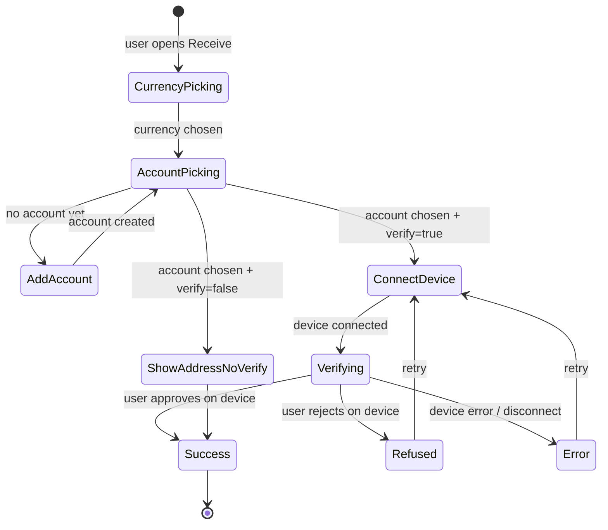

A few details worth pointing out:

- **"Don't verify on device" is a real branch.** The `selectDontVerifyAddress` method in the mobile POM (and the `noVerify*` testIds it targets) exists because users can opt out of on-device verification — for example, when the device is not physically present and they only need an address for someone to send small change. The flow then displays the address with a "this is your fresh address from your last sync" caveat.
- **Address verification does not create a transaction.** The device shows the address only. There is no nonce to bump, no fee paid; this is purely a display/confirm cycle on the secure element.
- **TRX has a special activation warning.** Tron addresses must receive at least 0.1 TRX before they can transact; the `verifyTronAddressActivationWarningMessage` POM method exercises this exact text. Other families have no equivalent.
- **EVM has a dedicated "Receive options" sub-step** that differentiates "receive crypto" vs "receive ERC-20", and it warns "Please only send ETH or Ethereum tokens to Ethereum accounts."
- **Sanctions screening intercepts.** The `SanctionedAccountModal` directory in the mobile receive flow shows a blocking modal when the resolved address (or the parent account) is on a sanctions list. This is regulatory plumbing that ships with the app and is exercised by a small dedicated subset of specs.
- **Memo-required bottom sheet.** Several Receive flows (XRP, Hedera, ATOM) show a `NeedMemoTagModal` reminding the receiver to instruct the sender to include a destination tag — common when the receiver is an exchange, where omitting the tag means the funds get pooled and lost. The modal lives at `apps/ledger-live-mobile/src/screens/ReceiveFunds/NeedMemoTagModal/`.
- **Fresh-address derivation is account-aware.** For UTXO accounts, "the next fresh address" walks the gap-limit logic in `libs/coin-modules/coin-bitcoin/src/wallet-btc/`; for EVM it is just the account's single address (EVM accounts have one address; the BIP-44 path is fixed). For Bitcoin you can call `freshAddressIndex` to ask the bridge for a *specific* address index — useful when reconciling against an external xpub viewer.
- **The `path` field in the bridge's `receive` Observable** is the BIP-44 derivation path, which the device displays alongside the address. This is what makes phishing on the device address layer hard: the path itself is a secondary check.

### 2.1.4 The Send flow (user journey)

`<photo of: Send modal step 1 — recipient address input with ENS-resolution preview underneath>`

`<photo of: Send modal step 2 — amount input with crypto/fiat toggle and "Send max" switch>`

`<photo of: Send modal step 3 — fees with the slow / medium / fast / custom presets visible>`

`<photo of: Send modal step 4 — review summary showing recipient, amount, fees, total, and the device-confirmation copy>`

`<photo of: Ledger device (Nano X / Stax) showing the transaction review screens with fields scrolled one by one>`

`<photo of: Send success toast / confirmation page with "Transaction sent" and a link to operation details>`

The Send entry point on **Desktop** is `apps/ledger-live-desktop/src/renderer/modals/Send/index.tsx`, which selects between two implementations based on the `useNewSendFlowFeature` hook:

- **Legacy stepper** (the default for most families today) — `Body.tsx` orchestrates a `Stepper` component with five visible steps: `recipient`, `amount`, `summary`, `device`, `confirmation`, plus a hidden `warning` step shown when `startWithWarning` is set.
- **New send flow** (gated by `LLD/features/Send/hooks/useNewSendFlowFeature`) — a single dialog with inline transitions, lives under `apps/ledger-live-desktop/src/mvvm/features/Send/` and is dispatched via the `openSendFlowDialog` Redux action. The new flow has its own POM at `e2e/desktop/tests/page/modal/new.send.modal.ts`.

> **Verify:** which families are enabled for the new flow is configured at runtime by feature flag; the `isEnabledForFamily(family)` call in `index.tsx` is the gate. Treat the two flows as coexisting today, with the new one progressively replacing the old one.

On **Mobile** the entry point is `apps/ledger-live-mobile/src/screens/SendFunds/`. The visible steps map onto numbered files:

| Step | File | Purpose |
| --- | --- | --- |
| 1 | `02-SelectRecipient.tsx` | Recipient address input + memo/tag input + ENS resolution + QR scan |
| 2 | `03a-AmountCoin.tsx` | Amount entry + fiat/crypto toggle + Send-max switch |
| 3 | `04-Summary.tsx` | Final review with recipient / amount / fees / total |
| 4 | (Device action via `~/components/DeviceAction`) | Speculos / real device — review fields + sign |
| 5 | `07-ValidationSuccess.tsx` / `07-ValidationError.tsx` / `07-SendBroadcastError.tsx` | Terminal states |

The state machine collapses cleanly into:

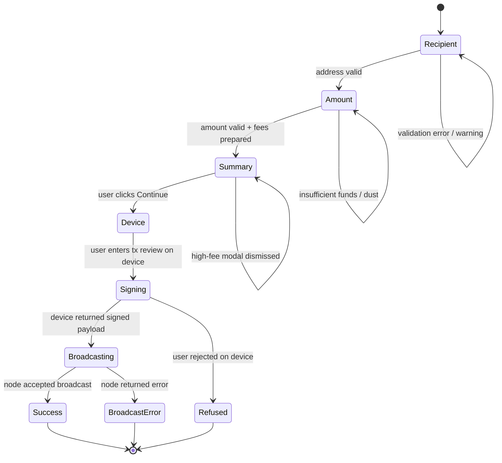

A few details that come up repeatedly in tests:

- **The recipient step does live validation.** As the user types, `bridge.getTransactionStatus(account, tx)` runs (debounced via `useDebounce`) and produces errors (`Recipient address is the same as the sender address`, `This is not a valid Ethereum address`, `Recipient address is inactive. Send at least 1 XRP to activate it`, etc.) and warnings. These exact strings appear in the desktop send-tx specs and double as test fixtures — see 2.1.11.
- **Memo / destination tag is family-specific.** Stellar, XRP, Hedera, Cosmos, ATOM, ADA, BNB, Solana SPL all have a memo/tag field. The "noTag" sentinel value triggers a confirmation drawer ("Don't add Tag?") which the test specs explicitly dismiss.
- **Fee strategies are family-specific.** EVM exposes `slow / medium / fast / custom` (with EIP-1559 fields underneath); Bitcoin exposes `slow / medium / fast / custom` over fee-per-byte; Solana has no user-controllable fee, only a priority fee.
- **"Send max" is a switch, not a number.** The bridge's `estimateMaxSpendable` runs and the field is filled. The test POM has dedicated `toggleMaxAmount()` / `amount-max-switch` paths.
- **Optimistic Operation insertion happens in `Body.tsx`.** When `signOperation` resolves, `addPendingOperation` is dispatched and the account is updated locally via `updateAccountWithUpdater`. The next sync round resolves it.
- **High-fee modal is a separate confirmation step.** When the user picks `custom` fees and the resulting fee exceeds a threshold (configured per family), the Send modal pops a "this fee is unusually high" confirmation drawer. The mobile POM has a `dismissHighFeeModal()` method that the test driver calls unconditionally — most tests skip past it, but it has to be polled for visibility because it only appears under specific conditions.
- **ENS / CNS domain resolution.** When the user types a name like `vitalik.eth` instead of an address, the recipient field calls into the `@ledgerhq/domain-service` package. The resolved address appears as a sub-row beneath the input (`transaction-recipient-ens` testId on desktop, `send-summary-recipient-ens` on mobile), and during device review the device displays a `device-validation-domain` row showing the human-readable name to mitigate fake-address phishing.
- **Recipient-the-same-as-sender** is a hard error, not a warning. Several specs (`B2CQA-2711` for DOT, `B2CQA-2712` for XRP, `B2CQA-2713` for ATOM) test exactly this guard.
- **QR code scan** is the mobile shortcut to fill the recipient field. The legacy stack handles it in `ScanRecipient.tsx` via the camera; the QR contains either a raw address or a EIP-681 / BIP-21 URI that also encodes amount and chain.

**The optimistic operation.** When `bridge.broadcast(signedTx)` resolves, it returns an `Operation` object — but the on-chain confirmation has not happened yet. Ledger Live treats this returned operation as *optimistic*: it inserts it immediately at the top of the account's operation list with a "pending" badge, so the user sees their send acknowledged without waiting for a block. The next account sync round pulls the actual on-chain operation and reconciles. If the broadcast was rejected by the node despite the local broadcast call succeeding (rare, but happens with mempool eviction), the next sync will not find the operation and the optimistic record will be marked as stuck. The `getStuckAccountAndOperation` helper in `libs/ledger-live-common/src/operation/` is what surfaces this state — it is also what triggers the "Speed up / Cancel transaction" prompt visible at the top of the account screen for stuck txes (the `EditOperationCard` import you saw at the top of `02-SelectRecipient.tsx`).

### 2.1.5 Per-family differences

Although every family implements the same `AccountBridge` interface, the shape of `Transaction` differs significantly. The table below highlights the important variants:

| Family | `Transaction` core fields | Fee model | Address quirks | Notes |
| --- | --- | --- | --- | --- |
| **EVM** (`coin-evm`: ETH, MATIC, BSC, AVAX, OP, ARB, BASE, …) | `mode`, `recipient`, `amount`, `gasLimit`, `gasPrice` (legacy) or `maxFeePerGas` + `maxPriorityFeePerGas` (EIP-1559), `nonce`, `data`, `nft`, `gasOptions`, `customGasLimit` | Gas units × gas price; EIP-1559 networks add a tip + base fee; `Strategy` is one of `slow / medium / fast / custom` | ENS resolution displays a `transaction-recipient-ens` row; ERC-20 token transfers reuse the EVM transaction with an ABI-encoded `data` field | A single coin-module covers ~20+ chains; per-chain config (chainId, currencyId, RPC, explorer) lives in `libs/ledger-live-common/src/families/evm/config.ts` |
| **UTXO** (`coin-bitcoin`: BTC, LTC, BCH, DOGE, ZEC, …) | `recipient`, `amount`, `feePerByte`, `utxoStrategy` (which inputs to spend), `rbf` (replace-by-fee), `opReturnData`, `replaceTxId`, `networkInfo.feeItems` | Fee-per-byte × estimated tx size; presets are `slow / medium / fast` over fee-per-byte | Multiple address formats (legacy, P2SH, native SegWit, taproot); change addresses created automatically; a single send may consume many UTXOs | RBF support means a stuck send can be replaced with a higher-fee version; `replaceTxId` carries the original tx hash |
| **Solana** (`coin-solana`) | `model: { kind, uiState, commandDescriptor }` carrying `TransferCommand`, `TokenTransferCommand`, `StakeDelegateCommand`, etc. | Tiny network fee in lamports; priority fee optional | `recentBlockhash` baked in; SPL tokens require an Associated Token Account; the bridge auto-creates the ATA with `TokenCreateATACommand` | The SOL transaction is a discriminated union of commands, not a flat record — much closer to the on-chain instruction model |
| **Cosmos / ATOM** (`coin-cosmos`) | `mode`, `recipient`, `amount`, `memo`, `validators`, `gas`, `fees` | Gas + fee in uatom | Memo required by some exchanges; delegate / undelegate / redelegate / claim-rewards modes share the transaction shape | Validator-list fields piggy-back on the same Transaction object — that is how the Stake feature reuses the Send pipeline |
| **Cardano** (`coin-cardano`) | `mode`, `recipient`, `amount`, `memo`, `useAllAmount`, native asset multi-output support | Min ada-per-tx + per-byte | Account-abstraction-ish: a single account has many "addresses" but acts as one balance | Stake registration / delegation reuses the same Transaction shape |
| **Polkadot** (`coin-polkadot`) | `mode`, `recipient`, `amount`, `era`, `validators`, `rewardDestination`, `numSlashingSpans` | Per-extrinsic weight × fee | Inactive accounts must be activated by sending at least 1 DOT (the `Recipient address is inactive` error in send.tx.spec.ts) | Bonding / nominating / rebonding modes layer on the same Transaction |
| **Tron** (`coin-tron`) | `mode`, `recipient`, `amount`, `resource`, `duration`, `voteBucket`, `assetName` | Free for first daily energy / bandwidth, then TRX-burn | Inactive recipient address requires 0.1 TRX activation (the `verifyTronAddressActivationWarningMessage` POM method exercises this) | TRC-10 vs TRC-20 tokens have different transaction modes |
| **XRP** (`coin-xrp` in live-common) | `mode`, `recipient`, `amount`, `memo` (destination tag), `fee` | Flat per-tx fee (drops) | 1 XRP minimum reserve to activate an address | Destination tag is the canonical "memo" — exchanges require it; the noTag sentinel exists in fixtures |
| **Hedera** (`coin-hedera`) | `mode`, `recipient`, `amount`, `memo`, `expirationDuration` | Account-abstraction-style fee in HBAR | Account aliases (0.0.x) instead of raw addresses | Memo is mandatory for many exchange flows |
| **Tezos** (`coin-tezos`) | `mode`, `recipient`, `amount`, `fees`, `gasLimit`, `storageLimit` | Burn fees + gas | Reveal operation needed for first send from a new account | Delegation reuses the Transaction shape (`mode: "delegate"`) |
| **Stellar** (`coin-stellar` in live-common) | `mode`, `recipient`, `amount`, `memo` (typed: text/id/hash/return), `assetCode`, `assetIssuer` | 100 stroops base | Memo type matters — exchanges may require `MemoText` vs `MemoID` | Token sends require pre-existing trustlines |

(Other families — Aptos, Aleo, Algorand, Sui, Near, MultiversX, Internet Computer, Mina, Filecoin, VeChain, Stacks, Casper, Concordium, Kaspa, Icon, Canton, Celo, Ton — follow the same pattern: `Transaction` carries family-specific fields, the bridge implements `prepareTransaction → getTransactionStatus → signOperation → broadcast`.)

**Three patterns recur** when reading any new family's transaction file:

1. **Memo / destination-tag**. Stellar, XRP, Hedera, Cosmos, Ton, BNB Beacon Chain, Solana SPL all need a string or numeric memo. They share the same `MemoTag` mobile feature folder (`apps/ledger-live-mobile/src/mvvm/features/MemoTag/`) and the same `tagInput` POM affordance on desktop.
2. **Account activation**. XRP needs 1 XRP minimum; DOT needs 1 DOT existential deposit; TRX needs 0.1 TRX activation; Stellar needs 1 XLM reserve; Cardano accounts can be created cheaply but require min-ada-per-output. Each family encodes the exact threshold in `getTransactionStatus`, and the error text — `Recipient address is inactive. Send at least N <TICKER> to activate it` — is what the test specs match.
3. **Multi-mode Transactions**. Most chains overload the `Transaction` shape with a `mode` discriminator: `"send" | "delegate" | "undelegate" | "claimRewards" | "freeze" | "unfreeze" | …`. The Send modal only ever uses `mode: "send"`; the Stake feature (Ch 2.3) reuses the same Transaction infra with `mode: "delegate"`. This is *the* reason the bridge interface is so wide — it has to support every mode any family ships.

**Sub-accounts (token accounts).** ERC-20 tokens, SPL tokens, TRC-10/20 tokens, Stellar assets, Algorand ASAs are all modelled as `TokenAccount`s under a parent `Account`. From the Send/Receive UI's perspective they are first-class accounts: you can pick `TokenAccount.ETH_USDT_1` as the debit account just like you would pick `Account.ETH_1`. The bridge layer routes the call through the parent account's bridge (because the device only knows how to sign for the parent's xpub) but populates the Transaction with the token contract address. The desktop POM's `selectToken` and `navigateToTokenInAccount` methods, and the mobile POM's `selectCurrencyByType(currencyType)`, exist to traverse this two-level account hierarchy.

### 2.1.5.5 Five things that surprise newcomers

Five footguns in the Send/Receive product surface that recur in incoming bug reports:

1. **The "fresh address" is not stable.** Every successful incoming operation rotates the next fresh address (UTXO families derive a new index; account-model families like EVM keep one address). A QA writing assertions against a hardcoded address will pass once and fail tomorrow. Always read the address dynamically, then assert it equals what the device displayed — that is the right invariant.
2. **EVM addresses are case-mixed checksum but case-insensitive.** `0xAbC…` and `0xabc…` resolve to the same account. The Send modal accepts both; the device displays the checksum form. Tests must compare lowercased.
3. **A Send to your own account is not always rejected.** Some families (BTC, ETH) allow it (you might be moving to a different fresh address); others (DOT, ATOM, XRP, HEDERA) reject it. The error is encoded per-family in `getTransactionStatus`.
4. **The "Don't add Tag" flow has two confirmations on some families.** The first drawer ("Don't add Tag?"), then for memo-required-by-default families the user has to click again to confirm. Tests that fail on memo dismissal usually fail because they only handled one of the two clicks.
5. **`useAllAmount` (Send max) does not equal `balance - fees` exactly.** The bridge's `estimateMaxSpendable` is a heuristic; for UTXO families it depends on which inputs are picked, and for accounts with reserves (DOT, ATOM, ADA, XLM) it subtracts the reserve. Tests should assert the displayed amount is *within tolerance*, not equal — the mobile POM has `expectSummaryMaxAmount(amount, tolerance = 0.00005)` exactly for this.

### 2.1.6 The supported-currency story

The numbers from the codebase map:

- **`libs/coin-modules/`** — 30 packaged coin modules: aleo, algorand, aptos, bitcoin, canton, cardano, casper, celo, concordium, cosmos, evm, filecoin, hedera, icon, internet_computer, kaspa, mina, multiversx, near, polkadot, solana, stacks, stellar, sui, tezos, ton, tron, vechain, zcash-shielded, plus the `coin-module-boilerplate` template (which is not shipped).
- **`libs/ledger-live-common/src/families/`** — 28 family folders (the same names plus xrp, which still lives in live-common rather than as a coin-module package).
- **EVM is a multiplexer.** `coin-evm` covers every EVM-compatible chain — Ethereum, Polygon, Binance Smart Chain, Avalanche, Optimism, Arbitrum, Base, Linea, Scroll, zkSync Era, etc. The per-chain config (chainId, currencyId, RPC URL, explorer URL, whether the chain supports EIP-1559) lives in `libs/ledger-live-common/src/families/evm/config.ts` (~30k of declarative network entries). The coin-module logic itself never branches on chain; only the config does.

The headline number is roughly **80+ chains** total: ~30 non-EVM families plus the ~50 EVM-compatible chains the EVM module covers. The exact production list depends on feature flags — some chains ship behind `nft.staging`, `evmNetworks`, etc. — so the number you see in QA depends on which environment you target.

The Receive flow's currency picker reads from the same registry: `libs/ledger-live-common/src/coin-modules/registry.ts` exposes `loadTransactionForFamily(family)` which is the indirection that makes the cross-family Transaction helpers in `libs/ledger-live-common/src/transaction/index.ts` possible.

**What "supported" means in practice.** A chain is "supported" when:

- **A coin-module exists** that exports an `AccountBridge` — `libs/coin-modules/coin-<family>/src/`.
- **Live-common registers it** — `libs/ledger-live-common/src/families/<family>/setup.ts` (or the equivalent in newer families) wires the bridge into the registry and exposes hooks/helpers.
- **A device app exists** — the Ledger device app (`@ledgerhq/hw-app-<family>`) provides the on-device signing primitives. Without this, the device cannot display fields and cannot sign.
- **A node provider is configured** — RPC endpoints, explorer URLs, fee oracle URLs — usually in `libs/ledger-live-common/src/families/<family>/config.ts` or a per-network config.
- **Cryptoassets metadata is shipped** — `libs/ledgerjs/packages/cryptoassets/` ships icons, ticker metadata, decimal places. A currency that lacks cryptoassets metadata cannot show in the picker.
- **The currency is enabled in the manager UI** — the user must have the matching device app installed; the Manager checks app version compatibility against `libs/ledger-live-common/src/manager/`.

When QA encounters an "I added the chain but it does not appear in the currency picker" bug, the bug is almost always one of those six layers being out of sync. The catalog tables in 2.1.5 give you the family names; this list gives you where to look when something is missing.

### 2.1.6.5 Mapping a currency to a coin-module — a worked example

Suppose a stakeholder asks: "When the user clicks Send on their Polygon (MATIC) account, which file actually constructs the transaction?" The reasoning trail is:

1. **Currency → family.** Look up `MATIC` in `libs/ledgerjs/packages/cryptoassets/src/data/currencies.ts` (or follow the `currency.id` resolved by `getAccountCurrency(account)`). The family is `evm`.
2. **Family → registry entry.** `loadTransactionForFamily("evm")` returns the `evm` transaction-module export from `libs/ledger-live-common/src/coin-modules/registry.ts`, which re-exports `libs/coin-modules/coin-evm/src/transaction.ts`.
3. **Bridge → `getAccountBridge`**. From the modal, `getAccountBridge(account)` returns the EVM bridge instance, registered via `libs/ledger-live-common/src/families/evm/setup.ts`.
4. **`prepareTransaction` for EVM** lives in `libs/coin-modules/coin-evm/src/api/prepareTransaction.ts` — it talks to the Ankr / Etherscan / Ledger node provider for fee data, fills `gasLimit`, `maxFeePerGas`, `maxPriorityFeePerGas`.
5. **`getTransactionStatus`** runs the validation; the file is `libs/coin-modules/coin-evm/src/getTransactionStatus.ts`.
6. **`signOperation`** delegates to `@ledgerhq/hw-app-eth` to send APDUs to the device.
7. **`broadcast`** posts the signed payload to the chain's RPC — for Polygon the RPC URL is read from the `evm/config.ts` entry keyed by `polygon`.

For Bitcoin the trail forks at step 1 to family `bitcoin`, then `libs/coin-modules/coin-bitcoin/src/wallet-btc/` for the UTXO selection and PSBT building. For Solana it is family `solana`, then `libs/coin-modules/coin-solana/src/api/prepareTransaction.ts` (which reads recent blockhash and serializes the command list). The pattern is invariant; only the file paths change.

### 2.1.7 Code path — desktop

The desktop Send and Receive entry points are both Modal components in `apps/ledger-live-desktop/src/renderer/modals/`. They follow Ledger Live's modal pattern:

- A Redux-managed registry of named modals (`MODAL_SEND`, `MODAL_RECEIVE`) — see `~/renderer/reducers/modals`.
- `openModal("MODAL_SEND", data)` from anywhere in the app pushes the modal name onto the stack with an opaque `data` payload.
- The Modal component subscribes via `useSelector((state) => isModalOpened(state, "MODAL_SEND"))` and renders when the name matches.
- A `Body.tsx` per modal owns the step-state machine and renders one `Step*.tsx` per visible step.

**File map — Send:**

```
apps/ledger-live-desktop/src/renderer/modals/Send/
├── index.tsx                       # Modal wrapper + new-flow redirect logic
├── Body.tsx                        # Stepper orchestration + bridge wiring
├── AccountFooter.tsx               # Reusable footer
├── SendAmountFields.tsx            # Per-family amount field shim
├── SendRecipientFields.tsx         # Per-family recipient field shim
├── types.ts                        # StepId union + St type
├── fields/                         # Per-family overrides (memo, validator, …)
└── steps/
    ├── StepRecipient.tsx           # Address + memo input
    ├── StepAmount.tsx              # Amount + fees
    ├── StepSummary.tsx             # Final review (largest step)
    ├── StepConnectDevice.tsx       # Device pairing
    ├── GenericStepConnectDevice.tsx
    ├── StepConfirmation.tsx        # Success / error terminal
    ├── StepWarning.tsx             # Optional warning shown first
    └── Confirmation/               # Post-confirm sub-views
```

**File map — Receive:**

```
apps/ledger-live-desktop/src/renderer/modals/Receive/
├── index.tsx                       # Modal wrapper + Noah feature flag gate
├── Body.tsx                        # Stepper + state.isAddressVerified tri-state
├── assets/
└── steps/
    ├── StepAccount.tsx             # Currency / account picker
    ├── StepOptions.tsx             # Receive-options (e.g. crypto / token)
    ├── StepConnectDevice.tsx       # Device pairing
    ├── StepReceiveFunds.tsx        # Address display + verify-on-device prompt
    ├── StepReceiveStakingFlow.tsx  # Reused for stake-receive variants
    └── StepWarning.tsx
```

The state machine implementation is **not Redux** for Send/Receive — the active step is local React `useState` inside the Modal component (see `Send/index.tsx:29` — `const [stepId, setStepId] = useState<StepId>(...)`). What lives in Redux is the modal registry, the account list, the device state, and the new-send-flow dialog dispatcher. The Transaction itself is owned by the cross-family `useBridgeTransaction` hook — see 2.1.9.

Verbatim — the heart of `Send/index.tsx` (the redirect to the new flow + the legacy modal):

```tsx
const SendModal = ({ stepId: initialStepId, onClose }: Props) => {
  const [stepId, setStepId] = useState<StepId>(() => initialStepId || "recipient");
  const handleReset = useCallback(() => setStepId("recipient"), []);
  const handleStepChange = useCallback((stepId: StepId) => setStepId(stepId), []);
  const isModalLocked = MODAL_LOCKED[stepId];
  const dispatch = useDispatch();

  const { isEnabledForFamily, getFamilyFromAccount } = useNewSendFlowFeature();
  const isOpened = useSelector((state: State) => isModalOpened(state, "MODAL_SEND"));
  const modalData = useSelector((state: State) => getModalData(state, "MODAL_SEND"));

  const family = getFamilyFromAccount(
    modalData?.account ?? undefined,
    modalData?.parentAccount ?? null,
  );
  const shouldRedirectToNewFlow = isEnabledForFamily(family);

  // ...

  useMemo(() => {
    if (!shouldRedirectToNewFlow || !isOpened) return;
    const sendData = modalData || {};
    const amount = sendData.amount ? sendData.amount.toString() : undefined;
    dispatch(
      openSendFlowDialog({
        params: {
          account: sendData.account ?? undefined,
          parentAccount: sendData.parentAccount ?? undefined,
          recipient: sendData.recipient,
          amount,
          fromMAD: false,
          startWithWarning: sendData.startWithWarning,
        },
        onClose,
      }),
    );
    dispatch(closeModal("MODAL_SEND"));
  }, [dispatch, isOpened, modalData, shouldRedirectToNewFlow, onClose]);

  if (shouldRedirectToNewFlow) return null;
  // …old flow path renders <Modal name="MODAL_SEND" …>
};
```

The `MODAL_LOCKED` table at the top of the file is the small detail that keeps users from accidentally backdrop-clicking out of a transaction mid-sign:

```ts
const MODAL_LOCKED: { [key in StepId]: boolean } = {
  recipient: false,    // user can backdrop-click out
  amount: true,        // locked
  summary: true,       // locked
  device: true,        // locked
  confirmation: true,  // locked
  warning: false,
};
```

That table is exactly the kind of UX-detail-encoded-in-a-record that a QA engineer needs to know about — it is why the Send modal does not close mid-flow under random clicks.

**Body.tsx — what it actually orchestrates.** The legacy stepper is wired in `apps/ledger-live-desktop/src/renderer/modals/Send/Body.tsx`. The opening lines tell the whole story:

```tsx
import {
  addPendingOperation,
  getMainAccount,
  getRecentAddressesStore,
} from "@ledgerhq/live-common/account/index";
import { isCryptoCurrency } from "@ledgerhq/live-common/currencies/helpers";
import { getAccountCurrency } from "@ledgerhq/live-common/account/helpers";
import { getAccountBridge } from "@ledgerhq/live-common/bridge/index";
import useBridgeTransaction from "@ledgerhq/live-common/bridge/useBridgeTransaction";
import { Account, AccountLike, Operation } from "@ledgerhq/types-live";
import { Transaction } from "@ledgerhq/live-common/generated/types";
import Stepper from "~/renderer/components/Stepper";
import { SyncSkipUnderPriority } from "@ledgerhq/live-common/bridge/react/index";
import { closeModal, openModal } from "~/renderer/actions/modals";
import { accountsSelector } from "~/renderer/reducers/accounts";
import { updateAccountWithUpdater } from "~/renderer/actions/accounts";
import { getCurrentDevice } from "~/renderer/reducers/devices";
import { getLLDCoinFamily } from "~/renderer/families";
import StepRecipient, { StepRecipientFooter } from "./steps/StepRecipient";
import StepAmount, { StepAmountFooter } from "./steps/StepAmount";
import StepConnectDevice from "./steps/StepConnectDevice";
import StepSummary, { StepSummaryFooter } from "./steps/StepSummary";
import StepConfirmation, { StepConfirmationFooter } from "./steps/StepConfirmation";
import StepWarning, { StepWarningFooter } from "./steps/StepWarning";
```

Read top to bottom: cross-family bridge accessor, the `useBridgeTransaction` hook (the heart of the flow), the `Stepper` component (visual breadcrumb + step rendering), Redux modal/account actions, the `getLLDCoinFamily` helper that loads per-family Send overrides, and finally the five Step components plus footers. The file is ~300 lines but the overwhelming majority is wiring; the actual logic delegates to the bridge.

**Per-family Send overrides.** `getLLDCoinFamily(family)` returns an object that may include `sendStepRecipientFields`, `sendStepAmountFields`, etc. — these are per-family slot fillers that the generic `StepRecipient` and `StepAmount` components render in addition to their own. This is how Cosmos's "validator picker" or Cardano's "memo + native asset selector" or Solana's "ATA creation prompt" appear inside the same Send modal without polluting the cross-family code.

### 2.1.8 Code path — mobile (legacy + MVVM split)

Mobile has two architectural eras visible in the same repo:

- **Legacy stack** under `apps/ledger-live-mobile/src/screens/` — class- and hooks-style React Native screens, navigated by React Navigation stacks. `SendFunds/` and `ReceiveFunds/` both live here today.
- **MVVM stack** under `apps/ledger-live-mobile/src/mvvm/features/` — newer screens using a view-model pattern: each feature has a `ViewModel` (state machine, no React imports), a `View` (pure presentation), and hooks that wire them. `Send/` is **not yet ported** to MVVM at the time of writing; ReceiveFunds is also still legacy. MVVM is fully present in `Assets/`, `AssetDetail/`, `MyWallet/`, `Buy/`, `FirmwareUpdate/`, `MemoTag/`, etc. — see Chapter 2.2 for an MVVM walkthrough.

> **Verify:** the MVVM port for Send is in flight. As of this snapshot the legacy stack is still the production one for Send/Receive on mobile; the new send flow is a desktop-only redirect.

**File map — Send (legacy):**

```
apps/ledger-live-mobile/src/screens/SendFunds/
├── 02-SelectRecipient.tsx          # Address + memo + ENS + QR scan
├── 03a-AmountCoin.tsx              # Amount entry + fees
├── 04-Summary.tsx                  # Final review
├── 07-ValidationSuccess.tsx        # Terminal success
├── 07-ValidationError.tsx          # Terminal error
├── 07-SendBroadcastError.tsx       # Broadcast-specific error
├── AmountInput.tsx                 # Reusable amount input
├── DomainServiceRecipientRow.tsx   # ENS / domain resolution
├── ScanRecipient.tsx               # Camera QR
├── RecipientRow.tsx                # Recent address / contact row
├── Summary*.tsx                    # 5 sub-views composing the summary
├── CounterValuesSeparator.tsx      # Layout helper
├── DomainErrorHandlers.tsx
└── TooMuchUTXOBottomModal.tsx      # UTXO warning sheet
```

The numbering scheme survives because earlier versions of the flow had additional intermediate steps (`01-Wallet`, `02-…`) that have since been collapsed. Treat the prefix as a navigation order hint, not a step count.

**File map — Receive (legacy):**

```
apps/ledger-live-mobile/src/screens/ReceiveFunds/
├── 01b-ReceiveProvider..tsx        # Shared context provider
├── 03-Confirmation.tsx             # Address display + QR
├── 03a-ConnectDevice.tsx           # Device pairing
├── 03b-VerifyAddress.tsx           # On-device verify cycle
├── ConfirmationHeaderTitle.tsx
├── HelpButton.tsx
├── NotSyncedWarning.tsx
├── ReadOnlyWarning.tsx
├── NeedMemoTagModal/
├── ReceiveSecurityModal/
└── SanctionedAccountModal/
```

The `SanctionedAccountModal/` directory is where the OFAC / sanctions screening lives — a regulatory feature that intercepts the receive flow when the resolved address matches a sanctioned-list entry.

The first 40 lines of `02-SelectRecipient.tsx` pull together the whole architectural picture in one screen:

```tsx
import { isConfirmedOperation } from "@ledgerhq/ledger-wallet-framework/operation";
import { RecipientRequired } from "@ledgerhq/errors";
import { Text } from "@ledgerhq/native-ui";
import { getAccountCurrency, getMainAccount } from "@ledgerhq/live-common/account/helpers";
import { getAccountBridge } from "@ledgerhq/live-common/bridge/index";
import {
  SyncOneAccountOnMount,
  SyncSkipUnderPriority,
} from "@ledgerhq/live-common/bridge/react/index";
import useBridgeTransaction from "@ledgerhq/live-common/bridge/useBridgeTransaction";
import { useFeature } from "@ledgerhq/live-common/featureFlags/index";
import { useDebounce } from "@ledgerhq/live-common/hooks/useDebounce";
// …
import { MemoTagDrawer } from "LLM/features/MemoTag/components/MemoTagDrawer";
import { useMemoTagInput } from "LLM/features/MemoTag/hooks/useMemoTagInput";
import { hasMemoDisclaimer } from "LLM/features/MemoTag/utils/hasMemoTag";
```

What you see, from top to bottom:

- `getAccountBridge(account)` — the family-agnostic accessor that returns the right `AccountBridge` for the account's currency. This is the indirection that makes the same screen work for 30+ families.
- `useBridgeTransaction` — the cross-family hook that owns the Transaction object, runs `prepareTransaction` whenever inputs change, runs `getTransactionStatus` for live validation, and exposes `setTransaction`, `transaction`, `status`, `bridgePending` to the screen.
- `SyncOneAccountOnMount` — triggers an account sync as soon as the screen mounts, so the UI starts with the freshest balance.
- `useFeature` — the Firebase Remote Config bridge for feature flags.
- `useDebounce` — debounces validation calls to avoid one-call-per-keystroke.
- `MemoTag*` — the memo-tag feature (lives in MVVM-land already as `LLM/features/MemoTag/`) — a sub-feature reused by every family that needs a memo/destination tag.

That single import block tells you mobile send is **state-driven by the cross-family bridge layer plus a Redux account store**, with React Navigation stacking the screens. The architecture is identical to desktop's; only the screen primitives (View, Text, ScrollView vs HTML) and the navigation library (React Navigation vs a Modal stepper) differ.

### 2.1.9 Code path — common (the family-agnostic transaction layer)

The cross-family layer lives in **`libs/ledger-live-common/src/`**. It is the most architecturally important code in the entire repo for this chapter — it is the substrate that lets one Send screen render across 30+ chains. The three key files are:

- `transaction/index.ts` — the cross-family Transaction helpers (`fromTransactionRaw`, `toTransactionRaw`, `formatTransaction`, `formatTransactionStatus`).
- `bridge/useBridgeTransaction.ts` — the React hook owning the Transaction object and orchestrating the bridge calls.
- `bridge/impl.ts` — the registry resolver that maps `family` → `AccountBridge` implementation.

All three are pure indirection: they delegate to per-family modules registered in `coin-modules/registry.ts`. The only "business logic" they contain is orchestration (when to call `prepareTransaction`, how to debounce status, when to retry on error).

Verbatim — `libs/ledger-live-common/src/transaction/index.ts`:

```ts
export * from "@ledgerhq/ledger-wallet-framework/transaction/common";
export * from "./signOperation";
export * from "./deviceTransactionConfig";
import type {
  Transaction,
  TransactionRaw,
  TransactionStatus,
  TransactionStatusRaw,
} from "../coin-modules/transaction-types";
import { loadTransactionForFamily } from "../coin-modules/registry";
import type { Account } from "@ledgerhq/types-live";

export const fromTransactionRaw = async (tr: TransactionRaw): Promise<Transaction> => {
  const TM = loadTransactionForFamily(tr.family);
  return TM.fromTransactionRaw(tr as any) as unknown as Transaction;
};
export const toTransactionRaw = async (t: Transaction): Promise<TransactionRaw> => {
  const TM = loadTransactionForFamily(t.family);
  return TM.toTransactionRaw(t as any) as unknown as TransactionRaw;
};
// …formatTransaction, fromTransactionStatusRaw, toTransactionStatusRaw, etc.
```

The pattern is canonical: every helper does `loadTransactionForFamily(family).method(...)`. The `family` field on the Transaction is the dispatch key.

The `AccountBridge` interface sits in `libs/ledgerjs/packages/types-live/src/bridge.ts` and is the contract every coin-module signs:

```ts
interface SendReceiveAccountBridge<
  T extends TransactionCommon,
  A extends Account = Account,
  U extends TransactionStatusCommon = TransactionStatusCommon,
> {
  // synchronizes an account continuously to update with latest blockchain state.
  sync(initialAccount: A, syncConfig: SyncConfig): Observable<(arg0: A) => A>;

  // derive an address; if verify=true, ask the device to display it.
  receive(account: A, arg1: {
    verify?: boolean;
    deviceId: string;
    subAccountId?: string;
    freshAddressIndex?: number;
    path?: string;
  }): Observable<{ address: string; path: string; publicKey: string; chainCode?: string; }>;

  // a Transaction object is created on UI side as a black box…
  createTransaction(account: AccountLike<A>): T;

  // mutate transaction with a partial patch (must return same ref if unchanged).
  updateTransaction(t: T, patch: Partial<T>): T;

  // prepare the remaining missing part of a transaction typically from network (e.g. fees).
  prepareTransaction(account: A, transaction: T): Promise<T>;

  // calculate derived state of the Transaction, useful to display summary / errors / warnings.
  getTransactionStatus(account: A, transaction: T): Promise<U>;

  // heuristic estimated max amount that can be sent.
  estimateMaxSpendable(arg0: {
    account: AccountLike<A>;
    parentAccount?: A | null;
    transaction?: T | null;
  }): Promise<BigNumber>;

  // finalizing a transaction by signing it with the ledger device.
  signOperation: SignOperationFnSignature<T, A>;

  // signing a raw transaction with the ledger device.
  signRawOperation: SignRawOperationFnSignature<A>;

  // broadcasting a signed transaction to network.
  broadcast: BroadcastFnSignature<A>;

  validateAddress: (
    address: string,
    parameters: Partial<AddressValidationCurrencyParameters>,
  ) => Promise<boolean>;
}
```

A few annotations on the contract:

- **`receive` returns an Observable** — that is how the streaming "device showing the address" UX is wired. The Observable emits as the device-flow progresses (`opened` → `device-streaming` → `display-confirm` → completed).
- **`prepareTransaction` is idempotent on identity** — if nothing changed, it returns the same object reference. That is critical for React rendering performance (no spurious re-renders).
- **`getTransactionStatus` is the validator** — it returns errors and warnings as record fields, not exceptions. The UI displays them next to the relevant input.
- **`signOperation` returns an Observable**, not a Promise — it streams signing progress to the UI (`device-signature-requested` → `device-signature-granted` → `signed`).
- **`broadcast` returns an "optimistic Operation"** — Ledger Live shows a pending operation in the account history immediately, before the chain confirms. The next sync resolves it.

The pipeline used by the Send screens, end-to-end:

```
createTransaction(account)
   → updateTransaction(tx, { recipient: "0x…" })
   → updateTransaction(tx, { amount: 1e18 })
   → prepareTransaction(account, tx)        // network fees, gas estimate, blockhash, etc.
   → getTransactionStatus(account, tx)      // {errors, warnings, estimatedFees, totalSpent, …}
   → signOperation({account, transaction})  // Observable<SignedOperation>
   → broadcast(signed)                       // Operation (optimistic)
```

Every step is synchronous on the client except `prepareTransaction`, `signOperation`, and `broadcast` (the network-touching ones). The Send modal renders status text (`Recipient address is inactive…`) directly from the `errors` field of `getTransactionStatus`, which is why those exact strings show up verbatim in the spec fixtures.

**The `useBridgeTransaction` reducer.** The React hook that owns the Transaction lifecycle is `libs/ledger-live-common/src/bridge/useBridgeTransaction.ts`. The relevant slice — the effect that runs `prepareTransaction → getTransactionStatus` whenever inputs change — is small enough to read in full:

```ts
// when transaction changes, prepare the transaction
useEffect(() => {
  let ignore = false;
  // If bridge is not pending, transaction change is due to
  // the last onStatus dispatch (prepareTransaction changed original transaction) and must be ignored
  if (!bridgePending && !synced) return;

  if (mainAccount && transaction) {
    // We don't debounce first status refresh, but any subsequent to avoid multiple calls
    // First call is immediate
    const debounce = statusIsPending.current ? delay(DEBOUNCE_STATUS_DELAY) : null;
    statusIsPending.current = true; // consider pending until status is resolved

    Promise.resolve(debounce)
      .then(() => getAccountBridge(mainAccount, null))
      .then(async bridge => {
        if (ignore) return;
        const preparedTransaction = await bridge.prepareTransaction(mainAccount, transaction);
        if (ignore) return;
        const status = await bridge.getTransactionStatus(mainAccount, preparedTransaction);
        if (ignore) return;
        return { preparedTransaction, status };
      })
      .then(/* dispatch onStatus */, /* dispatch onStatusError + retry timer */);
  }

  return () => { ignore = true; /* cancel timers */ };
}, [transaction, mainAccount, bridgePending, synced]);
```

The four moving parts to notice:

1. **Reference-equality dispatch suppression.** `bridgePending = transaction !== statusOnTransaction`. The hook only re-runs when the user actually changed the transaction, not when `prepareTransaction` itself returned a derived version. This is why family bridges are required to return the same reference if nothing changed (see the `AccountBridge` JSDoc).
2. **First-call-immediate, subsequent-debounced.** The first status fetch is immediate (zero perceived latency on the first keystroke); subsequent fetches are debounced by `DEBOUNCE_STATUS_DELAY` to avoid hammering the RPC.
3. **`ignore` flag for stale completion.** If the user types again while the previous prepare is in flight, the in-flight result is discarded. Standard React-effect cancellation pattern.
4. **Retry on prepare error.** The error path schedules a `setTimeout` retry with exponential backoff (`errorDelay`), reset on success. This is why a temporary RPC outage looks like "fees not loaded yet" rather than a hard error.

This single hook is consumed by **both** the desktop Send modal (`apps/ledger-live-desktop/src/renderer/modals/Send/Body.tsx`) and the mobile Send screens (`apps/ledger-live-mobile/src/screens/SendFunds/02-SelectRecipient.tsx`). When the apps look architecturally identical, this is why: they share the hook and the bridge.

**Sync-before-tx**. Some currencies — Bitcoin notably — need an account sync before a transaction is built (so the UTXO set is current). The hook calls `shouldSyncBeforeTx(mainAccount.currency)` and runs `bridge.sync(mainAccount, { paginationConfig: {} })` first if so. This is why opening the Bitcoin Send modal often shows a brief "syncing" state.

**The `signOperation` Observable.** Unlike `prepareTransaction` and `broadcast` (which return Promises), `signOperation` returns an Observable. The events it emits are typed:

```
device-signature-requested   → user is being asked to confirm on device
device-streaming             → progress event during streaming (Solana, large EVM tx)
device-signature-granted     → user pressed approve
signed                       → final SignedOperation payload
```

The Send modal's `Body.tsx` subscribes to this Observable and updates the device-step UI in lockstep with each event. Speculos auto-approves these events programmatically; that is how the test specs progress past the "review on device" step without a human pressing buttons.

### 2.1.10 Code path — coin module (one family)

Picking one family to ground all of the above: **EVM**.

`libs/coin-modules/coin-evm/` is the coin-module package. It is a regular pnpm package consumed by both `apps/ledger-live-desktop` and `apps/ledger-live-mobile` (via `libs/ledger-live-common` as the integration layer). The directory shape:

```
libs/coin-modules/coin-evm/src/
├── transaction.ts                  # Serializer (verbatim below)
├── prepareTransaction.ts (in api/) # Gas estimate, EIP-1559 fee fetch
├── getTransactionStatus.ts         # Errors / warnings calculator
├── createTransaction.ts            # Empty-tx factory
├── estimateMaxSpendable.ts         # "Send max" amount
├── hw-getAddress.ts                # Device-side address derivation
├── hw-signMessage.ts               # Sign-message variant
├── deviceTransactionConfig.ts      # Field display order on device
├── speculos-deviceActions.ts       # Speculos auto-approve scripts
├── adapters/
│   ├── etherscan.ts                # Etherscan / Ankr / etc. operation history
│   └── ledger.ts                   # Ledger node provider
├── api/                            # Network calls
├── editTransaction/                # Edit / replace / cancel
├── staking/                        # Stake operations (delegate, undelegate)
└── types/                          # EvmTransaction type
```

Both apps consume the **same coin-evm package**. Desktop's Send modal calls `getAccountBridge(account)` which returns the EVM bridge (registered via the family registry), and the mobile screen does exactly the same call on `ledger-live-common`. There is no per-app duplication of EVM logic.

Verbatim — the `formatTransaction` helper in `libs/coin-modules/coin-evm/src/transaction.ts` (this is what the CLI prints when you ask it to format a Send for a debug session):

```ts
export const formatTransaction = (
  { mode, amount, recipient, useAllAmount }: EvmTransaction,
  account: Account,
): string =>
  `
${mode.toUpperCase()} ${
    useAllAmount
      ? "MAX"
      : amount.isZero()
        ? ""
        : " " +
          formatCurrencyUnit(getAccountCurrency(account).units[0], amount, {
            showCode: true,
            disableRounding: true,
          })
  }${recipient ? `\nTO ${recipient}` : ""}`;
```

Compare to the Bitcoin equivalent, which has to print UTXO selection strategy, RBF flag, and fee-per-byte:

```ts
export const formatTransaction = (t: Transaction, account: Account): string => {
  const n = getEnv("DEBUG_UTXO_DISPLAY");
  const { excludeUTXOs, strategy } = t.utxoStrategy;
  const displayAll = excludeUTXOs.length <= n;
  return `
SEND ${
    t.useAllAmount
      ? "MAX"
      : formatCurrencyUnit(getAccountCurrency(account).units[0], t.amount, {
          showCode: true,
          disableRounding: true,
        })
  }
TO ${t.recipient}
with feePerByte=${t.feePerByte ? t.feePerByte.toString() : "?"} (${formatNetworkInfo(
    t.networkInfo,
  )})
${[
  Object.keys(bitcoinPickingStrategy).find(
    k => bitcoinPickingStrategy[k as keyof typeof bitcoinPickingStrategy] === strategy,
  ),
  "pick-unconfirmed",
  t.rbf && "RBF-enabled",
]
  .filter(Boolean)
  .join(" ")}…`;
};
```

That side-by-side is the punchline of this whole chapter: **the contract is shared, the implementations diverge along the natural shape of the chain.** EVM sees `mode/amount/recipient`. Bitcoin sees `utxoStrategy/feePerByte/rbf`. Solana sees a discriminated union of on-chain commands. The bridge layer hides this from the UI.

**Serialization is a bridge responsibility.** Look at the EVM serializer in `coin-evm/src/transaction.ts`. The functions `fromTransactionRaw` and `toTransactionRaw` round-trip the in-memory Transaction object (with `BigNumber` amounts and `Buffer` data fields) to a JSON-friendly raw form (string-encoded numbers, hex-encoded bytes). This is non-trivial for EVM because the type union covers legacy and EIP-1559 transactions, NFT metadata, and custom gas options:

```ts
export const fromTransactionRaw = (rawTx: EvmTransactionRaw): EvmTransaction => {
  const common = fromTransactionCommonRaw(rawTx);
  const tx: Partial<EvmTransaction> = {
    ...common,
    family: rawTx.family,
    mode: rawTx.mode,
    chainId: rawTx.chainId,
    nonce: rawTx.nonce,
    gasLimit: new BigNumber(rawTx.gasLimit),
    feesStrategy: rawTx.feesStrategy,
    type: rawTx.type ?? 0,
  };
  if (rawTx.data)              tx.data = Buffer.from(rawTx.data, "hex");
  if (rawTx.gasPrice)          tx.gasPrice = new BigNumber(rawTx.gasPrice);
  if (rawTx.maxFeePerGas)      tx.maxFeePerGas = new BigNumber(rawTx.maxFeePerGas);
  if (rawTx.maxPriorityFeePerGas) tx.maxPriorityFeePerGas = new BigNumber(rawTx.maxPriorityFeePerGas);
  if (rawTx.additionalFees)    tx.additionalFees = new BigNumber(rawTx.additionalFees);
  if (rawTx.nft)               tx.nft = { /* …copy fields, BigNumber-ify quantity… */ };
  if (rawTx.customGasLimit)    tx.customGasLimit = new BigNumber(rawTx.customGasLimit);
  if (rawTx.gasOptions)        tx.gasOptions = fromGasOptionsRaw(rawTx.gasOptions);
  if (rawTx.sponsored !== undefined) tx.sponsored = rawTx.sponsored;
  return tx as EvmTransaction;
};
```

Why this matters for QA:

- **Test fixtures live as raw JSON.** Userdata fixtures (`e2e/desktop/tests/userdata/*.json`, `e2e/mobile/userdata/*.json`) are arrays of `AccountRaw` and operation records. They are deserialized by the cross-family helpers above. If you add a new field to a Transaction type, the round-trip serializer is the contract that decides whether old fixtures still load.
- **The CLI uses the same serializer.** The `liveDataCommand` family of CLI helpers (Part 6 Ch 6.4) marshals an Account through `toAccountRaw` and feeds it to Speculos. The Send pipeline in tests reads from there.

**The coin-module / live-common split.** A practical question: why does EVM live in *both* `libs/coin-modules/coin-evm` and `libs/ledger-live-common/src/families/evm`? Because the coin-module is the *pure* implementation (no React, no Redux, no app-specific glue), and the live-common family folder hosts the *integration* shims — banner/promo copy, platform adapters (the Wallet API mapping), config, the `react.ts` hooks. As features migrate to coin-modules, the live-common family folder gets thinner. Today most families have both directories; tomorrow live-common may be a pure adapter.

> **Verify:** the migration to coin-modules is in flight; xrp still lives entirely in live-common (`libs/ledger-live-common/src/families/xrp/`) with no `coin-modules/coin-xrp/` package, while solana, evm, bitcoin, etc. have both. Treat the dual-location as a transitional state.

### 2.1.11 POMs and tests today

**Desktop POMs.** The Send/Receive UI is exercised by three Page Objects:

| POM file | Purpose | Key methods |
| --- | --- | --- |
| `e2e/desktop/tests/page/account.page.ts` | Account view — entry point to Send and Receive | `clickReceive()`, `clickSend()`, `clickBuy()`, `verifySendButtonVisibility()`, `expectFundedAccountDetails()`, `navigateToToken()`, `navigateToTokenInAccount()` |
| `e2e/desktop/tests/page/modal/send.modal.ts` | Legacy Send modal | `selectDebitCurrency()`, `fillRecipient()`, `fillRecipientInfo()`, `fillAmount()`, `chooseFeeStrategy()`, `craftTx()`, `clickContinueToDevice()`, `expectTxInfoValidity()`, `expectTxSent()`, `checkContinueButtonEnable()`, `checkContinueButtonDisabled()`, `checkInputErrorVisibility()`, `checkErrorMessage()`, `checkAmountWarningMessage()`, `checkInputWarningMessage()` |
| `e2e/desktop/tests/page/modal/new.send.modal.ts` | New Send dialog (feature-flagged families) | `waitForDialog()`, `typeAddress()`, `clickOnSendToButton()`, `skipMemo()`, `fillCryptoAmount()`, `clickReview()`, `openFeesMenu()`, `selectFeePreset()`, `waitForSignature()`, `waitForSuccessConfirmation()`, `waitForConfirmation()` |
| `e2e/desktop/tests/page/modal/receive.modal.ts` | Receive modal | `selectToken()`, `getAddressDisplayed()`, `expectValidReceiveAddress()`, `expectApproveLabel()`, `verifySendCurrencyTokensWarningMessage()`, `expectRecieveMenu()`, `clickReceive()`, `verifyTronAddressActivationWarningMessage()` |
| `e2e/desktop/tests/page/drawer/send.drawer.ts` | Send drawer (asset-detail entry point) | (drawer-specific actions) |

**Mobile POMs.** Mirror the desktop split:

| POM file | Purpose | Key methods |
| --- | --- | --- |
| `e2e/mobile/page/trade/send.page.ts` | Send screens (legacy stack) | `navigateToSendScreen()`, `openViaDeeplink()`, `sendViaDeeplink()`, `expectFirstStep()`, `setRecipient()`, `recipientContinue()`, `setRecipientAndContinue()`, `expectSendRecipientError()`, `expectSendRecipientWarning()`, `expectSendRecipientSuccess()`, `setAmount()`, `amountContinue()`, `setAmountAndContinue()`, `expectSendAmountSuccess()`, `expectSendAmountError()`, `summaryContinue()`, `expectSummaryAmount()`, `expectSummaryMaxAmount()`, `expectSummaryRecipient()`, `expectSendSummaryError()`, `expectSummaryWarning()`, `expectSummaryRecipientEns()`, `expectSummaryMemoTag()`, `dismissHighFeeModal()`, `expectValidationEnsName()`, `chooseFeeStrategy()` |
| `e2e/mobile/page/trade/receive.page.ts` | Receive screens (legacy stack) | `openViaDeeplink()`, `receiveViaDeeplink()`, `selectCurrency()`, `selectCurrencyByType()`, `selectNetwork()`, `selectNetworkIfAsked()`, `selectVerifyAddress()`, `getFreshAddressDisplayed()`, `continueCreateAccount()`, `selectDontVerifyAddress()`, `selectReconfirmDontVerify()`, `expectReceivePageIsDisplayed()`, `expectReceiveWarningPageIsDisplayed()`, `verifyAddress()`, `expectAddressIsCorrect()`, `expectTronNewAddressWarning()`, `expectSendCurrencyTokensWarningMessage()`, `doNotVerifyAddress()`, `expectDeviceConnectionScreen()`, `selectReceiveFundsOption()` |
| `e2e/mobile/page/trade/operationDetails.page.ts` | Operation-details screen post-broadcast | (details-specific actions) |

**Specs that exercise the flows.**

Desktop:

| Spec | What it covers |
| --- | --- |
| `e2e/desktop/tests/specs/send.tx.spec.ts` | The big one: invalid amount, invalid address, valid sends across BTC / ETH / SOL / XRP / DOT / TRX / BCH / ATOM / XTZ / HBAR / XLM / ADA. Uses `liveDataWithRecipientAddressCommand` to pre-seed both sender and receiver on Speculos. |
| `e2e/desktop/tests/specs/newSendFlow.tx.spec.ts` | Same shape as send.tx.spec.ts, but routed through `new.send.modal.ts` for feature-flagged families. |
| `e2e/desktop/tests/specs/receive.address.spec.ts` | Per-currency receive + on-device address verification. Includes a TRX-specific "empty balance, address activation warning" case. |
| `e2e/desktop/tests/specs/send.swap.spec.ts` | Send via the swap entry point (the Swap-then-Send composition). |
| `e2e/desktop/tests/specs/assets.addresses.spec.ts` | Cross-currency receive-address validation from the asset-detail screen. |

Mobile:

| Spec | What it covers |
| --- | --- |
| `e2e/mobile/specs/send/send.ts` (driver) + `e2e/mobile/specs/send/sendETH.spec.ts`, `sendBTC.spec.ts`, `sendSOL.spec.ts`, … (~17 per-currency specs) | Per-family valid send |
| `e2e/mobile/specs/send/sendInvalid/`, `e2e/mobile/specs/send/sendValidAddress/` | Invalid-input branches + valid-address-but-other-error branches |
| `e2e/mobile/specs/verifyAddress/verifyAddressETH.spec.ts`, `verifyAddressBTC.spec.ts`, `verifyAddressSOL.spec.ts`, … | On-device address verification per family |
| `e2e/mobile/specs/verifyAddress/receiveFlow.spec.ts` | Multi-step receive flow with create-account + verify |
| `e2e/mobile/specs/deposit/` | Deposit/receive entry points (selectCryptoNetworkWithoutAccount, selectCryptoWithoutNetworkAndAccount) |

A typical desktop receive spec is short and declarative — the `receive.address.spec.ts` per-currency loop fits the chapter in 80 lines:

```ts
const accounts = [
  { account: Account.BTC_NATIVE_SEGWIT_1, xrayTicket: "B2CQA-2559, B2CQA-2687" },
  { account: Account.ETH_1, xrayTicket: "B2CQA-2561, B2CQA-2688, B2CQA-2697" },
  { account: Account.SOL_1, xrayTicket: "B2CQA-2563, B2CQA-2689" },
  { account: Account.TRX_1, xrayTicket: "B2CQA-2565, B2CQA-2690, B2CQA-2699" },
  { account: Account.DOT_1, xrayTicket: "B2CQA-2562, B2CQA-2691" },
  // …
];

for (const account of accounts) {
  test.describe("Receive", () => {
    test.use({
      teamOwner: Team.WALLET_XP,
      userdata: "skip-onboarding-with-last-seen-device",
      speculosApp: account.account.currency.speculosApp,
      cliCommands: [liveDataCommand(account.account)],
    });
    // …
    test(`[${account.account.currency.name}] Receive`, /* tags + annotation */, async ({ app }) => {
      await app.mainNavigation.openTargetFromMainNavigation("accounts");
      await app.accounts.navigateToAccountByName(account.account.accountName);
      await app.account.expectAccountVisibility(account.account.accountName);
      await app.account.clickReceive();
      // per-family branch (TRX warning, ETH "receive options", BSC warning)
      await app.receive.continue();
      const displayedAddress = await app.receive.getAddressDisplayed();
      await app.receive.expectValidReceiveAddress(displayedAddress);
      await app.speculos.expectValidAddressDevice(account.account, displayedAddress);
      await app.receive.expectApproveLabel();
    });
  });
}
```

The shape is what to take away: a data table, a `for` loop generating one Playwright test per row, `liveDataCommand` to seed the speculos app, and POM methods named after user actions. Send specs follow the same shape with a richer per-currency dataset (amount + memo + speed + invalid-cases).

**Anatomy of a Send POM method.** To make the layering concrete, here is `craftTx` from the desktop legacy Send modal POM (`e2e/desktop/tests/page/modal/send.modal.ts`) — one method exercising five UI interactions:

```ts
@step("Fill tx information")
async craftTx(tx: Transaction) {
  await this.fillRecipientInfo(tx);          // step 1: address + memo
  await this.continue();                     // → step 2

  if (tx.memoTag === "noTag") {
    await this.noTagButton.click();          // dismiss "Don't add Tag?" drawer
  }

  await this.cryptoAmountField.fill(tx.amount);  // step 2: amount

  if (tx.speed !== undefined) {
    await this.chooseFeeStrategy(tx.speed);  // step 2: fee preset
  }
}
```

A few things worth noticing:

- **`@step("Fill tx information")`** — every POM method is decorated with `@step` so it shows up as a hierarchical entry in the Allure report. Reading an Allure HTML report tree is reading a sequence of these step strings; choose them well.
- **The `Transaction` model is a fixture, not a domain object.** It comes from `@ledgerhq/live-common/e2e/models/Transaction` — a thin record with `accountToDebit`, `accountToCredit`, `amount`, `memoTag`, `speed`. The same model is used on desktop and mobile.
- **Memo branching is dataset-driven.** `memoTag === "noTag"` is the sentinel that means "the user actively chose not to add a memo"; the POM dismisses the safety modal that would otherwise block the flow.

**Anatomy of a Receive POM method.** The mobile equivalent shows the on-device verify cycle compressed into three calls:

```ts
@Step("Accept to verify address")
async selectVerifyAddress(): Promise<void> {
  await waitForElementById(this.buttonVerifyAddressId);
  await tapById(this.buttonVerifyAddressId);
}

@Step("Get the fresh address displayed")
async getFreshAddressDisplayed(): Promise<string> {
  await waitForElementById(this.accountFreshAddress);
  return await getTextOfElement(this.accountFreshAddress);
}

@Step("Verify address")
async verifyAddress(address: string): Promise<void> {
  await detoxExpect(getElementById(this.accountAddress)).toHaveText(address);
}
```

Sequence in a typical test:

1. `selectVerifyAddress()` — user taps "Verify on device".
2. The Speculos device-action driver (Chapter 5.5) auto-approves the on-device confirmation.
3. `getFreshAddressDisplayed()` reads the address shown on screen.
4. `app.speculos.expectValidAddressDevice(account, displayedAddress)` (a separate POM method on the Speculos POM) cross-checks that the device-displayed address matches.
5. `verifyAddress(displayedAddress)` asserts the on-screen address matches the variable just read.

That cross-check between *device-displayed* and *Ledger-Live-displayed* addresses is the whole point of the Receive E2E test. A bug where Ledger Live shows one address while the device shows another would be a security-critical regression; this assertion is what catches it.

**Tags and Xray annotations.** Every test in both desktop and mobile carries:

- A `tag` array — `@NanoSP`, `@LNS`, `@NanoX`, `@Stax`, `@Flex`, `@NanoGen5` (which device families to run on); `@solana`, `@ethereum`, `@family-evm`, etc. (which crypto families); `@smoke` for the smoke subset.
- An `annotation: { type: "TMS", description: "B2CQA-…" }` (or multiple) that links to Xray test cases.
- For LIVE-bug regression tests, a `BUG` annotation that links to the Jira bug.

These tags drive selective CI runs (`pnpm test --grep "@smoke"`) and Allure dashboard filters. The pattern repeats verbatim across every spec; once you know the shape, every spec in `e2e/desktop/tests/specs/` and `e2e/mobile/specs/` reads the same.

### 2.1.11.4 The CLI helper that pre-resolves recipient addresses

The desktop `send.tx.spec.ts` opening imports include this trio:

```ts
import {
  getAccountAddress,
  liveDataWithRecipientAddressCommand,
  liveDataCommand,
} from "@ledgerhq/live-common/e2e/cliCommandsUtils";
```

What each does:

- `liveDataCommand(account)` — seeds the LLD/LLM userdata with the named account, fully populated (balance, operations, fresh address, derivation paths). Used by Receive specs because they only need the sending account.
- `getAccountAddress(account)` — given an `Account` enum, derives its current fresh address (asynchronously, via the bridge). Used inside spec setup to fill `transaction.accountToCredit.address`.
- `liveDataWithRecipientAddressCommand(transaction)` — the convenience composite: seeds the debit account, then derives the credit account's address and assigns it to `transaction.accountToCredit.address` so the spec can pass the recipient verbatim into the Send modal.

The mobile send driver wraps the same helpers in `beforeAllFunction` (see `e2e/mobile/specs/send/send.ts`). The cross-cutting pattern across both stacks is: **the test data table holds account *names*; the CLI helpers turn names into addresses at runtime**. This is what allows the same Send spec to run against different seed phrases (CI runs against a known dev seed; local runs may use a different one) without rewriting the table.

### 2.1.11.5 Common pitfalls when reading or writing Send/Receive tests

Working through Send/Receive specs as a new QA hire surfaces a recurring set of confusions. List them up front so you do not have to rediscover them:

- **"Why is the test green when I broke `prepareTransaction`?"** Because Speculos auto-approves device prompts, and many specs only assert the post-broadcast confirmation toast. If `prepareTransaction` returns a transaction that the device review page renders weirdly but still signs, the spec passes. The fix is to also assert intermediate states (`expectTxInfoValidity`, `expectSummaryAmount`) — the well-written specs do.
- **"My new currency works in production but the spec hangs."** The spec is probably waiting for a status that never arrives because the `sync` Observable's `complete` event never fires for that family. Several non-EVM coin-modules use long-running syncs and the bridge must emit `complete` explicitly. Check `bridge.sync` in your coin-module.
- **Speculos vs real device divergence.** Speculos emulates the Ledger device app, but it does not always cover the latest device firmware behaviour. If a test passes locally on Speculos and fails on a CI Nano-S+ device-farm run, suspect the device-app version: each family's coin-module pins a known-good app version and the speculos auto-approve script (`speculos-deviceActions.ts`) is written against that version.
- **Running a single send spec.** `pnpm --filter ledger-live-desktop-tests playwright test send.tx --grep "@ethereum"` is the canonical incantation; the `--grep` matches against the tag list described above. Without the grep, you run all 80+ rows.
- **Userdata snapshots can drift.** A test that uses `userdata: "speculos-tests-app"` is reading a checked-in JSON fixture. If the schema of `Account` or `Operation` has changed and the fixture has not been regenerated, you get cryptic load-time errors. The CLI helpers in Part 6 are how you regenerate fixtures.
- **Memo-required currencies have two failure modes.** If the user types a memo, Speculos must auto-approve a memo-display step on the device (one extra screen). If the user explicitly omits a memo (`noTag`), the modal-dismiss flow has to be exercised. Most spec rows explicitly set `memoTag: "noTag"` or a numeric value — never leave it undefined unless you mean it.
- **Fee strategy `undefined` is "default", not "no fee".** When the spec passes `Fee.MEDIUM` it picks the medium preset; when it passes `undefined` it leaves the family default in place (which is medium for most families). Do not assume `undefined` means "skip the fee step" — the step still runs, it just uses whatever is preselected.
- **The new send flow has different testIds.** When a family migrates from the legacy modal to the new send dialog, the testIds change (`send-recipient-input` survives, but `modal-amount-field` becomes `send-amount-input`, and `noTag` button text becomes `send-skip-memo-link`). The spec migration is an explicit step; do not assume an existing send spec works against the new flow.

### 2.1.11.6 Where the data lives

A practical map for the test data that drives Send/Receive specs:

| Data | Location | Purpose |
| --- | --- | --- |
| Account enum | `libs/ledger-live-common/src/e2e/enum/Account.ts` | Named accounts with seed phrase, fixed indices, addresses |
| Token-account enum | same file, separate `TokenAccount` namespace | Sub-accounts (`ETH_USDT_1`, `ETH_USDC_1`, etc.) |
| Currency enum | `libs/ledger-live-common/src/e2e/enum/Currency.ts` | Currency metadata used in tests (ticker, speculosApp, family) |
| Addresses enum | `libs/ledger-live-common/src/e2e/enum/Addresses.ts` | Hardcoded recipient/sender addresses for cross-account scenarios |
| Provider enum | `libs/ledger-live-common/src/e2e/enum/Provider.ts` | Swap providers (used by send.swap.spec) |
| Fee enum | `libs/ledger-live-common/src/e2e/enum/Fee.ts` | Slow / medium / fast labels |
| Transaction model | `libs/ledger-live-common/src/e2e/models/Transaction.ts` | The `(debit, credit, amount, speed, memoTag)` value object |
| CLI helpers | `libs/ledger-live-common/src/e2e/cliCommandsUtils.ts` | `liveDataCommand`, `liveDataWithAddressCommand`, `liveDataWithRecipientAddressCommand`, `getAddressCommand`, `getAccountAddress` |
| Userdata fixtures (desktop) | `e2e/desktop/tests/userdata/*.json` | Pre-seeded LLD app states |
| Userdata fixtures (mobile) | `e2e/mobile/userdata/*.json` | Pre-seeded LLM app states |
| Speculos device actions | `libs/coin-modules/coin-<family>/src/speculos-deviceActions.ts` | Per-family auto-approve scripts |

The cross-app reuse is the takeaway: **enums and CLI helpers live in `live-common`, not in each E2E workspace**. Both `e2e/desktop` and `e2e/mobile` import the same `Account.ETH_1`, the same `Transaction` constructor, the same `liveDataCommand`. When you add a new currency or test account, you add it once and both suites pick it up.

### 2.1.12 Cross-references forward

What you have just learned will resurface across the rest of the guide in concrete terms:

| Where | What |
| --- | --- |
| **Part 4 — Desktop E2E** | The send-tx, new-send-flow, and receive-address spec families discussed in 2.1.11 are the canonical examples used to teach the desktop POM pattern, fixture / userdata system, and the Speculos device-action driver. Chapter 4.4 (Playwright Advanced — Fixtures, POM, Decorators) uses Send/Receive as a worked example, and Part 3 Ch 3.3 (Speculos) does the same on the device-emulation side. |
| **Part 5 — Mobile E2E** | `e2e/mobile/specs/send/sendETH.spec.ts` and the associated driver `send.ts` are the worked examples in Ch 5.2 ("Writing your first mobile E2E test") and Ch 5.3 ("Translation table"). Ch 5.7 covers the mobile Send POM in detail. |
| **Part 6 — CLI helpers** | The `liveDataCommand`, `liveDataWithAddressCommand`, `liveDataWithRecipientAddressCommand`, and `getAddressCommand` helpers — which seed Speculos with funded accounts and pre-resolve recipient addresses for send tests — are documented in Ch 6.4. The Send specs at all three levels (desktop, mobile, common) consume these helpers. |
| **Part 7 — Swap deep dive** | Swap is conceptually a Send with a derived recipient. The Swap drawer composes `bridge.signOperation` and `bridge.broadcast` exactly as Send does, but the recipient address is resolved by the swap provider rather than typed by the user. |
| **Ch 2.5 — Buy/Sell** | Buy uses Receive plumbing (the address shown to the partner provider is the next fresh address from the same `bridge.receive(account, { verify: true, deviceId })` call). Sell uses Send plumbing. |

The bridge interface in 2.1.9 is also the foundation for Stake (Chapter 2.3) and Edit Transaction (the cancel/replace flow that lives under `editTransaction/` in EVM and Bitcoin).

<div class="resource-box">
<h4>Resources</h4>
<ul>
<li><strong>Source — desktop Send modal</strong>: <code>apps/ledger-live-desktop/src/renderer/modals/Send/index.tsx</code></li>
<li><strong>Source — desktop Receive modal</strong>: <code>apps/ledger-live-desktop/src/renderer/modals/Receive/index.tsx</code></li>
<li><strong>Source — mobile Send screens</strong>: <code>apps/ledger-live-mobile/src/screens/SendFunds/</code></li>
<li><strong>Source — mobile Receive screens</strong>: <code>apps/ledger-live-mobile/src/screens/ReceiveFunds/</code></li>
<li><strong>Source — cross-family transaction helpers</strong>: <code>libs/ledger-live-common/src/transaction/index.ts</code></li>
<li><strong>Source — AccountBridge contract</strong>: <code>libs/ledgerjs/packages/types-live/src/bridge.ts</code></li>
<li><strong>Source — useBridgeTransaction hook</strong>: <code>libs/ledger-live-common/src/bridge/useBridgeTransaction.ts</code></li>
<li><strong>Source — coin-evm</strong>: <code>libs/coin-modules/coin-evm/src/</code></li>
<li><strong>Source — coin-bitcoin</strong>: <code>libs/coin-modules/coin-bitcoin/src/</code></li>
<li><strong>Source — coin-solana</strong>: <code>libs/coin-modules/coin-solana/src/</code></li>
<li><strong>POMs — desktop</strong>: <code>e2e/desktop/tests/page/modal/send.modal.ts</code>, <code>new.send.modal.ts</code>, <code>receive.modal.ts</code>, <code>account.page.ts</code></li>
<li><strong>POMs — mobile</strong>: <code>e2e/mobile/page/trade/send.page.ts</code>, <code>e2e/mobile/page/trade/receive.page.ts</code></li>
<li><strong>Specs — desktop</strong>: <code>e2e/desktop/tests/specs/send.tx.spec.ts</code>, <code>newSendFlow.tx.spec.ts</code>, <code>receive.address.spec.ts</code></li>
<li><strong>Specs — mobile</strong>: <code>e2e/mobile/specs/send/</code>, <code>e2e/mobile/specs/verifyAddress/</code>, <code>e2e/mobile/specs/deposit/</code></li>
</ul>
</div>

<div class="chapter-outro">
<strong>Key takeaway:</strong> Send and Receive are the two universal primitives every wallet feature builds on. The product surface is small (pick currency, type address, type amount, review, sign, broadcast). The architectural surface is wider — a single AccountBridge contract that 30+ coin modules implement, with family-specific Transaction shapes that the cross-family hooks hide from the UI. Once you can draw the bridge interface from memory and name the four specs that exercise it, you have the mental model needed to read every other Part 2 chapter. Next up, Chapter 2.2: Portfolio and Countervalues — the read-side of the wallet.
</div>

### 2.1.12.4 The drawer / modal / dialog vocabulary

When reading the desktop POMs, three shapes recur and they are not interchangeable:

- **Modal** (`e2e/desktop/tests/page/modal/`) — a centred overlay with a close button and a backdrop, rendered by the legacy `Modal` component. Send and Receive both use this. Feature-flagged Send may opt into the dialog form instead.
- **Drawer** (`e2e/desktop/tests/page/drawer/`) — a side-panel that slides in from the right. The Asset Detail screen and the swap confirmation use this; `send.drawer.ts` exists for the asset-detail-derived send entry point.
- **Dialog** (`e2e/desktop/tests/page/dialog/`) — the new Volt-based dialog primitive. The new Send flow uses this; modular drawer flows for asset/account/network selection use this. The relevant files start with `modular.` (`modular.dialog.ts`, `modular.account.dialog.ts`, `modular.asset.dialog.ts`, `modular.network.dialog.ts`).

For each entry-point variant of Send (the global Receive button, the asset detail Send button, the swap-then-send shortcut, the account-screen Send button) there is a different ancestor component but the inner step machinery is shared. The POMs reflect this: `send.modal.ts` and `send.drawer.ts` both eventually delegate to the same recipient/amount/summary component tree but their entry-point assertions differ.

### 2.1.12.5 A glossary you will see across this part

Terms that appear repeatedly in Send/Receive code, named consistently across all of Part 2:

| Term | Meaning |
| --- | --- |
| **AccountBridge** | The TypeScript interface every coin-module implements (see 2.1.9). The contract: `sync`, `receive`, `createTransaction`, `updateTransaction`, `prepareTransaction`, `getTransactionStatus`, `estimateMaxSpendable`, `signOperation`, `signRawOperation`, `broadcast`, `validateAddress`. |
| **Family** | A string discriminator (`"evm" | "bitcoin" | "solana" | …`) on every `Account`, `Currency`, and `Transaction`. The dispatch key for the registry. |
| **Currency** | A specific chain or token (`ethereum`, `polygon`, `usd_tether__erc20`, etc.). Belongs to a family. |
| **Account** | A single derivation under a wallet — has a unique BIP-44 path, an xpub, a balance, an operations list. The "main account" of the user. |
| **TokenAccount / Sub-account** | A child account holding a single token (ERC-20, SPL, TRC-20). Has a `parentAccount` pointer. |
| **Operation** | An on-chain (or pending) transaction record attached to an account. Has `id`, `hash`, `type` (`OUT`, `IN`, `DELEGATE`, `STAKE`, …), `value`, `fee`, `senders`, `recipients`. |
| **Optimistic operation** | An Operation inserted into the account's history before the chain confirms — produced by `bridge.broadcast`. |
| **Transaction** | The in-flight black-box passed to `signOperation`. Family-specific shape; always serialisable. Don't confuse with **Operation** (the *record* of a confirmed/pending tx). |
| **Speculos** | The Ledger device emulator running in Docker. Auto-approves on-device prompts via per-family `speculos-deviceActions.ts` scripts. |
| **POM (Page Object Model)** | A class encapsulating selectors and actions for one screen / modal / drawer. Lives in `e2e/<platform>/page/`. |
| **Step (`@step` / `@Step`)** | Decorator on POM methods that adds an entry to the Allure step tree. The desktop decorator is from `tests/misc/reporters/step`; the mobile equivalent is `jest-allure2-reporter/api`. |
| **userdata** | A JSON fixture that pre-populates the LLD/LLM app state (accounts, settings, feature flags). Loaded at app launch. |
| **Userdata fixture name** | The string passed to `test.use({ userdata: "…" })` (desktop) or `app.init({ userdata: "…" })` (mobile). Matches a file in the relevant `userdata/` directory. |
| **Feature flag** | A runtime toggle set by Firebase Remote Config or by tests via `featureFlags: { foo: { enabled: true } }`. Read in code with `useFeature("foo")`. |
| **Bridge** (in mobile E2E) | A WebSocket bridge that lets Jest manipulate the running React Native app's state. Different concept from `AccountBridge` — Part 5 covers this in detail. |

### 2.1.12.6 Reading checklist for new QA hires

Before moving on to Chapter 2.2, confirm you can answer these without grep:

- Where does the legacy desktop Send modal live? (`apps/ledger-live-desktop/src/renderer/modals/Send/`)
- Where does the new desktop Send dialog live? (`apps/ledger-live-desktop/src/mvvm/features/Send/`)
- Where does the cross-family Transaction helper live? (`libs/ledger-live-common/src/transaction/index.ts`)
- Where is the `AccountBridge` interface declared? (`libs/ledgerjs/packages/types-live/src/bridge.ts`)
- Which method on `AccountBridge` produces the validation error strings the Send UI displays? (`getTransactionStatus`)
- Which method derives the receive address and (optionally) asks the device to display it? (`receive`)
- Which method emits an Observable of signing-progress events? (`signOperation`)
- Where is the EVM-specific `Transaction` shape defined? (`libs/coin-modules/coin-evm/src/types/`, with `transaction.ts` for serialization)
- What is the difference between an Operation and a Transaction? (Transaction = pre-sign black-box; Operation = post-broadcast record.)
- Where do the per-currency receive specs live for desktop? for mobile? (`e2e/desktop/tests/specs/receive.address.spec.ts`; `e2e/mobile/specs/verifyAddress/`)
- Which CLI helper pre-resolves the recipient address for a desktop send spec? (`liveDataWithRecipientAddressCommand(transaction)`)

If any of these is fuzzy, re-read the relevant subsection — they are the foundation for every later chapter.

### 2.1.13 Quiz

<!-- ── Chapter 2.1 Quiz ── -->

<div class="quiz-container" data-pass-threshold="80">
<h3>Quiz</h3>
<p class="quiz-subtitle">5 questions · 80% to pass</p>
<div class="quiz-progress"><div class="quiz-progress-bar"></div></div>

<div class="quiz-question" data-correct="C">
<p><strong>Q1.</strong> Where does the Send transaction's family-specific logic — gas, UTXO strategy, memos, blockhash — actually live?</p>
<div class="quiz-choices">
<button class="quiz-choice" data-value="A">A) Inline in <code>Send/Body.tsx</code> with <code>switch (family)</code> blocks</button>
<button class="quiz-choice" data-value="B">B) In Redux reducers under <code>~/renderer/reducers/</code></button>
<button class="quiz-choice" data-value="C">C) In the family-specific coin-module package (e.g. <code>libs/coin-modules/coin-evm/src/</code>) which implements the <code>AccountBridge</code> contract</button>
<button class="quiz-choice" data-value="D">D) In a single mega-file <code>libs/ledger-live-common/src/transaction/all.ts</code></button>
</div>
<p class="quiz-explanation">Each family ships its own coin-module that implements the <code>AccountBridge</code> interface (<code>prepareTransaction</code>, <code>getTransactionStatus</code>, <code>signOperation</code>, <code>broadcast</code>, …). The Send UI calls <code>getAccountBridge(account)</code> and never branches on family.</p>
</div>

<div class="quiz-question" data-correct="B">
<p><strong>Q2.</strong> Which method on <code>AccountBridge</code> drives the live recipient/amount validation that produces error messages like <code>Recipient address is inactive. Send at least 1 XRP to activate it</code>?</p>
<div class="quiz-choices">
<button class="quiz-choice" data-value="A">A) <code>signOperation</code></button>
<button class="quiz-choice" data-value="B">B) <code>getTransactionStatus(account, transaction)</code></button>
<button class="quiz-choice" data-value="C">C) <code>broadcast(signedOperation)</code></button>
<button class="quiz-choice" data-value="D">D) <code>validateAddress(address, params)</code></button>
</div>
<p class="quiz-explanation"><code>getTransactionStatus</code> returns a <code>TransactionStatus</code> object with <code>errors</code> and <code>warnings</code> fields. The Send modal renders those strings directly; that is why the spec fixtures contain the exact text.</p>
</div>

<div class="quiz-question" data-correct="A">
<p><strong>Q3.</strong> The desktop Receive modal can start at the <code>account</code> step or at the <code>receiveOptions</code> step. What decides which?</p>
<div class="quiz-choices">
<button class="quiz-choice" data-value="A">A) The <code>noah</code> feature flag combined with whether the user is in onboarding and whether the chosen account's currency is in <code>activeCurrencyIds</code></button>
<button class="quiz-choice" data-value="B">B) Whether the device is plugged in</button>
<button class="quiz-choice" data-value="C">C) The user's locale</button>
<button class="quiz-choice" data-value="D">D) The previously-used account from local storage</button>
</div>
<p class="quiz-explanation"><code>Receive/index.tsx</code>'s <code>getInitialState()</code> reads the <code>noah</code> feature flag, the onboarding-receive-flow Redux slice, and the active-currency-ids list, then picks the starting step accordingly.</p>
</div>

<div class="quiz-question" data-correct="D">
<p><strong>Q4.</strong> Which statement about the desktop Send <code>MODAL_LOCKED</code> table is correct?</p>
<div class="quiz-choices">
<button class="quiz-choice" data-value="A">A) It controls whether the user has signed the transaction</button>
<button class="quiz-choice" data-value="B">B) It hides the modal from the device action handler</button>
<button class="quiz-choice" data-value="C">C) It blocks the user from clicking the Continue button</button>
<button class="quiz-choice" data-value="D">D) It prevents accidental backdrop-click closes during steps where mid-flow interruption would be destructive (amount, summary, device, confirmation)</button>
</div>
<p class="quiz-explanation">The <code>MODAL_LOCKED</code> map sets <code>preventBackdropClick</code>. The recipient and warning steps are unlocked; everything from amount onward is locked so the user cannot accidentally cancel a half-signed transaction by clicking outside the modal.</p>
</div>

<div class="quiz-question" data-correct="C">
<p><strong>Q5.</strong> The per-currency desktop receive specs (<code>receive.address.spec.ts</code>) seed Speculos with funded accounts using which CLI helper?</p>
<div class="quiz-choices">
<button class="quiz-choice" data-value="A">A) <code>app.init({ accounts: [...] })</code></button>
<button class="quiz-choice" data-value="B">B) <code>setEnv(SEED, value)</code></button>
<button class="quiz-choice" data-value="C">C) <code>liveDataCommand(account)</code> via the <code>cliCommands</code> fixture</button>
<button class="quiz-choice" data-value="D">D) Manual fixture upload through the WebSocket bridge</button>
</div>
<p class="quiz-explanation">The receive spec passes <code>cliCommands: [liveDataCommand(account.account)]</code> to <code>test.use</code>. <code>liveDataCommand</code> is one of the seed helpers covered in Part 6 Ch 6.4; it pre-populates the Speculos app's userdata with the funded account so the receive flow has a real account to derive an address from.</p>
</div>

<div class="quiz-score"></div>
</div>

---

## Portfolio and Countervalues

<div class="chapter-intro">
The Portfolio is the front door of Ledger Live. Every time a user opens the app — desktop or mobile — they land on a screen that aggregates everything they own across every blockchain we support, converts each balance into their preferred fiat, and draws a single line chart for the whole lot. From a QA standpoint Portfolio is also a stress test: it touches the account state machine, the countervalues service, the sync loop, the cryptoassets registry, the chart renderer, and the navigation stack all at once. If anything breaks downstream, the symptom usually shows up here first. This chapter walks through what Portfolio shows, where the numbers come from, where the code lives on each app, and how the E2E suite asserts on it.
</div>

<a id="portfolio-and-countervalues"></a>

### 2.2.1 What Portfolio Shows

Open Ledger Live Desktop and the Dashboard route is what greets you. Open Ledger Live Mobile (Wallet 4.0) and the home tab is exactly the same idea: a vertical scroll that, top to bottom, contains:

| Region | What it displays | Source of data |
|---|---|---|
| Total balance | One large number in the user's countervalue (FIAT) | `getPortfolio(...)` over all accounts |
| 24h change | Delta + percentage versus yesterday's total | `cryptoChange` / `countervalueChange` from portfolio history |
| Balance graph | Sparkline of total countervalue over the selected range | `balanceHistory` from `getPortfolio` |
| Time range pills | Day / Week / Month / Year / All toggle | `selectedTimeRangeSelector` in Redux |
| Quick actions | Buy, Sell, Send, Receive, Swap, Earn entry points | feature-flag gated |
| Asset allocation | Top N assets by countervalue with per-asset balance + share | `useAssetDistribution(...)` |
| Account list | Per-account rows with native balance + countervalue + sync status | `accountsSelector` |
| Operations | Recent transaction history merged across all accounts | `accounts.flatMap(a => a.operations)` |

`<photo of: Ledger Live Desktop dashboard (Wallet 4.0) — total balance at the top, sparkline below, asset allocation table, recent operations>`

A few things you should internalise before the rest of the chapter makes sense:

- **The number on Portfolio is not stored anywhere.** It is recomputed every render from the union of account balances and the countervalues cache. There is no "portfolio table" in any database — Portfolio is a pure derivation of `accounts` plus `countervalues` plus `selectedTimeRange`.
- **Native balance and countervalue are two different things.** The chart on the asset detail page can flip between "BTC" mode (native) and "USD" mode (countervalue). The Portfolio chart is always countervalue, because adding 0.5 BTC to 12 ETH would otherwise be meaningless.
- **One account ≠ one row.** A Bitcoin SegWit account, a Bitcoin Taproot account, and a Bitcoin Native SegWit account all live as separate `Account` objects but roll up to the same asset row "Bitcoin" in the allocation list.

### 2.2.2 Countervalues — What They Are

A countervalue is a price-feed translation: take 1.5 ETH, look up the current ETH/USD rate, multiply, render `$4,500.00`. The whole system exists because users do not think in satoshis or wei — they think in dollars or euros.

The implementation lives in `libs/live-countervalues/`, with React glue in `libs/live-countervalues-react/`. The salient pieces:

```
libs/live-countervalues/src/
├── api/
│   ├── api.ts          # HTTP client for the Ledger price-feed backend
│   └── api.mock.ts     # Test double used by the bot suite + E2E
├── helpers.ts          # pairId, magFromTo, formatCounterValueDay, ...
├── logic.ts            # 700+ lines — the rate cache and merge engine
├── portfolio.ts        # getPortfolio, getBalanceHistory, getPortfolioRangeConfig
└── types.ts            # CounterValuesState, TrackingPair, RateMap
```

The price feed itself is hosted by Ledger (the `LEDGER_COUNTERVALUES_API` env var points to it; see `libs/live-countervalues/src/api/api.ts:9`). It in turn aggregates upstream feeds — historically CoinGecko, with custom Ledger-side bridging for tokens that CoinGecko does not list. Three endpoints matter:

```
GET /v3/spot/simple?to=usd&froms=bitcoin,ethereum,...   → latest rates
GET /v3/historical/{daily|hourly}/simple?from=...&to=... → time-series
GET /v3/supported/crypto                                 → marketcap-sorted IDs
```

The code that calls them is intentionally short. `fetchLatest` chunks pair lookups into batches of 50 (`LATEST_CHUNK = 50`) so we never blow out a query string, groups by destination currency, and runs four batches in parallel via `promiseAllBatched`:

```ts
// libs/live-countervalues/src/api/api.ts (excerpt)
const baseURL = () => getEnv("LEDGER_COUNTERVALUES_API");
const LATEST_CHUNK = 50;

fetchLatest: async (pairs: TrackingPair[], batchStrategySolver?) => {
  // we group the pairs into chunks (of max LATEST_CHUNK) of the same "to" currency
  const batches: Array<[Currency[], Currency]> = [];
  ...
  await promiseAllBatched(4, allBatches, async ([froms, to]) => {
    const url = URL.format({
      pathname: `${baseURL()}/v3/spot/simple`,
      query: { to: inferCurrencyAPIID(to), froms: fromIds.join(",") },
    });
    const { data } = await network<Record<string, number>>({ method: "GET", url });
    for (let i = 0; i < fromIds.length; i++) {
      map.set(pairId({ from: froms[i], to }), data[fromIds[i]]);
    }
  });
  return pairs.map(pair => map.get(pairId(pair)) || 0);
}
```

Two retention windows are baked into the cache:

```ts
const DAILY_RATE_MS  = 14 * 24 * 60 * 60 * 1000;  // 14 days at daily granularity
const HOURLY_RATE_MS =  2 * 24 * 60 * 60 * 1000;  // 2 days at hourly granularity
```

That is not the wire-level cache TTL. It is the alignment used to round timestamps so we hit the same key across requests and never redownload a datapoint we already have. The actual cache lives in memory inside `CounterValuesState.data` keyed by `pairId({ from, to })` and is persisted to the user's `app.json` via `exportCountervalues` / `importCountervalues` so a cold start does not have to refetch.

#### 2.2.2.a Refresh cadence

`<CountervaluesProvider>` (in `libs/live-countervalues-react/src/index.tsx`) wraps the React tree with a polling loop:

```ts
type Props = {
  bridge: CountervaluesBridge;
  pollInitDelay?: number;       // wait this long after boot before first poll
  autopollInterval?: number;    // minimum gap between automatic polls
  debounceDelay?: number;       // debounce before actually firing
  ...
}
```

In practice the desktop app polls on mount, then every ~120 seconds, and an additional poll is forced when the network or app-state events fire (focus, online). The mobile app does the same with slightly different defaults so it does not chew battery in the background.

The bridge interface (`CountervaluesBridge`) is the persistence boundary: the platform supplies how to load and save the countervalues state to disk. Desktop persists to `app.json`; mobile persists to MMKV. Tests stub it with `api.mock.ts` so the suite never hits the real backend.

#### 2.2.2.b Where rates come from for tokens

For a native chain (BTC, ETH, SOL) the API key is the chain's CoinGecko ID — `bitcoin`, `ethereum`, `solana`. For ERC-20 tokens it is `<chain>/<contract>`, e.g. `ethereum/0xdac17f958d2ee523a2206206994597c13d831ec7` (USDT). `inferCurrencyAPIID` in `helpers.ts` builds these IDs from the cryptoassets registry. If a token is not in the price feed at all, `fetchLatest` returns `0` for its pair, the countervalue rendering falls back to "—", and the asset still appears in the list with its native balance only.

### 2.2.3 The Portfolio User Flow

Here is what the user does, end to end, with the Wallet 4.0 dashboard:

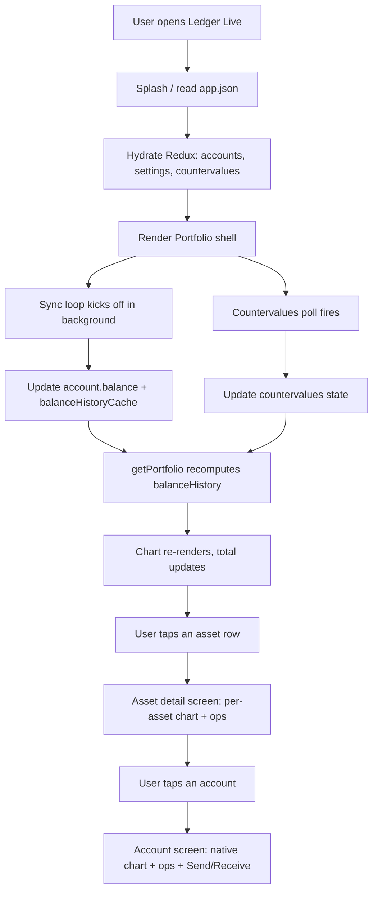

Photos to drop in:

- `<photo of: Ledger Live Desktop dashboard showing portfolio overview, balance graph, asset list>`
- `<photo of: per-asset detail screen (Asset page) with operations list>`
- `<photo of: Ledger Live Mobile portfolio (legacy) — single tab, scrollable list>`
- `<photo of: Ledger Live Mobile MVVM MyWallet view — quick actions row, profile, device section>`
- `<photo of: empty portfolio state (no accounts yet) with Add account CTA>`

A typical "happy path" user does not actually click much. They open the app, glance at the total, scroll through the asset list, maybe tap one row to see a one-asset chart, and close it. That brevity is part of why the screen is perceived as fast: nothing on the page is blocking on a network call by the time the user sees it. The first paint reads the cached countervalues state from `app.json`, the cached balance history from `balanceHistoryCache` on each account, and renders. The polling and sync are best-effort updates that come in over the next few seconds.

### 2.2.4 The Asset List

Ledger Live supports a long list of asset categories. For Portfolio the relevant grouping is by display category, not by underlying chain:

| Category | Examples | Where defined |
|---|---|---|
| Native chains | BTC, ETH, SOL, XRP, ADA, DOT, ATOM | `libs/ledgerjs/packages/cryptoassets/src/currencies.ts` |
| ERC-20 tokens | USDT, USDC, DAI, LINK, AAVE | Pulled from the Cal (cryptoassets-list) backend, cached locally |
| Solana SPL tokens | USDC-SPL, USDT-SPL, BONK | `libs/coin-modules/coin-solana/` |
| Cosmos IBC tokens | ATOM, OSMO, others depending on enabled IBC modules | `libs/coin-modules/coin-cosmos/` |
| ERC-721 / ERC-1155 NFTs | Non-fungible tokens on EVM chains | `libs/ledger-live-common/src/nft/` |

The cryptoassets registry is the source of truth. In code it is exposed as a singleton store:

```ts
// libs/ledger-live-common/src/account/helpers.ts:8
import { getCryptoAssetsStore } from "@ledgerhq/cryptoassets/state";
...
export async function loadBlacklistedTokenSections(tokenIds: string[]) {
  const tokens = await Promise.all(
    tokenIds.map(tokenId => getCryptoAssetsStore().findTokenById(tokenId)),
  );
  ...
}
```

The "Stablecoins" and "Cryptos" tabs you see on the desktop Assets list are also driven by metadata on the cryptoassets entries. Tests assert on those sections directly:

```ts
// e2e/desktop/tests/page/assets.page.ts
readonly cryptosSectionHeader = this.page.getByTestId("cryptos-section-header-button");
readonly stablecoinsSectionHeader = this.page.getByTestId("stablecoins-section-header-button");
readonly cryptosSection = this.page.getByTestId("cryptos-section");
readonly cryptosSectionRows = this.cryptosSection.locator("tbody tr");
readonly stablecoinsSection = this.page.getByTestId("stablecoins-section");
readonly stablecoinsSectionRows = this.stablecoinsSection.locator("tbody tr");
```

For QA, the takeaway is that adding a new supported asset is rarely a UI change — it is a registry change in `libs/ledgerjs/packages/cryptoassets/`. If your spec passes for BTC/ETH it almost certainly passes for any new EVM token, modulo the price-feed coverage.

### 2.2.5 The Legacy vs Wallet 4.0 Split on Mobile

Ledger Live Mobile is in the middle of a long-running migration from a "legacy" architecture to a new MVVM-style layout the team calls **Wallet 4.0** (sometimes shortened to W40). For Portfolio specifically, both code paths live in the repo at the same time, gated by a feature flag.

| Aspect | Legacy | Wallet 4.0 (MVVM) |
|---|---|---|
| Entry path | `apps/ledger-live-mobile/src/screens/Portfolio/index.tsx` | `apps/ledger-live-mobile/src/mvvm/features/MyWallet/` |
| Layout | Single scrollable Portfolio tab | Bottom-tab bar (Home / Swap / Earn / Card) + top-bar (My Ledger / Discover / Notifications / Settings) |
| Component style | Class components mixed with hooks, styled-components/native | Functional components only, Lumen UI design system |
| State flow | Redux + bespoke hooks | ViewModels exposed via dedicated hooks; same Redux underneath |
| Asset list | `PortfolioAssets.tsx` | `mvvm/features/Assets/` |
| Asset detail | `screens/Account/` | `mvvm/features/AssetDetail/` |
| Tests target | `tab-bar-portfolio` testID | `w40-tab-home` testID |

You can see the dual targeting clearly inside the mobile POM:

```ts
// e2e/mobile/page/wallet/portfolio.page.ts
portfolioListIdRegex = new RegExp(`portfolio-screen|${this.readOnlyItemsId}`);
...
@Step("Wait for portfolio page to load")
async waitForPortfolioPageToLoad(timeout = 120000) {
  await waitForElementById(this.portfolioListIdRegex, timeout);
  // TODO: Remove Regex when legacyWallet is removed from source code
}
```

That regex is a smell — it means the same POM method has to handle both implementations until the migration completes — and the comment documents the eventual cleanup.

The navigation POM has parallel tab vocabularies:

```ts
// e2e/mobile/page/wallet/mainNavigation.page.ts
// --- Wallet 4.0 bottom tabs ---
wallet40Tab = (tabName: Wallet40TabName) => element(by.id(`w40-tab-${tabName}`));

// --- Legacy bottom tabs ---
legacyPortfolioTabId = "tab-bar-portfolio";
legacyEarnTabId = "tab-bar-earn";
legacyTransferButtonId = "transfer-button";
legacyDiscoverTabId = "tab-bar-discover";
legacyMyLedgerTabId = "TabBarManager";
```

Specs that exercise W40-only behaviour live under `e2e/mobile/specs/wallet40/`. Specs that must work under both implementations branch on `isWallet40` (a constant derived from feature flags at runtime — see `e2e/mobile/helpers/commonHelpers.ts`).

### 2.2.6 Code Path — Desktop

#### 2.2.6.a Screens directory walk

```
apps/ledger-live-desktop/src/renderer/screens/
├── dashboard/                    # Portfolio entry point — this chapter
│   ├── index.tsx                 # Route component, picks W40 or legacy
│   ├── GlobalSummary.tsx         # The big balance + chart card
│   ├── AssetDistribution/        # Top-N asset allocation table
│   ├── EmptyStateAccounts.tsx    # No-accounts CTA
│   ├── EmptyStateInstalledApps.tsx # No-installed-apps CTA (older onboarding)
│   ├── ActionContentCards.tsx
│   ├── NoAccountsImage.tsx
│   └── components/
│       ├── Banners/
│       ├── FeaturedButtons.tsx
│       └── SwapWebViewEmbedded.tsx
├── accounts/                     # The /accounts route — flat list
│   ├── index.tsx
│   ├── AccountList/
│   ├── AccountRowItem/
│   ├── AccountGridItem/
│   ├── AccountsHeader.tsx
│   ├── AccountSyncStatusIndicator.tsx
│   └── OptionsButton.tsx
└── asset/                        # The /asset/:assetId route — per-asset
    ├── index.tsx
    ├── AssetHeader.tsx
    ├── BalanceSummary.tsx
    ├── AssetBalanceSummaryHeader.tsx
    └── AccountDistribution/      # Per-asset → its accounts breakdown
```

#### 2.2.6.b The dashboard route entry, annotated

The `dashboard/index.tsx` file is short for what it does. The decisive lines, with the legacy stripped for clarity:

```tsx
// apps/ledger-live-desktop/src/renderer/screens/dashboard/index.tsx
export default function DashboardPage() {
  const { t } = useTranslation();
  const accounts = useSelector(accountsSelector);
  const counterValue = useSelector(counterValueCurrencySelector);
  const selectedTimeRange = useSelector(selectedTimeRangeSelector);
  const hasInstalledApps = useSelector(hasInstalledAppsSelector);
  const totalAccounts = accounts.length;

  const { isFeatureFlagsAnalyticsPrefDisplayed, analyticsOptInPromptProps } =
    useDisplayOnPortfolioAnalytics();
  const { isEnabled: isWallet40Enabled } = useWalletFeaturesConfig("desktop");

  return (
    <>
      {isWallet40Enabled ? (
        <Portfolio />                          // LLD/features/Portfolio — the W40 surface
      ) : (
        <>
          <BannerSection />
          <FeaturedButtons />
          <Box flow={7} id="portfolio-container" data-testid="portfolio-container">
            {!hasInstalledApps ? (
              <EmptyStateInstalledApps />
            ) : totalAccounts > 0 ? (
              <>
                <BalanceSummary
                  counterValue={counterValue}
                  chartColor={colors.wallet}
                  range={selectedTimeRange}
                />
                <AssetDistribution />
                {totalOperations > 0 && (
                  <OperationsList accounts={accounts} title={t("dashboard.recentActivity")} ... />
                )}
              </>
            ) : (
              <EmptyStateAccounts />
            )}
          </Box>
        </>
      )}
    </>
  );
}
```

Three load-bearing pieces here:

1. **`useWalletFeaturesConfig("desktop")` decides the entire branch.** When Wallet 4.0 is enabled (which is the production default at the time of writing), the whole legacy tree below becomes dead code and `<Portfolio />` from `LLD/features/Portfolio` takes over. Both code paths still ship in the bundle because the flag is hot-toggleable.
2. **Three Redux selectors set the state contract:** `accountsSelector` (the entire account list), `counterValueCurrencySelector` (the user's preferred fiat — USD, EUR, GBP, etc.), and `selectedTimeRangeSelector` (Day / Week / Month / Year / All). Change any of these in dev tools and the Portfolio updates immediately. Tests can also force them via the bridge.
3. **`<EmptyStateAccounts />` and `<EmptyStateInstalledApps />` are not just "no data" placeholders.** They are meaningful destinations the QA suite asserts on directly — e.g. "after wiping the user data, the Portfolio renders the empty state with the visible Add Account CTA". See `portfolio.page.ts:checkAddAccountButtonVisibility` and `waitForPortfolioEmptyState`.

#### 2.2.6.c The asset detail route

`/asset/:assetId` is what you land on when you click an asset row from the Portfolio:

```tsx
// apps/ledger-live-desktop/src/renderer/screens/asset/index.tsx
export default function AssetPage() {
  const { "*": assetId } = useParams<{ "*": string }>();
  const range = useSelector(selectedTimeRangeSelector);
  const counterValue = useSelector(counterValueCurrencySelector);
  const allAccounts = useSelector(accountsSelector);

  const accounts = useFlattenSortAccounts({
    enforceHideEmptySubAccounts: true,
  }).filter(a => getAccountCurrency(a).id === assetId);

  if (!accounts.length || !unit) return <Navigate to="/" replace />;
  ...
  return (
    <Box>
      <AssetHeader account={accounts[0]} parentAccount={parentAccount} />
      <BalanceSummary
        account={accounts[0]}
        countervalueFirst={countervalueFirst}
        currency={currency}
        range={range}
        ...
      />
      <AccountDistribution accounts={accounts} />
      <OperationsList accounts={accounts} title={t("dashboard.recentActivity")} ... />
    </Box>
  );
}
```

Note `useFlattenSortAccounts` — it folds all top-level accounts of the requested currency *plus* any token sub-accounts whose token currency matches `assetId`, so the asset page can show e.g. "USDT" across the user's three Ethereum accounts in one place.

#### 2.2.6.d The Redux side

Three selector files anchor everything:

- `apps/ledger-live-desktop/src/renderer/reducers/accounts.ts` — `accountsSelector`, `starredAccountsSelector`, helpers like `flattenAccountsSelector`.
- `apps/ledger-live-desktop/src/renderer/reducers/settings.ts` — `counterValueCurrencySelector`, `selectedTimeRangeSelector`, `discreetModeSelector` (the privacy "***" mode).
- `apps/ledger-live-desktop/src/renderer/actions/portfolio.ts` — `usePortfolio()`, the hook every chart calls. It wires `accounts + range + countervalues` into a single memoised result.

The final aggregation function — the one that produces the (date, value) pairs that get drawn on the chart — is `getPortfolio` from `libs/live-countervalues/src/portfolio.ts`. We will read it in §2.2.8.

### 2.2.7 Code Path — Mobile

#### 2.2.7.a Legacy

The legacy Portfolio screen is one big React file:

```
apps/ledger-live-mobile/src/screens/Portfolio/
├── index.tsx                       # PortfolioScreen — the main view
├── Header.tsx
├── PortfolioGraphCard.tsx          # Chart + total balance card
├── GraphCardContainer.tsx
├── PortfolioAssets.tsx             # Per-asset list
├── PortfolioOperationsHistorySection.tsx
├── PortfolioQuickActionsBar.tsx    # Send / Receive / Buy / Swap
├── PortfolioEmptyState.tsx
├── ReadOnlyAssets.tsx              # No-device read-only mode
├── ReadOnly/
├── PortfolioHistory/               # Older chart implementation, kept around
│   ├── index.tsx
│   ├── PortfolioHistoryV1.tsx
│   └── types.ts
├── TabSection.tsx
├── TabIcon.tsx
├── Assets.tsx
├── EmptyStatePortfolio.tsx
├── NoOpStatePortfolio.tsx
├── AnimatedContainer.tsx
└── __integrations__/shared.tsx
```

The entry-point excerpt makes the dependencies plain:

```tsx
// apps/ledger-live-mobile/src/screens/Portfolio/index.tsx (excerpt)
function PortfolioScreen({ navigation }: NavigationProps) {
  const hideEmptyTokenAccount = useEnv("HIDE_EMPTY_TOKEN_ACCOUNTS");
  const accountListFF = useFeature("llmAccountListUI");
  const llmDatadog = useFeature("llmDatadog");
  const allAccounts = useSelector(flattenAccountsSelector, shallowEqual);
  const isFocused = useIsFocused();
  ...
  useEffect(() => {
    if (!llmDatadog?.enabled) return;
    const topChains = allAccounts.reduce<string[]>((acc, account) => {
      const currencyName = getAccountCurrency(account).name.toLowerCase();
      if (TOP_CHAINS.includes(currencyName)) acc.push(getAccountCurrency(account).name);
      return acc;
    }, []);
    DdRum.startView(PORTFOLIO_VIEW_ID, ScreenName.Portfolio, ...);
  }, [...]);
  ...
}
```

Two conventions to notice:

- **`useFeature(...)`** is everywhere on mobile. Almost every section (account list, Datadog tracing, banners) is flag-gated. Tests therefore manipulate flags via the bridge before the spec body runs, never via UI.
- **`useEnv("HIDE_EMPTY_TOKEN_ACCOUNTS")`** reads a runtime env var. This is how the test infra and the user's settings can independently toggle whether empty token sub-accounts are visible.

#### 2.2.7.b Wallet 4.0 (MVVM)

The MVVM tree is a smaller, cleaner footprint that delegates to feature-scoped folders:

```
apps/ledger-live-mobile/src/mvvm/features/
├── MyWallet/                       # The "settings & profile" overlay reachable from top-bar
│   ├── index.tsx                   # MyWalletScreen — ScrollView with three sections
│   ├── Navigator.tsx               # MyWalletNavigator — Stack.Screen for MyWallet + Help
│   ├── views/                      # ProfileSection, QuickActionsRow, DeviceSection, Header
│   ├── screens/Help/
│   ├── components/
│   └── types.ts
├── Assets/                         # The asset list landing page
│   ├── Navigator.tsx
│   ├── screens/AssetsList
│   ├── hooks/
│   └── components/
├── AssetDetail/                    # The per-asset chart + ops list
│   ├── Navigator.tsx
│   ├── screens/
│   ├── testIds.ts                  # Centralised testIDs for the screen
│   └── types.ts
└── Crypto/, CryptoAddresses/, ModularDrawer/, ...
```

`MyWalletScreen` itself is tiny:

```tsx
// apps/ledger-live-mobile/src/mvvm/features/MyWallet/index.tsx
export function MyWalletScreen() {
  return (
    <Box style={{ flex: 1 }}>
      <TrackScreen category="My Wallet" />
      <ScrollView>
        <Box lx={{ paddingHorizontal: "s16", gap: "s24", paddingBottom: "s24" }}>
          <ProfileSection />
          <QuickActionsRow />
          <DeviceSection />
        </Box>
      </ScrollView>
    </Box>
  );
}
```

That brevity is the MVVM promise: the screen does not own state — each `<*Section />` view subscribes to its own ViewModel.

The Assets navigator illustrates the React Navigation registration pattern:

```tsx
// apps/ledger-live-mobile/src/mvvm/features/Assets/Navigator.tsx
export default function Navigator() {
  const { colors } = useTheme();
  const navigation = useNavigation();
  const route = useRoute();

  const goBack = useCallback(() => {
    track("button_clicked", { button: "Back", page: route.name });
    navigation.goBack();
  }, [navigation, route]);

  const stackNavigationConfig = useMemo(
    () => ({
      ...getStackNavigatorConfig(colors, true),
      headerLeft: () => <NavigationHeaderBackButton onPress={goBack} />,
    }),
    [colors, goBack],
  );

  return (
    <Stack.Navigator screenOptions={{ ...stackNavigationConfig, gestureEnabled: Platform.OS === "ios" }}>
      <Stack.Screen
        name={ScreenName.AssetsList}
        component={AssetsList}
        options={{ headerTitle: "", headerRight: () => null }}
      />
    </Stack.Navigator>
  );
}
```

Each MVVM feature owns its own `Navigator.tsx`. The root navigator stitches them together by mounting each as a `Stack.Screen` whose component is the feature's navigator — a navigator-of-navigators pattern.

### 2.2.8 Code Path — Common (the heart of the feature)

The actual portfolio math lives in `libs/live-countervalues/src/portfolio.ts`. The function that everything calls is `getPortfolio`:

```ts
// libs/live-countervalues/src/portfolio.ts
export function getPortfolio(
  topAccounts: AccountLike[],
  range: PortfolioRange,
  cvState: CounterValuesState,
  cvCurrency: Currency,
  options?: GetPortfolioOptionsType,
): Portfolio {
  const { flattenSourceAccounts } = { ...defaultGetPortfolioOptions, ...options };
  const accounts = flattenSourceAccounts ? flattenAccounts(topAccounts) : topAccounts;
  const count = getPortfolioCount(accounts, range);

  const availables = [];
  const unavailableAccounts = [];

  for (const account of accounts) {
    const p = getBalanceHistoryWithChanges(account, range, count, cvState, cvCurrency);
    if (p.countervalueAvailable) {
      availables.push({ account, history: p.history, changes: p.changes });
    } else {
      unavailableAccounts.push(account);
    }
  }

  const histories = availables.map(a => a.history);
  const balanceHistory = getDates(range, count).map((date, i) => ({
    date,
    value: histories.reduce((sum, h) => sum + (h[i]?.countervalue ?? 0), 0),
  }));
  ...
}
```

A few pieces to internalise:

- **`flattenAccounts(topAccounts)`** turns a tree of `Account` (with optional `subAccounts` for tokens) into a flat list of `AccountLike`. So 3 Ethereum accounts each holding 4 tokens become 15 entries here.
- **`PortfolioRange`** is one of `"day" | "week" | "month" | "year" | "all"`. The configuration maps each to a granularity (hourly, daily, weekly) and an increment in milliseconds:
  ```ts
  const ranges: Record<PortfolioRange, PortfolioRangeConfig> = {
    all:   { increment: weekIncrement, startOf: startOfWeek, granularityId: "WEEK" },
    year:  { count: 52,   increment: weekIncrement, startOf: startOfWeek, granularityId: "WEEK" },
    month: { count: 30,   increment: dayIncrement,  startOf: startOfDay,  granularityId: "DAY"  },
    week:  { count: 7*24, increment: hourIncrement, startOf: startOfHour, granularityId: "HOUR" },
    day:   { count: 24,   increment: hourIncrement, startOf: startOfHour, granularityId: "HOUR" },
  };
  ```
- **`getBalanceHistoryWithChanges`** returns `{ history, countervalueAvailable, changes }` per account. Accounts whose countervalue cannot be computed (no rate in the cache, no historical data) end up in `unavailableAccounts` and are not summed into the chart, but their native balance is still shown in the asset list.
- **The reduction at the bottom** is the actual "total balance" computation: at each tick `i` in the timeline, sum up the per-account `countervalue` values and emit one `(date, value)` point. The chart receives that array verbatim.

#### 2.2.8.a getBalanceHistory and the per-account cache

The feeder for `getPortfolio` is `getBalanceHistory`. It does not recompute history from operations on every render — it pulls from the cache stored on the account itself:

```ts
export function getBalanceHistory(
  account: AccountLike,
  range: PortfolioRange,
  count: number,
): BalanceHistory {
  const conf = getPortfolioRangeConfig(range);
  const balances = getAccountHistoryBalances(account, conf.granularityId);
  const history: { date: Date; value: number }[] = [];
  const now = new Date();
  history.unshift({ date: now, value: account.balance.toNumber() });
  const t = new Date(conf.startOf(now).getTime() - 1).getTime(); // end of yesterday

  for (let i = 0; i < count - 1; i++) {
    history.unshift({
      date: new Date(t - conf.increment * i),
      value: balances[balances.length - 1 - i] || 0,
    });
  }

  return history;
}
```

Where does `balances` come from? It is the `BalanceHistoryCache` field on the `Account` type, populated and updated during sync. From `libs/ledgerjs/packages/types-live/src/account.ts`:

```ts
export type Account = {
  type: "Account";
  id: string;
  seedIdentifier: string;
  ...
  balance: BigNumber;             // current spendable + locked
  spendableBalance: BigNumber;
  blockHeight: number;
  currency: CryptoCurrency;
  operationsCount: number;
  operations: Operation[];
  pendingOperations: Operation[];
  lastSyncDate: Date;
  subAccounts?: TokenAccount[];   // tokens live here
  balanceHistoryCache: BalanceHistoryCache;   // ← used by getBalanceHistory
  swapHistory: SwapOperation[];
  syncHash?: string;
  nfts?: ProtoNFT[];
};
```

`BalanceHistoryCache` is the per-granularity cache:

```ts
export type GranularityId = "HOUR" | "DAY" | "WEEK";
export type BalanceHistoryCache = Record<GranularityId, BalanceHistoryDataCache>;
export type BalanceHistoryDataCache = {
  latestDate: number | null | undefined;   // cursor of latest datapoint
  balances: number[];                       // dense numeric series
};
```

Three things follow from this design:

1. **The chart is fast because the heavy lifting was done at sync time.** `Account.balanceHistoryCache` is updated incrementally by the bridge as new operations arrive; the renderer just slices it.
2. **There is one cache per granularity.** Switching the range pill from "Week" to "Year" does not refetch anything — it reads a different bucket of the same cache.
3. **The cache is persisted in `app.json` (desktop) / MMKV (mobile)** in a compressed form (`CompressedBalanceHistoryCache`, RLE-encoded for sequences of identical values) — see the `*Raw` types in the same file. Deserialisation expands it back to a plain numeric array.

#### 2.2.8.b countervalues — the calculate path

Producing a countervalue from a native value boils down to one helper:

```ts
// usage shape
const countervalueAmount = calculate(cvState, {
  value: amount,             // BigNumber-as-number, in smallest unit
  from: cryptoCurrency,
  to: fiatCurrency,
  date: optionalDate,        // omit for spot, include for historical
});
```

`calculate` looks up the rate in `cvState.data[pairId({ from, to })]`, applies the magnitude correction (`magFromTo`) so satoshis become BTC and wei becomes ETH, and returns the fiat number. `calculateMany` is the batch variant used by `getBalanceHistoryWithCountervalue` to convert a whole timeline at once.

The state itself is a plain object (transcribed conceptually from `types.ts`):

```ts
type CounterValuesState = {
  data: Record<string, RateMap>;          // pairId → rates over time
  cache: Record<string, PairRateMapCache>;
  status: Record<string, RateStatus>;
  marketcapIds: string[];                 // ordering for sort
  ...
};
```

`pairId({ from: BTC, to: USD })` is something like `"bitcoin-usd"`. `RateMap` is a `Map<string, number>` where keys are formatted dates (`"2026-04-27"` for daily, `"2026-04-27T13"` for hourly) and the magic key `"latest"` holds the spot rate.

#### 2.2.8.c useAssetDistribution — the asset allocation pie/list

Both apps render an "asset allocation" section (top-N assets by countervalue, with a percentage share). The hook is in live-common:

```ts
// libs/ledger-live-common/src/portfolio/useAssetDistribution.ts
export function useAssetDistribution(opts: UseAssetDistributionOpts): AssetDistributionResult {
  const { accounts, to, product, version, skip = false, ...displayOpts } = opts;

  const cvState = useCountervaluesState();

  const accountCurrencyIds = useMemo(() => {
    if (skip) return [];
    const ids = new Set(flattenAccounts(accounts).map(a => getAccountCurrency(a).id));
    return Array.from(ids);
  }, [accounts, skip]);

  const { data: assetsData, isLoading: isChunkedLoading, isSuccess: isChunkedSuccess } =
    useChunkedAssetsData({
      currencyIds: accountCurrencyIds,
      product, version,
      skip: skip || accountCurrencyIds.length === 0,
    });

  const distribution = useMemo<AssetsDistribution>(() => {
    if (skip || !isChunkedSuccess || !assetsData) {
      return emptyDistribution;
    }
    return buildAssetDistribution(accounts, cvState, to, assetsData, {
      showEmptyAccounts: !!displayOpts.showEmptyAccounts,
      hideEmptyTokenAccount: !!displayOpts.hideEmptyTokenAccount,
    });
  }, [skip, isChunkedSuccess, assetsData, accounts, cvState, to, ...]);

  return { distribution, isLoading: isChunkedLoading };
}
```

A few QA-relevant details:

- **DADA chunked fetch.** `useChunkedAssetsData` pulls metadata (24h price change, marketcap, etc.) from the DADA backend in chunks. While that promise is pending, the hook returns `isLoading: true` and the UI shows skeleton rows.
- **`product: "lld" | "llm"`** is passed in so the backend can A/B feature toggles. Specs that boot the LLD shell pass `"lld"`; LLM specs pass `"llm"`.
- **`showEmptyAccounts` / `hideEmptyTokenAccount`** control whether asset rows whose balance is zero appear at all — this is the same toggle as the user-facing setting in Preferences.

### 2.2.9 Real-time Updates — The Sync Loop

The Portfolio number changes for two reasons: a new operation arrives (sync), or a price tick lands (countervalues poll). Both happen in the background.

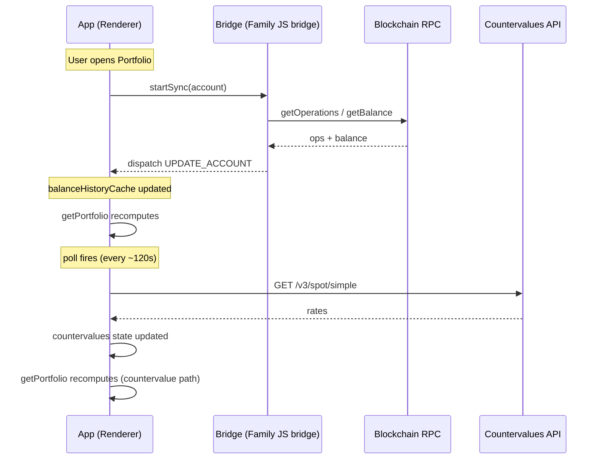

The sync loop itself is per-family. Each `libs/coin-modules/coin-<family>/` exports a `synchronization.ts` (or `bridge/js.ts` `getAccountShape`) whose contract is: given an old account, return a new one. The driver lives in `libs/ledger-wallet-framework/src/account/sync.ts`. Some families poll an HTTP indexer (Bitcoin via the Ledger explorer); some open a WebSocket (Cosmos via Tendermint RPC); some do both.

For QA the relevant question is rarely "is the sync correct" — that is owned by family teams and tested at the integration level — but rather "does the UI react to a sync update". That is asserted by injecting a fresh account snapshot via the bridge in mobile E2E (`server.ts` userdata reload) or via fixture state in desktop Playwright (userdata files), then asserting the Portfolio shows the expected total.

### 2.2.10 POMs and Tests Today

The desktop POM (`e2e/desktop/tests/page/portfolio.page.ts`, 323 lines) is the canonical surface. Here are the methods you will use most often:

| POM method | What it asserts / does | Maps to W4.0 testID |
|---|---|---|
| `expectPortfolioScreenToBeVisible()` | Portfolio shell is rendered | `portfolio-balance` |
| `expectBalanceVisibility()` | Total balance number is visible | `portfolio-total-balance` |
| `expectTotalBalanceCounterValue("$")` | Total balance contains expected fiat marker | `portfolio-total-balance` |
| `expectBalanceDiffCounterValue("%")` | 24h delta pill contains `%` (or `***` in discreet mode) | `portfolio-trend-percentage` |
| `checkOneDayPerformanceIndicatorVisibility()` | The trend pill is rendered | `portfolio-trend` |
| `clickOnPerformancePill()` | Tap the pill to open analytics page | `portfolio-trend` |
| `checkChartVisibility()` | Chart container is on screen | `chart-container` |
| `checkAssetAllocationSection()` | Asset allocation block + 6 rows + Show all | `w40-asset-row-*` |
| `clickOnSelectedAssetRow(asset)` | Tap a specific asset row | `w40-asset-row-<asset>-*` |
| `expectAssetRowToBeVisible(asset)` | Specific asset is in the allocation list | `w40-asset-row-<asset>` |
| `expectAssetRowCounterValue(asset, "€")` | Asset row shows the expected fiat | `w40-asset-row-value-<asset>` |
| `checkOperationHistory()` | Recent ops list is present, "Show more" expands | `#operation-list` |
| `expectOperationCounterValue(cv)` | First op shows expected fiat | `operation-row-*` |
| `quickActionButton("send"\|"receive"\|"buy"\|"sell")` | Quick action target locator | `quick-action-button-*` |
| `clickBuyButton()` / `clickSellButton()` / `clickSendButton()` | Tap quick action | same |
| `checkAddAccountButtonVisibility()` | The Add Account CTA is visible (prefers banner CTA) | `crypto-addresses-banner-add-account-cta` or `portfolio-add-account-button` |
| `clickAddAccountButton()` | Tap the CTA | same |
| `waitForPortfolioEmptyState()` | Empty-portfolio shell ready (sync gate) | `no-balance-title` |
| `checkNoBalanceTitleVisibility()` | "$0.00" / no balance title visible | `no-balance-title` |
| `checkNoDeviceTitleVisibility()` | Read-only mode message visible | `no-device-title` |
| `checkBuyALedgerButtonVisibility()` | "Buy a Ledger" CTA visible (read-only) | `quick-action-button-buy-a-ledger` |
| `checkSellButtonDisabled()` / `checkSendButtonDisabled()` | Quick actions disabled in read-only | `quick-action-button-*` |
| `expectAccountsPersistedInAppJson(file, n, t)` | Wait for `app.json` to contain ≥ n accounts | (filesystem assertion) |
| `expectIdentitiesPersistedInAppJson(file, t)` | Wait for `app.json` to contain identity object | (filesystem assertion) |

A few patterns recur:

- **"Wait" methods are explicit.** `waitForPortfolioEmptyState` and `expectBalanceVisibility` exist precisely so the Allure report shows a readiness step instead of a misleading product assertion failure.
- **The `@step("…")` decorator** wraps every public method. That is what lights up the Allure timeline. Maintain it on any new method.
- **Interpolated step names (`$0`, `$1`)** capture the arguments — e.g. `@step("Expect asset row $0 to have the correct counter value $1")` becomes `Expect asset row Bitcoin to have the correct counter value €` in the report.

The mobile POM mirrors the desktop POM with a different element library (Detox `getElementById`) and a slightly different testID namespace (`assetItem-Bitcoin` vs `w40-asset-row-Bitcoin`). The methods themselves are near-identical:

```ts
// e2e/mobile/page/wallet/portfolio.page.ts (excerpt)
@Step("Expect asset row to be visible")
async expectAssetRowToBeVisible(asset: string) {
  await detoxExpect(getElementById(this.assetItemBalanceId(asset))).toBeVisible();
}

@Step("Expect asset row to have the correct counter value")
async expectAssetRowCounterValue(asset: string, counterValue: string) {
  await this.expectAssetRowToBeVisible(asset);
  const text = await getTextOfElement(this.assetItemBalanceId(asset));
  jestExpect(text).toContain(counterValue);
}
```

#### 2.2.10.a Five specs that exercise Portfolio assertions

| Spec | Family | Assertion summary |
|---|---|---|
| `e2e/desktop/tests/specs/portfolio.spec.ts` | desktop | Wallet 4.0 zero-balance state: empty portfolio shell, no chart, sell/send disabled, Buy a Ledger CTA visible. |
| `e2e/mobile/specs/portfolio/portfolioChartAndAssets.spec.ts` | mobile | Chart visible after sync, allocation section renders ≥ 1 asset row. |
| `e2e/mobile/specs/portfolio/portfolioTabs.spec.ts` | mobile | Asset / Account tab toggle on the Portfolio screen behaves correctly. |
| `e2e/mobile/specs/portfolio/portfolioTransactionsHistory_BTC.spec.ts` | mobile | After loading a BTC userdata snapshot, the operations list shows the BTC operations with countervalue text. |
| `e2e/mobile/specs/portfolio/portfolioTransactionsHistory_ETH.spec.ts` | mobile | Same for ETH. |

The desktop spec begins exactly the way you would expect:

```ts
// e2e/desktop/tests/specs/portfolio.spec.ts (start)
test.describe("Portfolio Wallet 4.0 - Zero balance state", () => {
  test.use({
    teamOwner: Team.WALLET_XP,
    userdata: "speculos-subAccount",
    featureFlags: LWD_WALLET_40_FF_ENABLED,
  });
  test(
    "Charts are displayed when user added his accounts",
    {
      tag: ["@NanoSP", "@LNS", "@NanoX", "@Stax", "@Flex", "@NanoGen5"],
      annotation: { type: "TMS", description: "B2CQA-927, B2CQA-928, B2CQA-3038" },
    },
    async ({ app }) => {
      await addTmsLink(getDescription(test.info().annotations, "TMS").split(", "));
      await app.mainNavigation.openTargetFromMainNavigation("home");
      await app.portfolio.checkBuySellButtonVisibility();
      await app.portfolio.checkStakeButtonVisibility();
      await app.portfolio.checkChartVisibility();
      await app.portfolio.checkAssetAllocationSection();
    },
  );
});
```

Two things to flag:

1. **`featureFlags: LWD_WALLET_40_FF_ENABLED`.** The bridge injects flag overrides into the running app before the spec body runs. This is how the same spec file can be re-targeted at the legacy implementation by switching one constant.
2. **`tag: ["@NanoSP", ...]`** — the spec exercises Portfolio against several physical device profiles via Speculos. Portfolio assertions are device-agnostic for the most part (no tx signing), so the tags are mostly there for sharding, not for actual device-specific behaviour.

#### 2.2.10.b Accounts page — the sister POM

```ts
// e2e/desktop/tests/page/accounts.page.ts (excerpt)
private accountsTitle = this.page.getByRole("heading", { name: "Accounts" });
private readonly visibleAccountsList = this.page
  .locator(`[data-testid^="crypto-account-row-"]`)
  .filter({ visible: true });

@step("Expect Redux accounts length to be $0")
async expectReduxAccountsLength(count: number) {
  await expect.poll(async () => this.page.evaluate(() => {
    const store = (globalThis as { __STORE__?: { getState?: () => { accounts?: unknown[] } } })
      .__STORE__;
    if (!store?.getState) return -1;
    return store.getState().accounts?.length ?? 0;
  }), { timeout: 60_000 }).toBe(count);
}
```

That `expectReduxAccountsLength` is a particularly useful escape hatch. After Ledger Sync merges accounts in from another device, the success screen can render before the new rows are committed to the DOM. Polling Redux directly avoids the race.

### 2.2.11 Cross-References

- **Part 0 Ch 0.1 — Ledger Live as a product.** Sets up the mental model of a wallet that aggregates accounts across chains; Portfolio is its UI.
- **Part 2 Ch 2.1 — Send and Receive.** The quick action buttons on Portfolio are the entry points to those flows.
- **Part 2 Ch 2.3 — Stake and Earn.** The Earn quick action and the Stake button on Portfolio land you there.
- **Part 4 Ch 4.X — Desktop Portfolio specs.** The spec files cited in §2.2.10 are dissected line-by-line in Part 4 alongside the rest of the desktop suite.
- **Part 5 Ch 5.X — Mobile Portfolio specs.** Same treatment for the Detox specs under `e2e/mobile/specs/portfolio/` and `e2e/mobile/specs/wallet40/`.
- **Part 5 Ch 5.7 — Mobile codebase deep dive.** Catalogues every POM file, including `e2e/mobile/page/wallet/portfolio.page.ts` and `mainNavigation.page.ts`.
- **Part 6 — CLI.** The `live-cli` tool can drive the same `getPortfolio` aggregation outside the app, useful for reproducing user-reported balance discrepancies in isolation.

### 2.2.12 Quiz

<!-- ── Chapter 2.2 Quiz ── -->

<div class="quiz-container" data-pass-threshold="80">
<h3>Quiz</h3>
<p class="quiz-subtitle">5 questions · 80% to pass</p>
<div class="quiz-progress"><div class="quiz-progress-bar"></div></div>

<div class="quiz-question" data-correct="C">
<p><strong>Q1.</strong> Where does the total Portfolio balance number actually live in the data model?</p>
<div class="quiz-choices">
<button class="quiz-choice" data-value="A">A) In a dedicated <code>portfolio</code> Redux slice that is updated on every sync</button>
<button class="quiz-choice" data-value="B">B) In a <code>portfolio.json</code> file persisted to disk alongside <code>app.json</code></button>
<button class="quiz-choice" data-value="C">C) Nowhere — it is computed on the fly from <code>accounts</code> + <code>countervalues</code> + selected range via <code>getPortfolio</code></button>
<button class="quiz-choice" data-value="D">D) On the Ledger backend; the app fetches it on every Portfolio render</button>
</div>
<p class="quiz-explanation">There is no Portfolio store. The total balance is a pure derivation from the account list, the countervalues cache, and the selected time range. <code>getPortfolio</code> in <code>libs/live-countervalues/src/portfolio.ts</code> performs the aggregation.</p>
</div>

<div class="quiz-question" data-correct="B">
<p><strong>Q2.</strong> What is a "countervalue" in Ledger Live terminology?</p>
<div class="quiz-choices">
<button class="quiz-choice" data-value="A">A) A native blockchain unit translated to its base unit (satoshis to BTC, wei to ETH)</button>
<button class="quiz-choice" data-value="B">B) A native crypto amount translated to a fiat amount via a price feed (e.g. 1.5 ETH → $4,500)</button>
<button class="quiz-choice" data-value="C">C) The opposite operation in a bidirectional swap</button>
<button class="quiz-choice" data-value="D">D) An off-chain audit number used for reconciliation</button>
</div>
<p class="quiz-explanation">Countervalue is the price-feed translation of a crypto amount into the user's preferred fiat (USD, EUR, GBP, …). The service lives at <code>libs/live-countervalues/</code> and the rates come from the Ledger price-feed backend (which itself aggregates upstream feeds).</p>
</div>

<div class="quiz-question" data-correct="D">
<p><strong>Q3.</strong> Why does the Portfolio chart not feel slow even though it covers a year of data across many accounts?</p>
<div class="quiz-choices">
<button class="quiz-choice" data-value="A">A) Because it is rendered on the GPU via WebGL</button>
<button class="quiz-choice" data-value="B">B) Because the chart is a static SVG asset shipped with the app</button>
<button class="quiz-choice" data-value="C">C) Because it only shows the last 30 datapoints regardless of range</button>
<button class="quiz-choice" data-value="D">D) Because each <code>Account</code> carries a precomputed <code>balanceHistoryCache</code> populated at sync time, so rendering only slices arrays</button>
</div>
<p class="quiz-explanation"><code>BalanceHistoryCache</code> on each account stores per-granularity numeric series. <code>getBalanceHistory</code> just reads from it; no operations are replayed at render time. The cache is updated incrementally on sync.</p>
</div>

<div class="quiz-question" data-correct="A">
<p><strong>Q4.</strong> On mobile, the same Portfolio POM method <code>waitForPortfolioPageToLoad</code> waits on the regex <code>portfolio-screen|PortfolioReadOnlyItems</code>. Why a regex?</p>
<div class="quiz-choices">
<button class="quiz-choice" data-value="A">A) Because the mobile app is mid-migration from the legacy Portfolio screen to the Wallet 4.0 layout, and the same spec must work against both implementations</button>
<button class="quiz-choice" data-value="B">B) Because Detox does not support exact testID matches</button>
<button class="quiz-choice" data-value="C">C) Because read-only mode and normal mode use different testIDs that need to be merged</button>
<button class="quiz-choice" data-value="D">D) Because Android and iOS have different testID schemes</button>
</div>
<p class="quiz-explanation">The Wallet 4.0 (W40) migration is in flight; the legacy Portfolio screen and the new MVVM-based one coexist behind a feature flag. The POM regex covers both testIDs; a TODO in the source notes that the regex should be removed once the legacy code is deleted.</p>
</div>

<div class="quiz-question" data-correct="B">
<p><strong>Q5.</strong> The countervalues API exposes <code>GET /v3/spot/simple</code> and <code>GET /v3/historical/{daily|hourly}/simple</code>. Which best describes when each is called?</p>
<div class="quiz-choices">
<button class="quiz-choice" data-value="A">A) Spot is called once at boot; historical is called every 30 seconds</button>
<button class="quiz-choice" data-value="B">B) Spot is called for "latest" rates (the polling loop), batched in chunks of 50 pairs; historical is called to fill in the time-series for the chart, with timestamps rounded to alignment windows</button>
<button class="quiz-choice" data-value="C">C) Spot is for fiat-to-fiat conversions only; historical is for crypto-to-fiat</button>
<button class="quiz-choice" data-value="D">D) They are the same endpoint with different query parameters</button>
</div>
<p class="quiz-explanation">In <code>libs/live-countervalues/src/api/api.ts</code>, <code>fetchLatest</code> hits <code>/v3/spot/simple</code> with <code>LATEST_CHUNK = 50</code> and groups by destination currency; <code>fetchHistorical</code> hits the granularity-specific path with <code>start</code> and <code>end</code> rounded to the granularity's alignment (<code>DAILY_RATE_MS = 14 days</code>, <code>HOURLY_RATE_MS = 2 days</code>) so subsequent calls hit the same cache keys.</p>
</div>

<div class="quiz-score"></div>
</div>

<div class="chapter-outro">
<strong>Key takeaway:</strong> Portfolio is a derivation, not a stored value. The total balance equals the sum of per-account countervalues at each timeline tick, where each account contributes a precomputed <code>balanceHistoryCache</code> and each currency contributes a rate from the polling-backed countervalues service. On desktop the dashboard route is one file (<code>screens/dashboard/index.tsx</code>) that branches on a Wallet 4.0 feature flag; on mobile two screens (<code>screens/Portfolio/</code> legacy and <code>mvvm/features/MyWallet/</code>) coexist behind the same flag. POMs on both sides expose the same conceptual surface: total balance, trend pill, chart, asset allocation, operations list, quick actions. With Portfolio under your belt, the next chapter looks at Stake and Earn — features where the user does not just observe a balance, they put it to work.
</div>

---

## Stake and Earn

<div class="chapter-intro">
Staking is the revenue-generating heart of Proof-of-Stake blockchain participation. Ledger Live surfaces it across a single unified Earn section that aggregates every supported chain — native validators, liquid-staking protocols, and partner dApps — behind one consistent entry point. This chapter maps the feature from user-visible concept all the way down to coin-module code, then catalogs every POM method and spec file a QA engineer needs to exercise it.
</div>

### 2.3.1 What Stake and Earn Is

Proof-of-Stake (PoS) blockchains select block producers based on the amount of coin "locked" (staked) on-chain rather than on raw compute power. Holders who stake earn protocol-level rewards in return for securing the network. The mechanism is economically similar across chains but the vocabulary differs substantially:

| Term used in UI | Chain(s) | What it means |
|---|---|---|
| **Stake** / **delegate** | Solana, Cosmos, NEAR, Polkadot, Cardano, MultiversX | Assign voting power or bond tokens to a validator/pool |
| **Vote** | Celo (governance), TRON (Super Representatives) | Lock tokens then cast votes for a validator group or SR |
| **Freeze** / **unfreeze** | TRON | Lock TRX to obtain bandwidth or energy resources; staking rewards are a side-effect of the vote that follows |
| **Bond** / **nominate** | Polkadot | Bond DOT, then nominate up to 16 validators for the next era |
| **Bake** / **delegate** | Tezos | Point tokens at a baker — Tezos-specific PoS term for the block-producing node |
| **Deposit** (liquid) | Ethereum via Lido, Kiln, Stader Labs | Exchange ETH for a liquid staking token; no native lock, handled by an external partner protocol |

Ledger Live uses the word **"Earn"** in its UI to unify all these patterns under a single navigation entry point. Internally, the code continues to use family-specific names: cosmos delegation, solana delegation, tezos delegate, celo lock+vote, tron freeze+vote, and so on.

**Key concepts every QA engineer should know**

- **Validator / provider**: the node operator the user delegates to. For native staking (Cosmos, Solana, etc.) this is an on-chain entity. For liquid staking (Ethereum) this is an off-chain protocol wrapped by an embedded Live App.
- **Staking rewards**: accrued continuously on-chain. Some chains (Cosmos) require a manual `claimReward` transaction. Others (Solana, Cardano) compound rewards automatically at the epoch boundary.
- **Unbonding period**: the delay between revoking a delegation and recovering liquid funds. This varies widely and directly affects testing: you cannot verify full undelegation completion within a CI run. Tests instead verify the transaction broadcast only.
- **Commission**: the fraction of block rewards taken by the validator before distributing the remainder to delegators. Shown in the validator-selection step.
- **Ledger validator**: each Cosmos-family chain has a designated Ledger-operated validator node. The live-common hooks (`useLedgerFirstShuffledValidatorsCosmosFamily`) pin it at position 0 in the validator list regardless of its current rank by stake.

**Unbonding periods by chain (approximate)**

| Chain | Unbonding period |
|---|---|
| Solana | ~2–3 days (epoch-based) |
| Cosmos ATOM | 21 days |
| Osmosis | 14 days |
| Cardano | ~5 days (epoch boundary) |
| Polkadot | 28 days |
| Tezos | None — delegation is immediate |
| Celo | 3 days |
| TRON | 3 days (unfreeze cooldown) |
| NEAR | 2–4 days |
| MultiversX (EGLD) | 10 days |

---

### 2.3.2 The Earn Dashboard

The Earn section in Ledger Live Desktop is a **Live App** — a web application embedded in a `WebPlatformPlayer` iframe. It is not a pure React screen rendering local data; it fetches its own state from a remote manifest resolved at runtime.

**Desktop entry point**: left-navigation rail → "Earn" icon → renders `apps/ledger-live-desktop/src/renderer/screens/earn/index.tsx`.

**Mobile entry point**: bottom navigation → "Earn" or "Wallet" depending on the Wallet 4.0 feature flag → renders the same Earn Live App manifest in a React Native WebView.

#### Feature-flag wiring

The manifest ID is resolved by the `ptxEarnLiveApp` Firebase feature flag. If the flag is disabled, the component falls back to `DEFAULT_EARN_MANIFEST_ID` (set via env var `DEFAULT_EARN_MANIFEST_ID` or the hardcoded default in `DEFAULT_FEATURES.ptxEarnLiveApp`). The UI version is controlled by a separate `ptxEarnUi` flag:

```ts
// apps/ledger-live-desktop/src/renderer/screens/earn/index.tsx (lines 44-45)
const earnManifestId = earnFlag?.enabled ? earnFlag.params?.manifest_id : DEFAULT_MANIFEST_ID;
const earnUiVersion = useFeature("ptxEarnUi")?.params?.value ?? "v1";
```

The `uiVersion` is then passed into the iframe along with all other context:

```ts
inputs={{
  theme: themeType,
  lang: language,
  locale: locale,
  countryLocale,
  currencyTicker: fiatCurrency.ticker,
  devMode,
  discreetMode: discreetMode ? "true" : "false",
  OS: "web",
  routerState: JSON.stringify(location.state ?? {}),
  stakeProgramsParam: stakeProgramsParam ? JSON.stringify(stakeProgramsParam) : undefined,
  stakeCurrenciesParam: stakeCurrenciesParam ? JSON.stringify(stakeCurrenciesParam) : undefined,
  ethDepositCohort,
  uiVersion: isLwd40Enabled ? earnUiVersion : "v1",
  lw40enabled: isLwd40Enabled ? "true" : "false",
}}
```

#### The `stakePrograms` feature flag

This Firebase flag controls which families appear in the Earn dashboard and where their CTA redirects. The shape is:

```json
{
  "list": ["ethereum", "solana", "cosmos"],
  "redirects": {
    "ethereum": { "platform": "earn", "queryParams": { "ethDepositCohort": "v2" } },
    "ethereum/erc20/usd_tether__erc20_": {
      "platform": "earn",
      "name": "Earn - Deposit",
      "queryParams": { "cryptoAssetId": "...", "intent": "deposit", "deposit": "stablecoin" }
    }
  }
}
```

The helper `stakeProgramsToEarnParam()` (in `libs/ledger-live-common/src/featureFlags/stakePrograms/index.ts`) converts this structure into the `stakeProgramsParam` and `stakeCurrenciesParam` inputs. A separate helper, `getEthDepositScreenSetting()`, derives the `ethDepositCohort` string that drives A/B testing of the ETH deposit flow within the Earn web app.

#### Deep-link bridge

`earn/useDeepLinkListener.ts` connects the embedded web app to the native stake flow. It monitors `location.search` for an `action` query parameter posted by the iframe via the router state:

| Action | Effect |
|---|---|
| `action=stake` | Opens the stake flow (`useStakeFlow`) in asset-selection mode |
| `action=stake-account&accountId=<id>` | Opens `MODAL_START_STAKE` for the specific account (or `MODAL_NO_FUNDS_STAKE` if balance is zero) |
| `action=get-funds&currencyId=<id>` | Opens stake flow with `entryPoint: "get-funds"` (deprecated, use `custom.getFunds`) |

After handling an action the hook resets the query string with `navigate('?...', { replace: true })` to prevent the effect from re-firing.

<photo of: Earn dashboard showing the full Earn section in LWD — left nav highlighted, main panel showing "Your eligible assets" table with supported chains and Earn buttons, plus the balance cards for "Amount available to earn" and "Rewards you could earn">

---

### 2.3.3 Per-Family Flow Patterns

Each blockchain family has a distinct staking model. The table below maps each chain to its on-chain mechanism, the Ledger Live action name, the code module path, and its unbonding window.

| Chain | UI action | On-chain mechanism | Code path | Unbonding |
|---|---|---|---|---|
| **Solana (SOL)** | Delegate | Create stake account with `createStakeAccountSeed`, delegate to vote account | `libs/coin-modules/coin-solana/src/` | ~2–3 days |
| **Cosmos (ATOM)** | Delegate / Redelegate / Undelegate / Claim reward | `MsgDelegate`, `MsgBeginRedelegate`, `MsgUndelegate`, `MsgWithdrawDelegatorReward` | `libs/ledger-live-common/src/families/cosmos/` | 21 days |
| **Osmosis (OSMO)** | Delegate (Cosmos family) | Cosmos-protocol compatible | `libs/ledger-live-common/src/families/cosmos/` | 14 days |
| **Injective (INJ)** | Delegate (Cosmos family) | Cosmos-protocol compatible | `libs/ledger-live-common/src/families/cosmos/` | 21 days |
| **Cardano (ADA)** | Delegate | Register stake key, delegate to pool | `libs/ledger-live-common/src/families/cardano/` | ~5 days |
| **Polkadot (DOT)** | Bond / Nominate | Bond + nominate validators | `libs/coin-modules/coin-polkadot/src/` | 28 days |
| **Tezos (XTZ)** | Delegate (bake) | `set_delegate` operation pointing to a baker | `libs/ledger-live-common/src/families/tezos/` | None |
| **Celo (CELO)** | Lock → Vote → Activate | Three-step: lock CELO, vote for validator group, activate | `libs/ledger-live-common/src/families/celo/` | 3 days |
| **TRON (TRX)** | Freeze → Vote | Freeze TRX for bandwidth/energy, then vote for Super Representatives | `libs/ledger-live-common/src/families/tron/` | 3 days |
| **MultiversX (EGLD)** | Delegate | Stake EGLD to a staking provider contract | `libs/coin-modules/coin-multiversx/src/` | 10 days |
| **NEAR (NEAR)** | Delegate | `stake` action on a staking pool contract | `libs/coin-modules/coin-near/src/` | ~2–4 days |
| **Ethereum (ETH)** | Deposit (via Live App) | Liquid staking via Lido / Kiln / Stader Labs — no coin-module transaction | Live App embedded iframe only | Varies by protocol |

#### Cosmos multi-mode transactions

Cosmos staking is the most feature-rich native family. The `mode` field on the transaction object selects which `Msg` is built:

- `"delegate"` — lock new tokens with a validator
- `"undelegate"` — begin the 21-day unbonding
- `"redelegate"` — move tokens from one validator to another without unbonding
- `"claimReward"` — collect accumulated rewards from one or all validators

`useCosmosFamilyMappedDelegations` filters the delegation list per mode:

```ts
// libs/ledger-live-common/src/families/cosmos/react.ts (lines 51-56)
return useMemo(() => {
  const mappedDelegations = mapDelegations(delegations || [], validators, unit);
  return mode === "claimReward"
    ? mappedDelegations.filter(({ pendingRewards }) => pendingRewards.gt(0))
    : mappedDelegations;
}, [delegations, validators, mode, unit]);
```

The hook `useLedgerFirstShuffledValidatorsCosmosFamily` pins the Ledger-operated validator at position 0 in the search results regardless of stake rank. Validators with 100 % commission are filtered out.

#### Celo multi-step flow

Celo is unique in requiring three sequential on-chain operations before rewards accrue:

1. **Lock** — lock CELO tokens to make them eligible for voting (`celo-lock-button`)
2. **Vote** — cast votes for a validator group (`celo-vote-button`)
3. **Activate** — activate pending votes after one epoch (`celo-activate-vote-button`)

Revoking follows the reverse sequence: revoke vote → unlock → withdraw. All six buttons are exposed in `DelegateModal`.

#### TRON freeze terminology

TRON's "staking" is a byproduct of the freeze mechanism. Freezing TRX grants resource credits (bandwidth for transaction fees, energy for smart-contract execution). Holders with frozen TRX can then vote for Super Representatives. The `getUnfreezeData` helper in `tron/react.ts` returns `unfreezeBandwidth`, `unfreezeEnergy`, `canUnfreezeBandwidth`, and `canUnfreezeEnergy` independently — both axes must be tested in TRON E2E.

#### Solana stake account seed

Every Solana delegation creates a new on-chain stake account. The seed is generated by `createStakeAccountSeed()` in `coin-solana/src/stakeAccountSeed.ts`. The seed is capped at 32 bytes (Solana's `PublicKey.createWithSeed` limit) by using a `"stake:"` prefix and a truncated UUID hex part.

---

### 2.3.4 User Flow Screenshots

The following screenshots should be inserted by the documentation maintainer once the application is running with representative accounts.

<photo of: "Select asset" modular drawer or legacy SelectAccountAndCurrencyDrawer opened from the Earn CTA — showing the list of stakeable currencies with tickers and account names, search field visible>

<photo of: Delegate modal — validator/provider selection step for a Cosmos (ATOM) account showing the Ledger validator pinned at the top, "Show all" expand button, search input, and a checkmark on the selected validator>

<photo of: Earn dashboard V1 "My Rewards" tab for an account with active staking — showing "Deposited assets" table, "Total deposited" and "Total rewards" balance cards visible>

<photo of: Earn V2 cold-start state — showing "max-potential-rewards" banner, "tokens-to-earn-banner" listing eligible assets, and asset-earn-cta buttons for each eligible ticker>

<photo of: Earn V2 hot-start state — showing "wallet-header-amount" at top, "rewards-summary" boxes, and at least one "deposit-row-*" item for an active Ethereum Lido position>

<photo of: Device confirmation step during a native stake transaction — Speculos/Stax display showing the validator address and amount to delegate before signing>

---

### 2.3.5 Canonical Stake Flow — Mermaid Diagram

The diagram below covers the native-staking path (Cosmos, Solana, Cardano, Polkadot, NEAR, MultiversX). The Ethereum liquid-staking diverges at step 3 and is shown in section 2.3.7.

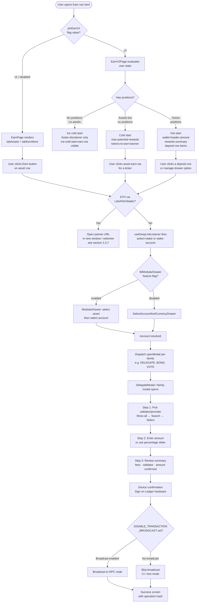

---

### 2.3.6 Earn V1 vs Earn V2

Two generations of the Earn Live App web application co-exist in the codebase. They share the same `ptxEarnLiveApp` manifest, but the `uiVersion` input selects which UI the web app renders. Both generations are exercised by separate POMs and spec files.

#### Feature-flag constants (from `featureFlagUtils.ts`)

```ts
export const EARN_V1_DESKTOP_FLAGS = {
  ptxEarnUi: { enabled: false, params: { value: "v1" } },
};
export const EARN_V2_DESKTOP_FLAGS = {
  ptxEarnLiveApp: { enabled: true, params: { manifest_id: "earn-local-manifest" } },
  ptxEarnUi: { enabled: true, params: { value: "v2" } },
};
```

V2 specs also accept a `localManifestOverride` fixture so that CI can test against a locally built manifest without hitting the production CDN.

#### Comparison

| Dimension | Earn V1 | Earn V2 |
|---|---|---|
| `ptxEarnUi` flag value | `"v1"` (or flag disabled) | `"v2"` |
| Desktop POM class | `EarnPage` | `EarnV2Page` |
| Desktop POM file | `earn.dashboard.page.ts` | `earn.v2.dashboard.page.ts` |
| Mobile POM class | `EarnDashboardPage` | `EarnV2DashboardPage` |
| Mobile POM file | `earnDasboard.page.ts` | `earnV2Dashboard.page.ts` |
| Desktop spec | `earn.spec.ts` | `earn.v2.spec.ts` |
| Mobile spec base | `earn.ts` | `earnV2.ts` |
| User state model | Single view; tabs "My Rewards" / "Earn Opportunities" | Three states: ice cold / cold / hot start |
| Balance cards shown | `amountAvailableToEarn`, `rewardsPotential`, `totalDeposited`, `totalRewards` | `maxPotentialRewards`, `walletHeaderAmount`, `rewardsSummary` |
| Position management | Not present | `deposit-row-*` items; manage drawer with Deposit / Withdraw options |
| Status | V1 suite marked `.skip` ("legacy not visible on prod") | Active — used in production |

#### V2 user-state model in detail

**Ice cold start** — the user has no crypto at all (`ETH_3` empty wallet). Only a footer disclaimer (`footer-disclaimer`) is shown. The `ice-cold-start-earn-cta` button drives the user to fund their account. Verified by `verifyIceColdStartPage()` which asserts `footer-disclaimer` is visible and `max-potential-rewards` / `wallet-header-amount` are absent.

**Cold start** — the user has assets but no active staking position. The dashboard shows `max-potential-rewards` (a banner with potential yield) and `tokens-to-earn-banner` (a list of eligible assets by ticker). Each asset has an `asset-earn-cta-<ticker>` button. Verified by `verifyColdStartPage()` + `verifyAssetReadyToEarn(ticker)`.

**Hot start** — at least one active staking position. The dashboard shows `wallet-header-amount` (total staked value), `rewards-summary` (accumulated rewards box), and one or more `deposit-row-*` rows for active positions. Clicking a row opens a manage drawer that offers Deposit and Withdraw options. Verified by `verifyHotStartPage()` + `verifyPositionRowPresent(id)`.

---

### 2.3.7 Ethereum via Lido (Live App Integration)

Ethereum staking in Ledger Live is not handled by a coin-module transaction. Instead, clicking an ETH staking CTA **opens the user's browser to a partner protocol URL** (desktop) or navigates the in-app webview (mobile). No `eth_signTransaction` or EIP-712 signature is built by Ledger Live itself — the partner application handles both signing and submission.

#### Partner providers and URL patterns

| Provider | Expected URL fragment | Additional assertions |
|---|---|---|
| **Lido** | `stake.lido.fi` | URL also contains `account.currency.id` |
| **Stader Labs** | `staderlabs.com/<ticker>` | URL also contains `account.currency.id` + `account.address` |
| **Kiln staking Pool** | `ledger-staking.widget.kiln.fi/earn` | URL also contains `focus=pooled`, `account.currency.id`, `account.address` |

`EarnBasePage.verifyProviderURL` (desktop) and `EarnDashboardPage.verifyProviderURL` (mobile) both implement these assertions via `switch(provider)`.

#### `ethDepositCohort` A/B testing

The Earn screen receives `ethDepositCohort` derived by `getEthDepositScreenSetting(stakePrograms)`. When the `stakePrograms` flag routes Ethereum to the `"earn"` platform with an `ethDepositCohort` query param, that value is forwarded to the embedded web app and used to select an A/B variant of the deposit UI without requiring a manifest update.

#### Mobile Lido in Earn V2

`earnV2_CTA_partnerDapp_ETH_LIDO.spec.ts` exercises the full path end to end:

1. Open Earn V2 from navigation.
2. Click ETH asset earn CTA (cold start) or ETH deposit row (hot start).
3. Tap the Lido provider in the staking-provider modal.
4. Assert the partner dApp URL loads inside the in-app webview.

Mobile uses `verifyPartnerDappLoaded(urlSubstring)` which calls `waitForCurrentWebviewUrlToContain(urlSubstring)` — a Detox helper that polls until the webview URL matches.

**QA implication**: because no native signed transaction is produced, broadcast and device-confirmation assertions do not apply to ETH staking. URL correctness is the primary assertion surface.

---

### 2.3.8 Code Path — Desktop

```
User clicks Earn in left nav
  └── React Router renders screens/earn/index.tsx
        └── Earn component
              ├── Reads ptxEarnLiveApp (manifest ID) + ptxEarnUi (version)
              ├── Resolves manifest: localManifest ?? remoteManifest
              │     if neither resolves → NetworkErrorScreen
              ├── Computes stakePrograms params
              │     stakeProgramsToEarnParam()
              │       in libs/ledger-live-common/src/featureFlags/stakePrograms/index.ts
              │     getEthDepositScreenSetting() → ethDepositCohort string
              ├── Determines Container: Box (LWD 4.0) or Card (legacy)
              ├── Renders <WebPlatformPlayer manifest={…} inputs={…}>
              │     data-testid="earn-app-container"
              └── useDeepLinkListener()
                    — reads location.search for action=stake / stake-account / get-funds
                    — dispatches openModal() or calls startStakeFlow()
                    — resets query string after handling

screens/stake/index.tsx (useStakeFlow hook)
  ├── useStake() resolves enabledCurrencies + partnerSupportedAssets
  ├── Checks useModularDrawerVisibility({ location: LIVE_APP, liveAppId: "earn" })
  │     if modular drawer enabled → opens ModularDrawer
  │     else                       → opens SelectAccountAndCurrencyDrawer
  └── On account selected → dispatch openModal per family
        "DELEGATE"         Cosmos, Solana, NEAR, MultiversX
        "BOND"             Polkadot
        "VOTE_TRON"        TRON
        "FREEZE_TRON"      TRON (if TRX not yet frozen)
        "DELEGATE_TEZOS"   Tezos
        "STAKE_CELO"       Celo
```

The `ptxEarnDrawerConfiguration` feature flag controls whether the legacy drawer or the modular drawer is shown for the asset selection step. This flag is separate from `lldModularDrawer` (the general modular drawer gate).

---

### 2.3.9 Code Path — Mobile

```
User taps Earn in bottom navigation
  └── React Native renders Earn Live App manifest in WebView
        (same manifest + inputs as desktop; uiVersion passed as query param)

Native-staking CTA tapped by user (e.g., SOL, ATOM):
  └── Live App posts deep-link message to React Native host
        └── React Native navigation handler
              ├── Cosmos / NEAR / Injective / Osmosis
              │     → Navigate to cosmos delegate navigator stack
              ├── Solana
              │     → Navigate to solana delegation navigator stack
              ├── Celo
              │     → Navigate to celo lock navigator stack
              ├── TRON
              │     → Navigate to tron freeze navigator stack
              ├── Tezos
              │     → Navigate to tezos delegate navigator
              └── Cardano / Polkadot / MultiversX
                    → Navigate to respective family delegate navigator

ETH Lido/Kiln/Stader CTA tapped:
  └── Live App navigates its own WebView to partner URL
        (no native navigator opened; webview URL verified by test)

Claim rewards (Cosmos):
  └── ClaimRewards navigator
        apps/ledger-live-mobile/src/screens/ClaimRewards/
          02-ValidationError.tsx   — error terminal step
          02-ValidationSuccess.tsx — success terminal step
        (steps 00-01 are family-specific navigator screens outside this directory)
```

**Mobile navigation entry point note**: the Earn tab label and position depend on the `llmWallet40` feature flag. When Wallet 4.0 is enabled, Earn is accessed via `app.mainNavigation.tapWallet40Tab("earn")`; otherwise it is a standalone bottom-tab item.

---

### 2.3.10 Code Path — Common (Family Staking Module)

#### Solana — `libs/coin-modules/coin-solana/src/`

**Stake account seed** (`stakeAccountSeed.ts`): every delegation creates a new on-chain stake account. The seed must be ≤ 32 bytes:

```ts
export const STAKE_SEED_PREFIX = "stake:";
const MAX_RANDOM_PART_LENGTH = 32 - STAKE_SEED_PREFIX.length; // 26

export function createStakeAccountSeed(): string {
  const hexPart = uuid().replace(/-/g, "").slice(0, MAX_RANDOM_PART_LENGTH);
  return `${STAKE_SEED_PREFIX}${hexPart}`;
}
```

**`prepareTransaction.ts`** (33 kB): the main transaction-building file for Solana. It handles the full lifecycle of a stake account — create, delegate, deactivate, withdraw — as well as SPL token transfers. It is the largest single file in the Solana coin module.

**Validators** (`utils.ts`): constants `LEDGER_VALIDATOR_LIST`, `LEDGER_VALIDATOR_DEFAULT`, `LEDGER_VALIDATOR_BY_FIGMENT`, `LEDGER_VALIDATOR_BY_CHORUS_ONE` expose the known Ledger-partnered vote accounts used by default in the selection step.

#### Cosmos — `libs/ledger-live-common/src/families/cosmos/`

**`react.ts`** — three hooks consumed by the delegation UI:

- `useCosmosFamilyPreloadData(currencyId)` — subscribes via RxJS to the preloaded validator set.
- `useCosmosFamilyMappedDelegations(account, mode)` — maps raw delegation objects to `CosmosMappedDelegation` display items. Filters by `pendingRewards > 0` for `claimReward` mode.
- `useLedgerFirstShuffledValidatorsCosmosFamily(currencyId, searchInput)` — returns the validator list with the Ledger validator pinned first, validators at 100 % commission removed, remainder sorted by token weight.

**`bridge/`** — the JS bridge implementation (`js.ts`) builds and serializes Cosmos transactions per mode. It calls the Cosmos LCD API for fee estimation.

#### Cardano — `libs/ledger-live-common/src/families/cardano/`

`staking.ts` exposes helpers for checking whether a stake key is registered on-chain and retrieving the current delegation pool. Pool selection is done by pool ID (bech32 format), not by a human-readable name.

#### Celo — `libs/ledger-live-common/src/families/celo/`

The Celo family uses a simpler hook model (see `react.ts`) but its complexity is in the multi-step lock/vote/activate lifecycle. The `setup.ts` file provides the account-setup helper that fetches locked gold and pending vote state.

#### TRON — `libs/ledger-live-common/src/families/tron/`

`react.ts` provides `getUnfreezeData`:

```ts
return {
  unfreezeBandwidth,
  unfreezeEnergy,
  canUnfreezeBandwidth,  // true if 3-day cooldown elapsed for bandwidth
  canUnfreezeEnergy,     // true if 3-day cooldown elapsed for energy
};
```

Both bandwidth and energy axes are independently testable. A common edge case: the user may have frozen bandwidth but not energy (or vice versa), which changes the available actions in the UI.

---

### 2.3.11 POM Table

#### Desktop POMs

**`EarnBasePage`** (`e2e/desktop/tests/page/earn.base.page.ts`)

Base class extended by both `EarnPage` and `EarnV2Page`. Inherits from `WebViewAppPage`, which provides `getWebView()` to resolve the Playwright iframe frame.

| Method | Purpose |
|---|---|
| `goAndWaitForEarnToBeReady(fn)` | Executes `fn` then waits for the `"Earn Live App Loaded"` console message (30 s timeout), then waits for loading skeleton to hide |
| `verifyProviderURL(provider, account)` | Opens new window after provider click; asserts URL contains expected substrings per provider |

---

**`EarnPage`** (V1) (`e2e/desktop/tests/page/earn.dashboard.page.ts`)

| Method | Purpose |
|---|---|
| `goToAssetsTab()` | Clicks `tab-assets` inside webview |
| `goToEarnMoreTab()` | Clicks `tab-earn-more` inside webview |
| `clickStakeCurrencyButton(account)` | Finds row by `<ticker> <accountName>` and clicks the Earn button |
| `verifyRewardsPotentials()` | Asserts `rewardsPotentialText` visible + balance cards present |
| `verifyTotalRewardsEarned()` | Asserts `totalRewardsText` + both reward balance cards visible |
| `verifyAssetsEarningRewards(account)` | Asserts "Deposited assets" heading + account name in view |
| `verifyYourEligibleAssets(account)` | Asserts "Amount available to earn" text + Earn button enabled for account row |
| `verifyEarnByStackingButton()` | Clicks stake CTA button; verifies ModularDialog or ChooseAssetDrawer opens |
| `clickLearnMoreButton(currency)` | Clicks `get-<currency>-button` in the webview |

---

**`EarnV2Page`** (V2) (`e2e/desktop/tests/page/earn.v2.dashboard.page.ts`)

| Method | Purpose |
|---|---|
| `verifyIceColdStartPage()` | Asserts `footer-disclaimer` visible; `maxPotentialRewards` and `walletHeaderAmount` absent |
| `clickIceColdStartEarnCTA()` | Clicks `ice-cold-start-earn-cta` in webview |
| `verifyColdStartPage()` | Asserts `maxPotentialRewards` + `tokensToEarnBanner` visible |
| `verifyAssetReadyToEarn(ticker)` | Asserts `asset-item-ticker-<ticker>` visible |
| `clickAssetEarnCta(ticker)` | Clicks `asset-earn-cta-<ticker>` |
| `verifyHotStartPage()` | Asserts `walletHeaderAmount` visible |
| `verifyRewardsSummaryBoxes()` | Asserts `rewardsSummary` element visible |
| `verifyPositionRowPresent(id)` | Finds `deposit-row-*` rows filtered by text; asserts first row visible |
| `clickPositionRow(id)` | Clicks the matching deposit row |
| `expectModularSelectorToBeVisible(app, type)` | Gets modular selector (`ASSET` or `ACCOUNT`) and validates items |
| `verifyModalContainerVisible()` | Asserts `modal-container` is visible |
| `verifyProviderVisible()` | Asserts at least one `stake-provider-container-*` inside modal |
| `verifyDepositFlowVisible()` | Asserts webview URL contains `/deposit` |
| `verifyWithdrawalFlowVisible()` | Asserts webview URL contains `/redeem` or `intent=withdraw` |
| `selectAssetInModularSelector(app, currency)` | Gets ASSET modular selector and selects given currency |
| `addExistingAccountViaModularSelector(app)` | Gets ACCOUNT selector and clicks "add existing account" |

---

**`DelegateModal`** (`e2e/desktop/tests/page/modal/delegate.modal.ts`)

| Method | Purpose |
|---|---|
| `getTitleProvider(row)` | Returns title text of the n-th provider row |
| `verifyFirstProviderName(name)` | Asserts first provider title contains expected name |
| `selectProviderOnRow(row)` | Selects the provider at position n |
| `selectProviderByName(name)` | Finds provider row by text, clicks it, verifies Continue is enabled |
| `verifyProvider(row)` | Checks the check-icon is present within the n-th provider row |
| `verifyContinueEnabled()` / `verifyContinueDisabled()` | Button state assertions |
| `verifyProviderTC(provider)` | Asserts `validatorTC` text contains expected provider string |
| `openSearchProviderModal()` | Clicks "Show all" to expand the full validator list |
| `inputProvider(provider)` | Types ticker portion of provider string into search field |
| `getSelectedProviderName()` | Returns text of the currently check-marked provider |
| `closeProviderList(row)` / `closeProviderListByName(name)` | Clicks "Show less" and verifies selection retained |
| `goToProviderLiveApp(provider)` | Clicks the provider name (external link) |
| `clickViewDetailsButton()` | Clicks "View details" |
| `checkValidatorListIsVisible()` | Asserts `validator-list` is visible |
| `fillAmount(amount)` | Types amount or toggles max-send |
| `verifySuccessMessage()` | Asserts `success-message-label` visible |
| `verifyValidatorName(name)` | Asserts `validator-name-label` texts contain expected name |
| `verifyFeesVisible()` | Asserts `fees-amount-step-summary` visible |
| `clickDelegateToEarnRewardsButton()` | Asserts delegation starter info visible, then clicks it |
| `verifyTezosDelegateInfos(validator)` | Tezos-specific: asserts validator name + warning box visible |
| `checkCeloManageAssetModal()` | Asserts all 6 Celo action buttons visible |
| `clickCeloLockButton()` | Clicks `celo-lock-button` |
| `clickLidoProvider()` | Clicks `stake-provider-container-lido` |
| `verifyLockInfoCeloWarning()` | Asserts `lock-info-celo` warning visible |

---

#### Mobile POMs

**`EarnDashboardPage`** (V1) (`e2e/mobile/page/trade/earnDasboard.page.ts`)

| Method | Purpose |
|---|---|
| `clickEarnCurrencyButton(account)` | Taps earn button for given account's ticker |
| `expectStakingProviderModalTitle(title)` | Asserts modal title text (normalized) |
| `goToProviderLiveApp(provider)` | Scrolls to and taps the provider |
| `verifyProviderURL(provider, account)` | Asserts webview URL against provider expectations |
| `verifyRewardsPotentials()` | Waits and asserts `rewardsPotentialBalanceCard` text |
| `verifyAmountAvailableToEarn()` | Waits and asserts `amountAvailableToEarnBalanceCard` text |
| `verifyTotalRewardsEarned()` | Asserts `totalRewardsBalanceCard` text |
| `verifyTotalDeposited()` | Asserts `totalDepositedBalanceCard` text |
| `verifyAvailableAssets(account)` | Asserts "Available assets" title and account row with Earn button |
| `verifyDepositedAssets(account)` | Asserts "Deposited assets" title and account in rewards table |
| `goToTab(tabName)` | Taps "My Rewards" (`tab-assets`) or "Earn Opportunities" (`tab-earn-more`) tab |
| `verifyEarnByStackingButton()` | Scrolls to stake CTA, taps it, calls `stake.verifyChooseAssetPage()` |

---

**`EarnV2DashboardPage`** (`e2e/mobile/page/trade/earnV2Dashboard.page.ts`)

| Method | Purpose |
|---|---|
| `verifyIceColdStartPage()` | Waits for `footer-disclaimer`; asserts `maxPotentialRewards` absent |
| `clickIceColdStartEarnCTA()` | Taps `iceColdStartEarnCta` in webview |
| `waitForColdStartPage()` | Waits for `maxPotentialRewards` to appear |
| `verifyColdStartPage()` | Asserts `tokensToEarnBanner` exists |
| `verifyAssetReadyToEarn(ticker)` | Asserts `asset-item-ticker-<ticker>` exists |
| `clickAssetEarnCta(ticker)` | Taps `asset-earn-cta-<ticker>` |
| `waitForHotStartPage()` | Waits for `walletHeaderAmount` |
| `verifyRewardsSummaryBoxes()` | Asserts `rewardsSummary` exists |
| `verifyPositionRowPresent(id)` | XPath query on `deposit-row-*` containing text; asserts exists |
| `clickPositionRow(id)` | Taps the matching deposit row |
| `verifyDepositFlowVisible()` | Waits for webview URL to contain `/deposit` |
| `verifyWithdrawalFlowVisible()` | Waits for webview URL to contain `/redeem` |
| `verifyStakingFlowOpened(ticker)` | Looks up static `stakingFlowTestIds[ticker]` and asserts visible |
| `tapStakingProvider(providerId)` | Taps `staking-provider-<providerId>-title` |
| `verifyPartnerDappLoaded(urlSubstring)` | Waits for webview URL to contain given string |
| `verifyModularAssetDrawerVisible()` | Calls `app.modularDrawer.checkSelectAssetPage()` |
| `waitForManageDrawerAndVerifyOptions(options)` | Waits for first option by testId; asserts all options present |
| `tapManageDrawerOption(optionText)` | Taps `earn-menu-option-<label>` |

---

**`StakePage`** (`e2e/mobile/page/trade/stake.page.ts`)

| Method | Purpose |
|---|---|
| `selectCurrency(currencyId)` | Taps `currency-row-<currencyId>` in the asset drawer |
| `delegationStart(currencyId)` | Taps delegation start button; waits for summary validator |
| `dismissDelegationStart(currencyId)` | Taps start button only if it is currently visible |
| `setAmount(currencyId, amount)` | Opens amount input; types amount; waits for continue button |
| `setAmountPercent(currencyId, pct)` | Opens amount input; taps percentage button (25/50/75/100) |
| `expectProvider(currencyId, provider)` | Asserts delegation summary validator text contains provider |
| `selectValidator(currencyId, provider)` | Taps summary validator; searches for ticker; taps provider row |
| `verifyFeesVisible(currencyId)` | Asserts fees element exists in summary |
| `getDisplayedFees(currencyId)` | Returns fees text from summary |
| `validateAmount(currencyId)` | Taps amount continue button |
| `summaryContinue(currencyId)` | Taps summary continue button |
| `setCeloLockAmount(amount)` | Types amount in `celo-lock-amount-input` |
| `openCeloVoteAmount()` | Taps `celo-vote-amount` row |
| `setCeloVoteAmount(amount)` | Types amount in vote amount input |
| `validateCeloVoteAmount()` | Taps vote amount continue button |
| `celoVoteSummaryContinue()` | Taps CELO vote summary continue |
| `verifyChooseAssetPage()` | Asserts modular drawer search bar or legacy select-asset title visible |

---

### 2.3.12 Specs List

#### Desktop

**`earn.spec.ts`** (`e2e/desktop/tests/specs/earn.spec.ts`)

Status: `test.describe.skip` — the V1 dashboard is no longer visible in production. Tests are preserved for regression reference and feature-flag rollback scenarios.

Coverage (when enabled via `EARN_V1_DESKTOP_FLAGS`):

- ETH with Lido, Stader Labs, Kiln — provider URL assertions, rewards-potential cards, deposited-assets view.
- Inline add-account flow from the Earn CTA.

---

**`earn.v2.spec.ts`** (`e2e/desktop/tests/specs/earn.v2.spec.ts`)

Active spec. Uses `EARN_V2_DESKTOP_FLAGS` + optional `localManifestOverride`.

| `test.describe` block | Account(s) | What is verified |
|---|---|---|
| Ice cold start | `ETH_3` (empty) | `footer-disclaimer` visible; `maxPotentialRewards` absent; CTA opens modular selector |
| Cold start — ETH / ATOM | `ETH_2`, `ATOM_2` | `maxPotentialRewards` + `tokensToEarnBanner`; asset-earn-cta visible per ticker |
| Hot start & Position — ETH / ATOM / SOL | `ETH_1`, `ATOM_1`, `SOL_1` | `walletHeaderAmount`; `rewardsSummary`; deposit rows present |
| Inline Add Account | `ETH_2` | CTA opens add-account flow |
| CTA → Native staking (SOL) | `SOL_2` | Clicking SOL asset CTA opens SOL delegation modal |
| CTA → Earn staking (USDT) | token account | Clicking USDT CTA navigates to `/deposit` in webview |
| ETH staking flow — Lido / Stader / Kiln | `ETH_1` | Provider modal visible; provider URL opens in new window |
| Position → Dapp (ETH) | `ETH_1` (with Lido position) | Deposit row present; clicking opens Lido URL |
| Position → Withdrawal (USDT) | `ETH_1` (with USDT position) | Manage drawer → Withdraw → webview URL contains `/redeem` |

---

**`delegate.spec.ts`** (`e2e/desktop/tests/specs/delegate.spec.ts`)

Covers native delegation across all supported Cosmos-family and other chains.

| `test.describe` block | Accounts / chains | Notes |
|---|---|---|
| Delegate (with broadcast) | ATOM, SOL, NEAR, INJ, OSMO | Broadcast enabled in most; `NAPPS-1357` bug ticket on OSMO |
| Delegate without Broadcasting | ADA, EGLD | `DISABLE_TRANSACTION_BROADCAST=1` |
| e2e delegation — Tezos | XTZ | Baker selection step; `warning-box` assertion |
| e2e delegation — Celo | CELO | Lock flow; `lock-info-celo` warning; vote flow |
| Select a validator | ATOM, SOL, NEAR, ADA | Verifies validator search, select, close-list retain selection |
| Staking flow from different entry point — legacy | ETH, ATOM, SOL | Entry from account page "Earn" button (legacy drawer) |
| Staking flow from different entry point | ETH, ATOM, SOL | Entry via modular drawer |
| LiveApp delegate | ETH | Lido provider in Earn LiveApp context |

#### Mobile

| Spec file / directory | Coverage |
|---|---|
| `earn/earn.ts` + per-account spec files | V1 dashboard: ATOM (with/without staking), SOL (with/without staking), NEAR, ETH_3; inline add-account; ETH Lido/Kiln/Stader provider URLs |
| `earn/earnV2.ts` + per-state spec files | V2 states: ice-cold (`ETH_3`), cold (`ETH_2`, `ATOM_2`), hot (`ATOM_1`, `NEAR_1`, `SOL_2`); native CTA (SOL); partner dApp CTA (ETH Lido); SCY staking (USDT); position withdrawal (USDT) |
| `delegate/delegate.ts` + per-chain spec files | ADA, ATOM, EGLD, INJ, NEAR, OSMO, SOL (+ default validator), TEZOS, CELO lock+vote |

---

### 2.3.13 Cross-References

| Topic | Where to look |
|---|---|
| Desktop E2E architecture — fixtures, `WebPlatformPlayer` frame helpers, `featureFlagUtils.ts` | Part 4 — Desktop E2E |
| Mobile E2E architecture — Detox WebView interactions, `waitForCurrentWebviewUrlToContain`, bridge server | Part 5 — Mobile E2E Architecture, Chapter 5.1 |
| Swap flow (also PTX-team owned, same Live App embedding pattern) | Chapter 2.4 (overview); Part 7 (Swap deep dive) |
| Live App / `WebPlatformPlayer` iframe mechanics and manifest resolution | Chapter 2.7 — Discover / Web3 |
| Firebase remote config, `useFeature`, `OptionalFeatureMap`, flag overrides in tests | Part 3 Ch 3.4 — Firebase & Feature Flags |
| CLI test helpers — `liveDataCommand`, `liveDataWithAddressCommand` | Part 6 — CLI |
| Allure reporting — `addTmsLink`, `addBugLink`, `getDescription`, `$TmsLink`, `$Tag` | Part 3 Ch 3.5 — Allure Reporting & Xray |
| Modular Drawer feature — `lldModularDrawer` flag, `ModularDrawerLocation` enum | Chapter 2.7 and Part 4 |

---

### 2.3.14 Quiz

<div class="quiz-container" data-pass-threshold="80">

<div class="quiz-question" data-correct="B">
  <p><strong>Q1.</strong> The Earn dashboard in Ledger Live Desktop is implemented as a pure React screen that fetches validator data directly from the blockchain. True or false?</p>
  <ul class="quiz-options">
    <li data-option="A">True — it uses React hooks from <code>libs/ledger-live-common</code> to query on-chain data and renders the UI locally without a manifest.</li>
    <li data-option="B">False — it embeds a Live App web application inside a <code>WebPlatformPlayer</code> iframe; the React shell resolves the manifest and passes context inputs, but all UI and data fetching happens inside the web app.</li>
    <li data-option="C">False — it is a native mobile screen only; the desktop version has no Earn section and routes users directly to the partner websites.</li>
    <li data-option="D">True — it renders chain data from <code>useCosmosFamilyPreloadData</code> and equivalent hooks synchronously without an iframe.</li>
  </ul>
  <div class="quiz-feedback"></div>
</div>

<div class="quiz-question" data-correct="C">
  <p><strong>Q2.</strong> In the Earn V2 dashboard, a user who has assets in Ledger Live but no active staking positions sees which state?</p>
  <ul class="quiz-options">
    <li data-option="A">Ice cold start — only a footer disclaimer and an <code>ice-cold-start-earn-cta</code> button to fund the account.</li>
    <li data-option="B">Hot start — a <code>wallet-header-amount</code> banner and active <code>deposit-row-*</code> entries.</li>
    <li data-option="C">Cold start — a <code>max-potential-rewards</code> banner, a <code>tokens-to-earn-banner</code> listing eligible assets, and per-asset earn CTA buttons.</li>
    <li data-option="D">Warm start — a hybrid view mixing deposit rows and an "earn more" table that is unique to V2.</li>
  </ul>
  <div class="quiz-feedback"></div>
</div>

<div class="quiz-question" data-correct="D">
  <p><strong>Q3.</strong> Which of the following best describes how Ethereum staking via Lido works in Ledger Live?</p>
  <ul class="quiz-options">
    <li data-option="A">The <code>coin-evm</code> coin module builds a standard ERC-20 approval + deposit transaction and signs it on the Ledger device inside the delegate modal.</li>
    <li data-option="B">A native React modal opens with a validator-selection step identical to the Cosmos delegate flow, ending with a hardware-signed <code>eth_signTransaction</code>.</li>
    <li data-option="C">The user sends ETH to a hardcoded Lido contract address using the standard Send flow with a memo field for the referral code.</li>
    <li data-option="D">The user is redirected to an external partner URL (e.g., <code>stake.lido.fi</code>) in a new window or webview; Ledger Live only asserts that the URL is correct — no native transaction is built or signed by the app.</li>
  </ul>
  <div class="quiz-feedback"></div>
</div>

<div class="quiz-question" data-correct="A">
  <p><strong>Q4.</strong> When testing the Celo (CELO) staking flow, which sequence of on-chain steps — and corresponding modal buttons — does the flow require?</p>
  <ul class="quiz-options">
    <li data-option="A">Lock → Vote → Activate Vote (with Revoke Vote / Unlock / Withdraw for the exit path), exposed as six separate buttons in <code>DelegateModal</code>.</li>
    <li data-option="B">Bond → Nominate, identical to the Polkadot flow, with a single nominate-validator step.</li>
    <li data-option="C">Delegate → Claim Reward, identical to the Cosmos ATOM flow with mode switching.</li>
    <li data-option="D">Freeze → Vote → Unfreeze, with separate bandwidth and energy resource selectors in the same modal.</li>
  </ul>
  <div class="quiz-feedback"></div>
</div>

<div class="quiz-question" data-correct="B">
  <p><strong>Q5.</strong> When the <code>ptxEarnUi</code> Firebase feature flag is set to <code>{ enabled: true, params: { value: "v2" } }</code>, what does the Earn screen in Ledger Live Desktop do differently compared to V1?</p>
  <ul class="quiz-options">
    <li data-option="A">It loads a completely different React component from a <code>screens/earnV2/</code> directory instead of <code>screens/earn/</code>, bypassing the iframe entirely.</li>
    <li data-option="B">It passes <code>uiVersion: "v2"</code> as an input to the embedded Live App web application, which then renders the three-state (ice cold / cold / hot start) UI with position management — no code outside the web app changes.</li>
    <li data-option="C">It disables the Earn section and shows a "coming soon" placeholder until the V2 manifest is deployed to the CDN.</li>
    <li data-option="D">It overrides the manifest ID to a separate V2 CDN endpoint and disables the <code>stakePrograms</code> parameter to avoid conflicts.</li>
  </ul>
  <div class="quiz-feedback"></div>
</div>

</div>

---

<div class="chapter-outro">
You now have a complete map of Ledger Live's stake and earn feature — from the terminology variations across PoS chains, through the Live App iframe architecture, the per-family flow differences, the V1-to-V2 UI migration, the deep-link bridge between the web app and native modals, and down to every POM method and spec file. The next chapter extends this coverage to another PTX-team feature that shares the same Live App embedding pattern: the Swap flow.
</div>

> **Next chapter**: 2.4 Swap Overview — entry points, the `swapWeb` screen, PTX's `swap.page.ts` (the largest POM in the repo at 22 kB), and the split between native swap and the Swap Live App.


---

## Swap (Overview)

<div class="chapter-intro">
Swap is the highest-complexity feature in Ledger Wallet. It spans two codebases, seven providers, two signing paradigms, and the largest Page Object Model in the desktop test suite. This chapter gives you the product-level mental model you need before reading the E2E code: what Swap does, where it lives in the app, how the user flow unfolds step by step, and which test artefacts cover it. The deep technical dive — Live App architecture, Wallet API, manifest wiring, deployment pipeline — lives in Part 7 (Swap Live App). Cross-references to that part are distributed throughout this chapter; follow them when you need to go deeper on any sub-topic.
</div>

---

### 2.4.1 What Swap Is

Swap is Ledger Wallet's built-in cryptocurrency exchange. It lets a user exchange one asset for another — ETH to BTC, USDC to SOL, DAI to MATIC — without leaving the Wallet and without trusting a third-party custodian with the private key.

Three properties define Swap and distinguish it from a conventional web-based exchange:

**Intra-app.** The swap flow runs inside Ledger Live (desktop and mobile). The user never pastes a receiving address into an external website, never copies a private key, and never leaves the application. The entire journey — pick asset, review quote, confirm on device — is self-contained.

**On-device signing.** Regardless of which provider executes the exchange, the transaction is signed on the Ledger hardware device. The private key never leaves the secure element. The Wallet shell constructs the unsigned transaction from the provider's quote, sends it to the device for user review, and broadcasts the signed bytes after the user approves the on-screen summary.

**Multi-provider aggregation.** Swap aggregates quotes from multiple exchange providers in a single request. The user sees a ranked list of rates, fees, and ETAs from every provider that supports the chosen pair. The best-rate quote is pre-selected; the user can override the selection. This aggregation layer is why Swap is architecturally distinct from a simple "open a DEX webview" integration.

#### What Swap is not

Swap is **not** Buy or Sell. Buy converts fiat currency (EUR, USD) into crypto; Sell converts crypto back into fiat. Both flows go through the PTX (Provider Transaction eXperience) integration — a different code path, different providers, and a different Part 2 chapter (Ch 2.5). A beginner's common mistake is filing a Swap bug against the Buy/Sell surface or vice versa. The rule is simple: crypto-to-crypto = Swap; fiat-to-crypto or crypto-to-fiat = Buy/Sell.

Swap is also **not** Earn. The Earn/Staking surfaces (Ch 2.3) let a user delegate, stake, or deposit an asset to earn yield while retaining the same asset. Swap changes the asset. Architecturally, Earn uses native Ledger Live screens for most protocols (Cosmos delegation, Solana staking), while Swap uses a Live App webview for all flows.

Swap is also **not** a cross-app operation. Everything stays inside Ledger Live; no external browser tab opens, no clipboard paste is required, no external account is involved.

---

### 2.4.2 Where Swap Lives in the App

#### Desktop

On the desktop, Swap is reachable from multiple entry points:

1. **Left sidebar — "Swap" icon.** The primary entry point. It loads the Swap screen directly.
2. **Dashboard — Quick actions bar.** A "Swap" shortcut appears in the action strip at the top of the portfolio view.
3. **Account screen — "Swap" button.** Each account detail page exposes a Swap action that pre-selects that account as the "from" side.
4. **Market screen — "Swap" action.** Certain asset rows in the Market screen carry a Swap shortcut.

All four entry points route to `apps/ledger-live-desktop/src/renderer/screens/swapWeb/index.tsx`, which mounts the Live App webview. The `exchange/` sibling directory holds legacy swap code (`Swap2/`) kept for reference; the active path is `swapWeb/`.

<photo of: Swap entry on desktop dashboard — sidebar icon highlighted and dashboard Quick Actions bar showing "Swap" shortcut>

#### Mobile

On mobile, Swap lives under the **Trade** tab in the bottom navigation bar. The route is driven by a deeplink (`ledgerlive://swap`) and lands on `apps/ledger-live-mobile/src/screens/PTX/index.tsx`, which delegates to the swap Live App webview via the shared `walletApiWebview` component.

<photo of: Swap entry on mobile main nav — bottom tab bar with Trade tab selected, Swap option highlighted>

The mobile entry points mirror the desktop ones:

- Trade tab bottom nav (primary)
- Account screen "Exchange" action
- Deeplink `ledgerlive://swap` (used by E2E tests: `await openDeeplink("swap")`)

---

### 2.4.3 The User Flow

A standard crypto-to-crypto swap follows six stages. Understanding these stages is prerequisite knowledge for reading any swap spec.

**Stage 1 — From-account selection.**
The user picks the account to debit. The Live App calls `walletApi.account.list()` over the Wallet API bridge to populate the selector. The from-account picker (`from-account-coin-selector`) is the first webview element the E2E suite interacts with.

<photo of: Swap Live App — from-account coin selector open, showing account list>

**Stage 2 — To-asset selection.**
The user picks the destination asset. The selection is independent from the from-account: the user can send ETH and receive BTC into any BTC account in the Wallet. The to-asset picker (`to-account-coin-selector`) works identically to the from-account picker.

**Stage 3 — Amount entry and quote fetch.**
The user types an amount (or toggles "Send Max"). The Live App debounces the input and fans out a quote request to all enabled providers. On desktop, quotes refresh automatically on a countdown timer (`quotes-countdown`). On mobile, the user taps a "Get Quotes" button (`mobile-get-quotes-button`) to trigger the fetch.

<photo of: Swap Live App — amount entered, provider quote list with countdown timer visible>

**Stage 4 — Provider selection and review.**
The Live App renders one quote card per responding provider. Each card shows the output amount, network fees, exchange rate type (fixed or floating), and — for DEX providers — the maximum slippage. The highest-rated quote is pre-selected ("Best Offer" badge). The user taps a quote card to select it, then taps the Exchange button (`execute-button`).

<photo of: Swap Live App — provider quote cards, best offer badge on top row, Exchange button>

**Stage 5 — On-device signing.**
The Wallet shell takes over. It constructs the unsigned transaction from the selected quote, displays a native review summary, and requests the user to confirm on the hardware device. The user verifies the send amount, destination address, and fees on the device screen, then holds to approve. This stage is where Speculos matters in E2E: the POM's `verifyAmountsAndAcceptSwap(swap, amount)` delegates to `app.speculos` to walk the device screen and press hold-to-sign.

<photo of: Device signing screen — Ledger hardware device displaying swap transaction details>

**Stage 6 — Broadcast and confirmation.**
After the user approves on-device, the Wallet broadcasts the signed transaction. The Live App polls the swap backend for status and displays a success state (`swap-success-title`) when the provider confirms receipt. On desktop, `waitForSwapToComplete()` or checking for the success title completes the E2E assertion. On mobile, `waitForSuccessAndContinue()` waits for `swap-success-title` with a 120-second timeout.

<photo of: Swap success screen — confirmation message, swap ID, and "Continue" button>

---

### 2.4.4 Mermaid Diagram of the Swap Flow

The following diagram shows the full swap flow from user action to on-chain broadcast, including the two-sided architecture (Wallet shell vs. Live App):

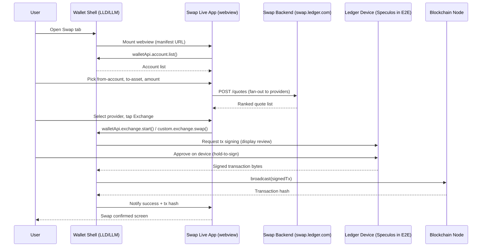

**Token-approval variant (DEX providers only).** When the from-asset is an ERC-20 token and the provider is a DEX, an `approve(spender, amount)` transaction is inserted between Stage 4 and Stage 5. The user signs the approval on the device first, then signs the swap transaction. See Section 2.4.6 for the full treatment.

---

### 2.4.5 Provider Categories

Ledger Swap currently integrates seven providers. Understanding the CEX/DEX boundary is essential for QA because it determines whether a token approval step is present.

| Provider | Category | KYC Required | Contract Address | Notes |
|---|---|---|---|---|
| Changelly | CEX | No | — | Floating and fixed rate; most broadly supported pairs |
| Exodus | CEX | No | — | Cross-chain pairs including BTC; native to Ledger |
| CIC | CEX | No | — | |
| THORChain | DEX | No | `0xD37BbE...` | Cross-chain native asset swaps; requires approval for ERC-20 from-assets |
| Uniswap | DEX | No | `0x000000...` | EVM only; requires approval; not available on Ledger Nano S devices |
| 1inch | DEX | No | `0x111111...` | EVM only; requires approval; has a dedicated signing app (`AppInfos.ONE_INCH`) |
| Velora | DEX | No | `0x6A000F...` | EVM only; requires approval; has a dedicated signing app (`AppInfos.VELORA`) |
| LI.FI | Aggregator | No | `0x1231DE...` | Cross-chain aggregator; requires approval; excluded from ETH↔SOL pairs and LNS devices |
| OKX | DEX | No | `0x40aA95...` | EVM only; requires approval |
| MoonPay | Buy/Sell only | Yes | — | Appears in the Provider enum but routes to Buy/Sell, not Swap |

> **Source:** `libs/ledger-live-common/src/e2e/enum/Provider.ts`

#### The CEX / DEX distinction for QA

| Dimension | CEX (Changelly, Exodus) | DEX / Aggregator (THORChain, Uniswap, 1inch, Velora, LI.FI) |
|---|---|---|
| Token approval step | Never required | Required when from-asset is ERC-20 |
| Provider contact | Centralised server | Smart contract on-chain |
| Quote variability | Fixed or floating rate | Always floating (slippage applies) |
| Slippage field in quote card | Not shown | Shown (`Max Slippage`) |
| `contractAddress` in `Provider` enum | `undefined` | Populated |
| `ensureTokenApproval` pre-check | No-op (early return) | Active — checks and sets allowance |

When a spec targets a specific provider, the `Provider.contractAddress` field is the signal that approval plumbing is required. The check in `ensureTokenApproval` on both desktop and mobile is:

```typescript
if (!provider.contractAddress || !fromAccount.parentAccount) return;
```

If `contractAddress` is absent (CEX), the function returns immediately. If it is present (DEX), it proceeds to query the on-chain allowance and potentially issue an `approve` transaction before the swap.

---

### 2.4.6 Token Approvals

When the from-asset is an ERC-20 token and the selected provider is a DEX, the user must first grant the provider's smart contract the right to move their tokens. This is the ERC-20 `approve(spender, amount)` mechanism, and it produces a distinct step in the swap flow: an approval transaction must be signed on the device before the swap transaction itself.

#### Why approvals are required for DEX swaps

ERC-20 tokens cannot be moved by a smart contract unless the token holder has explicitly called `approve(spender, amount)` on the token contract. Without this call, the DEX router contract cannot pull the user's USDC (or DAI, or any ERC-20) to execute the exchange. CEX providers take custody of the asset server-side and do not need on-chain permission; DEX providers operate entirely on-chain and must have the allowance in the token contract's storage.

For the full ERC-20 storage model — `allowances[owner][spender]`, slot derivation, why the slot survives across CI runs — see **Part 6 Ch 6.2** (ERC-20 Allowances deep dive).

#### The approval step in the UI

When the user taps Exchange and the provider is a DEX with an ERC-20 from-asset, the Live App renders an approval step before showing the swap summary. The execute button shifts to `execute-swap-button-step-approval` during this phase. On mobile, `tapExecuteSwapOnStepApproval()` handles this variant in `swapLiveApp.ts`.

<photo of: Approval step in swap flow — swap Live App showing "Approve [TOKEN] for [PROVIDER]" step with execute button>

<photo of: Device approve tx — Ledger hardware device screen displaying ERC-20 approve transaction details>

After the user approves on-device, the Live App proceeds to the swap transaction signing step. Two separate device confirmations happen: one for `approve(spender, amount)`, one for the swap itself.

#### E2E handling: `ensureTokenApproval`

The E2E suite uses a pre-flight helper — `ensureTokenApproval` — to guarantee the allowance is set to a sufficient value before the test reaches the UI approval step. This decouples the "does the UI approval screen render correctly" test from the "does the approval state persist correctly across runs" test.

The helper appears in identical form in both the desktop POM (`e2e/desktop/tests/page/swap.page.ts`) and the mobile POM (`e2e/mobile/page/trade/swap.page.ts`):

```typescript
async ensureTokenApproval(
  fromAccount: Account | TokenAccount,
  provider: Provider,
  minAmount: string,
) {
  if (!provider.contractAddress || !fromAccount.parentAccount) return;

  const currentAllowance = await isTokenAllowanceSufficientCommand(
    fromAccount,
    provider.contractAddress,
    minAmount,
  );
  if (currentAllowance) return;

  // launch a fresh Speculos for the EVM app, run approve, restore previous port
  const speculos = await launchSpeculos(fromAccount.currency.speculosApp.name);
  try {
    await approveTokenCommand(fromAccount, provider.contractAddress, approveAmount);
  } finally {
    await cleanSpeculos(speculos, previousSpeculosPort); // desktop
    // or: await deleteSpeculos(speculos.id);           // mobile
  }
}
```

Internally, `approveTokenCommand` calls `runCliTokenApproval` with `--mode approve`, which invokes the CLI's `send` command with the `--mode approve` flag. The CLI signs and broadcasts the `approve(spender, amount)` transaction against the Speculos-emulated device. For the full five-layer trace from POM method to CLI subprocess, see **Part 6 Ch 6.4** (the Five-Layer Integration walkthrough).

> **Cross-link: token approvals deep dive.** Part 6 Ch 6.2 explains the ERC-20 storage model. Part 6 Ch 6.8 (QAA-615 walkthrough) walks the complete revoke workflow that restores determinism after an approval lands on-chain.

---

### 2.4.7 Token Revocation

Token revocation is the act of resetting an ERC-20 allowance back to zero: `approve(spender, 0)`. It is the inverse of the approval step described in Section 2.4.6 and serves one purpose in QA: restoring allowance state to a known-zero baseline between test runs.

#### Why revocation matters for test determinism

An `approve(spender, N)` transaction lands on-chain on the test network and persists indefinitely. If a test run sets `allowances[seed][0xRouter] = 100 USDC` and the CI runner never resets it, the next run finds an existing allowance of 100 USDC. Any test that asserts the "Approve USDC" device screen text will silently fail or skip the approval step, depending on how the pre-check is written. Revocation before or after a test is the only way to prevent this accumulation. See **Part 6 Ch 6.4** for the layer-by-layer trace and **Part 6 Ch 6.8** (QAA-615) for the canonical implementation.

#### The CLI command

The CLI's `send` command accepts `--mode revokeApproval`. When used, it constructs an `approve(spender, 0)` transaction and signs it on the device:

```
ledger-live send \
  --currency ethereum \
  --mode revokeApproval \
  --token ethereum/erc20/usd_coin \
  --spender 0xRouterAddress \
  --index 0 \
  --wait-confirmation
```

The matching TypeScript wrapper is `runCliTokenApproval` in `libs/ledger-live-common/src/e2e/runCli.ts`:

```typescript
export type TokenApprovalOpts = {
  currency: string;
  index: number;
  spender: string;
  approveAmount?: string;
  token: string;
  waitConfirmation?: boolean;
  mode: "revokeApproval" | "approve";   // <-- both directions share this wrapper
};
```

The `revokeTokenCommand` fixture (referenced in Part 6 as a higher-level wrapper around `runCliTokenApproval`) follows the same pattern as `approveTokenCommand` but passes `mode: "revokeApproval"` and omits `approveAmount`. Both wrappers manage the `DISABLE_TRANSACTION_BROADCAST` environment variable in a `try/finally` block to ensure the revoke transaction actually lands on-chain regardless of the surrounding test's broadcast-gate setting.

> **Cross-links:** Part 6 Ch 6.4 traces the full five-layer revoke path. Part 6 Ch 6.8 (QAA-615) is the canonical sprint ticket that introduced the revoke fixture and the `revokeTokenApproval` POM method on `swap.page.ts`.

---

### 2.4.8 Swap History

After a swap executes, the Wallet records it in a persistent swap history list. The user can view past swaps, see their status (pending / complete / failed), and export the history as a CSV file. The history tab is accessible via the "History" button (`History-tab-button` on desktop, `navigation-header-swap-history` or `topbar-swap-history` on mobile).

<photo of: Swap history list — swap operation rows showing provider, from/to accounts, amounts, and date>

Each history row is keyed by a `swapId` string assigned by the swap backend. The E2E suite uses `swapId` to address individual operations:

- Desktop: `selectSpecificOperation(swapId)` → `operation-row-${swapId}`
- Mobile: `getSpecificOperation(swapId)` → `swap-operation-row-${swapId}`

The `checkSwapOperation(swapId, provider, swap)` method on both platforms verifies that the row displays the correct provider name, account names, amounts, and date.

The history export produces a CSV at `ledgerwallet-swap-history.csv` containing swap IDs, provider names, currency tickers, amounts, account names, and addresses. The `checkExportedFileContents(swap, provider, id)` method verifies the file contents after `clickExportOperations()` moves the file from its download location to the test artifacts directory.

> **Cross-link:** Part 5 Ch 5.10 is a full sprint-ticket walkthrough (QAA-702) for adding a swap history ERC-20 export test case on mobile. If you are new to the "how do I add a test?" workflow, read Chapter 5.10 before touching swap history specs.

---

### 2.4.9 Code Path — Swap as a Live App

Understanding Swap's code path is what separates a tester who can debug swap issues from one who cannot. The key insight is that **Swap is a Live App**: the quote UI, provider selection, and approval flow are rendered by a separate web application loaded into a webview, not by code inside `ledger-live`.

#### The split

| Concern | Owner | Location |
|---|---|---|
| Mounting the webview | Wallet shell | `apps/ledger-live-desktop/src/renderer/screens/swapWeb/index.tsx` (desktop) |
| Account picker state | Wallet shell | Wallet API bridge (`walletApi.account.list`) |
| Quote UI, provider list, approval step | Swap Live App | Separate repo (not in `ledger-live`) |
| Device signing | Wallet shell | Ledger hardware SDK, driven by Wallet API `exchange.complete` / `custom.exchange.swap` |
| Swap backend | Backend team | `swap.ledger.com` (prod), `swap-stg.ledger.com` (staging) |

The desktop `swapWeb/index.tsx` is intentionally thin — 80 lines. It resolves the swap manifest (local override first, then remote), mounts `WebPlatformPlayer` with `inputs` for theme, locale, and fiat currency, and registers a crash handler that navigates back if the webview fails to load. There is no swap logic in this file; all behaviour lives in the Live App.

The `WebPlatformPlayer` component (used across all Live Apps) receives these `inputs`:

| Input key | Value | Purpose |
|---|---|---|
| `theme` | `"light"` or `"dark"` from Redux | Lets the Live App match the Wallet theme |
| `lang` | Current locale (e.g., `"en"`) | Localises the Live App UI |
| `currencyTicker` | Counter-value ticker (e.g., `"USD"`) | Live App uses this for fiat-equivalent display |

Additional `params` from `location.state` are spread into `inputs` — this is how entry points like the account screen pre-select a from-account (they pass `{ fromAccountId: "..." }` as route state).

#### What "separate repo" means for QA

The Swap Live App lives in `swap-live-app` (a separate GitHub repository under `LedgerHQ`). Its CI/CD pipeline deploys independently of the Wallet release train. When you see a swap regression, the bug could be in:

1. The Swap Live App code (not in this repo — requires `swap-live-app` access)
2. The Wallet API bridge or manifest wiring (in `ledger-live`)
3. The swap backend (`swap.ledger.com`) — infrastructure team territory
4. The feature flag or manifest service that controls which URL the webview loads

Part 7 of this guide (Swap Live App) covers all four of these layers in detail — Live App architecture, manifest schema, Wallet API method reference, feature flag wiring, and the E2E environment switching mechanism.

---

### 2.4.10 POM Overview

#### Desktop — `swap.page.ts`

`e2e/desktop/tests/page/swap.page.ts` is the largest POM in the desktop suite at approximately 22 kB. It extends `WebViewAppPage`, which provides the `getWebView()` helper that resolves the swap webview frame from the surrounding Electron shell. All element interactions go through a `const webview = await this.getWebView()` call first.

Key methods at a glance:

| Method | Purpose |
|---|---|
| `selectAssetFrom(currency)` | Clicks `from-account-coin-selector`, then delegates to `ChooseAssetDrawer` |
| `selectAssetTo(currency)` | Clicks `to-account-coin-selector`, same drawer delegate |
| `fillInOriginCurrencyAmount(amount)` | Clicks and fills `from-account-amount-input`; waits 500 ms for error debounce |
| `selectSpecificProvider(provider: Provider)` | Calls `getProviderList()` then clicks the matching `compact-quote-card-provider-name-*` locator |
| `clickExchangeButton()` | Asserts and clicks `execute-button` (the main CTA in the quote view) |
| `clickExecuteSwapButton()` | Asserts and clicks `execute-swap-button-step-approval` (the DEX approval variant); polls for `disabled` removal before click |
| `ensureTokenApproval(fromAccount, provider, minAmount)` | Pre-flight CLI approve — see Section 2.4.6 for the full implementation |
| `goToSwapHistory()` | Clicks `History-tab-button` |
| `checkSwapOperation(swapId, provider, swap)` | Asserts all fields on a history row |
| `clickExportOperations()` | Clicks export, then moves CSV from download dir to artifacts |

The `revokeTokenApproval` method referenced in Part 6 Ch 6.8 (QAA-615) is the POM method added by the senior's branch (`support/qaa_add_revoke_token`). It orchestrates: save current Speculos port, launch a fresh EVM Speculos instance, call `revokeTokenCommand` via CLI, restore the original Speculos port in `finally`. This method is the canonical Layer 5 example in the five-layer revoke trace.

#### Mobile — `trade/swap.page.ts`

`e2e/mobile/page/trade/swap.page.ts` covers the native mobile shell around the swap webview: navigation, history access, and the Speculos device interactions that cannot go through the webview. It delegates webview interactions to `swapLiveApp.page.ts`.

Key methods:

| Method | Purpose |
|---|---|
| `openViaDeeplink()` | Opens `ledgerlive://swap` and waits for `walletApiWebview` |
| `goToSwapHistory()` | Taps `topbar-swap-history` or falls back to `navigation-header-swap-history` |
| `checkSwapOperation(swapId, swap)` | Asserts operation row fields on the history list |
| `verifyAmountsAndAcceptSwap(swap, amount)` | Delegates to `app.speculos` to walk the device confirmation screens |
| `waitForSuccessAndContinue()` | Waits for `swap-success-title` (120 s timeout), then taps proceed |
| `ensureTokenApproval(fromAccount, provider, minAmount)` | Identical logic to desktop; manages a dedicated Speculos device for the EVM app |

#### Mobile — `liveApps/swapLiveApp.ts`

`e2e/mobile/page/liveApps/swapLiveApp.ts` owns all webview-level interactions on mobile. It communicates through Detox's `getWebElementByTestId` / `tapWebElementByTestId` / `getWebElementText` helpers (the WebSocket bridge layer described in Part 5 Ch 5.1).

Key methods:

| Method | Purpose |
|---|---|
| `expectSwapLiveApp()` | Waits for `from-account-coin-selector` to appear — the readiness signal |
| `tapFromCurrency()` / `tapToCurrency()` | Opens the asset picker in the webview |
| `inputAmount(amount)` | Types into `from-account-amount-input` via `typeTextByWebTestId` |
| `tapGetQuotesButton()` | Taps `mobile-get-quotes-button` (mobile-only step, no auto-refresh) |
| `waitForQuotes()` / `waitForQuotesStable()` | Waits for `number-of-quotes` and polls the countdown to land in the 2–19 s stable window |
| `selectSpecificProvider(provider)` | Taps `compact-quote-card-provider-name-${providerName}` in the webview |
| `selectExchange()` | Picks the first available provider without KYC; excludes LI.FI |
| `tapExecuteSwap()` / `tapExecuteSwapOnStepApproval()` | Taps exchange CTA; `OnStepApproval` variant also waits for the send summary |
| `checkBestOffer()` | Parses quote container text and verifies the top-ranked quote bears the "Best Offer" label |
| `goToProviderLiveApp(provider)` | Handles the 1inch flow which requires an extra `tapExecuteSwapOnStepApproval` + summary continue |

---

### 2.4.11 Specs

The desktop swap test suite has six spec files, each covering a distinct dimension of the feature:

| File | What it covers |
|---|---|
| `provider.swap.spec.ts` | Provider-specific swap scenarios; includes the `revokeTokenApproval` usage from QAA-615 |
| `accounts.swap.spec.ts` | Swap entry from the Account screen; pre-selection of from-account; account-level edge cases |
| `entrypoint.swap.spec.ts` | All entry points to Swap (sidebar, dashboard quick action, account screen, market screen); verifies correct pre-selection |
| `send.swap.spec.ts` | Full send-and-receive swap flows for various asset pairs; covers the happy path end-to-end |
| `ui.swap.spec.ts` | UI-only assertions: swap button states, best-offer badge, quote card fields, max toggle, switch button |
| `validation.swap.spec.ts` | Error states: insufficient funds, amount below minimum, amount error message format |

All six files live at `e2e/desktop/tests/specs/`.

The mobile swap suite lives under `e2e/mobile/specs/swap/` and covers equivalent scenarios using the Detox + WebSocket bridge stack. The mobile specs include an `otherTestCases/` subdirectory for edge-case flows (see Part 5 Ch 5.10 for the QAA-702 walkthrough which extends the mobile swap history spec).

#### How to read a swap spec

Every desktop swap spec follows the same fixture-driven structure:

```typescript
test.describe("Swap — [scenario name]", () => {
  let swapPage: SwapPage;

  test.beforeAll(async ({ page }) => {
    // 1. CLI commands: seed the account state
    // 2. ensureTokenApproval: set allowance if provider is a DEX
    swapPage = new SwapPage(page);
    await swapPage.goAndWaitForSwapToBeReady(async () => {
      await navigationHelper.navigateToSwap();
    });
  });

  test("should complete swap", async () => {
    await swapPage.selectAssetFrom("ETH");
    await swapPage.selectAssetTo("BTC");
    await swapPage.fillInOriginCurrencyAmount("0.1");
    await swapPage.selectSpecificProvider(Provider.CHANGELLY);
    await swapPage.clickExchangeButton();
    // Speculos device confirmation
    await swapPage.waitForSwapToComplete();
  });
});
```

The `goAndWaitForSwapToBeReady()` helper retries the webview attachment up to 90 seconds; this is needed because the Swap Live App can take several seconds to hydrate after the webview mounts. Any test that navigates to Swap without this wrapper will intermittently find the webview in a loading state and produce false-negative failures.

---

### 2.4.12 Forward References

<div class="forward-refs">

| Topic | Where to go |
|---|---|
| Live App architecture — manifest, Wallet API, webview boot sequence, manifest environments | Part 7 (Swap Live App) — start at Ch 7.1 |
| ERC-20 storage model — why allowances persist across CI runs | Part 6 Ch 6.2 |
| Five-layer CLI integration — POM method through to `node apps/cli/bin/index.js` | Part 6 Ch 6.4 |
| QAA-615 walkthrough — canonical revoke implementation, `revokeTokenApproval` POM method | Part 6 Ch 6.8 |
| QAA-702 walkthrough — adding a swap history ERC-20 export test on mobile | Part 5 Ch 5.10 |

</div>

---

### 2.4.13 Quiz

<!-- ── Chapter 2.4 Quiz ── -->

<div class="quiz-container" data-pass-threshold="80">
<h3>Quiz</h3>
<p class="quiz-subtitle">5 questions · 80% to pass</p>
<div class="quiz-progress"><div class="quiz-progress-bar"></div></div>

<div class="quiz-question" data-correct="B">
  <p><strong>Q1.</strong> A QA engineer sets up a test that swaps USDC (ERC-20) to BTC via Changelly. After running the test, another engineer runs the same test and finds the on-chain USDC allowance is zero, as expected. Why is the allowance zero even though an approve step runs for some providers?</p>
  <ul class="quiz-options">
    <li data-option="A">Changelly uses a smart contract router, so it always requires and then resets the allowance after the swap.</li>
    <li data-option="B">Changelly is a CEX provider; it has no <code>contractAddress</code> in the Provider enum, so <code>ensureTokenApproval</code> returns immediately without setting any allowance.</li>
    <li data-option="C">The <code>DISABLE_TRANSACTION_BROADCAST</code> flag prevents the approve transaction from landing.</li>
    <li data-option="D">The Wallet API bridge intercepts ERC-20 approve calls and strips them from the transaction bundle.</li>
  </ul>
  <div class="quiz-feedback"></div>
</div>

<div class="quiz-question" data-correct="C">
  <p><strong>Q2.</strong> A swap spec targeting the 1inch provider passes locally but fails on CI with "No providers without KYC found". The from-asset is USDC (ERC-20) and the target device is a Ledger Nano S (LNS). What is the most likely cause?</p>
  <ul class="quiz-options">
    <li data-option="A">1inch requires KYC on production but not on staging environments.</li>
    <li data-option="B">The Swap Live App webview failed to load because the CDN URL was unavailable.</li>
    <li data-option="C"><code>Provider.ONE_INCH.availableOnLns</code> is <code>true</code>, but the provider filter in <code>selectExchangeWithoutKyc</code> also checks <code>provider.isNative</code>, which is <code>false</code> for 1inch — so it is filtered out.</li>
    <li data-option="D">The manifest does not include 1inch in the <code>currencies</code> whitelist for the CI environment.</li>
  </ul>
  <div class="quiz-feedback"></div>
</div>

<div class="quiz-question" data-correct="A">
  <p><strong>Q3.</strong> What is the correct sequence of device confirmations when a user swaps DAI (ERC-20) to ETH via Uniswap?</p>
  <ul class="quiz-options">
    <li data-option="A">First, sign <code>approve(0x000000..., amount)</code> on-device (ERC-20 allowance); then sign the swap transaction on-device.</li>
    <li data-option="B">Sign the swap transaction on-device; the smart contract issues the approve call internally without a second confirmation.</li>
    <li data-option="C">Sign a single combined transaction that bundles the approve and swap in one EIP-2612 permit signature.</li>
    <li data-option="D">No device confirmation is required; Uniswap uses a server-side signing key held in custody by Ledger.</li>
  </ul>
  <div class="quiz-feedback"></div>
</div>

<div class="quiz-question" data-correct="D">
  <p><strong>Q4.</strong> A tester wants to verify that the swap history CSV export contains the correct swap ID and account names for a recent ETH-to-BTC swap. Which POM method should they call after <code>clickExportOperations()</code> on the desktop suite?</p>
  <ul class="quiz-options">
    <li data-option="A"><code>checkSwapOperation(swapId, provider, swap)</code> — this reads the CSV file directly.</li>
    <li data-option="B"><code>goToSwapHistory()</code> then <code>openSelectedOperation(swapId)</code> — the drawer shows the CSV data.</li>
    <li data-option="C"><code>verifyAmountsAndAcceptSwap(swap, amount)</code> — this validates both the swap and the export.</li>
    <li data-option="D"><code>checkExportedFileContents(swap, provider, id)</code> — this reads the artifact CSV file and asserts it contains the provider name, swap ID, tickers, amounts, account names, and addresses.</li>
  </ul>
  <div class="quiz-feedback"></div>
</div>

<div class="quiz-question" data-correct="B">
  <p><strong>Q5.</strong> The Swap Live App is described as living in a "separate repo". What is the most important QA implication of this architecture?</p>
  <ul class="quiz-options">
    <li data-option="A">The Swap Live App cannot be tested with Playwright; it requires a dedicated browser automation framework.</li>
    <li data-option="B">A swap regression may be caused by a Swap Live App deploy that happened independently of the Ledger Live release, requiring coordination with the Live App team and potentially requiring access to the <code>swap-live-app</code> repository to diagnose.</li>
    <li data-option="C">The Live App is statically bundled into the desktop installer at build time, so it cannot change without a full desktop release.</li>
    <li data-option="D">The Swap Live App shares the same manifest as the Buy/Sell feature, so a manifest change for one will break the other.</li>
  </ul>
  <div class="quiz-feedback"></div>
</div>

<div class="quiz-score"></div>
</div>

---

<div class="chapter-outro">
<strong>Key takeaway:</strong> Swap is the most architecturally layered feature in Ledger Wallet. Its UI lives in a separate repository deployed independently; its account state and device signing are driven by the Wallet shell; its on-chain allowances persist across CI runs and must be actively managed by the test suite. The POM (<code>swap.page.ts</code> at 22 kB) reflects this complexity. Before writing or debugging a swap spec, confirm: which provider is under test (CEX or DEX?), whether an approval pre-flight is needed, and whether the failure is in the Live App, the Wallet shell, the CLI layer, or the swap backend. The next chapter covers Buy and Sell — a simpler architecture (PTX fiat ramps, no on-device signing for fiat operations) but one that shares some infrastructure with Swap.
</div>


---

## Buy and Sell

<div class="chapter-intro">
Buy and Sell is the fiat on-ramp and off-ramp surface inside Ledger Live. It lets users purchase
cryptocurrency with a bank card or bank transfer (Buy) and convert crypto back to fiat (Sell),
all without leaving the app. Because payments, identity verification, and regulatory compliance
are handled by partner providers, Ledger's role is precise: surface a curated provider list,
capture the user's receive address from the secure element, and hand control to the partner's
hosted checkout in a sandboxed webview. This chapter explains why the architecture is built that
way, maps every layer from the UI down to the hardware signing step, and equips QA engineers to
test the feature rigorously.
</div>

---

### 2.5.1 What Buy/Sell Does — Fiat On/Off-Ramps

A fiat on-ramp converts national currency (USD, EUR, GBP, …) into cryptocurrency and deposits
the resulting coins directly to a user-controlled address. A fiat off-ramp runs the same operation
in reverse: the user specifies an amount of crypto to sell, signs a send transaction on their
Ledger device, and the partner converts the proceeds to fiat and transfers them to the user's
bank account.

From the user's perspective the flow feels like a single integrated checkout, but technically
it is two distinct systems communicating at a narrow boundary:

1. **Ledger Live** selects an account, derives the receive address (or constructs a send
   transaction), and passes these to the partner via URL query parameters.
2. **The partner's webview** handles everything financial: payment method selection, price
   quote, KYC identity checks, fraud screening, payment processing, and the final crypto
   transfer or fiat disbursement.

Key facts that every QA engineer must keep in mind:

- Ledger Live does **not** touch the user's payment card data at any point.
- The partner confirms the purchase and triggers the on-chain transfer independently;
  Ledger Live is not in the settlement loop.
- For Sell, Ledger Live does construct and **sign** a send-to-provider transaction on
  the Ledger hardware device. That step is the only place the app handles crypto funds
  directly during a sell operation.

---

### 2.5.2 Why Partner-Driven — KYC, Payment Rails, and Regulation

Providing fiat-to-crypto conversion services requires licences that differ by jurisdiction,
integration with card-payment networks (Visa, Mastercard, ACH, SEPA, open-banking rails),
compliance with Anti-Money Laundering (AML) and Know-Your-Customer (KYC) regulations, and
fraud management systems. Building and maintaining all of that in-house across every market
where Ledger operates would be prohibitively expensive and would expose Ledger to direct
financial-services liability.

The partner model cleanly separates responsibilities:

| Responsibility | Who handles it |
|---|---|
| Payment card / bank integration | Partner |
| KYC / AML identity verification | Partner |
| Pricing, spread, and liquidity | Partner |
| Regulatory licence per jurisdiction | Partner |
| Secure key management and receive address | Ledger device |
| UI surface and account selection | Ledger Live |
| Wallet API communication layer | Ledger Live |

This split means Ledger Live must trust the address it derives and passes to the partner,
but it does not trust the partner to deliver coins — the user monitors on-chain settlement
independently. From a QA standpoint, tests can verify that the correct address and query
parameters are forwarded, but **real payment flows cannot be exercised in automation** because
they would initiate actual financial transactions.

---

### 2.5.3 Provider Matrix

The partner roster is defined in the `BuySellProvider` enum at
`libs/ledger-live-common/src/e2e/enum/Provider.ts`. The table below lists all providers
registered as of the snapshot date, with notes on E2E test coverage and geo-restrictions.
Wyre, referenced in some historical documents, does **not** appear in the current codebase
(`Provider.ts`, `fund.ts`, `sell.ts`, or any live spec); it has been removed. Banxa and
Transak are present and marked `isTested: true`.

| Provider | Internal ID | UI name | `isTested` | Notes |
|---|---|---|---|---|
| MoonPay | `moonpay` | MoonPay | Yes | Used in all desktop E2E buy/sell specs; supports `walletaddress` address param |
| Transak | `transak` | Transak | Yes | Uses `walletaddress` param; fiat param key is `fiatAmount` |
| Coinbase Pay | `coinbase` | Coinbase | Yes | Uses `destinationwallets` JSON array for address passing |
| Banxa | `banxa` | Banxa | Yes | Listed in enum; geo-restricted; not yet in desktop spec fixture list |
| Revolut | `revolut` | Revolut | Yes | EU-focused; requires Revolut account |
| Mercuryo | `mercuryo` | Mercuryo | Yes | Multi-region card on-ramp |
| Topper | `topper` | Topper | Yes | US-focused debit card on-ramp |
| Coinify | `coinify-buy` | Coinify | Yes | EU-focused; historically Ledger's first on-ramp partner |
| Ramp Network | `ramp` | Ramp Network | Yes | UK / EU / US coverage |
| BTC Direct | `btc_direct` | BTC Direct | Yes | European on-ramp, strong BTC focus |
| Sardine | `sardine` | Sardine | Yes | US-focused with ACH |
| Simplex | `simplex` | Simplex | Yes | Global card on-ramp |
| YouHodler | `youhodler` | YouHodler | Yes | Also appears as a sell/fund provider in `fund.ts` |
| Alchemy Pay | `alchemypay` | Alchemy Pay | Yes | Asia-Pacific focus |
| Crypto.com | `cryptocom` | Crypto.com | Yes | On-ramp via Crypto.com Pay |
| PayPal | `paypal` | PayPal | **No** | Listed but not yet E2E-tested |
| Wyre | — | — | Removed | No reference found in current code |

**Geo-restriction note.** Partner availability is determined at runtime by the `buy-sell-ui`
Live App (the hosted webview), which queries each provider's availability for the user's
detected country. Ledger Live does not hard-code which providers appear in which regions;
the Live App handles that logic. This means E2E tests that run against the real Live App
may see a different provider list depending on the test runner's IP geolocation. Tests
that assert on a specific provider (e.g., MoonPay) must either run from a known geography
or use a provider-selection step that handles dynamic lists — which is exactly what
`selectRandomProvider()` in the mobile POM does.

---

### 2.5.4 Buy User Flow

The complete buy flow from a user's perspective consists of six steps, each depicted below
by a placeholder screenshot:

**Step 1 — Entry point**
The user taps Buy from the Portfolio screen, the Asset detail page, the Market page, or the
Account page. On desktop (Wallet 4.0), a dedicated Buy button appears in the top navigation.
On legacy desktop, the user navigates to the Buy/Sell section in the sidebar.

<photo of the Portfolio / Asset / Account page showing the Buy entry-point button>

**Step 2 — Landing screen (crypto and fiat selector)**
The `buy-sell-ui` Live App loads inside the `WebPTXPlayer` component. The landing view
presents a crypto-currency selector pre-populated with the asset chosen at the entry point,
a fiat-currency selector (default derived from the device locale), and an amount input field
with quick-amount preset buttons (400 / 800 / 1600 in the selected fiat currency).

<photo of the Buy/Sell landing screen showing crypto selector, fiat selector, and amount input>

**Step 3 — Region and currency selection**
The user can open the fiat drawer, search for their country, and choose a currency that the
selected country supports. On mobile, quick-amount preset buttons adjust automatically.

<photo of the region/fiat currency selection drawer>

**Step 4 — Quote list**
After entering an amount and tapping "See quotes" (mobile) or the form CTA button (desktop),
the Live App fetches quotes from all available partners and renders them as a ranked list.
The user can expand the list with "Show more quotes". A payment-method selector allows
filtering by card, bank transfer, or other methods.

<photo of the provider quote list showing MoonPay, Transak, etc. with prices>

**Step 5 — Provider selection and CTA**
The user taps a specific provider quote. The form CTA changes to "Buy with [Provider Name]".
Tapping the CTA opens the partner's hosted checkout in the same webview (or a new webview
frame), with the user's receive address pre-filled in the URL query string.

<photo of the Buy CTA in active state reading "Buy with MoonPay">

**Step 6 — Partner checkout**
The partner renders its own checkout UI: KYC steps (if required), card entry, and an order
summary. Ledger Live has no visibility into this sub-flow. After successful payment the partner
broadcasts the on-chain transaction independently. The user's Ledger Live balance reflects
the purchase once the transaction confirms.

<photo of the partner webview checkout screen (MoonPay or similar)>

---

### 2.5.5 Buy State Machine (Mermaid)

The following state diagram captures the client-side states that Ledger Live and the `buy-sell-ui`
Live App cycle through during a buy operation. Partner-side states (KYC, payment authorisation,
on-chain broadcast) are external and not modelled here.

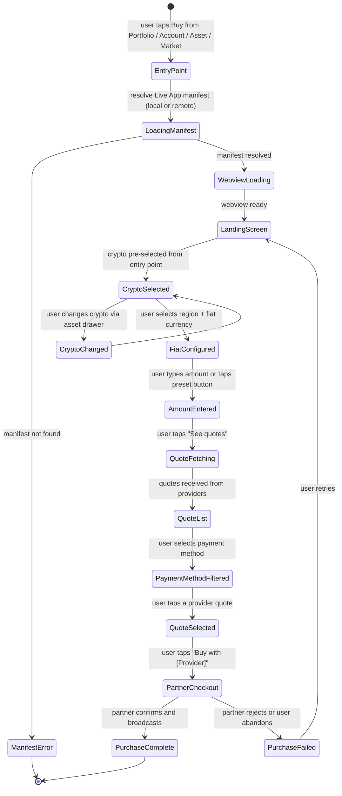

---

### 2.5.6 KYC Flow

Know-Your-Customer (KYC) verification is entirely owned by the partner and executed inside
the partner's webview. From Ledger Live's perspective it is a transparent sub-flow within
the partner checkout step.

How it works in practice:

1. When the user taps "Buy with [Provider]", the Live App constructs a redirect URL that
   includes a `goToURL` parameter encoding the partner's checkout URL.
2. The `WebPTXPlayer` component follows the redirect and loads the partner's domain.
3. The partner's front-end checks whether the user has previously completed KYC (typically
   via a session cookie or a stored verification token on the partner's servers).
4. If no prior verification exists, the partner renders its KYC wizard: document upload,
   selfie, address proof, and so on.
5. Once approved, the partner stores the verified state on its side. On subsequent visits from
   the same device (same browser storage context), KYC is bypassed.

Ledger Live does not receive any KYC result, does not store identity data, and does not have
a code path that branches on KYC state. This has a direct consequence for E2E testing:

> **Automation cannot complete a real KYC flow.** Tests stop at the boundary where the
> Live App redirects to the partner URL. The `verifyProviderUrl` method in the desktop POM
> confirms the redirect target is correctly formed; it does not proceed beyond that point.

From a QA risk perspective, KYC-related regressions must be caught through manual exploratory
testing against a partner sandbox or staging environment, not through automated regression suites.

---

### 2.5.7 Sell Flow

The sell flow runs the on-ramp logic in reverse. The user converts crypto to fiat; the partner
receives the crypto on a deposit address it controls and disburses fiat to the user's bank.

The distinguishing feature of the sell path is that **the Ledger hardware device must sign a
send transaction**. This places the sell flow in the same category as a regular Send (see
Chapter 2.1) from a hardware-interaction standpoint.

Step-by-step:

1. The user opens the Sell tab. On Wallet 4.0 desktop, a dedicated Sell button navigates
   directly to the sell view of the `buy-sell-ui` Live App. On legacy desktop, the user switches
   tabs on the Buy/Sell landing screen.
2. The sell landing screen shows a "You will sell" label, percentage preset buttons (25% / 50% /
   75% / max), and the same crypto/fiat selectors as Buy.
3. The user selects an asset, picks a percentage or types an amount, and chooses a region and
   fiat currency.
4. After tapping "See quotes", the Live App fetches sell quotes. Not all buy providers offer
   sell; the partner list may be smaller.
5. The user selects a quote and taps "Sell with [Provider]".
6. The `buy-sell-ui` Live App initiates a `startExchange` call via the Wallet API. Ledger Live
   opens the Exchange app on the hardware device (`ExchangeTypes.Sell` or `ExchangeTypes.SellNg`).
7. The device displays the transaction details. The user approves on-device.
8. `completeExchange` is called on the live-common side; it signs and broadcasts the send
   transaction to the partner's deposit address.
9. The partner receives the crypto and triggers a fiat disbursement to the user's bank.

The key code paths for the sell on-device step:

- `libs/ledger-live-common/src/exchange/platform/startExchange.ts` — opens the Exchange app and
  retrieves a nonce.
- `libs/ledger-live-common/src/exchange/platform/transfer/completeExchange.ts` — signs and
  broadcasts the transaction, referencing `getSellProvider()` from `exchange/providers/sell.ts`.
- `exchange/providers/sell.ts` fetches sell provider public keys from `@ledgerhq/ledger-cal-service`
  in production; test mode uses a hardcoded `SELL_TEST` provider stub.

---

### 2.5.8 Code Path — Buy/Sell as Live Apps

Buy and Sell are not built as regular React component screens inside Ledger Live. They are
**Live Apps**: remotely-hosted single-page applications that Ledger Live embeds in a sandboxed
webview. This architecture means:

- The product logic (quote comparison, payment-method selection, partner routing) lives in a
  separate deployment pipeline outside the `ledger-live` monorepo.
- Ledger Live contributes only the embedding shell (`WebPTXPlayer`), the account/address
  resolution, and the Wallet API transport layer.
- Feature changes to the Buy/Sell UI ship without a Ledger Live app-store release, by updating
  the hosted Live App.

**Desktop rendering path**

```
apps/ledger-live-desktop/src/renderer/screens/exchange/index.tsx
  └── LiveAppExchange (resolves manifest from RemoteLiveAppProvider)
        └── WebPTXPlayer (renders Live App in Playwright-accessible webview)
              inputs: { theme, lang, locale, currencyTicker, account, … }
```

The route is `/exchange/:appId`. When no explicit `appId` is provided (typical navigation
from Buy/Sell buttons), the `buySellUi` feature flag's `manifestId` is used, defaulting to
the constant `BUY_SELL_UI_APP_ID = "buy-sell-ui"`.

**Mobile rendering path**

```
apps/ledger-live-mobile/src/screens/PTX/index.tsx   (PtxScreen)
  └── WebPTXPlayer (React Native WebView bridge)
        inputs: { theme, lang, locale, currencyTicker, platform, account, … }
```

The mobile navigator that owns this screen is `PtxNavigator`; the relevant screen names are
`ScreenName.ExchangeBuy` and `ScreenName.ExchangeSell`. Navigation to these screens is
triggered by the MVVM `useOpenBuySell` hook at
`apps/ledger-live-mobile/src/mvvm/features/Buy/index.ts`, which resolves the correct account
before navigating and opens an account-selection drawer when multiple accounts exist for
the target currency.

**Manifest resolution**

Both desktop and mobile use `useRemoteLiveAppManifest(appId)` from
`@ledgerhq/live-common/platform/providers/RemoteLiveAppProvider` to fetch the Live App
manifest at runtime. A `localManifest` override (from `LocalLiveAppProvider`) is checked first,
allowing QA and developers to point the webview at a local or staging instance via the
`MOCK_REMOTE_LIVE_MANIFEST` environment variable or the local manifest provider. A missing
manifest triggers the `NetworkErrorScreen` on desktop and a `GenericErrorView` on mobile.

---

### 2.5.9 Wallet API Integration

The `buy-sell-ui` Live App communicates with Ledger Live using the **Wallet API**, a
JSON-RPC-over-postMessage protocol. The account picker and address resolution happen on
the Ledger Live side; everything else (provider UI, KYC, payment) happens inside the Live App.

The integration sequence for a Buy operation is:

```
buy-sell-ui (iframe)              Ledger Live (host)
     |                                  |
     |-- requestAccount(currency) ----->|
     |                                  |-- open account picker drawer
     |                                  |-- user selects account
     |<-- account (WalletAPIAccount) ---|
     |                                  |
     |-- receive(accountId) ----------->|
     |                                  |-- derive receive address from device
     |<-- address ----------------------|
     |                                  |
     |  build goToURL with address      |
     |  redirect webview to provider    |
```

For a Sell operation the Live App issues `startExchange` and `completeExchange` Wallet API
calls, which are handled by the `WalletAPIServer` and delegate to
`libs/ledger-live-common/src/exchange/platform/startExchange.ts` and
`libs/ledger-live-common/src/exchange/platform/transfer/completeExchange.ts`.

**Account ID translation.** Platform SDK account IDs (used in older Live Apps) differ from
Wallet API v2 account IDs. Both `exchange/index.tsx` (desktop) and `screens/PTX/index.tsx`
(mobile) run an account-ID remapping step: they look up the account by the legacy ID, call
`accountToWalletAPIAccount()`, and pass the Wallet API v2 ID in the `inputs` map so the Live
App receives a compatible identifier.

---

### 2.5.10 Page Object Model

#### Desktop — `buyAndSell.page.ts`

File: `e2e/desktop/tests/page/buyAndSell.page.ts` (~350 lines, 14 kB)

`BuyAndSellPage` extends `WebViewAppPage` and uses the protected `webviewIdentifier = "buy"` to
scope all test-ID lookups inside the webview frame. All element interactions go through
`WebViewAppPage`'s `getWebViewElementByTestId()` helper rather than raw Playwright locators,
which is critical because the Buy/Sell UI lives in a sandboxed iframe whose elements are
not directly accessible from the top-level page context.

| Method | Step decorator label | Purpose |
|---|---|---|
| `verifyBuySellScreenIsVisible()` | Expect Buy / Sell screen to be visible | Asserts `navigation-tabs` element is present |
| `verifySelectedTab(operation)` | Expect tab to be selected | Checks tab test-ID is in selected state |
| `selectTab(operation)` | Select tab | Clicks the Buy or Sell tab and verifies selection |
| `chooseAssetIfNotSelected(account)` | Choose crypto asset if not selected | Clicks crypto selector; routes to modular selector or legacy drawer depending on runtime state |
| `changeRegionAndCurrency(fiat)` | Change region and currency | Opens fiat drawer, sets country and currency, saves |
| `setRegion(locale)` | Select region | Searches and selects country in country drawer |
| `setCurrency(currencyTicker)` | Select currency | Searches and selects fiat currency in fiat drawer |
| `verifySelectedAssetIsDisplayed(account)` | Expect asset selected to be displayed | Checks ticker and account name labels |
| `verifyBuySellLandingAndCryptoAssetSelector(account, operation)` | Verify landing and crypto asset selector | Composite: screen visible + tab selected + asset displayed |
| `verifyFiatAssetSelector(fiatCurrencyTicker)` | Verify fiat asset selected | Checks fiat option button text |
| `verifyProviderInfoIsNotVisible()` | Verify provider info is not visible | Asserts payment selector and providers list are absent before amount is entered |
| `verifyBuyInfoBox()` | Verify buy info box | Asserts info box contains "Buy securely with Ledger" |
| `verifySellInfoBox()` | Verify sell info box | Asserts info box contains "Sell securely with Ledger" |
| `setAmountToPay(amount, operation)` | Enter amount to pay | Types amount; verifies CTA text changes to quote-selection prompt; asserts provider list appears |
| `selectProviderQuote(operation, providerName)` | Select provider quote | Expands quote list if needed; scrolls to and clicks the named provider |
| `selectQuote()` | Select quote | Clicks the active CTA to proceed to provider checkout |
| `verifyProviderUrl(providerName, buySell, userdataDestinationPath)` | Verify provider URL | Reads `goToURL` from webview URL history; double-decodes it; asserts base URL, query params, and destination address |

**Internal helpers in `buyAndSellPage`**

| Helper | Role |
|---|---|
| `providerConfigs` record | Per-provider maps of buy/sell query-param keys and address param names |
| `waitForGoToUrl()` | Polls `webviewUrlHistory` until the `goToUrl` param stabilises (prevents race on URL rewrite) |
| `verifyBaseUrl()` | Asserts operation type and provider name appear in the decoded URL |
| `verifyQueryParams()` | Iterates expected key/value pairs from the provider config and checks them against URL search params |
| `verifyDestinationAddress()` | Reads `walletaddress` or `destinationwallets` param; normalises to lowercase; checks against all known account addresses from the userdata fixture |
| `decodeGoToUrl()` (module-level) | Extracts and double-decodes the `goToURL` param from the raw webview URL |

#### Mobile — `buySell.page.ts`

File: `e2e/mobile/page/trade/buySell.page.ts` (~240 lines, 11 kB)

The mobile POM uses Detox `tapWebElementByTestId` / `waitWebElementByTestId` helpers
(global Detox+Jest injections) rather than Playwright locators.

| Method | Purpose |
|---|---|
| `openViaDeeplink(page)` | Opens the Buy or Sell screen via `ledgerlive://buy` or `ledgerlive://sell` deeplink |
| `expectBuyScreenToBeVisible()` | Asserts crypto selector, "You will pay" text, amount input, and three quick-amount buttons are present |
| `expectSellScreenToBeVisible()` | Asserts crypto selector, "You will sell" text, amount input, and percentage preset buttons (25%/50%/75%/max) are present |
| `chooseAssetIfNotSelected(account)` | Taps crypto selector; branches on `modularDrawer.isFlowEnabled("live_app")` for new vs legacy asset picker; includes iOS workaround |
| `chooseCountryIfNotSelected(fiat)` | Full fiat region and currency selection sequence |
| `verifyQuickAmountButtonsFunctionality()` | Taps each preset button (400/800/1600) and asserts the input field shows the expected value |
| `tapSellPercentageButton(percentage)` | Taps the 25%/50%/75%/max sell percentage preset |
| `setAmountToPay(amount)` | Types into the amount input |
| `tapSeeQuotes()` | Waits for CTA to become enabled; verifies its text is "see quotes"; taps it |
| `tapBuySellWithCta(provider, page)` | Verifies CTA reads "[Buy/Sell] with [Provider]"; taps it |
| `selectPaymentMethod(paymentMethod)` | Opens payment options and selects the specified method |
| `getAvailableProviders()` | Expands provider list; scrapes all `provider_title_*_title_container` test-ID elements and returns their text labels |
| `selectRandomProvider()` | Calls `getAvailableProviders()`, filters to `isTested` providers, selects one at random |
| `selectProvider(provider)` | Selects a named provider by test-ID |
| `verifyProviderPageLoadedWithCorrectUrl(provider)` | Waits for webview URL to contain the provider name string |
| `handleBuyFlow(buySell, paymentMethod, skipQuickAmountVerify?)` | Orchestrates the full buy flow: screen check → asset select → amount → country → see quotes → payment method → random provider → CTA → URL verify |
| `handleSellFlow(buySell, paymentMethod, provider)` | Orchestrates sell: screen check → asset select → 75% preset → country → see quotes → payment method → named provider → CTA → URL verify |

---

### 2.5.11 Specs

#### Desktop — `buySell.spec.ts`

File: `e2e/desktop/tests/specs/buySell.spec.ts` (~300 lines, 10 kB)

The spec is structured as two test suites.

**Suite 1 — Buy entry points (parametrised over three assets)**

The three buy fixtures are:

| Asset | Fiat | Amount | Provider |
|---|---|---|---|
| BTC (Native SegWit 1) | USD | 900 | MoonPay |
| ETH 1 | USD | 230 | MoonPay |
| USDT on ETH 1 | USD | 900 | MoonPay |

Each fixture runs four entry-point tests:

| Test | Entry point |
|---|---|
| Asset Allocation page | `app.portfolio.clickOnSelectedAssetRow(currency)` → `app.assetPage.startBuyFlow()` |
| Market page | Market search → `openBuyPage(ticker)` |
| Account page | Account list → account detail → `clickBuy()` |
| Portfolio page (full buy) | `clickBuyButton()` or `clickBuySellButton()` (legacy) → full buy flow + URL verify |

The three first entry-point tests only verify the landing screen state (correct tab selected,
correct asset pre-selected, correct fiat currency). Only the portfolio-page test executes the
full buy flow including `setAmountToPay` → `selectProviderQuote` → `selectQuote` →
`verifyProviderUrl`.

**Suite 2 — Sell flow (single fixture)**

| Asset | Fiat | Amount | Provider |
|---|---|---|---|
| BTC (Native SegWit 1) | EUR | 0.0003 BTC | MoonPay |

The sell test navigates to the sell view, changes region to France/EUR, enters the amount,
selects the MoonPay quote, and verifies the redirect URL contains the correct sell parameters.

**Test configuration**

```typescript
test.use({
  teamOwner: Team.BUY_AND_SELL,
  userdata: "skip-onboarding-with-last-seen-device",
  speculosApp: crypto.currency.speculosApp,
  cliCommands: [liveDataCommand(crypto)],
});
```

Device tags: `@NanoSP`, `@LNS`, `@NanoX`, `@Stax`, `@Flex`, `@NanoGen5`. All device form
factors are expected to pass because the Buy/Sell screen is a webview — hardware interaction
is minimal (only the sell path requires device signing, and the spec only exercises the URL
verification step before the partner checkout).

**What the spec does NOT test**

- Real KYC flows
- Actual payment processing
- On-chain broadcast confirmation
- Partner-side order status updates
- Sell device-signing step (the spec stops at the `verifyProviderUrl` assertion)

#### Mobile — `e2e/mobile/specs/buySell/`

The mobile suite splits tests into individual spec files:

| File | Coverage |
|---|---|
| `navigateToBuyFromPortfolioPage_BTC.spec.ts` | Buy BTC from Portfolio quick action |
| `navigateToBuyFromAccountPage_BTC.spec.ts` | Buy BTC from Account page |
| `navigateToBuyFromMarketPage_USDT.spec.ts` | Buy USDT from Market page |
| `navigateToBuyFromAssetPage_ETH.spec.ts` | Buy ETH from Asset page |
| `buyQueryParameters_BTC.spec.ts` | Verify query parameters for BTC buy |
| `buyQueryParameters_ETH.spec.ts` | Verify query parameters for ETH buy |
| `buyQueryParameters_USDT.spec.ts` | Verify query parameters for USDT buy |
| `sellFlow_BTC.spec.ts` | Full sell flow for BTC via deeplink |

All mobile tests use `setEnv("DISABLE_TRANSACTION_BROADCAST", true)` via the shared
`buySell.ts` orchestration module, which prevents any accidental on-chain broadcasts during
automated runs.

---

### 2.5.12 PTX Tribe Context

The Buy and Sell feature is owned by the **PTX tribe** (Post-Transaction eXperience), which
is also responsible for the Swap feature (Chapter 2.4) and for the general Live App / Wallet
API infrastructure that both features rely on. "PTX" appears as a screen-group prefix in
mobile navigator naming (`PtxNavigator`, `PtxNavigatorParamList`, `ScreenName.ExchangeBuy`)
and as a directory name (`apps/ledger-live-mobile/src/screens/PTX/`).

Understanding this context matters for triage: defects in the Wallet API transport layer, in
the `WebPTXPlayer` component, or in the Live App manifest resolution will surface across
Buy, Sell, and Swap simultaneously. When a Buy regression is reported, checking Swap health
in the same build is a useful first step.

For architectural background on the PTX tribe's ownership boundaries and for the Wallet API
specification, see **Part 0, Chapter 0.3** (Tribe and Team map). For the Live Apps system
in depth, see **Part 7** (Live Apps general).

---

### 2.5.13 Cross-References

| Topic | Location |
|---|---|
| Tribe and team ownership (PTX tribe) | Part 0, Ch 0.3 |
| Wallet API in depth | Part 7 — Live Apps general |
| Swap (closely related; same WebPTXPlayer) | Chapter 2.4 (overview) and Part 7 (deep dive) |
| Send flow (device signing, relevant to Sell) | Chapter 2.1 |
| Live App manifest provider and RemoteLiveAppProvider | Part 7 — Live Apps general |
| E2E fixture format (`BuySell`, `Fiat`, `AccountType`) | `libs/ledger-live-common/src/e2e/models/BuySell.ts`, `e2e/enum/Account.ts` |

**Key file inventory**

| Path | Role |
|---|---|
| `apps/ledger-live-desktop/src/renderer/screens/exchange/index.tsx` | Desktop exchange route; resolves manifest and renders `WebPTXPlayer` |
| `apps/ledger-live-desktop/src/renderer/screens/exchange/config.ts` | Local configuration for the exchange screen |
| `apps/ledger-live-desktop/src/renderer/screens/exchange/helpers.ts` | `getWallet40HeaderKey()` helper for page title |
| `apps/ledger-live-desktop/src/renderer/screens/exchange/Fund/FundCompleted.tsx` | Post-fund completion screen |
| `apps/ledger-live-desktop/src/renderer/screens/exchange/Sell/SellCompleted.tsx` | Post-sell completion screen |
| `apps/ledger-live-mobile/src/screens/PTX/index.tsx` | Mobile PTX screen; renders `WebPTXPlayer` |
| `apps/ledger-live-mobile/src/mvvm/features/Buy/index.ts` | `useOpenBuySell` hook; account resolution + navigation |
| `libs/ledger-live-common/src/exchange/platform/startExchange.ts` | Opens Exchange app on device; returns nonce |
| `libs/ledger-live-common/src/exchange/platform/transfer/completeExchange.ts` | Signs and broadcasts sell transaction |
| `libs/ledger-live-common/src/exchange/providers/index.ts` | Entry point; dispatches to fund/sell/swap provider lookup |
| `libs/ledger-live-common/src/exchange/providers/fund.ts` | Static fund provider registry (Baanx, YouHodler, Uquid) |
| `libs/ledger-live-common/src/exchange/providers/sell.ts` | Fetches sell provider data from `@ledgerhq/ledger-cal-service` |
| `libs/ledger-live-common/src/wallet-api/constants.ts` | `BUY_SELL_UI_APP_ID = "buy-sell-ui"`, `WALLET_API_VERSION = "2.0.0"` |
| `libs/ledger-live-common/src/e2e/enum/Provider.ts` | `BuySellProvider` enum; `isTested` flags |
| `e2e/desktop/tests/page/buyAndSell.page.ts` | Desktop POM (14 kB) |
| `e2e/mobile/page/trade/buySell.page.ts` | Mobile POM (11 kB) |
| `e2e/desktop/tests/specs/buySell.spec.ts` | Desktop spec (10 kB) |
| `e2e/mobile/specs/buySell/` | Mobile spec directory (9 spec files) |

---

### 2.5.14 Quiz

<div class="quiz-container" data-pass-threshold="80">

<div class="quiz-question" data-correct="C">
  <p><strong>Q1.</strong> Why can automated E2E tests not complete a real Buy transaction
  all the way to on-chain confirmation?</p>
  <ul class="quiz-options">
    <li data-option="A">The Speculos device emulator does not support the Exchange app.</li>
    <li data-option="B">The Wallet API transport is disabled in test environments.</li>
    <li data-option="C">After the Live App redirects to the partner URL, the KYC and payment
    steps are executed inside the partner's server-side systems, which cannot be automated
    without initiating a real financial transaction.</li>
    <li data-option="D">The `WebPTXPlayer` component blocks all navigation beyond the initial
    quote-selection screen in CI mode.</li>
  </ul>
  <div class="quiz-feedback"></div>
</div>

<div class="quiz-question" data-correct="B">
  <p><strong>Q2.</strong> Which constant in the codebase identifies the default Live App
  used for Buy and Sell on desktop?</p>
  <ul class="quiz-options">
    <li data-option="A"><code>DEFAULT_MULTIBUY_APP_ID</code></li>
    <li data-option="B"><code>BUY_SELL_UI_APP_ID = "buy-sell-ui"</code> in
    <code>libs/ledger-live-common/src/wallet-api/constants.ts</code></li>
    <li data-option="C"><code>EXCHANGE_APP_ID = "exchange"</code></li>
    <li data-option="D"><code>PTX_APP_ID = "ptx-live-app"</code></li>
  </ul>
  <div class="quiz-feedback"></div>
</div>

<div class="quiz-question" data-correct="D">
  <p><strong>Q3.</strong> In the desktop POM <code>verifyProviderUrl()</code>, what does the
  method check to confirm the correct user address was forwarded to the provider?</p>
  <ul class="quiz-options">
    <li data-option="A">It reads the clipboard for the copied receive address.</li>
    <li data-option="B">It calls a Wallet API <code>receive()</code> on the device and compares
    the returned address to the URL parameter.</li>
    <li data-option="C">It extracts the address from the Speculos device screen.</li>
    <li data-option="D">It reads all known account addresses from the userdata fixture via
    <code>getAccountAddressesFromAppJson()</code>, double-decodes the <code>goToURL</code>
    parameter from the webview URL history, and asserts that the address query param in that
    URL matches one of the known addresses.</li>
  </ul>
  <div class="quiz-feedback"></div>
</div>

<div class="quiz-question" data-correct="A">
  <p><strong>Q4.</strong> What is the role of the Ledger hardware device specifically in
  the <strong>Sell</strong> flow, as opposed to the Buy flow?</p>
  <ul class="quiz-options">
    <li data-option="A">In the Sell flow the device must sign a send transaction that transfers
    crypto to the partner's deposit address. In the Buy flow, the device only provides the
    receive address; it does not sign any transaction.</li>
    <li data-option="B">The device role is identical: it signs a transaction in both flows.</li>
    <li data-option="C">In the Buy flow the device signs the payment authorisation; in Sell
    it only provides a public key.</li>
    <li data-option="D">The device is not involved in the Sell flow; the partner withdraws
    directly from the user's account via the Wallet API.</li>
  </ul>
  <div class="quiz-feedback"></div>
</div>

<div class="quiz-question" data-correct="C">
  <p><strong>Q5.</strong> A QA engineer runs the desktop buy spec in a CI environment located
  in a jurisdiction where MoonPay is not available. The test calls
  <code>selectProviderQuote(operation, "MoonPay")</code> and fails with "element not found".
  What is the most likely root cause, and what is the correct long-term fix?</p>
  <ul class="quiz-options">
    <li data-option="A">The <code>buyAndSell.page.ts</code> POM has a bug in the
    <code>scrollToElement</code> call and needs a selector update.</li>
    <li data-option="B">The <code>buy-sell-ui</code> Live App manifest was not resolved;
    the fix is to set <code>MOCK_REMOTE_LIVE_MANIFEST</code> to a local manifest.</li>
    <li data-option="C">The provider list returned by the Live App is geo-filtered: MoonPay
    is not available from the CI runner's IP region. The fix is to either run the test from
    a known-good region or refactor the test to use a provider-agnostic selection path (such
    as the mobile POM's <code>selectRandomProvider()</code> which filters on <code>isTested</code>
    dynamically).</li>
    <li data-option="D">The test must add <code>setupEnv(false)</code> to disable geo-filtering
    in the exchange Live App.</li>
  </ul>
  <div class="quiz-feedback"></div>
</div>

</div>

---

<div class="chapter-outro">

This chapter covered the full Buy and Sell surface: why the partner-driven model exists,
which providers are registered and tested, how the `buy-sell-ui` Live App is embedded via
`WebPTXPlayer` on both desktop and mobile, how the Wallet API bridges the account picker to
the partner webview, and where the device-signing step sits in the sell path. The POM
analysis of `buyAndSell.page.ts` and `buySell.page.ts` gave you the precise method-level
vocabulary needed to read, debug, and extend the buy/sell E2E suite.

The next chapter, **Chapter 2.6 — Device Management**, shifts focus from financial operations
to the management of the Ledger hardware device itself: firmware updates, app installation and
removal, genuine-check flows, and the My Ledger screen. Many of the patterns introduced
here — Speculos emulation, device-action observables, the Manager app on the device — will
reappear in that chapter from a new angle.

</div>


---

## Device Management

<div class="chapter-intro">
Device Management is the operational core of Ledger Live. Every time a user installs a coin app, updates firmware, or pairs a new device, the Manager (desktop) or My Ledger (mobile) screen is orchestrating a precise sequence of APDU exchanges, signature verifications, and transport-layer negotiations. This chapter maps the entire surface — from the user's first Bluetooth pairing to the internal RxJS streams that drive app installation — so you can test it with accuracy and confidence.
</div>

---

### 2.6.1 What Device Management Does

The Manager / My Ledger section is responsible for four primary concerns:

1. **Device identity** — reading `DeviceInfo` (firmware version, SE target, MCU version, language, genuine status) from the connected device.
2. **App lifecycle** — listing available BOLOS apps from the Ledger Manager API, showing which are installed, and executing install/uninstall queues over the device transport.
3. **Firmware updates** — detecting that a new OS, MCU, or Bootloader version exists and guiding the user through the multi-component update sequence.
4. **Device onboarding and pairing** — first-use setup of a new device, BLE pairing on mobile, and transport detection (USB-HID, USB-C, BLE).

On desktop, this surface lives under the **Manager** route. On mobile, it is branded **My Ledger** and is reachable from the bottom navigation tab or the `myledger` deeplink. Despite the name difference both platforms share the same `@ledgerhq/live-common` manager and apps libraries.

---

### 2.6.2 Pairing a Device

`<photo of: Pair device flow on mobile via Bluetooth — scanning list of nearby Nano X / Stax devices>`

#### Transport overview

Ledger Live supports three physical transports, all mediated by the Device Management Kit (DMK — see Part 6 Ch 6.4 for the full Layer 1 specification):

| Transport | Desktop | Mobile (iOS) | Mobile (Android) |
|---|---|---|---|
| USB-HID (Nano S, Nano S+) | Yes | No | No |
| USB-C (Stax, Flex, Europa) | Yes | Yes (via Lightning adapter on older iPhones) | Yes |
| BLE / Bluetooth Low Energy | No (by design) | Yes | Yes |

On desktop, device discovery is automatic: the OS exposes the HID or USB-C device and Ledger Live's transport layer picks it up. No explicit pairing step exists — plug the cable and the device appears.

On mobile, the BLE path requires explicit OS-level pairing. The flow is:

1. User taps **My Ledger** or **Add device**.
2. `BleDevicePairingFlow` screen (`apps/ledger-live-mobile/src/screens/BleDevicePairingFlow/index.tsx`) launches `BleDevicePairingFlowComponent`.
3. The DMK's BLE scanner broadcasts a scan for nearby Ledger advertisements.
4. The user selects their device from the list.
5. The OS prompts for the PIN visible on the Ledger screen (see §2.6.9 for the full BLE pairing sub-flow).
6. On success, `onPairingSuccess` navigates into `SyncOnboardingCompanion` (for a brand-new device) or returns the `Device` object to the calling navigator (for an existing device being reconnected to My Ledger).

The `BleDevicePairingFlow` screen is used specifically from deep-link sync-onboarding for touch-screen devices (Stax, Flex, and optionally Europa/Apex depending on the `supportDeviceApex` feature flag). Non-touch devices use a different onboarding path driven by the `MyLedgerChooseDevice` screen.

Cross-reference: Part 6 Ch 6.4 covers the DMK transport abstraction and `DiscoveredDevice` types that back the `_discoveredDevice` parameter passed to `onPairingSuccess`.

---

### 2.6.3 Device Catalog

The following table lists every currently supported device model. Hardware lifecycle details — SE chip generations, MCU variants, genuine-check protocol, target IDs — are covered in Part 0 Ch 0.2 and are not duplicated here.

| Model | Internal ID (`DeviceModelId`) | Transport | Touch screen | Status |
|---|---|---|---|---|
| Nano S | `nanoS` | USB-HID | No | Legacy (no new features) |
| Nano S Plus | `nanoSP` | USB-HID / USB-C | No | Supported |
| Nano X | `nanoX` | USB-HID / BLE | No | Supported |
| Stax | `stax` | USB-C / BLE | Yes (color) | Supported |
| Flex | `europa` | USB-C / BLE | Yes (color) | Supported |
| Europa / Apex | `apex` | USB-C / BLE | Yes (color) | Gated behind `supportDeviceApex` FF |

> **Nano S firmware upper bound.** `libs/ledger-live-common/src/manager/index.ts` contains explicit version guards: firmware below 1.3.0 is `firmwareUnsupported`; firmware at or below 1.4.2 requires the user to manually uninstall apps before updating. Tests that cover Nano S must account for these legacy branches.

Refer to Part 0 Ch 0.2 for the full BOLOS architecture, SE/MCU version numbering, and genuine-check cryptographic flow.

---

### 2.6.4 Manager / My Ledger Screen

`<photo of: Manager on desktop — showing device name, firmware version, storage bar, and app catalog>`

`<photo of: My Ledger on mobile — showing device tile, storage indicator, installed apps, and Catalog/Installed tabs>`

#### Desktop — `screens/manager/`

The desktop Manager is a three-phase screen:

1. **Connect phase** (`DeviceAction` component) — renders a "connect your device" prompt and waits for transport to surface a connected device. Uses `useConnectManagerAction` hook.
2. **Dashboard phase** (`Dashboard.tsx` → `DeviceDashboard/`) — once connected, reads `DeviceInfo` and the `ListAppsResult`, then checks for available firmware updates via `getLatestFirmwareForDeviceUseCase`. Renders the firmware update banner and the full app catalog.
3. **Disconnected phase** (`Disconnected.tsx`) — if the device disconnects after a reset, renders a "try again" screen.

The `SyncSkipUnderPriority priority={999}` wrapper in `index.tsx` prevents account syncing (which would compete for the transport) while the Manager screen is active.

#### Mobile — `screens/Manager/` (legacy path)

The mobile entry point (`screens/Manager/index.tsx`) is the navigation hub for the My Ledger section. It routes to:

- `MyLedgerChooseDevice` — selects or re-connects the device.
- `MyLedgerDevice` — the app catalog screen (`screens/MyLedgerDevice/index.tsx`), identical in function to the desktop Dashboard.
- `FirmwareUpdate` — the firmware update sub-flow.

The `MyLedgerDevice` screen holds the local `[state, dispatch]` pair returned by `useApps` (which wraps `initState` and `reducer` from `apps/logic.ts`). It also listens for USB-device plug-in events and automatically navigates back to `MyLedgerChooseDevice` when an USB device appears while connected over BLE.

---

### 2.6.5 Install and Uninstall Coin Apps

`<photo of: App catalog showing Bitcoin, Ethereum, Solana — with Install button and progress bar during installation>`

#### How BOLOS apps are delivered

All apps distributed through the Manager are BOLOS applications — ELF binaries compiled for the Secure Element, signed by Ledger's HSM. The catalog is fetched from the Ledger Manager API (`libs/ledger-live-common/src/manager/api.ts`). Before any install, the device performs a **genuine check**: a cryptographic challenge-response that proves the SE firmware has not been tampered with (see Part 0 Ch 0.2 for the protocol).

#### The install/uninstall state machine

`libs/ledger-live-common/src/apps/logic.ts` is a pure Redux-style reducer that drives the entire app-management state machine. State shape:

```typescript
type State = {
  installed: InstalledItem[];
  installQueue: string[];
  uninstallQueue: string[];
  currentAppOp: AppOp | null;
  currentError: { error: Error; appOp: AppOp } | null;
  // ...
};
```

Actions dispatched by the UI (`{ type: "install", name }`, `{ type: "uninstall", name }`) are fed into `reducer`, which resolves dependency chains via `reorderInstallQueue` before adding items to the queue.

`libs/ledger-live-common/src/apps/runner.ts` executes the queue. `runAppOp` emits an `Observable<RunnerEvent>` per operation:

```typescript
export const runAppOp = ({ state, appOp, exec }) =>
  concat(
    of({ type: "runStart", appOp }),
    defer(() => delay(getEnv("MANAGER_INSTALL_DELAY"))).pipe(ignoreElements()),
    defer(() => exec({ appOp, targetId: deviceInfo.targetId, app, modelId, ... }))
      .pipe(throttleTime(100), materialize(), map(toRunnerEvent)),
  );
```

The `exec` function is provided by the calling component:
- Desktop: `execWithTransport` from `@ledgerhq/live-common/device/use-cases/execWithTransport`.
- Mock (CI/Speculos): `mockExecWithInstalledContext(result.installed)` — a canned implementation that simulates install/uninstall without touching real hardware.

#### Dependency resolution

Apps can declare dependencies (e.g., an ERC-20 token app depends on the Ethereum app). `reorderInstallQueue` topologically sorts the install queue. Conversely, uninstalling a base app that other installed apps depend on triggers an `UninstallAppDependenciesModal` asking the user to confirm cascading uninstall.

#### App data backup

When the `enableAppsBackup` feature flag is active, `execWithTransport` receives `skipAppDataBackup: false`, allowing the transport layer to back up and restore per-app data (e.g., settings stored by a BOLOS app in flash) across an uninstall/reinstall cycle. When the flag is off, the `skipAppDataBackup` field is omitted from `ExecArgs` and no backup is attempted. Tests that exercise the full install flow on a feature-flag-enabled build should verify that app data survives a reinstall where the spec requires it.

#### Storage calculation

`distribute(initState(result))` computes `totalAppsBytes / appsSpaceBytes` — a ratio displayed as the storage bar in both desktop and mobile UIs. The legacy `manager.page.ts` POM hardcodes the expected storage text from this formula for assertions: each installed app is assumed to occupy 4 KB, giving `storageUsedText = "Used ${installedCount * 4} Kb"`. This hardcoded assumption will fail if the device model or firmware version changes the per-app block size — a fragility to note when extending the spec to new device models.

---

### 2.6.6 Firmware Update

`<photo of: Firmware update screen showing "A new firmware is available" banner with version number and Update button>`

The firmware update flow is the most safety-critical path in device management. A failed mid-update power cycle can brick a device, so the implementation has multiple safeguards.

#### What gets updated

A full firmware update may touch up to three distinct components on the device (Part 0 Ch 0.2 covers the hardware architecture):

| Component | Description |
|---|---|
| SE OS (BOLOS) | The secure element operating system; holds the user's PIN and seed |
| MCU firmware | The microcontroller firmware; handles USB/BLE transport and screen |
| Bootloader | The SE bootloader; required to accept new SE OS images |

Not every firmware release updates all three components. `FirmwareUpdateContext` (from `@ledgerhq/types-live`) carries the list of operations needed for a given device.

#### Progressive rollout

Ledger does not push firmware updates to 100% of devices simultaneously. The Manager API returns the latest available firmware version for a given `DeviceInfo`, filtered by a provider ID (from `libs/ledger-live-common/src/manager/provider.ts`). A device may receive "no update available" simply because it is not yet in the rollout cohort, not because it is up to date.

The provider ID is a numeric value that encodes the update channel (production, test, internal). In `libs/ledger-live-common/src/manager/provider.ts`, `getProviderId` maps a `DeviceModelId` to the appropriate channel. Non-production builds can use a different provider ID to access pre-release firmware, which is the mechanism used by the QA team when testing firmware before public release.

**QA implication:** When validating a firmware release, the team must use a build configured with the correct provider ID for that release stage. A production build will not offer a pre-release firmware to a retail device, even if the device is on the correct MCU/SE combination. Always confirm the provider ID in the test environment before debugging a "no update available" scenario.

#### Battery warning

On battery-powered devices (Nano X, Stax, Flex), the update screen checks `BatteryStatusTypes.BATTERY_PERCENTAGE` and `BATTERY_FLAGS` before proceeding. If the battery is too low, a `BatteryWarningDrawer` is displayed to prevent a mid-update power failure.

#### Apps are uninstalled and restored

`firmwareUpdateWillUninstallApps` returns `true` for all modern devices. Before the update, the Manager records the list of installed apps so that `appsToRestore` can be passed back to `MyLedgerDevice` after the update completes, triggering a silent re-install queue.

---

### 2.6.7 Firmware Update State Machine

The following Mermaid diagram represents the states visible in `apps/ledger-live-mobile/src/screens/FirmwareUpdate/useUpdateFirmwareAndRestoreSettings.ts` (the `UpdateStep` type) and the corresponding desktop equivalents:

```mermaid
stateDiagram-v2
    [*] --> idle : Manager screen opens

    idle --> checkingUpdate : Device connected
    checkingUpdate --> noUpdate : Latest firmware already installed
    checkingUpdate --> updateAvailable : New firmware detected (API)

    noUpdate --> [*]

    updateAvailable --> batteryCheck : User taps Update
    batteryCheck --> batteryWarning : Battery below threshold
    batteryWarning --> batteryCheck : User charges and retries
    batteryCheck --> allowManager : Battery OK

    allowManager --> confirmUpdate : User allows Manager on device
    confirmUpdate --> installingOsuFirmware : User confirms on device

    installingOsuFirmware --> installingFirmware : OSU downloaded and flashed
    installingFirmware --> installingMcu : SE OS installed; MCU update needed
    installingMcu --> restoreApps : MCU updated; device restarts
    installingFirmware --> restoreApps : MCU update not needed

    restoreApps --> restoringLanguage : Re-installing saved apps
    restoringLanguage --> restoringCustomLockScreen : Language pack restored (if applicable)
    restoringCustomLockScreen --> completed : Custom lock screen restored

    restoringLanguage --> completed : No custom lock screen
    restoreApps --> completed : No apps to restore

    completed --> [*]

    installingOsuFirmware --> error : Transport failure
    installingFirmware --> error : Transport failure
    installingMcu --> error : Transport failure
    error --> idle : User taps Retry
```

The `UpdateStep` type is a discriminated union used by `useUpdateFirmwareAndRestoreSettings` to track position in this machine and render the correct `VerticalStepper` item status in the mobile UI.

---

### 2.6.8 Onboarding — Related Flow

`<photo of: Setup new device onboarding — device selection screen showing Nano X, Stax, Flex choices>`

Device onboarding (first-time setup) is a distinct flow from the Manager but shares transport and firmware infrastructure. It lives in:

- `apps/ledger-live-mobile/src/screens/Onboarding/` — guided new-device / restore-wallet flow.
- `apps/ledger-live-mobile/src/screens/MyLedgerChooseDevice/` — the "choose or connect a device" interstitial used both during onboarding and when re-entering My Ledger.

From the onboarding spec (`apps/ledger-live-mobile/e2e/specs/onboarding.spec.ts`), the tested paths are:

| Scenario | Steps |
|---|---|
| Access existing wallet | `startOnboarding` → `chooseToAccessYourWallet` → `chooseToConnectYourLedger` → BT pairing → Portfolio |
| Restore Nano X | `startOnboarding` → `chooseSetupLedger` → choose device → restore phrase → BT pairing → PostOnboarding |
| Restore Nano S+ (Android) | Same as above but USB pairing |
| Setup new Nano X | `startOnboarding` → `chooseSetupLedger` → choose device → create wallet → BT pairing → PostOnboarding |

On iOS, Nano S and Nano S+ are flagged as **not compatible** (no BLE and no USB-C adapter path is supported in the current iOS UI). The onboarding spec asserts `checkDeviceNotCompatible` for those models on iOS.

The post-onboarding flow (`screens/PostOnboarding/`) presents the user with optional follow-up tasks (e.g., add an account, enable notifications) after the device is first confirmed genuine.

---

### 2.6.9 BLE Pairing on Mobile

`<photo of: BLE pairing modal — "Enter the code displayed on your Ledger device" with PIN digit entry>`

Bluetooth pairing between a mobile phone and a Ledger device is a two-step process:

**Step 1 — BLE advertisement scan.** The DMK's BLE transport manager scans for nearby Ledger GATT services. Devices advertise a specific UUID that identifies them as Ledger hardware. The scan result appears as a list of `DiscoveredDevice` objects.

**Step 2 — OS-level pairing.** When the user selects a device from the list, the OS initiates BLE pairing. The Ledger device generates and displays a 6-digit PIN on its screen. The user must enter this PIN on the phone when prompted by the OS pairing dialog. This step is a standard BLE MITM-protection mechanism and is handled entirely by the OS — Ledger Live has no control over this dialog.

After OS pairing succeeds, the `BleDevicePairingFlowComponent` calls `onPairingSuccess(device, discoveredDevice)` and the navigator continues to the next step (sync onboarding companion or My Ledger).

**Important testing note.** Automated BLE pairing cannot be fully reproduced in Speculos or any emulator (see §2.6.13). BLE pairing tests in the mobile E2E suite rely on pre-paired physical devices or on mock device injection via the Detox bridge. The `app.common.addDeviceViaBluetooth()` helper in the legacy test suite abstracts this mock injection.

#### BLE re-pairing after firmware update

One non-obvious edge case: a firmware update can reset the Bluetooth bond stored on the device, requiring the user to re-pair from scratch. This means:
- The iOS Bluetooth settings must have the old pairing removed before a new pairing is possible.
- The onboarding flow handles this by navigating back to `BleDevicePairingFlow` automatically when the post-update reconnect attempt fails.

This edge case is not currently covered by automated tests and is a manual regression checkpoint in every firmware release campaign.

---

### 2.6.10 Code Path — Desktop

#### Directory walk: `apps/ledger-live-desktop/src/renderer/screens/manager/`

```
manager/
├── index.tsx                   # Route entry — DeviceAction → Dashboard | Disconnected
├── Dashboard.tsx               # Post-connect orchestrator; fetches firmware; composes DeviceDashboard + FirmwareUpdate
├── Disconnected.tsx            # Fallback screen on device disconnect
├── DeviceDashboard/            # App catalog, storage bar, device info panel
├── FirmwareUpdate/             # Desktop firmware update sub-flow
├── assets/                     # Static images used in the UI
└── __tests__/                  # Unit tests for manager helpers
```

#### Key snippet: transport acquisition in `index.tsx`

```tsx
// apps/ledger-live-desktop/src/renderer/screens/manager/index.tsx (simplified)
const Manager = () => {
  const action = useConnectManagerAction();
  const [result, setResult] = useState<Result | null>(null);

  return (
    <>
      <SyncSkipUnderPriority priority={999} />
      {result ? (
        <Dashboard {...result} onReset={onReset} appsToRestore={appsToRestore} />
      ) : hasReset ? (
        <Disconnected onTryAgain={setHasReset} />
      ) : (
        <DeviceAction onResult={onResult} action={action} request={null} />
      )}
    </>
  );
};
```

`useConnectManagerAction` returns a `DeviceAction` configured with the `connectManager` hardware action. When the action resolves, `onResult` stores the `{ device, deviceInfo, result }` triple in state, which switches the render from the connect prompt to the `Dashboard`.

The `SyncSkipUnderPriority` at priority 999 ensures that no account bridge sync attempts to claim the transport while the Manager holds it. This is one of the most common sources of flakiness in Manager-adjacent tests.

#### Dashboard flow after connect

Once `result` is set, `Dashboard.tsx` takes over:

1. `getLatestFirmwareForDeviceUseCase(deviceInfo)` is called on mount. Its result is stored in `firmware` state. If no update is available, `firmware` remains `null` and the banner is hidden.
2. The `openFirmwareUpdate` query parameter (`?firmwareUpdate=true`) can pre-open the firmware update panel, used when navigating from a notification or notification-style banner elsewhere in the app.
3. `distribute(initState(result))` computes the storage usage ratio displayed in the progress bar. This is a pure calculation — no additional API call.
4. The `exec` function is built via `useMemo`: in `MOCK` mode it uses `mockExecWithInstalledContext`; in production it wraps `withDevice(deviceId)` with `execWithTransport`.

When the device is disconnected mid-session, the `currentDevice` selector changes to `null` and `onReset(appsToRestore)` is called — unless a drawer is currently open and `preventResetOnDeviceChange` is `true` (e.g., during a firmware update that must not be interrupted).

---

### 2.6.11 Code Path — Mobile (Legacy and MVVM)

#### Legacy path

| Screen | File | Responsibility |
|---|---|---|
| `Manager` | `screens/Manager/index.tsx` | Navigation hub; routes to ChooseDevice or Device |
| `MyLedgerChooseDevice` | `screens/MyLedgerChooseDevice/index.tsx` | Device picker; entry to BLE or USB connect |
| `MyLedgerDevice` | `screens/MyLedgerDevice/index.tsx` | App catalog; holds `useApps` state |
| `FirmwareUpdate` | `screens/FirmwareUpdate/index.tsx` | Full update flow; `useUpdateFirmwareAndRestoreSettings` |
| `BleDevicePairingFlow` | `screens/BleDevicePairingFlow/index.tsx` | BLE scan + pairing wrapper |
| `DeviceConnect` | `screens/DeviceConnect/index.tsx` | Generic "connect your device" step used across multiple flows |

The `MyLedgerDevice` screen also handles:
- USB device plug detection: if `lastConnectedDevice.deviceId.startsWith("usb|")` while the current session is BLE, it navigates back to `MyLedgerChooseDevice` to re-connect over USB.
- App backup metadata: dispatches `setLastSeenDeviceInfo` so that other parts of the app can know which apps were installed last time, enabling the "restore apps after firmware update" feature.

#### MVVM path

The MVVM refactor splits device management between two features:

| Feature | Path | Responsibility |
|---|---|---|
| `DeviceSelection` | `mvvm/features/DeviceSelection/` | Device picker navigator (used in receive flow context, and expanded incrementally per LIVE-14726) |
| `FirmwareUpdate` | `mvvm/features/FirmwareUpdate/` | New firmware update components and utilities, replacing the legacy `screens/FirmwareUpdate/` over time |

`DeviceSelection/Navigator.tsx` creates a `Stack.Navigator` with a single `SelectDevice` screen. The MVVM FirmwareUpdate feature (`mvvm/features/FirmwareUpdate/`) provides updated components and utils that complement (and will eventually replace) the legacy firmware update screens.

Both legacy and MVVM paths share the same `@ledgerhq/live-common` business logic — only the React layer differs.

#### Navigation locking during installs

The `useLockNavigation` hook in `MyLedgerDevice` prevents the user from navigating away while an install or uninstall is in progress (`pendingInstalls = installQueue.length + uninstallQueue.length > 0`). If the user attempts to navigate away, a `QuitManagerModal` is shown asking them to confirm abandonment of the in-progress operation. This is important for QA: tests that navigate away from My Ledger mid-install must account for this modal gate or they will hang.

#### `MyLedgerChooseDevice` — the entry interstitial

`screens/MyLedgerChooseDevice/index.tsx` renders differently depending on whether a device is already known:
- If a `device` param is passed (e.g., after a firmware update), it skips the picker and goes directly to `MyLedgerDevice`.
- Otherwise it presents the device selection UI (BLE scan for touch-screen devices, USB instruction for Nano models).

The `wallet40HeaderOptions.tsx` file in the same directory provides header configuration for the Wallet 4.0 navigation system, which uses a different chrome from the legacy bottom-tab navigator.

---

### 2.6.12 Code Path — Common Libraries

#### `libs/ledger-live-common/src/manager/`

| File | Purpose |
|---|---|
| `api.ts` (13 kB) | HTTP client for the Ledger Manager API — fetches app catalog, firmware, language packs |
| `index.ts` | `CacheAPI` — thin cache layer; `getIconUrl`, `getFirmwareVersion`, version-gate helpers, `getAvailableLanguagesDevice` |
| `provider.ts` | `getProviderId` — maps device model to the numeric provider used by the API to determine update cohort |
| `useDeviceHasUpdatesAvailable.ts` | React hook — returns `true` if any installed app has a newer version available |
| `useAvailableLanguagesForDevice.ts` | React hook — returns the list of supported language packs for the current `DeviceInfo` |

#### `libs/ledger-live-common/src/apps/`

| File | Purpose |
|---|---|
| `logic.ts` (17 kB) | Pure reducer — `initState`, `reducer`, dependency resolution, `getActionPlan` |
| `runner.ts` | RxJS executor — `runAppOp`, `runAllWithProgress`, `runAll`, `runOne` |
| `listApps.ts` (12 kB) | Fetches the app list from device + Manager API and reconciles `installed` vs. `catalog` |
| `types.ts` | `State`, `AppOp`, `Action`, `RunnerEvent`, `ListAppsResult` type definitions |
| `filtering.ts` | Filters and sorts the catalog (by search query, category, etc.) |
| `formatting.ts` | Display helpers (byte counts, version strings) |
| `react.ts` | `useApps` hook — wraps `initState` + `reducer` as React state, exposes dispatch to UI components |
| `inlineAppInstall.ts` | Allows app installation to be triggered inline (e.g., from a "send" flow that detects the app is missing) |
| `mock.ts` | `mockExecWithInstalledContext` — canned exec for tests and Speculos; also exports `deviceInfo155` used in manager specs |
| `polyfill.ts` | Compatibility shims for older firmware versions |

#### `listApps.ts` — the reconciliation step

Before the catalog can be shown, Ledger Live must reconcile two sources of truth:
1. The apps currently installed on the device (read via APDU).
2. The full catalog returned by the Manager API for this device model and firmware version.

`listApps.ts` performs this reconciliation. It produces the `ListAppsResult` object consumed by `initState` in `logic.ts`. The `installed` array within `ListAppsResult` contains both the app name and a flag indicating whether the installed version is outdated relative to the catalog. This is what drives the "update available" badge in the UI and the `canUpdate` status in POM assertions.

#### `react.ts` — `useApps` hook

`useApps` is the bridge between the pure reducer in `logic.ts` and the React component tree. It wraps `useReducer` with `initState` and exposes `[state, dispatch]`. Components call `dispatch({ type: "install", name: "Bitcoin" })` — the reducer runs synchronously to update the queue, and `runner.ts` is triggered asynchronously to flush the queue against the device transport.

---

### 2.6.13 Speculos Limitation

**Speculos does not simulate the Manager / My Ledger flow.**

This is one of the most important constraints for QA planning in this area. The reasons are architectural:

1. **No genuine check.** Speculos emulates the SE instruction set but does not replicate the HSM-signed attestation chain required by the genuine check. The Manager API would reject Speculos as a non-genuine device.

2. **No real app installation.** The BOLOS ELF loading mechanism (INSTALL APDU sequences) is partially emulated by Speculos, but in practice, Ledger Live's CI does not exercise real app install/uninstall against Speculos. Instead, the test suite uses `mockExecWithInstalledContext` (from `apps/mock.ts`), which simulates the state transitions without sending APDUs to any device.

3. **No BLE.** Speculos exposes a TCP socket transport, not BLE. BLE pairing tests run only on physical devices or via Detox mock injection.

4. **Pre-loaded app images.** When a Speculos image is built for a specific test scenario, the required coin apps are compiled into the image. From Ledger Live's perspective the apps are "already installed" — there is no network round-trip to the Manager API.

**Practical consequence for testers:** Manager flow (install, uninstall, firmware update) is covered primarily by **manual testing on physical devices** and by **unit tests** of the pure logic in `apps/logic.ts` and `apps/runner.ts`. The E2E manager spec (`manager.spec.ts`) tests the navigation and display layer only, using mock device data injected via Detox.

#### What can be tested in CI

Despite the Speculos limitations, the following Manager-related behaviors are testable in a CI environment:

| Test type | What it covers | How |
|---|---|---|
| Unit tests (`apps/logic.test.ts`, `apps/runner.test.ts`) | State transitions, dependency resolution, queue ordering | Pure Jest, no device needed |
| Unit tests (`manager/index.test.ts`) | Version-gate helpers, icon URL generation | Pure Jest |
| E2E deeplink smoke (`deeplinks.spec.ts`) | My Ledger screen reachable via `myledger` deeplink | Detox + Speculos (navigation only) |
| E2E manager spec (`manager.spec.ts`) | Device name/version display, app-list rendering | Detox + mock device injection |
| E2E onboarding spec (`onboarding.spec.ts`) | Full onboarding navigation path | Detox + mock BT injection |

Everything else — genuine check, real app install/uninstall, firmware update with device restart, BLE pairing PIN entry — requires physical hardware and belongs to manual test campaigns or dedicated hardware-lab automation.

---

### 2.6.14 Page Object Model — Manager

#### `e2e/mobile/page/manager/manager.page.ts` (canonical workspace)

This is the single POM file in the `e2e/mobile/page/manager/` directory.

| Method / Property | testID / selector | What it asserts or does |
|---|---|---|
| `openViaDeeplink()` | `myledger` deeplink | Navigates to My Ledger via `openDeeplink` |
| `expectManagerPage()` | `/manager-title\|header-title/` (regex) | Waits for the My Ledger title to be visible |
| `deviceName()` | `manager-device-name` | Element getter for the device name label |

> Note: The regex `managerTitleId = /manager-title|header-title/` exists because Wallet 4.0 uses a different `testID` than the legacy navigation. The TODO comment in the file states this will be removed when Wallet 4.0 is fully activated.

#### `apps/ledger-live-mobile/e2e/page/manager/manager.page.ts` (legacy workspace)

The legacy POM is more complete and covers the full app-list assertion flow:

| Method | Description |
|---|---|
| `openViaDeeplink()` | Deeplink to `myledger` |
| `expectManagerPage()` | Assert `manager-title` visible |
| `selectConnectDevice()` | Tap `manager_connect_device` |
| `waitForDeviceInfoToLoad()` | Wait for `manager-device-name` to appear |
| `checkDeviceName(name)` | Assert device name text |
| `checkDeviceVersion(version)` | Assert `V {version}` in version label |
| `checkDeviceAppsNStorage(appDesc, installedDesc)` | Scroll and assert per-app row status (`installed`, `canUpdate`, `notInstalled`) + storage figures |

The `checkDeviceAppsNStorage` method is the richest assertion in this POM. It scrolls `manager-deviceInfo-scrollView` to find each app row and checks both `manager-app-row-{appName}` and `app-{appName}-{status}` testIDs. Storage assertions use fixed arithmetic based on `installedDesc.length * 4 Kb` per app.

If a new device model is added to the test matrix, the per-app storage constant and the `storageLeftText` baseline (`1.93 Mb`) in this POM will need to be updated to match the new model's flash layout — or the method should be refactored to accept these values as parameters.

---

### 2.6.15 Specs

#### Legacy mobile E2E — `apps/ledger-live-mobile/e2e/specs/manager.spec.ts`

Three test cases, all tagged with `$TmsLink("B2CQA-657")` or `B2CQA-658`:

| Test | What it does |
|---|---|
| "open My Ledger and add a new device" | Opens My Ledger, taps Add Device, pairs via BT mock |
| "open My Ledger" | Opens My Ledger, selects mock Nano X, injects `appDesc` and `installedDesc` via `DeviceAction.accessManager`, waits for device info to load |
| "displays device informations" | Calls `checkDeviceName`, `checkDeviceVersion`, `checkDeviceAppsNStorage` |

The spec initialises with `userdata: "skip-onboarding"` — the device is pre-configured so the test does not need to go through the onboarding flow. Mock device data (`deviceInfo155` from `@ledgerhq/live-common/apps/mock`) drives the displayed firmware version.

#### Legacy mobile E2E — `apps/ledger-live-mobile/e2e/specs/onboarding.spec.ts`

Four scenarios covering the full onboarding path from first-launch splash to Portfolio. Uses `DeviceAction` helpers and mock BT/USB injection. See §2.6.8 for the scenario table.

#### Deeplink spec — `e2e/mobile/specs/deeplinks.spec.ts` / `apps/ledger-live-mobile/e2e/specs/deeplinks.spec.ts`

Both contain a deeplink test that navigates to `myledger` and verifies the Manager title is visible. This is the most minimal Manager smoke test and runs in CI on every PR.

#### Desktop

No dedicated manager spec file was found under `e2e/desktop/tests/specs/` at the time of writing. Desktop Manager coverage comes from:
- The `DeviceAction` unit path exercised by the mock environment (`MOCK=true`).
- Manual QA campaigns for firmware update and app install/uninstall on real hardware.
- Inline coverage in account-creation flows that use `inlineAppInstall.ts` to install a required coin app before adding an account — these flows appear in `addAccounts` specs and incidentally exercise parts of the apps runner.

---

### 2.6.16 Cross-References

| Topic | Where to look |
|---|---|
| SE chip, MCU, Bootloader architecture | Part 0 Ch 0.2 — BOLOS firmware lifecycle, genuine check protocol, target IDs |
| DMK transport layer (BLE, USB, USB-C) | Part 6 Ch 6.4 — Device Management Kit as Layer 1 |
| `DeviceAction` component pattern | Part 4 — how device actions are composed and rendered |
| Feature flags (`supportDeviceApex`, `enableAppsBackup`) | Part 2 Ch 2.9 (Feature Flags) |
| Deeplink navigation | Part 2 Ch 2.8 (Navigation and Deep Links) |
| Speculos setup and image building | Part 4 Ch 4.x (Speculos in CI) |

---

### 2.6.17 Quiz

<div class="quiz-container" data-pass-threshold="80">

<div class="quiz-question" data-correct="B">
  <p><strong>Q1.</strong> Which module is responsible for executing the install and uninstall queue on the device, emitting `runStart`, `runProgress`, and `runSuccess` events as an RxJS Observable?</p>
  <ul class="quiz-options">
    <li data-option="A"><code>libs/ledger-live-common/src/apps/logic.ts</code></li>
    <li data-option="B"><code>libs/ledger-live-common/src/apps/runner.ts</code></li>
    <li data-option="C"><code>libs/ledger-live-common/src/manager/api.ts</code></li>
    <li data-option="D"><code>apps/ledger-live-desktop/src/renderer/screens/manager/Dashboard.tsx</code></li>
  </ul>
  <div class="quiz-feedback"></div>
</div>

<div class="quiz-question" data-correct="C">
  <p><strong>Q2.</strong> In automated tests and Speculos-based CI runs, how does Ledger Live simulate app installation without sending real APDUs to a device?</p>
  <ul class="quiz-options">
    <li data-option="A">It calls the Manager API with a test token that returns pre-approved install responses</li>
    <li data-option="B">It replays a recorded APDU session captured from a real device</li>
    <li data-option="C">It uses <code>mockExecWithInstalledContext</code> from <code>apps/mock.ts</code>, which simulates state transitions without hardware</li>
    <li data-option="D">It connects to a Speculos instance and runs the full install APDU sequence</li>
  </ul>
  <div class="quiz-feedback"></div>
</div>

<div class="quiz-question" data-correct="D">
  <p><strong>Q3.</strong> A firmware update for a Nano X may touch up to three device components. Which of the following is NOT one of those components?</p>
  <ul class="quiz-options">
    <li data-option="A">SE OS (BOLOS)</li>
    <li data-option="B">MCU firmware</li>
    <li data-option="C">Bootloader</li>
    <li data-option="D">BLE radio firmware</li>
  </ul>
  <div class="quiz-feedback"></div>
</div>

<div class="quiz-question" data-correct="A">
  <p><strong>Q4.</strong> On desktop, what does the <code>SyncSkipUnderPriority priority={999}</code> wrapper in <code>screens/manager/index.tsx</code> prevent?</p>
  <ul class="quiz-options">
    <li data-option="A">Account bridge sync tasks from competing with the Manager for the device transport</li>
    <li data-option="B">The Manager screen from re-rendering when Redux state changes</li>
    <li data-option="C">Firmware update banners from appearing while apps are installing</li>
    <li data-option="D">The genuine check from running more than once per session</li>
  </ul>
  <div class="quiz-feedback"></div>
</div>

<div class="quiz-question" data-correct="B">
  <p><strong>Q5.</strong> Why might a Nano X show "no firmware update available" in the Manager even though a newer firmware version exists?</p>
  <ul class="quiz-options">
    <li data-option="A">The device has too many apps installed, blocking the update</li>
    <li data-option="B">The device is not yet in the progressive rollout cohort for that firmware version</li>
    <li data-option="C">The BLE connection does not support firmware metadata queries</li>
    <li data-option="D">The genuine check failed silently and the API returned an empty response</li>
  </ul>
  <div class="quiz-feedback"></div>
</div>

</div>

---

<div class="chapter-outro">
This chapter has mapped the full device management surface: from the BLE pairing handshake and the BOLOS app installation pipeline to the firmware update state machine and the limits of automated coverage. The next chapter shifts from hardware to the web: <strong>Chapter 2.7 — Discover / Web3 / WalletConnect</strong> covers how Ledger Live embeds third-party dApps through its Live App platform, the Wallet API protocol that dApps use to request signatures, and how WalletConnect extends that capability to external wallets connecting from a browser.
</div>


---

## Discover, Web3 and WalletConnect

<div class="chapter-intro">
Discover is the in-wallet "app store" inside Ledger Wallet. It is where users browse and launch <strong>Live Apps</strong> — webview-rendered applications, owned by Ledger or by a partner, that talk to Ledger Wallet through the <strong>Wallet API</strong>. Swap, Buy, Sell, Stake, Lido, Aave, Uniswap, the Ledger Card program — every one of these surfaces is a Live App, even when it looks like a native screen. Discover is also where WalletConnect lives: the protocol that lets <em>external</em> dApps (running in a separate browser, on the user's phone or laptop) ask the wallet to sign transactions on their behalf. This chapter maps the catalog, the Live App lifecycle, the Wallet API method surface, the Manifest API, the visibility levers, and the WalletConnect bridge — with file pointers into the monorepo and the POMs E2E uses to drive the webviews. <br><br><a href="#discover-web3-and-walletconnect">#discover-web3-and-walletconnect</a>
</div>

### 2.7.1 What Discover Does

Open Ledger Wallet on desktop or mobile and tap the **Discover** tab (compass icon, top-right in v4.0). You land on a tile-based catalog. Each tile is a Live App: Swap, Buy, Sell, Stake, Lido staking, Recover, Aave, Curve, Uniswap, MoonPay, Ramp, Kiln, Zerion, Transak, 1inch, the Ledger Card program, the NFT minter, and a long tail of partner integrations. Tap a tile and the wallet opens a webview pointed at that Live App's URL.

It is worth pausing on a single mental model that ties this entire chapter together: **almost every "non-native" thing a user does inside Ledger Wallet is a Live App**. Swap is a Live App. Buy is a Live App. Sell is a Live App. The Lido staking surface is a Live App. The Ledger Recover onboarding is a Live App. The Ledger Card management surface is a Live App. WalletConnect is a Live App. Even the Earn dashboard is in the process of being moved into a Live App. The native shell is shrinking; the Live Apps surface is growing.

This matters for QA because it means a huge fraction of "the wallet" is actually three independently-deployed pieces of software that have to be tested together:

1. The wallet host (LLD or LLM, in the `ledger-live` monorepo).
2. The Live App (often in a different repo, often deployed independently to a different CDN, on a different release cadence).
3. The Wallet API library + protocol (`@ledgerhq/wallet-api-client`, `@ledgerhq/wallet-api-server`, `@ledgerhq/wallet-api-core`), which is in turn versioned by `manifest.apiVersion`.

A bug in any one of those three causes a failure in the user-visible Live App. Knowing where the seam is — webview vs native shell, host code vs Live App code, Wallet API protocol mismatch vs feature-flag mismatch — is half the diagnostic effort.

That same Discover catalog is the entry point for the **swap-live-app** (Ledger's own replatformized swap UI), the **buy-sell-ui** Live App (PTX's unified Buy/Sell front-end), and the Ledger-Wallet-Connect Live App, which is how WalletConnect is actually mounted inside the wallet — as a Live App with a special id (`ledger-wallet-connect`).

So Discover is three things at once:

1. **A marketplace** — browse + search + categorise Live Apps.
2. **The Live Apps runtime** — the webview host and Wallet API server that every Live App tile launches into.
3. **The WalletConnect entry point** — the URL scheme `wc:…` is intercepted, parsed and forwarded to the WalletConnect Live App, which then handles pairing, session approval and per-transaction approval.

```
Discover catalog
    +-- Tile: Swap-Live-App           --> walletApp Live App
    +-- Tile: Buy / Sell              --> walletApp Live App (buy-sell-ui)
    +-- Tile: Stake (Lido / Kiln)     --> walletApp Live App
    +-- Tile: Aave / Curve / Uniswap  --> dapp Live App  (rides on EVM)
    +-- Tile: MoonPay / Ramp          --> webBrowser Live App
    +-- Tile: Ledger Card             --> walletApp Live App (card-program)
    +-- Tile: Recover                 --> walletApp Live App
    +-- (hidden) ledger-wallet-connect --> Live App for WalletConnect sessions
```

The "(hidden)" label is literal: WalletConnect's Live App entry has `visibility: "deep"` in its manifest, meaning it never appears as a tile but is reachable only by deeplink (specifically when the wallet receives a `wc:` URI).

### 2.7.2 The Live App Architecture — Three Moving Parts

A Live App is conceptually three things glued together:

| Layer | What it is | Lives where |
|---|---|---|
| **The Live App** | A web app (React, usually deployed on Vercel or a partner CDN) | External repo (e.g. `github.com/LedgerHQ/swap-live-app`) |
| **The manifest** | A JSON declaration that tells Ledger Wallet the Live App exists, where to load it from, what it can do, and to whom it is visible | `github.com/LedgerHQ/manifest-api`, fetched per environment |
| **The Wallet API server** | The JSON-RPC dispatcher running *inside* Ledger Wallet that handles every method call coming from the webview, asks the user to confirm, drives the device, and replies | `libs/ledger-live-common/src/wallet-api/` |

The Live App itself does not sign anything. It does not hold a private key. It does not even know which device the user is using. All it does is open a webview, mount the wallet-api **client** SDK from `@ledgerhq/wallet-api-client`, and send messages like *"please give me the user's accounts"* or *"please sign this transaction"*. Ledger Wallet, on the other side of the postMessage bridge, is the wallet-api **server**. It interprets each message, opens the right native screen (account picker, transaction confirmation drawer), drives the device through the bridge layer (Chapter 2.1 — Coin Framework), and returns the signed payload.

This split is what makes Live Apps safe in principle:

- The Live App is sandboxed in a webview. It cannot read the user's private key. It cannot read other Live Apps' storage. It cannot navigate to arbitrary domains (helper `isWhitelistedDomain` in `libs/ledger-live-common/src/wallet-api/manifestDomainUtils.ts` enforces the manifest's `domains` allowlist).
- The Wallet API permission system (declared in the manifest's `permissions` array) gates which methods the Live App is even allowed to call.
- Every signature still requires explicit on-device confirmation. The user reads the destination, the amount, the fee on the Ledger device's screen and approves with the physical buttons. No webview can fake that.

### 2.7.3 The Catalog — Photos

<photo of: Discover catalog on desktop showing tiles of Live Apps>

<photo of: Discover catalog on mobile, vertical scroll of tiles>

<photo of: A Live App running inside Ledger Wallet — for example, Lido staking or the Swap Live App in the right-side drawer>

### 2.7.4 Visibility Levers — How a Tile Gets to the Catalog

Before walking the full lifecycle: it is useful to know how a Live App makes it to the catalog, because half the QA tickets in this area are about "why is X visible / not visible". The wallet applies three filters, in this order:

1. **Manifest `visibility`** — `complete` shows in catalog + search + deeplink, `searchable` only in search results, `deep` only via deeplink. WalletConnect (`ledger-wallet-connect`) is `deep`, which is why you never see a "WalletConnect" tile in the catalog even though it is technically a Live App.
2. **Firebase Remote Config feature flags** — for any Live App with a feature flag (`ptxSwapLiveAppDemoThree`, `ptxSwapLiveApp`, etc.) the wallet calls `getFeature(flagName)`; an `enabled: false` outcome filters the manifest out before render. The flag's `params.manifest_id` can also force the catalog to use a different manifest id than the default (this is how PTX A/B-tests new Swap Live App versions in staging).
3. **Per-environment Manifest API contents** — a Live App that is published in production manifests but missing from staging manifests will simply not exist in staging.

The order matters: visibility is a logical AND. A manifest that is `complete` but disabled by a feature flag will not appear. A manifest with `enabled: true` flag but `visibility: deep` will not appear either. A bug like "the Swap tile is missing in pre-prod" is a visibility-lever bug 9 times out of 10.

### 2.7.5 The Live App Lifecycle

There are three lifecycles to keep distinct:

- The **catalog lifecycle** — when does the wallet fetch the manifest list, when does it refresh, when does it cache?
- The **session lifecycle** — what happens between the user tapping a tile and closing the Live App?
- The **release lifecycle** — how does a new Live App version go from a developer's laptop to a user's wallet?

This section walks the session lifecycle in detail. The catalog and release lifecycles are covered (briefly) in Sections 2.7.4 / 2.7.8 and in Part 0 Ch 0.4 respectively.

The user flow looks like this:

1. User opens Discover in Ledger Wallet.
2. Wallet renders the catalog: it iterates the manifests fetched from the **Manifest API** for the current Firebase environment (development / staging / pre-prod / production — see Part 0 Ch 0.4) and filters them by `visibility`, `platforms` (`desktop | mobile | all`) and feature flags.
3. User taps a tile.
4. Wallet looks up the manifest for that `id`, picks the right URL based on the manifest's `type` (`url`, `dappUrl`, or `webUrl`).
5. Wallet creates a webview component pointed at that URL, with a `postMessage` channel attached.
6. The Live App boots inside the webview. It instantiates a wallet-api client and uses it to call methods on the wallet-api server (which is Ledger Wallet itself).
7. For each method call, the wallet:
   - Validates the call against the manifest's permissions and currency whitelist.
   - If user interaction is required (e.g. picking an account, signing a transaction), opens the matching native screen (account drawer, send-confirmation flow).
   - Drives the device through the coin module's bridge.
   - Returns the result as a JSON-RPC response over `postMessage`.
8. When the user closes the Live App, the webview is destroyed; Recently Used is updated; any session state is dropped.

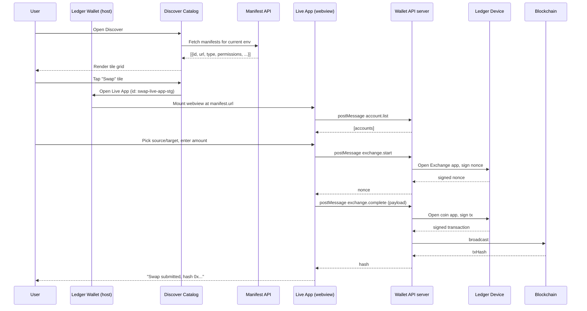

The diagram illustrates the **canonical** Wallet API flow: every transaction goes through the device, every signature is confirmed by the user, and the Live App is a pure UI/orchestrator — it never touches a key.

A subtle aspect: each Live App gets its own webview process per session. When the user closes a Live App, the webview is destroyed, the wallet-api server's session for that app is torn down, and any per-app `storage.get` / `storage.set` namespace stays put (it is keyed by manifest id and persisted across sessions, but isolated from other Live Apps). Re-opening the Live App rebuilds a fresh wallet-api server with the same persistent storage but new in-memory state. This is the same model browsers use for tabs — and the same caveats apply: closing a Live App mid-flow drops the in-memory transaction context, so the user has to start over.

### 2.7.6 The Live App ↔ Wallet API ↔ Device ↔ Chain Picture

A more architectural view:

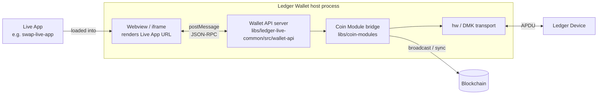

Things worth noting on the diagram:

- The Wallet API server is in-process, not a network server. It is just the Wallet's host code listening on a `postMessage` channel.
- The bridge is the *same* bridge (CurrencyBridge / AccountBridge) that powers the native Send/Receive flows. There is no special "Live App bridge".
- The device is reached through the same `hw` / DMK transports as everywhere else in the wallet. From the device's point of view, a Live App-initiated signature looks identical to a native-flow signature.

### 2.7.7 The Wallet API — Method Catalogue

The Wallet API method set is stable enough to enumerate. The list below comes from the UiHook and server.setHandler calls in `libs/ledger-live-common/src/wallet-api/react.ts`. Methods marked **(UI)** require user interaction and are gated through one of the UI hooks Ledger Wallet provides.

| Method | Purpose | Notes |
|---|---|---|
| `account.list` | List the user's accounts, optionally filtered by `currencyIds` | Read-only; no UI |
| `account.request` **(UI)** | Ask the user to pick an account (or add one) | Triggers the modular drawer / account picker |
| `account.receive` **(UI)** | Show the receive address on device for verification | Triggers the verify-on-device flow |
| `transaction.sign` **(UI)** | Sign a structured transaction; do not broadcast | Live App provides `WalletAPITransaction` shape |
| `transaction.signAndBroadcast` **(UI)** | Sign and broadcast in one step | The most commonly used method |
| `transaction.signRaw` **(UI)** | Sign a pre-encoded raw transaction string | Used by some EVM Live Apps |
| `transaction.broadcast` | Broadcast a previously signed operation | No device interaction |
| `message.sign` **(UI)** | Sign an arbitrary message (EIP-191 / EIP-712 for EVM, Bitcoin signed message, etc.) | Goes through the SignMessage flow |
| `wallet.userId` | Anonymous, deterministic user id | For Live App analytics keying |
| `wallet.capabilities` | What the wallet supports (methods, currencies) | Used by the Live App for graceful degradation |
| `wallet.info` | Wallet name, version, locale | |
| `currency.list` | Supported currencies on the host wallet | Filtered by feature flags |
| `bitcoin.getXPub` | Return the xpub for a Bitcoin family account | Used by Bitcoin-native Live Apps |
| `bitcoin.getAddress` | Get a derived BTC address | |
| `bitcoin.getAddresses` | Batch address derivation | |
| `bitcoin.getPublicKey` | Public key on a derivation path | |
| `exchange.start` **(UI)** | Begin a SWAP / FUND / SELL exchange flow; returns a nonce signed by the Exchange device app | Used by the Swap, Buy and Sell Live Apps (cross-link Ch 2.4 / 2.5) |
| `exchange.complete` **(UI)** | Provide the partner-signed payload, get user confirmation, broadcast | Pairs with `exchange.start` |
| `storage.get` / `storage.set` | Per-Live-App key-value storage | Sandboxed per manifest id |
| `device.transport` **(UI)** | Open a device transport for a given app name | Used for advanced / vault flows |
| `device.select` **(UI)** | Pick a device | |
| `device.exchange` | Send raw APDU through the device transport | High privilege; gated by manifest |

A few more things to remember:

- The Live App declares which of these methods it needs in its manifest's `permissions` array. The wallet refuses any call to a method not in `permissions`.
- The Live App also declares its currency whitelist in `currencies`. `["*"]` is allowed but flagged as broad in code review.
- For UI methods, Ledger Wallet shows the user a clear, native screen (drawer or modal) before doing anything irreversible. The Live App cannot bypass this.

To make this concrete, here is what a single Wallet API call looks like on the wire (postMessage payloads, JSON-RPC 2.0 shape):

```jsonc
// Live App -> Wallet (request)
{
  "jsonrpc": "2.0",
  "id": "req-42",
  "method": "account.list",
  "params": { "currencyIds": ["ethereum", "polygon"] }
}

// Wallet -> Live App (response)
{
  "jsonrpc": "2.0",
  "id": "req-42",
  "result": {
    "rawAccounts": [
      { "id": "uuid-...", "name": "Account 1", "address": "0x...", "currency": "ethereum", "balance": "1234567890" },
      { "id": "uuid-...", "name": "Account 2", "address": "0x...", "currency": "polygon",  "balance":  "987654321" }
    ]
  }
}
```

A `transaction.signAndBroadcast` looks like:

```jsonc
// Request
{
  "jsonrpc": "2.0",
  "id": "req-43",
  "method": "transaction.signAndBroadcast",
  "params": {
    "accountId": "uuid-...",
    "rawTransaction": {
      "family": "ethereum",
      "amount": "1000000000000000",
      "recipient": "0xRecipient",
      "gasPrice": "...",
      "gasLimit": "...",
      "nonce": 5
    },
    "options": { "hwAppId": null }
  }
}

// Response (after user confirms on device)
{
  "jsonrpc": "2.0",
  "id": "req-43",
  "result": { "transactionHash": "0xabcdef..." }
}
```

If the user rejects on device, the response is an error:

```jsonc
{
  "jsonrpc": "2.0",
  "id": "req-43",
  "error": { "code": -32000, "message": "UserRefusedOnDevice" }
}
```

The Live App's wallet-api client SDK abstracts this into typed promises (`client.account.list({ currencyIds })`, `client.transaction.signAndBroadcast(...)`), but on the wire it is plain JSON-RPC. This matters when you debug: open the webview's DevTools, watch `window.postMessage` traffic, and you can directly read the protocol.

### 2.7.8 The Manifest API

The Manifest API is a separate repo: `github.com/LedgerHQ/manifest-api`. It is the source of truth for "which Live Apps exist". Ledger Wallet does not hard-code Live App URLs; it reads them from the manifest at boot (and refreshes them on focus).

Per environment, there is a different manifest set:

| Environment | Firebase project | Manifest source |
|---|---|---|
| development | `ledger-live-development` | `manifest-api` dev branch |
| staging | `ledger-live-staging` | `manifest-api` staging branch |
| pre-prod (prerelease) | `ledger-live-staging` (with ppr config overrides) | `manifest-api` ppr branch |
| production | `ledger-live-production` | `manifest-api` main branch |

Refer back to Part 0 Ch 0.4 (Firebase environment matrix) for how the wallet binds to a given environment at build / runtime. The same mechanism that picks `feature_*` flags also picks the Manifest API source.

A Manifest V2 entry looks roughly like this (real fields, taken from `LiveAppManifest` in `libs/ledger-live-common/src/platform/types.ts`):

```json
{
  "id": "swap-live-app-demo-3-stg",
  "author": "Ledger",
  "name": "Swap",
  "url": "https://swap-live-app.staging.aws.ledger.com",
  "homepageUrl": "https://www.ledger.com/swap",
  "supportUrl": "https://support.ledger.com",
  "icon": "https://cdn.live.ledger.com/icons/swap.png",
  "platforms": ["desktop", "mobile"],
  "apiVersion": "^2.0.0",
  "manifestVersion": "2",
  "categories": ["exchange", "defi"],
  "currencies": ["*"],
  "content": {
    "shortDescription": "Swap between assets",
    "description": "Swap any asset for another, securely, with Ledger."
  },
  "permissions": [
    "account.list",
    "account.request",
    "exchange.start",
    "exchange.complete",
    "transaction.signAndBroadcast",
    "wallet.userId",
    "wallet.capabilities"
  ],
  "domains": ["https://swap-live-app.staging.aws.ledger.com"],
  "type": "walletApp",
  "params": { "embeddedTheme": "light" },
  "visibility": "complete"
}
```

Every field above has consequences for QA:

- **`id`** — used by feature flags (e.g. `ptxSwapLiveAppDemoThree.params.manifest_id`), by deep links, by tracking events.
- **`author`** — when set to "Ledger" (or another reserved value), suppresses the "external app" warning modal. Partner Live Apps do not get this.
- **`url`** — the page that loads. Bug isolation often starts with: "is the bug in the Live App URL or in the wallet?". A common diagnostic: load the URL directly in a browser, outside the wallet, and see whether it errors. If it does, the bug is in the Live App's deployment, not the wallet.
- **`platforms`** — controls platform visibility. A wrong `["desktop"]` setting is a frequent reason a Live App "disappears" on mobile.
- **`apiVersion`** — semver-checked against the wallet's wallet-api version (currently `2.0.0`, see `WALLET_API_VERSION` in `libs/ledger-live-common/src/wallet-api/constants.ts`). Mismatches make the Live App unloadable.
- **`currencies`** — whitelists which networks the Live App may interact with. A mis-whitelisted currency presents as "no accounts found" inside the Live App.
- **`permissions`** — the JSON-RPC method allowlist. If a method is missing here, the wallet rejects the call even if the Live App tries it.
- **`domains`** — navigation allowlist enforced by `isWhitelistedDomain`. Off-list navigation aborts.
- **`type`** — dispatches to `dapp`, `walletApp`, or `webBrowser` rendering. Each type uses a different `params` schema and a different code path inside `WebPlatformPlayer`.
- **`visibility`** — `complete | searchable | deep`. Controls catalog presence (see Section 2.7.4).
- **`categories`** — used by the catalog's category filters and by Fuse.js search ranking (see `BROWSE_SEARCH_OPTIONS` in `constants.ts`).

### 2.7.9 Permissions in Practice — The Trust Boundary

A short reflection that is worth its own subsection: the Live App permissions model is *the* trust boundary between Ledger and any third-party Live App. From the wallet's point of view, every Live App is untrusted by default. The manifest's `permissions` array is a positive allowlist: methods not listed cannot be called, and there is no run-time consent prompt that lifts a permission ad-hoc. If the Aave Live App's manifest lists `account.list`, `account.request`, `transaction.signAndBroadcast`, `message.sign` and nothing else, then the Aave Live App can never read Bitcoin xpubs (`bitcoin.getXPub` is not in the list), can never start an exchange flow (`exchange.start` is not in the list), can never poke the device transport directly (`device.exchange` is not in the list).

Three practical implications:

1. **Adding a permission is a manifest change**, not a code change. It requires a new manifest version in the manifest-api repo, which goes through code review.
2. **Removing a permission is a backwards-incompatible change**. If the Live App expected the permission to be there, dropping it from the manifest will break the app.
3. **Auditing a Live App's blast radius** is as simple as opening its manifest and reading the `permissions` array. No need to read the Live App's source.

The currency whitelist is parallel: `currencies: ["ethereum", "polygon"]` means even a permitted `account.list` call only ever returns Ethereum + Polygon accounts; the user's Bitcoin and Solana accounts are invisible to that Live App. Use `["*"]` only when justified — the Discover catalog itself uses `["*"]` because the catalog is the wallet's own surface, but a third-party DeFi Live App should never declare `["*"]` if it only needs EVM chains.

### 2.7.10 Live App Categories — The Three Manifest Types

The `type` field sets the rendering and integration model. The three types are not interchangeable.

| Type | Use case | Example | What the user sees |
|---|---|---|---|
| **walletApp** | Fully integrated, Ledger-branded experience that talks to the wallet-api at full bandwidth | `swap-live-app`, `buy-sell-ui`, `card-program`, `recover` | Looks like a native screen; usually mounted in the right-side drawer on desktop or as a full-screen modal on mobile |
| **dapp** | Third-party EVM dApp that rides on the Ethereum / EVM device app | `aave-live-app`, `compound-live-app`, generic Uniswap embed | Branded as a partner; shows a partner disclaimer modal (unless `author` is set) |
| **webBrowser** | Generic webview wrapper for a partner site that does not need wallet-api signatures | MoonPay buy widget, Transak | Looks like a partner site embedded; minimal integration |

The dispatch happens on `manifest.type` and the params shape changes accordingly:

```ts
// dapp params
{ dappUrl, nanoApp, dappName, networks: [{ chainID, nodeURL, currency }] }

// walletApp params
{ /* free-form, depends on the app */ }

// webBrowser params
{ webUrl, webAppName, currencies }
```

`dapp` is the legacy Ethereum-app-only path: the Live App speaks Web3 JSON-RPC, the wallet's `useDappLogic` hook (`libs/ledger-live-common/src/wallet-api/useDappLogic.ts`, ~23 KB) translates each `eth_*` request into a wallet-api `account.request` / `transaction.sign` / `message.sign`. This is how Aave or Curve work today inside Ledger Wallet without WalletConnect.

`walletApp` is the path Ledger's own integrations use; it gives the Live App direct access to the wallet-api method set without going through Web3 RPC.

`webBrowser` is the bare minimum: useful for partner sites that just need a webview + the user's userId (e.g. MoonPay's KYC flow).

### 2.7.11 WalletConnect — The Other Web3 Bridge

WalletConnect is not a Live App in the traditional sense. It is a **protocol** that lets an external dApp (running in your phone's browser, in your laptop's browser, on your desktop in MetaMask-style apps) authorise Ledger Wallet to sign transactions for it. The user is on, say, `app.uniswap.org` in Safari on their phone. They tap "Connect Wallet" and pick "WalletConnect". Uniswap shows a QR code (or a deep-link `wc:` URI on mobile). The user opens Ledger Wallet, scans the QR or follows the deep link. Ledger Wallet pairs with Uniswap. Subsequent transaction requests from Uniswap arrive in Ledger Wallet as a "Pending request" notification; the user reviews them inside the wallet and approves or rejects.

Inside the monorepo, WalletConnect is implemented as a Live App with a reserved id:

```ts
// libs/ledger-live-common/src/wallet-api/constants.ts
export const WC_ID = "ledger-wallet-connect";
```

The dedicated navigator on mobile is `apps/ledger-live-mobile/src/components/RootNavigator/WalletConnectLiveAppNavigator.tsx`. It mounts the standard `LiveApp` component from `apps/ledger-live-mobile/src/screens/Platform/`, parameterised with `platform: WC_ID` and the `wc:` URI in the params:

```tsx
<LiveApp
  route={{
    name: ScreenName.PlatformApp,
    params: {
      platform: WC_ID,
      uri: uri || _props.route.params?.uri,
      requestId: _props.route.params?.requestId,
      sessionTopic: _props.route.params?.sessionTopic,
    },
  }}
/>
```

So the wallet treats WalletConnect uniformly with all other Live Apps: same webview host, same Wallet API server, same UI hooks for account picking and transaction signing. The differences are in the Live App itself — it implements the WalletConnect protocol on top of the Wallet API instead of presenting a custom UI.

<photo of: WalletConnect pairing QR scan inside Ledger Wallet>

<photo of: WalletConnect transaction review drawer inside Ledger Wallet>

The Redux slice that holds the pending `wc:` URI is `apps/ledger-live-mobile/src/reducers/walletconnect.ts` (selector `uriSelector`, action `setWallectConnectUri`). The deeplink router in `DeeplinksProvider.tsx` and the URL handler in `parseDeepLink.ts` recognise the `wc:` scheme and dispatch into that slice, then navigate to the `WalletConnectLiveAppNavigator`. From there, everything is a Live App.

### 2.7.12 WalletConnect v1 vs v2

WalletConnect has had two major protocol versions.

| Aspect | v1 (deprecated 2024) | v2 (current) |
|---|---|---|
| Transport | Bridge servers, simple JSON | Relay network with persistent JSON-RPC over WebSocket |
| Session model | One session = one chain + one account | One session = a set of namespaces, each with chains + accounts + methods + events |
| Multi-chain | One session per chain | Multi-chain in a single session |
| Method scoping | Implicit (whatever the dApp asks) | Explicit (dApp declares required + optional methods at proposal time, wallet approves) |
| Pairing | URI carries bridge URL + key | URI carries relay parameters + symmetric key |
| Status in Ledger Wallet | Disconnected after sunset | Active; what users see |

In QA terms: any v1-only test cases are no longer applicable. New test cases must target v2 sessions, including multi-chain proposals (Ethereum + Polygon + Arbitrum in one session is a common Uniswap setup) and the explicit method-scoping model. A v2 session that requests `eth_signTypedData_v4` but does not include it in the proposal must be rejected by the wallet at proposal time, not at signing time.

The Ledger Wallet WalletConnect Live App handles both proposal evaluation (the user sees a "Approve session" sheet listing the requested chains and methods) and per-request approval (each `eth_sendTransaction` triggers a confirmation drawer that ultimately funnels into the same Wallet API `transaction.sign` flow).

The end-to-end picture for a v2 WalletConnect transaction:

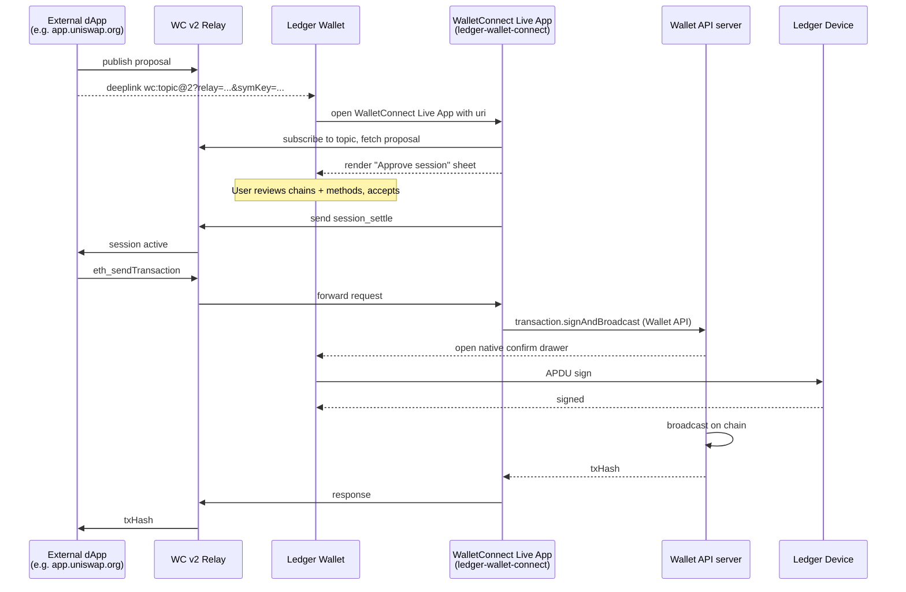

Two QA hooks worth noting:

- **Session expiry.** WC v2 sessions have a TTL (default 7 days). Sessions can be silently dropped server-side. Test cases should cover "dApp sends a request after session has expired" — the wallet should reject cleanly, not crash.
- **Method scope mismatch.** If a session was approved with `eth_sign` but the dApp later asks for `eth_signTypedData_v4`, the wallet should reject with a JSON-RPC error code (typically `-32601` "method not found") — not silently approve.

### 2.7.13 Code Path — Desktop

```
apps/ledger-live-desktop/src/renderer/screens/platform/
|-- index.tsx                # routes Discover entry
|-- LiveApp.tsx              # the "open a Live App" screen wrapper
|-- Catalog/
|   |-- index.tsx            # legacy catalog
|   |-- Banner.tsx
|   +-- TwitterBanner.tsx
+-- v2/
    |-- hooks.ts             # Wallet 4.0 catalog hooks
    +-- Catalog/             # the Wallet 4.0 catalog UI
```

The pieces that matter:

- **`LiveApp.tsx`** (~3 KB) — fetches the manifest by id, renders a `WebPlatformPlayer` (the webview wrapper) and wires up the wallet-api server hooks.
- **`Catalog/index.tsx`** — renders the tile grid using manifests from the `RemoteLiveAppProvider` (which itself fetches from the Manifest API).
- **`v2/Catalog/`** — the redesigned catalog under Wallet 4.0; same data, different chrome.

Live App rendering on desktop uses an Electron `<webview>` tag wrapped in a React component. The wallet-api postMessage bridge is attached at mount; the webview is destroyed on unmount. Webview process isolation is on by default; the Live App cannot reach into the Electron main process.

### 2.7.14 Code Path — Mobile

```
apps/ledger-live-mobile/src/screens/
|-- Discover/
|   |-- index.tsx            # the Discover hub (4 cards: Browse Web3, Earn, Mint, Refer)
|   +-- DiscoverCard.tsx     # the tile component
|
+-- Platform/
    |-- index.tsx            # default export of LiveApp
    |-- LiveApp.tsx          # wraps WebPlatformPlayer with manifest lookup
    |-- AppIcon.tsx
    |-- Catalog/             # the actual Live Apps catalog screen
    |-- exchange/            # exchange-specific overlays (Swap drawer, etc.)
    +-- v2/                  # Wallet 4.0 catalog re-skin
```

Reading `Discover/index.tsx`, the top-level hub is intentionally simple: four big cards (`Browse Web3`, `Earn`, `Mint`, `Referral`). Tapping `Browse Web3` navigates to `NavigatorName.Discover / ScreenName.PlatformCatalog`, which is the actual Live Apps catalog under `Platform/Catalog/`. Tapping any tile in that catalog opens `ScreenName.PlatformApp`, which is `Platform/LiveApp.tsx`.

`Platform/LiveApp.tsx` resolves the manifest with `useLiveAppManifest(appId, dappUrl)` and mounts a `<WebPlatformPlayer manifest={manifest} inputs={{ theme, lang, ...params }} />`. `WebPlatformPlayer` is the cross-platform wrapper that mounts a React Native WebView, exposes a `postMessage` channel and instantiates the `WalletAPIServer` from `@ledgerhq/wallet-api-server`.

A subtlety: the same `LiveApp` component is reused by `WalletConnectLiveAppNavigator` (Section 2.7.9), with `platform: "ledger-wallet-connect"`. There is no separate WC screen.

### 2.7.15 Code Path — Common (libs)

```
libs/ledger-live-common/src/
|-- wallet-api/
|   |-- types.ts                # AppManifest, UiHook, AppPlatform, Visibility
|   |-- constants.ts            # WALLET_API_VERSION, WC_ID, INTERNAL_APP_IDS
|   |-- react.ts                # the main useWalletAPIServer hook (~52 KB)
|   |-- logic.ts                # the *Logic* helpers (signTransactionLogic, etc.)
|   |-- helpers.ts              # isWalletAPISupportedCurrency, etc.
|   |-- manifestDomainUtils.ts  # isWhitelistedDomain
|   |-- useDappLogic.ts         # Web3 -> wallet-api translator for dapp type
|   |-- useLiveAppManifest.ts   # React hook: id -> manifest
|   |-- converters.ts           # AccountLike <-> WalletAPIAccount
|   |-- tracking.ts             # analytics events
|   |-- SmartWebsocket.ts       # WC relay transport helper
|   |-- Exchange/               # start exchange / complete exchange handlers
|   |-- CustomDeeplink/
|   |-- FeatureFlags/           # featureFlagsHandlers exposed to Live Apps
|   |-- ModularDrawer/
|   |-- LocalLiveAppProvider/   # for dev: load manifest from localhost
|   |-- Perps/
|   |-- ACRE/
|   +-- validation/
|
+-- platform/
    |-- providers/              # RemoteLiveAppProvider, LocalLiveAppProvider
    |-- types.ts                # LiveAppManifest definition
    |-- logic.ts                # filtering, deduplication, recently-used
    |-- filters.ts
    |-- converters.ts
    |-- helpers.ts
    |-- JSONRPCServer.ts        # legacy JSON-RPC server (v1 manifests)
    |-- react.ts
    |-- serializers.ts
    +-- tracking.ts
```

A few design notes from reading these files:

- **`react.ts`** is the integration core. It exposes `useWalletAPIServer({ walletState, manifest, accounts, tracking, config, webviewHook, uiHook, customHandlers })`. Everything that happens between a webview and Ledger Wallet flows through here.
- The **UiHook** type (Section 2.7.6) is the contract between the wallet-api logic and the host UI. The desktop and mobile apps both implement this hook; the wallet-api server itself is platform-agnostic.
- **`logic.ts`** holds the platform-agnostic pieces: `signTransactionLogic`, `broadcastTransactionLogic`, `startExchangeLogic`, `completeExchangeLogic`, `bitcoinFamilyAccountGetXPubLogic`, etc. These are the pure functions the host calls when a Wallet API method comes in.
- **`useDappLogic.ts`** is the bridge from `eth_*` Web3 RPC to the Wallet API. When a `dapp`-type Live App calls `eth_sendTransaction`, this hook converts it into a wallet-api `transaction.sign` call, opens the right UI, and returns the result.
- **`platform/`** is the older orchestration layer (manifest loading, recently-used list, per-environment provider). Most of the runtime logic has moved to `wallet-api/`, but the manifest types and the `RemoteLiveAppProvider` still live here.

A note on test ids: every interactive element inside a Live App must expose a `data-testid` attribute that is stable across releases. This is the contract between the Live App developers and the QA E2E suite: the QA POMs key on `data-testid`, not on text or class names. When a Live App rename or refactor accidentally drops a `data-testid`, the corresponding E2E spec breaks silently with a "selector not found" error. The fix is on the Live App side, not the wallet side. If you are reviewing a partner Live App PR as a QA engineer, scanning the diff for missing or renamed `data-testid` attributes is one of the highest-leverage things you can do.

### 2.7.16 POMs and Test Surface

The desktop POMs:

| File | Purpose |
|---|---|
| `e2e/desktop/tests/page/liveApp.page.ts` (~0.5 KB) | Specific Live App pages extend this thin abstract class |
| `e2e/desktop/tests/page/webViewApp.page.ts` (~6 KB) | The `WebViewAppPage` abstract base class — provides webview discovery, postMessage timing, `getByTestId` access into the iframe |

`WebViewAppPage` is the workhorse. It exposes protected methods like `getWebView(timeout)`, `verifyElementIsVisible(testId)`, `setValue(testId, value)`, `clickElement(testId)`, and `expectTextToBeVisible(text)`. Subclasses are usually one POM per Live App: the Swap Live App POM, the Buy/Sell Live App POM, the Stake Live App POM. Each subclass sets a `webviewIdentifier` (matched against the webview window title) and exposes Live-App-specific helpers on top of the base operations.

Desktop test code typically does:

```ts
const swap = await app.discover.openSwapLiveApp();   // tile click in Catalog
await swap.fillFromAmount("0.1");                    // setValue inside webview
await swap.selectProvider("changelly");
await swap.tapExchange();
await app.device.signOnSpeculos();                   // device drawer is native, not webview
await swap.expectSuccess("0x...");
```

The split is important: anything in the **webview** is driven through `WebViewAppPage` helpers (which thunk into Playwright's iframe API). Anything in the **native** shell — the right-side drawer, the device confirmation modal, the Send-confirmation flow — is driven through the regular Playwright Page API. The wallet-api postMessage bridge is the seam, and your POM has to mirror that seam.

The mobile POMs:

| Folder / file | Purpose |
|---|---|
| `e2e/mobile/page/discover/discover.page.ts` | The Discover hub + catalog navigation |
| `e2e/mobile/page/liveApps/swapLiveApp.ts` (~14 KB) | The Swap Live App POM (the most complex Live App POM in the suite) |

`discover.page.ts` is small (~70 lines): it has a hard-coded list of well-known Live Apps (`MoonPay`, `Ramp`, `Kiln`, `Lido`, `1inch`, `Zerion`, `Transak`), helpers to open Discover via deeplink (`discover/<appName>`), and search-bar interactions (`typeInCatalogSearchBar`, `goBackFromCatalogSearch`). It does not have any wallet-api-aware methods; its job is purely catalog navigation.

`swapLiveApp.ts` is bigger because it has to drive the webview content: source/target selection, amount entry, provider choice, the device confirmation overlay, the success state. It is also one of the most-touched POMs in the mobile suite because Swap is exercised constantly (see Ch 2.4 / Part 7 for the deep dive).

A simple desktop POM for a hypothetical "MyLiveApp":

```ts
import { LiveAppPage } from "./liveApp.page";
import { step } from "../misc/reporters/step";

export class MyLiveAppPage extends LiveAppPage {
  protected readonly webviewIdentifier = "myliveapp.example.com";

  @step("Enter source amount")
  async fillFromAmount(amount: string) {
    await this.setValue("from-amount-input", amount);
  }

  @step("Tap exchange button")
  async tapExchange() {
    await this.clickElement("exchange-button");
  }

  @step("Expect success state with hash")
  async expectSuccess(expectedHash: string) {
    await this.expectTextToBeVisible(expectedHash);
  }
}
```

The `webviewIdentifier` is matched against the webview window's title. This is how `getWebView()` finds the right page among all Electron windows: by title substring. Two consequences:

- A Live App must set a meaningful `<title>` for the webview to be findable. If a partner deploys a Live App with `<title>Untitled</title>`, the desktop POM cannot reliably attach to it.
- If two Live Apps have overlapping title substrings, the POM can pick the wrong one. This has bitten test runs in the past where two staging Live Apps both had "Swap" in their titles.

### 2.7.17 Specs — What Discover and Wallet API Tests Look Like

Mobile already has dedicated Wallet API specs:

```
e2e/mobile/specs/discover/                # discover catalog navigation
e2e/mobile/specs/liveApps/                # per-Live-App flows
e2e/mobile/specs/swap/                    # swap-live-app flows (large)
```

There is also a focused `wallet-api.spec.ts` in the mobile suite that exercises the protocol contract directly: it imports a fixture user, opens a known Live App (the swap-live-app demo), and round-trips each major method (`account.list`, `account.request`, `transaction.sign`, `exchange.start`, `exchange.complete`) end-to-end against Speculos. It is the closest the wallet has to a wallet-api conformance test, and it catches protocol regressions early — particularly when a wallet-api package update silently renames or reshapes a method.

A Wallet API spec typically:

1. Imports a fixture set of accounts via the WebSocket bridge (see Part 5 Ch 5.1.3).
2. Overrides feature flags so the target Live App's tile is visible.
3. Opens Discover (or deeplinks straight into the Live App).
4. Drives the webview through the corresponding Live App POM.
5. Asserts on the device side via the Speculos POM.
6. Asserts on the operation history (does the resulting tx land back in the user's account?).

The asymmetry between desktop and mobile is mostly mechanical:
- On desktop, the webview is a Playwright `Page` reachable via `electronApp.windows()`.
- On mobile, the webview is a React Native WebView; Detox can drive it through `webview` matchers, but the bridge-injected handlers usually carry the heavy lifting (e.g. importing accounts, overriding flags).

The **Wallet API contract test** category is worth flagging separately. Several specs in `wallet-api.spec.ts` (mobile) exercise the protocol contract itself: do `account.list`, `account.request`, `transaction.sign`, `exchange.start` and `exchange.complete` behave as advertised, with the right permission checks, with the right error shapes? These are the closest thing to a Wallet API conformance suite the wallet has, and they catch protocol regressions early — for instance a manifest permission rename or an accidental method-name change in a wallet-api package update.

A second note worth highlighting: the WebSocket bridge's `overrideFeatureFlag` action and `importAccounts` action are Live-App-aware. You can override `feature_<liveAppFlag>` from a spec to force a Live App tile into the catalog regardless of Firebase's current state, and you can import a fixture account set so the Live App's `account.list` returns deterministic data. Without these two levers, Live App E2E would either be flaky (Firebase race conditions) or impossibly slow (full account sync per test).

### 2.7.18 Common Failure Modes and Where to Look

A short field guide. When a Live App misbehaves, the symptom usually maps cleanly to a layer:

| Symptom | Most likely cause | First place to look |
|---|---|---|
| Tile is missing in catalog | `visibility` / feature flag / platform filter | Manifest in manifest-api repo + Firebase Remote Config |
| Tile present, but tap does nothing or shows blank webview | Manifest `url` returns 4xx/5xx; CDN cache; CSP blocking the wallet's iframe | Network tab in webview DevTools (desktop) or `adb logcat` (Android) |
| Live App loads but accounts are missing | `currencies` whitelist excludes the relevant family; or `account.list` permission missing from manifest | Manifest `permissions` and `currencies`; wallet-api `account.list` filter logic |
| Account picker shows but tx button does nothing | `transaction.sign` / `transaction.signAndBroadcast` permission missing | Manifest `permissions` |
| User confirms on device but Live App hangs | Live App not awaiting the JSON-RPC response correctly; or webview lost the postMessage channel | Webview console logs; `tracking.ts` events |
| Wrong account currency in Live App | `manifest.currencies` mismatched with what the Live App requested in `account.list` | Cross-check manifest and Live App source |
| Live App works in dev manifest, broken in staging | `apiVersion` mismatch between manifest and wallet's `WALLET_API_VERSION` | `WALLET_API_VERSION` in `constants.ts` |
| External dApp pairs but no transaction request arrives | WC v2 relay not reachable; session expired; method not in approved scope | WalletConnect explorer; session inspector |
| User sees "external app" disclaimer for a Ledger app | Manifest missing `author` field | Add `author: "Ledger"` (or equivalent reserved value) |

This is not exhaustive but it covers ~80% of the Live App tickets that land in a typical QA week. The pattern: **manifest first, permissions second, network third, code fourth**. The bug is rarely in the wallet host code — it is almost always in either the manifest, the deployed Live App, or the partner's CDN.

A nuance worth flagging: a Live App that "loads" successfully may still be in a degraded state. The wallet considers a Live App "loaded" once its webview emits the wallet-api ready handshake, but the Live App's own runtime initialisation (fetching token lists, provider quotes, currency metadata) happens after that. A user-perceived "blank Live App" almost always means the wallet-api handshake succeeded (so you do not see an error toast), but the Live App's downstream fetch failed (Sentry from the Live App's project will show it, not the wallet's Sentry).

### 2.7.19 Debugging Live Apps Locally

A QA-only-but-load-bearing fact: you can run a Live App against a local Ledger Wallet build on your laptop. This is documented internally on Confluence (QA / "Debug live app locally", page 6704562204) and is the workflow most Live App devs use day-to-day. The mechanics:

1. Run the Live App on `localhost:3000` (or whatever port).
2. On desktop, set the experimental setting "Enable local Live App" and point it at `http://localhost:3000`. The wallet then loads its manifest from a local URL instead of the remote Manifest API.
3. On Android, run `adb reverse tcp:3000 tcp:3000` to bridge the device's localhost to your machine. On iOS you may need to use the LAN IP. The wallet's `LocalLiveAppProvider` (`libs/ledger-live-common/src/wallet-api/LocalLiveAppProvider/`) loads the local manifest.
4. If your Live App's domain is not in the manifest's `domains` allowlist, force `isWhitelistedDomain` to return `true` for the dev build, or list `localhost:3000` explicitly in the local manifest's `domains`.
5. Override the relevant feature flag locally (Settings → Experimental features → Feature flags overrides → set `feature_<your_app>` to `{ enabled: true, params: { manifest_id: "your-local-id" } }`).
6. Restart the wallet, open Discover. Your local Live App should appear (or be reachable by deeplink if `visibility: "deep"`).

For QA, this is the "isolate the Live App from the wallet" test: if the local Live App + production wallet works but the production Live App + production wallet does not, the bug is in the deployed Live App (or the manifest, or a CDN cache). If the local Live App against the local wallet does not work, the bug is in the contract between the two — usually a Wallet API protocol regression or a permission misalignment.

### 2.7.20 Cross-References

- **Part 0 Ch 0.4 (Firebase environments)** — the manifest fetch source and the `feature_*` flags that gate Live Apps both bind to the active Firebase project. Knowing which env you are testing in tells you which manifests + flags are active.
- **Ch 2.1 (Send and Receive)** — the Wallet API's `transaction.sign` and `transaction.signAndBroadcast` ultimately go through the same coin-module bridges that Send/Receive uses. There is no separate "Live App send"; a Live App-driven transaction is byte-for-byte identical at the device level to a native-flow transaction.
- **Ch 2.2 (Portfolio)** — `account.list` and `account.receive` are the read paths Live Apps use to populate their account dropdowns. The same accounts you see in Portfolio are the ones a Live App sees through `account.list`.
- **Ch 2.3 (Stake)** — Lido staking inside Ledger Wallet is a `walletApp`-type Live App; the in-wallet Earn dashboard combines native staking flows for some chains and Live App stakers for others.
- **Ch 2.4 (Swap)** — the Swap UI inside Ledger Wallet *is* the swap-live-app, a `walletApp`-type Live App. Everything in this chapter applies to it. The deep-dive on swap-specific frameworks (Centralized Native, DEX-in-CEX, Native DEX) lives in Part 7.
- **Ch 2.5 (Buy and Sell)** — Buy/Sell is the `buy-sell-ui` Live App, plus partner-specific webBrowser Live Apps for MoonPay / Ramp / Coinbase Pay etc.
- **Ch 2.6 (Device Management)** — `device.transport`, `device.select` and `device.exchange` Wallet API methods are the same machinery used by My Ledger; advanced Live Apps such as Recover use them.
- **Part 4 Ch 4.x (Desktop E2E)** — the desktop POM hierarchy (`AppPage` → `WebViewAppPage` → per-Live-App pages) and the swap.page.ts (the largest POM) are the Live App testing surface.
- **Part 5 Ch 5.1 (Mobile E2E architecture)** — the WebSocket bridge that imports accounts and overrides feature flags is exactly the bridge Discover/Live App specs use to set up state.
- **Part 7 (Swap Live App)** — for the full swap-live-app architecture, the Exchange device app, the partner integration frameworks, and the end-to-end Swap QA matrix.

### 2.7.21 What This Chapter Did Not Cover

A few topics are deliberately deferred:

- **The Exchange SDK** (`github.com/LedgerHQ/exchange-sdk`) — the higher-level helper library Swap/Buy/Sell Live Apps use on top of the Wallet API. It deserves its own treatment in the Swap deep-dive (Part 7).
- **The Exchange device app** — the firmware-side app that signs the swap nonce passed via `exchange.start`. Also covered in Part 7.
- **The wallet-api repo's internal architecture** — the `wallet-api-core`, `wallet-api-server`, `wallet-api-client` packages and how they relate. Worth a focused appendix entry but not in this chapter's scope.
- **dApp-specific manifests for EVM Live Apps** (`dappUrl`, `nanoApp`, `networks` params) — covered briefly here but with full depth in the Aave / Curve / Uniswap onboarding playbooks (PTX team).
- **Localisation of Live Apps** — Manifest V2 dropped translatable strings; localisation now lives in the Live App itself or in the host's i18n bundle.

### 2.7.22 Quiz

<!-- ── Chapter 2.7 Quiz ── -->

<div class="quiz-container" data-pass-threshold="80">
<h3>Quiz</h3>
<p class="quiz-subtitle">5 questions · 80% to pass</p>
<div class="quiz-progress"><div class="quiz-progress-bar"></div></div>

<div class="quiz-question" data-correct="C">
<p><strong>Q1.</strong> What is a Live App, technically?</p>
<div class="quiz-choices">
<button class="quiz-choice" data-value="A">A) A native React component compiled into Ledger Wallet</button>
<button class="quiz-choice" data-value="B">B) A separate process that holds a copy of the user's private key</button>
<button class="quiz-choice" data-value="C">C) A web app rendered in a webview inside Ledger Wallet that talks to the Wallet API server over postMessage</button>
<button class="quiz-choice" data-value="D">D) A device firmware app loaded via the Manager</button>
</div>
<p class="quiz-explanation">A Live App is a webview-rendered web app. It holds no key; it cannot sign anything by itself. Every signature still goes through the Wallet API server, the bridge, and the on-device confirmation.</p>
</div>

<div class="quiz-question" data-correct="B">
<p><strong>Q2.</strong> Where is the source of truth for the list of Live Apps that exist in a given environment?</p>
<div class="quiz-choices">
<button class="quiz-choice" data-value="A">A) Hard-coded in <code>libs/ledger-live-common/src/wallet-api/constants.ts</code></button>
<button class="quiz-choice" data-value="B">B) The <code>manifest-api</code> repository, fetched per Firebase environment at runtime</button>
<button class="quiz-choice" data-value="C">C) Each user's local AsyncStorage / IndexedDB</button>
<button class="quiz-choice" data-value="D">D) The Ledger Device's secure element</button>
</div>
<p class="quiz-explanation">Live Apps are declared in <code>github.com/LedgerHQ/manifest-api</code>, with one manifest set per Firebase environment (development, staging, pre-prod, production). Ledger Wallet fetches that list at boot.</p>
</div>

<div class="quiz-question" data-correct="A">
<p><strong>Q3.</strong> A Live App's manifest declares <code>permissions: ["account.list", "transaction.sign"]</code> but the Live App calls <code>message.sign</code> at runtime. What happens?</p>
<div class="quiz-choices">
<button class="quiz-choice" data-value="A">A) The Wallet API server rejects the call because <code>message.sign</code> is not in the permission allowlist</button>
<button class="quiz-choice" data-value="B">B) The wallet silently approves the call because the device already validated the manifest</button>
<button class="quiz-choice" data-value="C">C) The user is shown a permission upgrade prompt and chooses</button>
<button class="quiz-choice" data-value="D">D) The Live App falls back to <code>transaction.sign</code> automatically</button>
</div>
<p class="quiz-explanation">Manifest <code>permissions</code> are a hard allowlist. The wallet-api server rejects any method call not present in <code>permissions</code> at the protocol layer — there is no upgrade prompt and no fallback.</p>
</div>

<div class="quiz-question" data-correct="D">
<p><strong>Q4.</strong> WalletConnect inside Ledger Wallet is implemented as:</p>
<div class="quiz-choices">
<button class="quiz-choice" data-value="A">A) A separate native screen completely outside the Live Apps system</button>
<button class="quiz-choice" data-value="B">B) A device-side firmware app named "WalletConnect"</button>
<button class="quiz-choice" data-value="C">C) A pure WebSocket relay running in the Wallet API server with no UI</button>
<button class="quiz-choice" data-value="D">D) A Live App with the reserved id <code>ledger-wallet-connect</code> and visibility <code>deep</code>, mounted by the same <code>LiveApp</code> component as every other Live App</button>
</div>
<p class="quiz-explanation">WalletConnect reuses the entire Live Apps machinery. The constant <code>WC_ID = "ledger-wallet-connect"</code> in <code>libs/ledger-live-common/src/wallet-api/constants.ts</code> is the manifest id, and <code>WalletConnectLiveAppNavigator.tsx</code> on mobile mounts the standard <code>LiveApp</code> component with that id.</p>
</div>

<div class="quiz-question" data-correct="B">
<p><strong>Q5.</strong> A QA tester is debugging a Live App that "does not appear in the catalog on Android, but appears on iOS". The most likely root cause is:</p>
<div class="quiz-choices">
<button class="quiz-choice" data-value="A">A) The Wallet API version mismatched between platforms</button>
<button class="quiz-choice" data-value="B">B) The manifest's <code>platforms</code> array is set to <code>["desktop", "ios"]</code> instead of <code>"all"</code> or <code>["desktop", "ios", "android"]</code>; or a feature flag is conditioned on platform</button>
<button class="quiz-choice" data-value="C">C) The device firmware on Android does not support webviews</button>
<button class="quiz-choice" data-value="D">D) Detox cannot render Live Apps on Android</button>
</div>
<p class="quiz-explanation">Catalog visibility is gated by (1) the manifest's <code>platforms</code> field, (2) the manifest's <code>visibility</code>, (3) the Firebase feature flag for that Live App. Platform asymmetry is almost always one of (1) or (3), with (1) the most common.</p>
</div>

<div class="quiz-actions">
<button class="quiz-submit">Submit answers</button>
<button class="quiz-reset" hidden>Try again</button>
</div>
<div class="quiz-result" hidden></div>
</div>

<div class="resource-box">
<h4>Resources</h4>
<ul>
<li><a href="https://developers.ledger.com/docs/live-app/start-here/">Ledger Live Apps developer documentation</a></li>
<li><a href="https://github.com/LedgerHQ/wallet-api">github.com/LedgerHQ/wallet-api</a> — Wallet API protocol + client SDK</li>
<li><a href="https://github.com/LedgerHQ/manifest-api">github.com/LedgerHQ/manifest-api</a> — per-environment Live App manifests</li>
<li><a href="https://github.com/LedgerHQ/exchange-sdk">github.com/LedgerHQ/exchange-sdk</a> — Live App helpers for the Exchange (Swap/Buy/Sell) flows</li>
<li><a href="https://docs.walletconnect.com/2.0/specs/">WalletConnect v2 specification</a></li>
<li><a href="https://ledgerhq.atlassian.net/wiki/spaces/WAL/pages/3924230200/Manifest+V2">Confluence: Manifest V2</a></li>
<li><a href="https://ledgerhq.atlassian.net/wiki/spaces/QA/pages/6704562204/Debug+live+app+locally">Confluence: Debug Live App locally</a></li>
</ul>
</div>

<div class="chapter-outro">
<strong>Key takeaway:</strong> Discover is the catalog. Live Apps are webviews speaking the Wallet API. The Manifest API is the source of truth, fetched per Firebase environment. The Wallet API server in <code>libs/ledger-live-common/src/wallet-api/</code> handles every method call from a Live App, asks the user to confirm, drives the device, and returns. WalletConnect rides on that same Live App machinery with a reserved id (<code>ledger-wallet-connect</code>) and a deep-link entry point. From a QA standpoint: every Live App is bug-isolatable by separating the Live App URL, the manifest, the Wallet API server response and the device confirmation — and your POMs (<code>WebViewAppPage</code> on desktop, <code>swapLiveApp.ts</code> on mobile) are exactly that, two-sided drivers spanning webview and native shell.
<br><br>
That closes Part 2 — the feature-by-feature tour of Ledger Wallet. Next up is the <strong>Part 2 Final Assessment</strong>: a 25-question synthesis quiz drawing from every chapter (Send/Receive, Portfolio, Stake/Earn, Swap, Buy/Sell, Device Management, Discover/Web3) before we move into the testing-craft parts.
</div>


---

## Part 2 Final Assessment

You have walked the seven core feature areas of Ledger Wallet: Send and Receive on top of the per-family Bridge interface, Portfolio with its CryptoCompare-fed countervalues, Stake and Earn split between native per-chain modules and the V2 Live App, the Swap Live App with its DEX token-approval gate, partner-driven Buy and Sell, the three-component firmware update path, and the Discover hub with its Wallet API and WalletConnect bridge. This assessment samples the load-bearing ideas across Chapters 2.1 through 2.7. Eighty percent to pass. If you miss a question, jump back to the referenced chapter — the answer is always grounded in a concrete file or family difference, not general knowledge.

Before the quiz, a one-page mental map you can re-read in thirty seconds:

- **2.1 Send and Receive** — the family `Bridge` contract is the seam. Six methods, thirty-plus implementations, one shared screen.
- **2.2 Portfolio and Countervalues** — `portfolio/` aggregates `Account` and `subAccounts`; `countervalues/` adds CryptoCompare rates; selectors join them.
- **2.3 Stake and Earn** — native staking lives per family (`families/<chain>/staking/`); ETH staking goes through Lido as a Live App. Earn V1 (native dashboard) cohabits with Earn V2 (Live App).
- **2.4 Swap** — Live App. Largest POM in the suite. DEX providers require an ERC20 `approve` step; CEX providers do not.
- **2.5 Buy and Sell** — partner-embedded. KYC stays outside the wallet. Test surface stops at the partner handoff.
- **2.6 Device Management** — three-component firmware update: MCU, SE BOLOS OS, user apps, in that order, orchestrated by `libs/ledger-live-common/src/manager/`.
- **2.7 Discover, Web3, WalletConnect** — Wallet API is the trust boundary. Three integration categories: `walletApp`, `dapp`, `webBrowser`. The category picks the runtime and the POM.

<a id="part-2-final-assessment"></a>

<div class="quiz-container" data-pass-threshold="80">
<h3>Part 2 Final Assessment</h3>
<p class="quiz-subtitle">10 questions · 80% to pass · Covers Chapters 2.1-2.7</p>
<div class="quiz-progress"><div class="quiz-progress-bar"></div></div>

<div class="quiz-question" data-correct="C">
<p><strong>Q1.</strong> What is the role of the per-family <code>Bridge</code> interface in <code>libs/ledger-live-common/src/families/&lt;family&gt;/bridge/js.ts</code> during a Send flow?</p>
<div class="quiz-choices">
<button class="quiz-choice" data-value="A">A) It is a thin wrapper around the device transport — it speaks APDU directly and bypasses the family code</button>
<button class="quiz-choice" data-value="B">B) It is only used for Receive; Send is handled by the UI components in <code>screens/SendFunds/</code></button>
<button class="quiz-choice" data-value="C">C) It exposes the family-agnostic lifecycle the UI calls into — <code>createTransaction</code>, <code>updateTransaction</code>, <code>getTransactionStatus</code>, <code>prepareTransaction</code>, <code>signOperation</code>, <code>broadcast</code> — and each family implements those methods against its own transaction shape and node</button>
<button class="quiz-choice" data-value="D">D) It is a deprecated layer kept only for the legacy Bitcoin family</button>
</div>
<p class="quiz-explanation">See Chapter 2.1. The Send flow in both Desktop (<code>renderer/modals/Send/</code>) and Mobile (<code>screens/SendFunds/</code>) is identical at the UI level because the screens call into the family Bridge through <code>accountBridge</code>. Each family fulfils the same contract — <code>createTransaction</code>, <code>updateTransaction</code>, <code>getTransactionStatus</code>, <code>prepareTransaction</code>, <code>signOperation</code>, <code>broadcast</code> — but with its own transaction type, fee model, and broadcast endpoint. This is the seam every Send/Receive test ultimately exercises, whether through the UI or through CLI hooks.</p>
</div>

<div class="quiz-question" data-correct="B">
<p><strong>Q2.</strong> A QA engineer is debugging why the EVM Send flow shows a gas-limit selector but the Solana flow shows a priority-fee selector. Where does that difference live?</p>
<div class="quiz-choices">
<button class="quiz-choice" data-value="A">A) In the shared <code>SendFunds</code> screen — it switches on <code>account.currency.id</code> with a long <code>if/else</code></button>
<button class="quiz-choice" data-value="B">B) In each family's <code>transaction.ts</code> and per-family fee components — the EVM family adds <code>gasLimit</code>, <code>maxFeePerGas</code>, and <code>maxPriorityFeePerGas</code> to its <code>Transaction</code> type, Solana adds <code>priorityFee</code>, and the shared screen delegates the fee section to the family's own component</button>
<button class="quiz-choice" data-value="C">C) In <code>libs/ledger-live-common/src/transaction/index.ts</code>, which holds a master switch over every supported chain</button>
<button class="quiz-choice" data-value="D">D) In the device firmware — the family fee UI is rendered on the Ledger device, not in the wallet</button>
</div>
<p class="quiz-explanation">See Chapter 2.1. Per-family differences are encapsulated in the family's <code>transaction.ts</code> (which extends the base <code>Transaction</code> type) and in the family-specific fee/advanced components plugged into <code>SendFunds</code>. The EVM type carries <code>gasLimit</code> and EIP-1559 fields; Solana carries a Compute Budget priority fee. The shared screen never branches on currency id — it asks the family bridge what to render, which is why adding a new chain rarely touches the screen code at all.</p>
</div>

<div class="quiz-question" data-correct="A">
<p><strong>Q3.</strong> The Portfolio screen displays a single fiat balance summed across thirty-plus chains and hundreds of token accounts. How does that number get computed?</p>
<div class="quiz-choices">
<button class="quiz-choice" data-value="A">A) <code>libs/ledger-live-common/src/portfolio/</code> aggregates each <code>Account</code> and its <code>subAccounts</code> (token accounts) into a portfolio model, while <code>libs/ledger-live-common/src/countervalues/</code> fetches CryptoCompare rates and converts every balance to the user's fiat — the screen consumes the joined result via Redux selectors</button>
<button class="quiz-choice" data-value="B">B) The Ledger device computes the total locally and the wallet only renders it</button>
<button class="quiz-choice" data-value="C">C) Each family's <code>bridge/js.ts</code> returns a fiat value directly, and the Portfolio screen sums those</button>
<button class="quiz-choice" data-value="D">D) The Portfolio screen calls <code>getCountervalue()</code> on every render — there is no aggregation layer</button>
</div>
<p class="quiz-explanation">See Chapter 2.2. The two collaborating modules are <code>portfolio/</code> (account and sub-account aggregation, history points, range filters) and <code>countervalues/</code> (CryptoCompare rate cache and fiat conversion). The screen — whether the legacy <code>screens/Portfolio/</code> on mobile or <code>screens/dashboard/</code> on desktop — consumes the joined result through selectors. It never talks to families directly, which is exactly what makes a single Portfolio fixture testable across chains.</p>
</div>

<div class="quiz-question" data-correct="D">
<p><strong>Q4.</strong> Why does the staking flow for a Cosmos account render a delegate-and-redelegate UI, while a Solana account renders a stake-account-creation UI, while an Ethereum account routes through the Lido Live App?</p>
<div class="quiz-choices">
<button class="quiz-choice" data-value="A">A) Each chain runs the same staking module and the differences are pure copy</button>
<button class="quiz-choice" data-value="B">B) Cosmos and Solana share a single staking module with conditional code; Ethereum uses a different repo entirely</button>
<button class="quiz-choice" data-value="C">C) The staking UI is generated from on-chain metadata at runtime — there is no per-family code</button>
<button class="quiz-choice" data-value="D">D) Native staking maps onto each chain's actual on-chain primitives — Cosmos has <code>delegate</code>/<code>redelegate</code>/<code>undelegate</code> messages, Solana has stake accounts, Tezos has bakers, Polkadot has nominators — and each is implemented under <code>families/{cosmos,solana,polkadot,tezos,near,multiversx,celo,tron,cardano}/staking/</code>; Ethereum has no native protocol-level delegated staking, so ETH staking is delegated to the Lido Live App through the platform plumbing</button>
</div>
<p class="quiz-explanation">See Chapter 2.3. Each native staking family models the chain's own primitives and ships its own ops, screens, and POMs (<code>e2e/desktop/tests/page/modal/delegate.modal.ts</code>, <code>e2e/mobile/page/trade/stake.page.ts</code>). Ethereum has no delegated-staking primitive at the user level, so liquid-staking via Lido is integrated as a Live App rather than as a coin-module staking submodule. This is why "stake on ETH" and "stake on Cosmos" exercise completely different code paths even though the entry button looks the same.</p>
</div>

<div class="quiz-question" data-correct="C">
<p><strong>Q5.</strong> What changes between Earn V1 and Earn V2 that justifies the existence of two distinct dashboards (and two distinct POMs, <code>earn.dashboard.page.ts</code> and <code>earn.v2.dashboard.page.ts</code>)?</p>
<div class="quiz-choices">
<button class="quiz-choice" data-value="A">A) V1 was iOS-only and V2 added Android support — the dashboards are otherwise identical</button>
<button class="quiz-choice" data-value="B">B) V1 used Redux and V2 uses Zustand — the rendering is the same</button>
<button class="quiz-choice" data-value="C">C) Earn V1 is a native screen built on top of the per-family staking modules; Earn V2 is a Live App that aggregates yield products (native staking, Lido, partner protocols) behind a single Wallet-API-driven UI — the two cohabit during the migration, which is why both POMs exist side by side</button>
<button class="quiz-choice" data-value="D">D) V1 is for testnets and V2 is for mainnet</button>
</div>
<p class="quiz-explanation">See Chapter 2.3. The presence of <code>earn.base.page.ts</code>, <code>earn.dashboard.page.ts</code>, and <code>earn.v2.dashboard.page.ts</code> in <code>e2e/desktop/tests/page/</code> reflects an architectural shift, not a cosmetic refresh: the legacy native dashboard sits next to the V2 Live App dashboard, and tests written against one cannot be reused against the other. Pick the POM that matches the version your scenario targets, and confirm with the feature flag in effect on the build under test.</p>
</div>

<div class="quiz-question" data-correct="B">
<p><strong>Q6.</strong> The Swap feature lives at <code>apps/ledger-live-desktop/src/renderer/screens/swapWeb/</code> and <code>apps/ledger-live-mobile/src/screens/PTX/Swap/</code>, with the largest POM in the desktop suite (<code>swap.page.ts</code>, 22k). Why does swapping <strong>USDT for ETH on a DEX provider</strong> require a token approval step that swapping <strong>BTC for ETH on a CEX provider</strong> does not?</p>
<div class="quiz-choices">
<button class="quiz-choice" data-value="A">A) DEX providers always require KYC — the approval is the KYC artifact</button>
<button class="quiz-choice" data-value="B">B) ERC20 tokens enforce ownership through allowance — a DEX router contract can only pull USDT from the user's address if the user has signed an <code>approve(spender, amount)</code> transaction first; native sends (BTC) and CEX flows (where the user transfers funds to the provider's deposit address) do not need allowance, which is why <code>swap.page.ts</code> covers approval and revoke</button>
<button class="quiz-choice" data-value="C">C) Approval is a Ledger-device requirement on every swap, regardless of provider or asset</button>
<button class="quiz-choice" data-value="D">D) The approval is a remnant of an old protocol and is going away</button>
</div>
<p class="quiz-explanation">See Chapter 2.4. DEX providers route the swap through a smart contract that pulls funds via <code>transferFrom</code>; this requires a prior ERC20 <code>approve</code>. CEX providers receive the user's funds at a deposit address and execute off-chain, so no allowance is needed. Native-asset legs (BTC, ETH-as-source on a DEX) likewise need no approval. The size of <code>swap.page.ts</code> reflects the matrix it covers: provider type x asset type x approval state x revoke path. Treat the approval transaction as a first-class artifact in your scenarios — it has its own device confirmation and its own block-confirmation wait.</p>
</div>

<div class="quiz-question" data-correct="A">
<p><strong>Q7.</strong> When a user taps Buy and selects MoonPay as the provider, where does the KYC happen and what is Ledger Live's role in it?</p>
<div class="quiz-choices">
<button class="quiz-choice" data-value="A">A) KYC is performed by the partner (MoonPay, Coinbase Pay, Banxa, Transak, Wyre) inside their own webview/Live App — Ledger Live integrates the partner via <code>libs/ledger-live-common/src/exchange/buy/</code> and the platform layer, but never collects, transmits, or stores KYC data itself; the wallet's job is to hand the partner a fresh receive address from the chosen account and let the partner take over</button>
<button class="quiz-choice" data-value="B">B) Ledger Live runs its own KYC flow and forwards the verified identity to the partner</button>
<button class="quiz-choice" data-value="C">C) KYC is a one-time device-level enrollment performed during onboarding</button>
<button class="quiz-choice" data-value="D">D) Buy and Sell skip KYC entirely as long as the amount is under a threshold</button>
</div>
<p class="quiz-explanation">See Chapter 2.5. Buy and Sell are partner-driven flows: the wallet provides a receive address (or, for Sell, a Send-funded transaction) and embeds the partner UI. The KYC boundary is a hard line — Ledger Live does not see, transit, or persist any KYC data. This is why the test surface is small (<code>buyAndSell.spec.ts</code> plus <code>buyAndSell.page.ts</code>) compared to Swap: most of the user journey is in the partner's webview, and end-to-end tests stop at the handoff to the provider rather than completing a real fiat transaction.</p>
</div>

<div class="quiz-question" data-correct="D">
<p><strong>Q8.</strong> A firmware update on a modern Stax/Flex/Europa device touches three components in a specific order. Which trio and order is correct?</p>
<div class="quiz-choices">
<button class="quiz-choice" data-value="A">A) Bootloader, then app store cache, then user PIN — order does not matter</button>
<button class="quiz-choice" data-value="B">B) The Secure Element only — MCU and bootloader are immutable</button>
<button class="quiz-choice" data-value="C">C) Operating System, then language pack, then a single user app — installed via <code>libs/ledger-live-common/src/manager/</code></button>
<button class="quiz-choice" data-value="D">D) The MCU (microcontroller, handles screen/USB/BLE), then the SE BOLOS Operating System (the Secure Element OS, where apps run), then the user-installed apps that have to be reinstalled after an OS bump — the orchestration lives in <code>libs/ledger-live-common/src/manager/</code> together with <code>@ledgerhq/device-management-kit</code></button>
</div>
<p class="quiz-explanation">See Chapter 2.6. Firmware update is a multi-stage operation because the device has two processors: the MCU (peripherals) and the Secure Element (key material and apps). MCU is updated first, then the SE OS, then user apps are reinstalled because an OS bump invalidates them. <code>libs/ledger-live-common/src/manager/</code> owns the orchestration, while <code>@ledgerhq/device-management-kit</code> is the transport library underneath. This three-step shape is also why the Manager screens have multiple progress bars and recovery branches that QA scenarios must each cover.</p>
</div>

<div class="quiz-question" data-correct="C">
<p><strong>Q9.</strong> The Wallet API (<code>libs/ledger-live-common/src/wallet-api/</code>) is the contract that lets Live Apps and embedded webviews talk to the wallet. Which statement best captures what it does?</p>
<div class="quiz-choices">
<button class="quiz-choice" data-value="A">A) It is a thin wrapper around <code>fetch</code> for HTTP calls to ledger.com</button>
<button class="quiz-choice" data-value="B">B) It is the device transport — Live Apps speak APDU through it directly</button>
<button class="quiz-choice" data-value="C">C) It is a postMessage-based RPC layer that exposes a curated set of capabilities — list accounts, request a receive address, request a transaction signature, broadcast — to a Live App running in an isolated webview; the manifest declares which permissions the app gets, and the wallet renders a user consent screen for each device-touching action</button>
<button class="quiz-choice" data-value="D">D) It is a Solidity ABI for on-chain calls</button>
</div>
<p class="quiz-explanation">See Chapter 2.7. The Wallet API is the trust boundary between the wallet (which holds the user's accounts and drives the Ledger device) and a Live App (which is an external webapp loaded in a sandboxed webview). The app cannot read the seed, sign arbitrary payloads, or skip user consent — it can only invoke the capabilities declared in its manifest, and every device-touching operation is gated by an in-wallet confirmation screen. Understanding this boundary is essential before testing any Live App, because it draws the line between "the wallet's bug" and "the partner app's bug."</p>
</div>

<div class="quiz-question" data-correct="B">
<p><strong>Q10.</strong> The Discover hub categorizes integrations as <code>walletApp</code>, <code>dapp</code>, or <code>webBrowser</code>. What is the practical difference for a QA engineer about to write a test?</p>
<div class="quiz-choices">
<button class="quiz-choice" data-value="A">A) The categories are cosmetic — they share the same runtime and POMs are interchangeable</button>
<button class="quiz-choice" data-value="B">B) <code>walletApp</code> integrations use the Wallet API directly (Lido, Earn V2, Swap Live App — first-party-style integrations); <code>dapp</code> integrations are bridged to an external dApp's web frontend through WalletConnect (Uniswap, OpenSea-style); <code>webBrowser</code> embeds an arbitrary webview with no wallet capabilities (news, education) — POMs differ accordingly: <code>liveApp.page.ts</code> and <code>webViewApp.page.ts</code> on desktop, and the <code>discover/</code> and <code>liveApps/</code> subdirs on mobile</button>
<button class="quiz-choice" data-value="C">C) Only <code>dapp</code> can sign transactions; <code>walletApp</code> is read-only</button>
<button class="quiz-choice" data-value="D">D) <code>webBrowser</code> is the modern category and the other two are deprecated</button>
</div>
<p class="quiz-explanation">See Chapter 2.7. The category determines the runtime: <code>walletApp</code> integrations talk to the Wallet API, <code>dapp</code> integrations are mediated by the WalletConnect bridge (which exposes the wallet to a third-party dApp running outside the manifest registry), and <code>webBrowser</code> is a plain webview with no wallet capabilities at all. A test against a Lido-style <code>walletApp</code> exercises Wallet API permissions; a test against a Uniswap-style <code>dapp</code> exercises the WalletConnect pairing and signing flow; a <code>webBrowser</code> test only checks navigation. Picking the wrong POM bucket is a common early-onboarding mistake — and it tends to manifest as flaky tests rather than obvious failures, because the assertions look superficially similar.</p>
</div>

<div class="quiz-score"></div>
</div>

<div class="chapter-outro">
<strong>Part 2 complete.</strong> You can now place every major user journey on a map and name the file or directory where each one lives.

Send and Receive route through the per-family <code>Bridge</code> contract — the same six methods (<code>createTransaction</code>, <code>updateTransaction</code>, <code>getTransactionStatus</code>, <code>prepareTransaction</code>, <code>signOperation</code>, <code>broadcast</code>) implemented thirty-plus times under <code>libs/coin-modules/</code> and <code>libs/ledger-live-common/src/families/</code>. The shared <code>SendFunds</code> screen does not branch on chain id — it asks the bridge for the right transaction type, the right fee component, and the right validation rules, which is why a new family rarely touches the screen.

Portfolio joins the <code>portfolio/</code> aggregation module with the <code>countervalues/</code> CryptoCompare rate cache and exposes the result through Redux selectors. The screen never calls a family directly; it consumes the joined model. That separation is what makes a single Portfolio fixture testable across thirty-plus chains without per-family branches in the spec.

Stake and Earn split between native per-chain modules (Cosmos, Solana, Polkadot, Tezos, Near, MultiversX, Celo, Tron, Cardano) and the Earn V2 Live App, with Ethereum delegating to Lido because no native ETH-staking primitive exists at the user level. Earn V1 and Earn V2 cohabit during the migration, and the two POMs (<code>earn.dashboard.page.ts</code> and <code>earn.v2.dashboard.page.ts</code>) are not interchangeable.

Swap is a Live App with the largest desktop POM in the suite — <code>swap.page.ts</code> at 22k — and a hard token-approval gate for DEX providers that CEX flows do not need. Treat the approval transaction as a first-class artifact: it has its own device confirmation, its own block-confirmation wait, and its own revoke path.

Buy and Sell are partner-embedded flows where the KYC boundary stays outside the wallet: Ledger Live hands a fresh address to the partner and lets the partner take over. The end-to-end test surface stops at the handoff, which is why the buy/sell suite is small compared to Swap.

Firmware updates orchestrate three components in order — MCU, SE BOLOS OS, user apps — through <code>libs/ledger-live-common/src/manager/</code> and <code>@ledgerhq/device-management-kit</code>. Each stage has its own progress bar and recovery branch, and QA scenarios must cover each of them.

Discover hosts everything else, classified into <code>walletApp</code> (Wallet-API integrations), <code>dapp</code> (WalletConnect-bridged third-party frontends), and <code>webBrowser</code> (plain webviews with no wallet capabilities). The right POM bucket follows the category, and picking the wrong one tends to surface as flaky tests rather than obvious failures.

<strong>Next:</strong> Part 3 introduces the shared tooling that every test in this guide leans on — the monorepo conventions, the <code>pnpm</code> and <code>turbo</code> commands, the libraries that desktop, mobile, and the CLI all depend on, and the cross-cutting helpers (logging, feature flags, environment files) that show up in every spec. Part 3 is the connective tissue. Once you have it, Part 4's desktop E2E and Part 5's mobile E2E will read as variations on a single toolchain rather than two unrelated stacks, and Part 6's CLI work will fit alongside both as another consumer of the same libraries.
</div>


---

