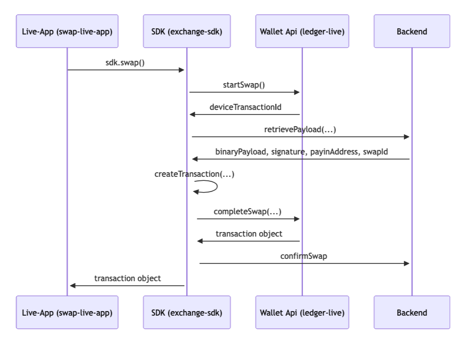

# PART 6 -- LEDGER WALLET COMPONENTS & SWAP LIVE APP

<div class="chapter-intro">
Parts 1-5 taught you the monorepo, the E2E stack, and the desktop internals. Part 6 moves up a layer: the <strong>products</strong> that live on top of Ledger Wallet. These are called <strong>Live Apps</strong> — sandboxed web experiences embedded inside the desktop and mobile apps. They are how Ledger ships features that need their own release cadence, their own backends, and sometimes their own regulatory scope.

This part zooms in on one Live App that matters more than any other for QA: the <strong>Swap Live App</strong>. Swap is MiCA-regulated, multi-provider, revenue-driving, and touched by nearly every Ledger team. After this part you will know every repo, every backend, every Firebase project, every URL — and you will finish by closing a real coverage gap ticket (QAA-1136) end-to-end.
</div>

---

## Live Apps in Ledger Wallet

<div class="chapter-intro">
A Live App is not a React component. It is not a screen. It is an embedded webview, loaded from a remote URL, sandboxed behind a strict API, and versioned independently from the Wallet shell itself. Understanding Live Apps is a prerequisite to understanding Swap — and several other high-value surfaces in Ledger Wallet.
</div>

### 32.1 What Is a Live App?

A **Live App** is a web application that renders inside Ledger Wallet (desktop and mobile) in a sandboxed webview and communicates with the Wallet through a well-defined JSON-RPC bridge called **Wallet API**.

In practice, a Live App is:

- A **separate repo** (not part of `ledger-live`) owned by the feature team
- A **separate deployment** — the Swap Live App is containerized and shipped to AWS EKS via ArgoCD; other Live Apps may run on their own infrastructure, but the pattern is always "independent of the Wallet release train"
- A **manifest entry** declared inside `ledger-live` that tells the Wallet shell: "load this URL, expose these Wallet-API permissions, show this icon, put it in that tab"
- A **sandboxed runtime** — the Live App cannot touch the device, blockchain, or accounts directly; every privileged action must go through the Wallet API

This split matters because it decouples the Live App team's velocity from the Wallet shell's velocity. Swap can release multiple times per week without waiting for a desktop release; the market team can iterate on discover surfaces without touching native code.

### 32.2 Why Live Apps Exist

Before Live Apps, every new feature had to ship inside `ledger-live-desktop` and `ledger-live-mobile`. That model broke down quickly:

| Constraint | Consequence |
|---|---|
| One release cadence for the whole Wallet | Feature teams blocked by Wallet release train |
| Native code changes for every feature | High risk, long review, long QA cycle |
| Shared bundle size | Every feature grows the installer |
| Shared codebase ownership | Feature teams needed desktop/mobile expertise |
| Single regulatory posture | One non-compliant feature risked the whole app |

Live Apps solve all five:

- Each app ships on its own cadence (Swap ships independently of the Wallet)
- No native code — features are standard web apps
- Bundle size in the Wallet is zero (the webview loads the app remotely)
- The feature team owns the repo, the CI/CD, and the ops
- Legal / compliance boundaries can be drawn **per Live App**, not per Wallet version (critical for MiCA)

### 32.3 Architecture -- How a Live App Loads

Here is the data flow when a user opens Swap from inside Ledger Wallet:

```
User taps "Swap" tab
       │
       ▼
Wallet shell reads the manifest
  for "swap" (manifest-api)
       │
       ▼
Wallet mounts a webview/iframe
  pointing at the Live App URL
  (e.g. swap-v3.apps.ledger.com)
       │
       ▼
Live App boots and calls
  window.ledgerLive.accounts.list()
       │
       ▼
Wallet API bridge intercepts the
  call, checks manifest permissions,
  returns account list
       │
       ▼
Live App shows quotes. User picks
  one. App calls
  walletApi.exchange.start()
       │
       ▼
Wallet shell drives the device
  signing flow through Speculos /
  a real device
       │
       ▼
Live App shows the "transaction
  sent" state
```

The three layers to remember:

1. **Manifest** — configuration in `ledger-live`, declares where to load the app from and what it is allowed to do
2. **Live App** — the web app itself, loaded in a webview, owns its UX
3. **Wallet API** — the JSON-RPC bridge between the two; the **only** way a Live App touches accounts, signing, or the network on behalf of the user

### 32.4 The Manifest API

Manifests live inside `ledger-live`. They declare how each Live App is exposed inside the Wallet — which URL to load per environment, which Wallet-API permissions to grant, which icon to show, which platforms it supports.

The manifest service is consumed by both desktop and mobile. For each Live App there is typically one manifest per environment.

**Manifest schema (from the Wallet API spec).** Every manifest validated by `@ledgerhq/wallet-api-manifest-validator` carries this shape:

| Field | Type | Purpose |
|---|---|---|
| `id` | `string` | Manifest unique id (e.g., `swap-live-app-aws`) |
| `name` | `string` | Display name shown in the Wallet (e.g., `"Swap"`) |
| `url` | `string` | The URL the Wallet loads in the webview |
| `homepageUrl` | `string` | Canonical homepage for the app |
| `platform` / `platforms` | `"desktop" \| "mobile" \| "all"` or array | Which Wallet shells load this app |
| `apiVersion` | `string` | Wallet-API semver range the app expects (e.g., `^2.0.0`) |
| `manifestVersion` | `string` | Manifest schema version |
| `branch` | `"stable" \| "experimental" \| "soon" \| "debug"` | Stability channel exposed to users |
| `categories` | `string[]` | Catalog tabs (e.g., `["exchange"]`) |
| `currencies` | `string[]` or `"*"` | Which currencies the app supports |
| `content.shortDescription` / `content.description` | `TranslatableString` | Copy shown in the catalog |
| `permissions` | `AppPermission[]` | The **capability allow-list** — see below |
| `domains` | `string[]` | Allowed navigation domains inside the webview |
| `private` | `boolean` (optional) | Hides the app from the public catalog |

**Real permission list (extract from the Swap dev manifest** — `apps/live-app/manifests/manifest.dev.json`**):**

```json
{
  "id": "swap-live-app-aws",
  "name": "Swap DEV",
  "url": "http://localhost:3000",
  "platforms": ["android", "ios", "desktop"],
  "apiVersion": "^2.0.0",
  "branch": "experimental",
  "categories": ["exchange"],
  "currencies": "*",
  "permissions": [
    "account.list",
    "account.request",
    "currency.list",
    "custom.exchange.start",
    "custom.exchange.complete",
    "custom.exchange.swap",
    "device.exchange",
    "device.transport",
    "exchange.start",
    "exchange.complete",
    "transaction.sign",
    "transaction.signAndBroadcast",
    "wallet.capabilities",
    "wallet.userId"
  ]
}
```

Every permission maps to one or more JSON-RPC methods the Live App can invoke. Anything not whitelisted is denied at the bridge layer, even if the Live App tries to invoke it — which is the Wallet's defence against a compromised or malicious app iframe.

**One manifest per environment.** The URL field differs by environment; everything else stays structurally similar:

| Environment | Manifest | Live App URL (public) |
|---|---|---|
| **Local dev** | local override (`manifest.dev.json` in the repo) | `http://localhost:3000` |
| **Staging** | `manifest-api` staging | `swap-live-app-stg.ledger-test.com` |
| **Pre-prod** | `manifest-api` pre-prod | `swap-live-app-ppr.ledger-test.com` |
| **Production** | `manifest-api` prod | `swap-live-app.ledger.com` |

### 32.5 The Wallet API

Wallet API is the [**JSON-RPC 2.0**](https://www.jsonrpc.org/specification) contract between the Wallet shell and any embedded Live App. The transport is **`postMessage`** between the parent window (the Wallet) and the iframe (the Live App) — not HTTP, not WebSocket. This matters: there is no network round-trip for a Wallet-API call, but the Wallet still enforces every permission inside the shell.

Wallet API is split across a **Client** (bundled inside the Live App) and a **Server** (hosted by the Wallet shell):

```
  ┌─────────────────┐      postMessage      ┌──────────────────┐
  │   Live App      │ ◄──── JSON-RPC ────►  │  Wallet shell    │
  │  (webview)      │         2.0           │   (Ledger Live)  │
  │                 │                       │                  │
  │ wallet-api-     │                       │ wallet-api-      │
  │ client          │                       │ server           │
  └─────────────────┘                       └──────────────────┘
@ledgerhq/wallet-api-client    │          @ledgerhq/wallet-api-server
                               │
                   @ledgerhq/wallet-api-core
                   (shared types and errors)
```

**Canonical JSON-RPC methods (from `/spec/rpc/README.md` in the Wallet API repo).** These are the calls a Swap Live App relies on:

| Method | Purpose |
|---|---|
| `transaction.sign` | User signs a transaction on the device — returns the raw signed tx |
| `transaction.broadcast` | Broadcasts a previously signed transaction — returns the tx hash |
| `message.sign` | User signs an EIP-191 / EIP-712 message on the device |
| `account.list` | List accounts the user has in the Wallet |
| `account.request` | Prompt the user to pick (or create) an account for the Live App |
| `account.receive` | Show a "Verify on device" address for an account |
| `currency.list` | List currencies supported in the Wallet |
| `exchange.start` | Start an exchange (swap/buy/sell) flow — returns a `deviceTransactionId` |
| `exchange.complete` | Finish the exchange after backend payload is retrieved — device signs |
| `wallet.capabilities` | Query which Wallet-API features the host supports |
| `wallet.userId` | Get an opaque, stable per-Wallet user identifier |

A minimal request / response pair, verbatim to the spec:

```json
// request
{ "jsonrpc": "2.0", "id": 1, "method": "transaction.sign",
  "params": { "accountId": "...", "transaction": { }, "params": { "useApp": "Ethereum" } } }
// response
{ "jsonrpc": "2.0", "id": 1, "result": { } }
```

**Canonical error types (from `/spec/core/errors.md`).** Every Wallet-API error is a `PlatformError` (`title`, `description`, `errorCode`) wrapped in the JSON-RPC 2.0 error envelope. Four error codes matter for swap QA:

| Code | Title | When QA sees it |
|---|---|---|
| `100` | `AccountNotFound` | The Live App passed an `accountId` the Wallet cannot match — usually a stale fixture or a currency the Wallet has not added |
| `101` | `AccountNotMain` | A sub-account was used where a main account was expected — common mistake when a test targets a token account by mistake |
| `102` | `AccountAndTransactionNotLinked` | The transaction object is for a different currency family than the account — the single most frequent "I swear I typed the right thing" error in fixture-driven tests |
| `103` | `TransactionNotProvided` | The transaction object is missing or malformed — often after a build that dropped a required field |

**Two things to internalize as a QA:**

1. **Everything is audited at the bridge** — if a Wallet-API call is rejected, the Wallet shell returns a `PlatformError` with a clear code. Grep for the error code and title before assuming a code bug; the manifest `permissions` list is usually where the truth lives.
2. **The Wallet API is versioned** — manifests declare `apiVersion` (e.g., `^2.0.0`). The Wallet shell and the Live App can evolve independently but the version range must overlap, so cross-version testing matters when either side bumps.

### 32.6 Live Apps in the Ledger Wallet Catalog

The Wallet ships several production Live Apps. Each has its own repo, team, Firebase, and release cycle. The most important ones for QA:

| Live App | What it does | Team | Where it lives |
|---|---|---|---|
| **Swap** | Crypto-to-crypto swap across multiple providers (CEX + DEX) | Swap | Swap tab / CTA from account |
| **PTX (Buy/Sell)** | Buy and sell crypto with fiat through MoonPay / Coinify / Banxa | PTX | Buy / Sell buttons |
| **Earn** | Staking and yield across supported chains | Earn | Earn tab |
| **Discover** | Third-party Live Apps (wallet-connect, NFT marketplaces, etc.) | Discover | Discover tab |
| **MoonPay (Buy)** | MoonPay's own Live App, wrapped via PTX | PTX + MoonPay | Buy flow |
| **Recover / Ledger Sync** | Account recovery and cross-device sync | Recover | Settings |

All of them follow the same pattern: separate repo, manifest entry, Wallet-API permissions, sandboxed webview. The complexity hides in the business logic, the partner integrations, and the legal constraints — which is exactly where QA spends its time.

### 32.7 QA Implications of the Live App Model

The Live App model changes how QA thinks about bugs:

- A bug in the Wallet shell (device flow, account sync, wallet-api bridge) affects **all** Live Apps → reproduce on at least two Live Apps before blaming the shell
- A bug in the Live App (quote rendering, provider selection, KYC flow) is **scoped** to that repo → open the ticket in the Live App's Jira project, not in the Wallet's
- An end-to-end test that opens a Live App has to wait for the webview to load; this is slower and flakier than intra-Wallet navigation — budget for it
- Release windows are **per Live App** → a swap regression does not require a Wallet hotfix; the swap team rolls back swap
- Firebase feature flags can live in two projects at once — one for the Wallet, one for the Live App — and a QA session may need to coordinate both (see Chapter 34)

<div class="chapter-outro">
<strong>Key takeaway:</strong> A Live App is a remote, sandboxed web app wired into Ledger Wallet through a manifest and the Wallet API. Each Live App has its own repo, deployment, Firebase, and release cadence — which is why Swap QA work rarely happens inside <code>ledger-live</code> alone. The Wallet shell is the runtime; the Live App is the product.
</div>

### 32.8 Quiz

<div class="quiz-container" data-pass-threshold="80">
<h3>Quiz -- Live Apps in Ledger Wallet</h3>
<p class="quiz-subtitle">5 questions · 80% to pass</p>
<div class="quiz-progress"><div class="quiz-progress-bar"></div></div>

<div class="quiz-question" data-correct="C">
<p><strong>Q1.</strong> What is a Live App, architecturally?</p>
<div class="quiz-choices">
<button class="quiz-choice" data-value="A">A) A native screen inside <code>ledger-live-desktop</code></button>
<button class="quiz-choice" data-value="B">B) A plugin DLL loaded into the Electron main process</button>
<button class="quiz-choice" data-value="C">C) A remote web application loaded into a sandboxed webview and talking to the Wallet over the Wallet API</button>
<button class="quiz-choice" data-value="D">D) A background worker running on the device</button>
</div>
<p class="quiz-explanation">A Live App is a remote web app embedded in a sandboxed webview. It never runs native code. Everything privileged (accounts, signing, network) is brokered by the Wallet API bridge.</p>
</div>

<div class="quiz-question" data-correct="B">
<p><strong>Q2.</strong> Which statement about Live App releases is true?</p>
<div class="quiz-choices">
<button class="quiz-choice" data-value="A">A) A new Live App version requires a new Ledger Wallet release</button>
<button class="quiz-choice" data-value="B">B) Each Live App releases independently from the Wallet shell, on its own cadence</button>
<button class="quiz-choice" data-value="C">C) Live Apps are rebuilt on every Wallet CI run</button>
<button class="quiz-choice" data-value="D">D) Live Apps are stored inside the installer and updated via Electron auto-updater</button>
</div>
<p class="quiz-explanation">Decoupled releases are the main reason Live Apps exist. Swap, for example, can ship several times a week without Wallet desktop or mobile releasing at all. The manifest points at a URL that the Live App team updates independently.</p>
</div>

<div class="quiz-question" data-correct="A">
<p><strong>Q3.</strong> The Wallet API is best described as...</p>
<div class="quiz-choices">
<button class="quiz-choice" data-value="A">A) A JSON-RPC bridge that brokers every privileged call a Live App needs to make, with permissions enforced at the bridge</button>
<button class="quiz-choice" data-value="B">B) A REST API hosted by Ledger's backend</button>
<button class="quiz-choice" data-value="C">C) A WebSocket used only for streaming market prices</button>
<button class="quiz-choice" data-value="D">D) A shared library linked into the Live App</button>
</div>
<p class="quiz-explanation">Wallet API is an in-process JSON-RPC bridge between the webview and the shell. The shell enforces manifest permissions at the bridge — a Live App cannot bypass them even if it tries.</p>
</div>

<div class="quiz-question" data-correct="D">
<p><strong>Q4.</strong> Why are manifests important from a QA perspective?</p>
<div class="quiz-choices">
<button class="quiz-choice" data-value="A">A) They contain the Live App's source code</button>
<button class="quiz-choice" data-value="B">B) They replace feature flags</button>
<button class="quiz-choice" data-value="C">C) They are loaded only in production</button>
<button class="quiz-choice" data-value="D">D) They control which URL the Wallet loads per environment and which Wallet-API permissions the app has — a misconfigured manifest can break an otherwise correct Live App</button>
</div>
<p class="quiz-explanation">If the manifest points at the wrong URL or denies a required permission, the Live App will fail even if its own code is flawless. When a Live App is broken in one environment only, always compare manifests first.</p>
</div>

<div class="quiz-question" data-correct="B">
<p><strong>Q5.</strong> A webview-based Live App is slower to load than a native screen. What does this mean for E2E test design?</p>
<div class="quiz-choices">
<button class="quiz-choice" data-value="A">A) Use <code>page.waitForTimeout(5000)</code> before every action</button>
<button class="quiz-choice" data-value="B">B) Budget for webview boot time and Wallet-API handshake in fixture/setup, not inside assertions — and prefer deterministic waits on app-specific selectors over sleeps</button>
<button class="quiz-choice" data-value="C">C) Never test Live Apps end-to-end</button>
<button class="quiz-choice" data-value="D">D) Disable webviews in test mode</button>
</div>
<p class="quiz-explanation">Live Apps need deterministic waits on app-specific UI elements (e.g., the quotes list) because the boot adds latency the Wallet shell does not have. Fixed sleeps create flakiness; Playwright's auto-waiting on a real element is what you want.</p>
</div>

<div class="quiz-score"></div>
</div>

---

## Swap Live App -- Architecture & Components

<div class="chapter-intro">
The Swap Live App is the most business-critical Live App in Ledger Wallet. It is also the most architecturally complex — several repos, several backends, several providers, and a regulated perimeter. This chapter is the map you need to debug a swap issue without guessing where the problem lives.
</div>

### 33.1 What Swap Does

From the user's point of view, Swap exchanges one crypto for another directly from Ledger Wallet without leaving the app and without giving custody to anyone. Under the hood, "directly from Ledger Wallet" hides a lot of moving parts:

1. The user picks a source account and a destination currency
2. The Swap Live App asks multiple providers for quotes in parallel
3. The user picks a provider (or the best-rate pick is preselected)
4. The Wallet shell builds a transaction on the source chain, the device signs it, the Wallet broadcasts it
5. The provider receives the source asset, converts it, and sends the destination asset to the user's destination account
6. Swap polls the provider for status until the trade reaches a terminal state (completed, failed, refunded)

Ledger does not hold funds at any step. The provider takes custody briefly between inbound and outbound; Ledger's role is limited to quote aggregation, transaction orchestration, and status reporting. That boundary is a legal one — see 33.9 for why.

### 33.2 The Swap Repo Landscape

Swap lives in several repos. You will need to know each one by name.

| Repo | What it is | Language / stack | QA interest |
|---|---|---|---|
| **`swap-live-app`** | The Swap Live App itself — the webview UI users see | Next.js 15 (App Router) + React 19 + TypeScript 5.9 + Tailwind 4; containerized and deployed to AWS EKS via ArgoCD | Most frontend bugs live here |
| **`swap`** | The Swap backend: quote aggregator + completer (polls providers and updates status) | Scala (service) + Scala (completer), PostgreSQL, RabbitMQ | Quote discrepancies, status-polling issues, provider outages surface here |
| **`swap-configuration`** | Configuration for supported pairs, limits, fees, provider enablement | Rust + CSV configuration files | "Why is this pair unavailable?" almost always starts here |
| **`exchange-sdk`** | Shared TypeScript SDK used by Live Apps (Swap, PTX) and by the Wallet shell to drive exchange flows | TypeScript | Wallet-API exchange contract lives here |
| **`wallet-api`** | The JSON-RPC bridge itself — `client`, `server`, `core`, `simulator`, `manifest-validator` packages | TypeScript monorepo | Manifest schema, RPC methods, error types are defined here |
| **`ledger-live`** (this repo) | The Wallet shell, including E2E tests for swap | pnpm + Turborepo monorepo | E2E desktop (`send.swap.spec.ts`, `accounts.swap.spec.ts`) and mobile tests |
| **`ledger-live-assets`** | Static assets: provider logos, provider configs, icons | Static CDN-served | Missing logo, wrong provider label → check here |

A **swap bug does not always belong to Swap** — it might live in `ledger-live` (the shell), in `exchange-sdk` (the bridge contract), in `wallet-api` (the protocol itself), or in the provider. Triage by layer.

### 33.3 Frontend: the `swap-live-app` Repo

`swap-live-app` is a **Next.js 15 (App Router) + React 19 + TypeScript 5.9 + Tailwind 4** monorepo. It is **not** deployed on Vercel — the application is containerized by GitHub Actions (`build.yml`), pushed to a JFrog OCI registry (`jfrog.ledgerlabs.net/ptx-oci-prod-green/swap-live-app`), and deployed to **AWS EKS via ArgoCD** (GitOps). Chapter 34 covers the environments and URLs.

**Repo layout** (from `apps/docs/architecture/index.md`):

```
swap-live-app/
├── apps/
│   ├── live-app/           # Main swap application (Next.js 15, App Router)
│   └── docs/               # Documentation site (VitePress)
├── packages/
│   ├── ui-desktop/         # Design system components (Atomic Design)
│   ├── formatter/          # Number/currency formatting with i18n
│   ├── utils/              # Shared utilities (cn helper)
│   ├── testing-tools/      # Testing utilities and MSW setup
│   ├── window-transport-simulator/   # Wallet API transport simulator
│   ├── eslint-config/      # Shared ESLint configurations
│   ├── typescript-config/  # Shared TypeScript configurations
│   └── tailwind-config/    # Shared Tailwind CSS configuration
├── argocd/                 # ArgoCD deployment configs (stg, ppr, prd, prx)
├── .github/workflows/      # CI/CD (build, e2e, release, rollback, code freeze)
└── .rules/                 # Project-wide coding standards
```

**Inside `apps/live-app/src/`:**

```
src/
├── app/             # Next.js App Router pages & layouts
├── components/      # Feature and page-specific components
├── context/         # React contexts (Wallet API, user state)
├── hooks/           # Custom React hooks
├── locales/         # i18n strings
├── queries/         # React Query API calls to the swap backend
├── remote-config/   # Firebase remote config (feature flags, partner config)
├── schemas/         # Zod schemas for runtime validation
├── state/           # Jotai atoms
├── swap-api/        # Typed client for the `swap` backend
├── wallet-api/      # Thin wrapper around @ledgerhq/wallet-api-client
└── middleware.ts    # Next.js edge middleware
```

**Key stack traits to remember as QA:**

- **Next.js App Router** (not Pages Router) — URL routing is filesystem-based under `src/app/`
- **Styling** — Tailwind 4 + Ledger's Lumen design system (`@ledgerhq/lumen-design-core`, `@ledgerhq/lumen-ui-react`) + `@ledgerhq/react-ui`. Tailwind utilities come from a custom preset — QA should not be tempted to read arbitrary class values like `w-[107px]`; only design-token sizes are valid
- **State** — Jotai atoms (not Redux/Zustand) for local state; React Query for backend calls
- **Feature flags** — Firebase Remote Config (see chapter 34)
- **UI component library** — `@workspace/ui-desktop` is the in-repo design system, organised Atomic-Design style (atoms / molecules / organisms / primitives), documented via Storybook
- **Simulator** — `@workspace/window-transport-simulator` + `@ledgerhq/wallet-api-simulator` mock the Wallet-API bridge so the Live App can run standalone at `http://localhost:3000` during dev
- **Analytics / monitoring** — Datadog RUM (`@datadog/browser-rum`), Segment (`@segment/analytics-next`), Mixpanel (`mixpanel-browser`) are all bundled into `apps/live-app`

The Live App is **stateless across sessions** from the Wallet's perspective — if you reopen Swap, it reboots. This matters in tests: every `openSwap()` in an E2E spec is a full webview boot (plus Next.js hydration).

### 33.4 Backend: the `swap` Service and Completer

The `swap` backend is two processes sharing a PostgreSQL database and a RabbitMQ (Amazon MQ) queue:

```
              HTTPS from Live App
                     │
                     ▼
        ┌────────────────────────┐
        │       swap service      │
        │  (Scala, REST, quotes,  │
        │   trade creation)       │
        └────────┬───────────────┘
                 │ enqueue
                 ▼
        ┌────────────────────────┐
        │       RabbitMQ          │
        │      (Amazon MQ)        │
        └────────┬───────────────┘
                 │ consume
                 ▼
        ┌────────────────────────┐
        │       swap completer    │
        │  (Scala, polls provider │
        │   status, persists it)  │
        └────────┬───────────────┘
                 │
                 ▼
        ┌────────────────────────┐
        │      PostgreSQL         │
        │  (trades, statuses,     │
        │   audit)                │
        └────────────────────────┘
```

Responsibilities:

- **`swap` service** — receives quote and trade requests from the Live App, fans them out to providers, ranks quotes, returns the best, and creates the trade record
- **`swap completer`** — background worker that polls providers for long-running trades and updates status in PostgreSQL; the Live App (and Wallet) read status from the service endpoint
- **PostgreSQL** — system of record for every trade, status history, audit
- **RabbitMQ** — decouples trade creation (synchronous, user-facing) from status polling (asynchronous, provider-dependent)

The **completer is why a swap you started can "complete later"** even if you close Swap. Status is owned by the backend, not the Live App.

### 33.5 Configuration: the `swap-configuration` Repo

`swap-configuration` holds the declarative rules that the service and the Live App obey:

- Which swap pairs are supported, per provider
- Per-pair min/max amounts
- Per-provider fee tiers
- Which providers are enabled globally and per environment
- KYC requirements per provider
- Geolocation / jurisdiction rules

It is **Rust** tooling over **CSV** sources. QA almost never edits this repo, but you will read it constantly:

- "Why can't I swap X to Y?" → grep the pair in `swap-configuration`
- "Why is Changelly disabled on pre-prod?" → same
- "Why does the min amount differ between stg and prod?" → same

When you see a behavior that looks like a bug but might be a config intent, **check `swap-configuration` before opening a ticket**.

### 33.6 Shared Contracts: `exchange-sdk`

`exchange-sdk` is a TypeScript package that both the Wallet shell and the Swap Live App consume. It defines:

- The Wallet-API exchange contract (types, method signatures, error codes)
- The shape of swap quotes, trade requests, and status responses
- Helpers for building the transaction the device will sign

Bugs in `exchange-sdk` are particularly painful because they surface as mysterious errors at the Wallet-API bridge — the Live App thinks it sent a valid call, the shell thinks it received a malformed one, and the stack trace points at neither. When you see `INVALID_PARAMS` or similar bridge errors from Swap, check if `exchange-sdk` was recently bumped on either side.

### 33.7 Static Assets: `ledger-live-assets`

This repo serves static assets (images, provider configs) through a CDN. For Swap specifically:

- Provider logos (Changelly, CIC, 1inch, Paraswap, MoonPay, Thorswap, Uniswap, ...)
- Provider metadata (display name, URL, KYC flag)
- Icons used in the Live App UI

If a provider shows up with a broken or missing logo in prod, that is an assets repo issue, not a Swap issue.

### 33.8 Providers

Swap aggregates multiple providers. Each provider is either a CEX (custodial, KYC-prone) or a DEX (non-custodial, usually KYC-free). For QA, the CEX/DEX distinction drives the flow:

| Provider | Type | KYC required? | Notes |
|---|---|---|---|
| **Changelly** | CEX | Conditional | Float rates, widely supported pairs |
| **CIC** | CEX | Conditional | Partner-specific fiat off-ramp |
| **1inch** | DEX | No | EVM DEX aggregator |
| **Paraswap** | DEX | No | EVM DEX aggregator |
| **MoonPay** | CEX (fiat-on-ramp, via Swap on some flows) | Yes | Different flow — often has its own Live App |
| **Thorswap** | DEX | No | Cross-chain (BTC, ETH, LTC, ...) |
| **Uniswap** | DEX | No | EVM, canonical DEX |

Two things to remember in tests:

- **KYC path diverges**: `selectExchangeWithoutKyc` picks a provider the test can actually go through without a human. Using `selectExchange` (including KYC-capable providers) may land on Changelly/CIC and block the test behind a KYC screen.
- **DEX swaps need token approvals** before the actual swap — `app.swap.ensureTokenApproval(...)` handles this. If a test flakes on a token swap only, missing or stale approval is the first suspect.

### 33.9 The Regulatory Boundary (MiCA / CASP)

Since late 2024, swap in the EU falls under MiCA. Two consequences matter for QA:

- Ledger operates Swap under an **RTO** (Reception and Transmission of Orders) model. Ledger does not custody funds and does not match orders — providers do.
- Provider availability varies **by user jurisdiction**. A pair that works in stg from a French test IP may not work from a US-VPN test session.

This is why QA environments have stg/ppr/prod split, and why the list of enabled providers differs across envs (see Chapter 34).

### 33.10 Putting It All Together

The end-to-end exchange flow involves four actors — the **Live App** (frontend), the **Exchange SDK** (shared contracts), the **Wallet API** (JSON-RPC bridge exposed by the Wallet shell), and the **Swap backend** (service + completer). The sequence below is the canonical happy path for a swap trade:



In words, step by step:

1. The Wallet shell reads the manifest and opens the Live App URL
2. The Live App boots, uses `exchange-sdk` types to request quotes from the `swap` service
3. The service consults `swap-configuration` to know which providers and pairs are enabled
4. The service hits each enabled provider in parallel
5. The Live App shows quotes, the user picks one
6. The Live App asks the Wallet API (via `exchange.start`) to initialize an exchange nonce on the device
7. The Live App then calls `exchange.complete`; the Wallet shell builds the tx, the device signs, and the Wallet broadcasts
8. The `swap` service writes the trade record; the **completer** polls the provider until the trade reaches a terminal state
9. The Live App queries status until completion; logos and provider metadata come from `ledger-live-assets`

**When you triage a swap bug, ask by layer, top to bottom:**

- Live App UX / rendering → `swap-live-app`
- Wallet-API bridge / shell device flow → `ledger-live` + `exchange-sdk`
- Quote rejection, wrong pair availability, stale status → `swap` backend
- Supported pair / min-max / provider enablement → `swap-configuration`
- Missing logo / wrong provider label → `ledger-live-assets`
- Provider-specific failure → the provider itself (escalate)

<div class="resource-box">
<h4>Resources</h4>
<ul>
<li><code>swap-live-app</code> repo — the Live App itself</li>
<li><code>swap</code> repo — Scala backend (service + completer)</li>
<li><code>swap-configuration</code> repo — pair/fees/provider configuration</li>
<li><code>exchange-sdk</code> repo — Wallet-API exchange contract</li>
<li><code>ledger-live-assets</code> repo — provider logos and metadata</li>
<li><code>e2e/desktop/tests/specs/send.swap.spec.ts</code> in <code>ledger-live</code> — desktop swap E2E tests</li>
<li><code>e2e/mobile/specs/swap/</code> in <code>ledger-live</code> — mobile swap E2E tests</li>
</ul>
</div>

<div class="chapter-outro">
<strong>Key takeaway:</strong> Swap is an aggregator plus an orchestrator. The Live App is the UI; the <code>swap</code> service is the quote/trade API; the completer is the status worker; <code>swap-configuration</code> is the rulebook; <code>ledger-live-assets</code> supplies branding. A swap bug is almost always scoped to one of these layers — triaging by layer saves hours of blind debugging.
</div>

### 33.11 Quiz

<div class="quiz-container" data-pass-threshold="80">
<h3>Quiz -- Swap Live App Architecture</h3>
<p class="quiz-subtitle">5 questions · 80% to pass</p>
<div class="quiz-progress"><div class="quiz-progress-bar"></div></div>

<div class="quiz-question" data-correct="B">
<p><strong>Q1.</strong> Where does the Swap Live App's frontend source code live, and how is it deployed?</p>
<div class="quiz-choices">
<button class="quiz-choice" data-value="A">A) In <code>ledger-live/apps/swap</code>, bundled with the Wallet shell</button>
<button class="quiz-choice" data-value="B">B) In the separate <code>swap-live-app</code> repo — containerized by GitHub Actions, pushed to JFrog, and deployed to AWS EKS via ArgoCD</button>
<button class="quiz-choice" data-value="C">C) In <code>exchange-sdk</code>, served from npm</button>
<button class="quiz-choice" data-value="D">D) In <code>ledger-live-assets</code>, served from a CDN</button>
</div>
<p class="quiz-explanation">The Swap Live App lives in its own repo. Deployment is <strong>not</strong> Vercel — <code>build.yml</code> builds a Docker image, pushes it to JFrog (<code>jfrog.ledgerlabs.net/ptx-oci-prod-green/swap-live-app</code>), and ArgoCD syncs it to an EKS cluster (GitOps). The Wallet shell loads the Live App by URL, declared in a manifest.</p>
</div>

<div class="quiz-question" data-correct="C">
<p><strong>Q2.</strong> Which component is responsible for polling providers and updating the status of long-running trades?</p>
<div class="quiz-choices">
<button class="quiz-choice" data-value="A">A) The Swap Live App frontend</button>
<button class="quiz-choice" data-value="B">B) The <code>swap</code> service (REST API)</button>
<button class="quiz-choice" data-value="C">C) The <code>swap</code> completer — a background worker consuming from RabbitMQ and writing status to PostgreSQL</button>
<button class="quiz-choice" data-value="D">D) The <code>exchange-sdk</code> package</button>
</div>
<p class="quiz-explanation">The completer is the status worker. It decouples "I just created a trade" (synchronous, user-facing) from "is the trade complete?" (asynchronous, provider-dependent). This is why a trade can complete even after the user closes Swap.</p>
</div>

<div class="quiz-question" data-correct="A">
<p><strong>Q3.</strong> A user reports that a specific swap pair is unavailable in production only. What repo should you check first?</p>
<div class="quiz-choices">
<button class="quiz-choice" data-value="A">A) <code>swap-configuration</code> — the declarative rules about which pairs are enabled per provider and per environment</button>
<button class="quiz-choice" data-value="B">B) <code>ledger-live</code></button>
<button class="quiz-choice" data-value="C">C) <code>swap-live-app</code></button>
<button class="quiz-choice" data-value="D">D) <code>ledger-live-assets</code></button>
</div>
<p class="quiz-explanation">Pair availability is driven by <code>swap-configuration</code>. Before you assume a code bug, check whether the pair is intentionally disabled or restricted for that environment.</p>
</div>

<div class="quiz-question" data-correct="D">
<p><strong>Q4.</strong> Why does the desktop E2E test call <code>selectExchangeWithoutKyc</code> instead of <code>selectExchange</code>?</p>
<div class="quiz-choices">
<button class="quiz-choice" data-value="A">A) It is faster</button>
<button class="quiz-choice" data-value="B">B) It is the only method that works on Speculos</button>
<button class="quiz-choice" data-value="C">C) It is required by <code>exchange-sdk</code></button>
<button class="quiz-choice" data-value="D">D) To deterministically pick a provider that will not trigger a KYC step mid-test — KYC screens cannot be automated</button>
</div>
<p class="quiz-explanation">KYC-capable providers (Changelly, CIC) can route the test into an identity-verification flow that no E2E test can complete. <code>selectExchangeWithoutKyc</code> restricts the provider pool to those that allow the swap to proceed without human verification.</p>
</div>

<div class="quiz-question" data-correct="B">
<p><strong>Q5.</strong> A token-pair swap test flakes only on DEX providers. What is the most likely root cause?</p>
<div class="quiz-choices">
<button class="quiz-choice" data-value="A">A) Speculos is misconfigured</button>
<button class="quiz-choice" data-value="B">B) The ERC-20 token approval step has not been granted or is stale — DEX swaps require an approval before the swap itself</button>
<button class="quiz-choice" data-value="C">C) The completer is down</button>
<button class="quiz-choice" data-value="D">D) <code>ledger-live-assets</code> is serving stale logos</button>
</div>
<p class="quiz-explanation">DEX swaps on EVM chains require an ERC-20 <code>approve()</code> transaction before the actual swap. The test calls <code>app.swap.ensureTokenApproval(...)</code>; if that step is skipped or the approval is stale, the swap itself will fail on the first DEX provider.</p>
</div>

<div class="quiz-score"></div>
</div>

---

## Swap Live App -- Releases & Firebase Environments

<div class="chapter-intro">
The Swap Live App has its own branching model, its own CI/CD, and its own Firebase — none of which is obvious from inside <code>ledger-live</code>. This chapter maps every environment to the URLs, feature flags, and monitoring you will actually use on your first week of QA work.
</div>

### 34.1 Release Model -- Trunk-Based on `develop`

The Swap Live App follows **trunk-based development**. There is **no `release/*` branch** and no Gitflow: `develop` is the single source of truth, feature branches are short-lived, and production is cut from `develop` by running a workflow.

```
develop (trunk — always deployable, auto-deploys to staging)
  │
  ├── feat/<name>    (short-lived, days)
  ├── fix/<name>     (short-lived)
  └── hotfix/<name>  (branched from the latest app@vX.Y.Z tag)
```

Key rules:

- `develop` is the trunk; feature and fix branches merge back quickly
- Every merge to `develop` builds a Docker image tagged `develop` and auto-deploys to **staging** (ArgoCD sync)
- A production release is triggered manually by running the **`release-production.yml`** GitHub Action — it consumes pending **Changesets** (`.changeset/*.md`), bumps versions, commits the bump, and creates an `app@vX.Y.Z` git tag
- The tag push triggers `build.yml` which builds a Docker image tagged `app-vX.Y.Z` (hyphen, not `@`) and ArgoCD picks it up for production
- **Hotfixes** branch from the latest `app@vX.Y.Z` tag, are tagged as a new patch release, and are merged back into `develop` (do **not** cherry-pick — always merge, to avoid divergence)
- **Code freezes** are activated with the `code-freeze.yml` workflow; it flips the `CODE_FREEZE` repo variable and makes the "Code Freeze Check" fail on open PRs, blocking merges

Versioning is **fully automated** by Changesets. Before a PR that introduces a user-facing change, you run `npx changeset`, select the bump type (major/minor/patch), write a summary, and commit the generated `.changeset/*.md` with your PR. The release workflow does the rest.

> **Note:** Git tag format is `app@vX.Y.Z` (with `@`). The corresponding Docker image tag is `app-vX.Y.Z` (with a hyphen). The conversion happens automatically in the pipeline.

### 34.2 The Environments and Their URLs

Swap has **four** environments: three long-lived (stg, ppr, prd) and one dynamic per-PR preview (prx). Each long-lived env has an internal AWS hostname (used by Ledger-internal tooling) and a public Cloudflare hostname (the one QA and end users actually hit). Memorize the shape:

| Environment | Purpose | Frontend (Live App, public) | Internal AWS host | ArgoCD config |
|---|---|---|---|---|
| **Staging** (`stg`) | Auto-deploys on every merge to `develop`; internal dev and early QA | `swap-live-app-stg.ledger-test.com` | `swap-live-app.aws.stg.ldg-tech.com` | `argocd/stg/values.yaml` |
| **Pre-prod** (`ppr`) | Final validation — prod-like; QA sign-off | `swap-live-app-ppr.ledger-test.com` | `swap-live-app.aws.ppr.ldg-tech.com` | `argocd/ppr/values.yaml` |
| **Production** (`prd`) | End users | `swap-live-app.ledger.com` | `swap-live-app.aws.prd.ldg-tech.com` | `argocd/prd/values.yaml` |
| **Preview** (`prx`) | Dynamic per-PR environment | — | `swap-live-app-pr<NNN>.aws.stg.ldg-tech.com` | `argocd/prx/values.yaml` |

The backend (the `swap` service QA hits for quotes and trade creation) has its own URLs, versioned in the path:

| Env | Backend URL |
|---|---|
| Staging | `swap-stg.ledger-test.com/v5` |
| Pre-prod | `swap-ppr.ledger-test.com/v5` |
| Production | `swap.ledger.com` |

A few things to note:

- The Live App frontend and the swap backend are **separate services on separate URLs** — the Live App calls the backend via HTTPS. When debugging a swap issue, always check both sides
- `ledger-test.com` is Ledger's public test domain (behind Cloudflare) — do not expose these URLs to end users; they are for QA and dev only
- `ldg-tech.com` is Ledger's internal AWS domain — typically only reachable from Ledger infrastructure
- Provider enablement can differ between environments; a provider may be paused in stg to test fallback, or may be disabled in prod because of a region block
- Each `argocd/{env}/values.yaml` has two fields that control which image runs: `imageTag` (default — `develop` for stg, `main` for prd) and `IMAGE_UPDATE_OVERRIDE_TAG` (empty = automatic updates; set to `app-vX.Y.Z` to pin a version, which is how rollbacks work)

### 34.3 Firebase Projects

Swap uses **two separate Firebase projects**. They serve different clients and the distinction catches new QA off guard.

| Firebase project | Who reads it | What it contains |
|---|---|---|
| **`ledger-live-production`** | The Wallet shell (desktop + mobile) | Wallet-wide feature flags, Wallet 4.0 toggles, manifest overrides, the Wallet's own configuration (`shouldShowSwap`, entry-point toggles, KYC gates, etc.) |
| **`swap-live-app`** | The Swap Live App itself | Swap-specific flags: provider enablement per env, A/B experiments inside the Live App, per-pair overrides, UI experiments |

In practice:

- A flag that controls **whether the Swap entry point appears in the Wallet** is in `ledger-live-production`
- A flag that controls **the layout of the quotes list inside the Live App** is in `swap-live-app`
- If QA says "I cannot see Swap in the Wallet", check `ledger-live-production` first
- If QA says "A provider is missing in Swap", check the `swap-live-app` Firebase first, then `swap-configuration`

Each Firebase project has its own staging / prod split (typically separated by project or by remote-config condition). Credentials to these projects are distributed per-role; do not share.

### 34.4 Feature Flags -- Where to Look

Swap-related feature flags live in three places at once. When tracing a flag, check all three:

| Source | Examples |
|---|---|
| **Firebase `ledger-live-production`** | `ptxSwap`, `ptxEarn`, manifest overrides, Swap entry-point toggles |
| **Firebase `swap-live-app`** | Provider enablement (e.g., `changelly_enabled`), UI experiments, best-rate algorithm toggles |
| **`swap-configuration` repo** | Pair enablement, min/max amounts, per-provider pair whitelist |

Configuration wins in this order (most specific first):

1. `swap-configuration` — a disabled pair is disabled, full stop
2. Firebase `swap-live-app` — if enabled in config, a provider may still be hidden by a Firebase flag for an A/B test
3. Firebase `ledger-live-production` — if the Wallet hides the Swap entry altogether, none of the above matter

### 34.5 The Release Workflow in Practice

A typical swap release (no release branch, Changesets-driven):

```
Ongoing │  PRs merge to develop; each carries a .changeset/*.md if user-facing
Ongoing │  On every merge to develop: build.yml builds app image tagged `develop`
Ongoing │  ArgoCD syncs the new `develop` image to stg (swap-live-app-stg.ledger-test.com)
Day 0   │  prepare-release.yml runs → GitHub issue with next version + changelog preview
Day 0   │  Scope agreed; optionally code-freeze.yml activates CODE_FREEZE to block new merges
Day 1   │  QA regresses on ppr (the same develop-tracking image is promoted to ppr for the gate)
Day 2   │  release-production.yml triggered manually → Changesets consumed, versions bumped,
        │  commit pushed to develop, app@vX.Y.Z git tag created
Day 2   │  Tag push triggers build.yml → Docker image tagged `app-vX.Y.Z` pushed to JFrog
Day 2   │  ArgoCD prd picks up the new image; swap-live-app.ledger.com now serves the new version
Day 2   │  Monitor #ptx-swap-prod and Datadog/Sentry for regressions
```

QA's touchpoints on this timeline:

- **Ongoing (stg)** — smoke + targeted regression as PRs merge; this is where most bugs are caught
- **Day 1 (ppr)** — full regression against production-like data; this is the go/no-go gate
- **Day 2 (prod)** — watchdog on Datadog, Sentry, Mixpanel dashboards for the first 2 hours after deploy

**Rollback:** to roll back production, run `rollback-production.yml` with the environment (`prd`) and the target version (e.g., `app@v1.8.0`). The workflow updates `IMAGE_UPDATE_OVERRIDE_TAG` in `argocd/prd/values.yaml` and commits it to `develop`; ArgoCD syncs within minutes. If the workflow is unavailable, edit `argocd/prd/values.yaml` directly, set `IMAGE_UPDATE_OVERRIDE_TAG: "app-v1.8.0"`, and merge to `develop` — same effect.

### 34.6 Monitoring and Observability

When a swap bug is reported, the monitoring stack is where you start:

| Tool | What it shows |
|---|---|
| **Datadog** | Service health, error rates, latency, alerts for the `swap` backend and completer |
| **Sentry** | Client-side errors in the Live App (desktop webview + mobile webview) |
| **Mixpanel** | Funnel metrics — how many users start a quote, how many complete a trade, drop-off per step; there are separate Mixpanel projects for desktop and mobile |
| **Tableau** | Aggregated business metrics; revenue per provider, volume per pair, KYC pass-through |
| **Runscope** | Synthetic uptime checks against the `swap` service endpoints |

And Slack is where the humans are:

| Channel | Purpose |
|---|---|
| **`#ptx-swap-build`** | Swap team engineering chatter, release announcements |
| **`#ptx-swap-prod`** | Production-only: deploys, rollbacks, first-hour watchdog |
| **`#alerts-swap`** | Automated alerts from Datadog and Sentry |
| **`#consumer-service-alerts`** | Broader consumer-backend alerts that sometimes affect Swap |

### 34.7 What Changes Across Environments -- Cheat Sheet

| Concern | Staging | Pre-prod | Production |
|---|---|---|---|
| Backend URL | `swap-stg.ledger-test.com/v5` | `swap-ppr.ledger-test.com/v5` | `swap.ledger.com` |
| Frontend URL (public) | `swap-live-app-stg.ledger-test.com` | `swap-live-app-ppr.ledger-test.com` | `swap-live-app.ledger.com` |
| Frontend URL (AWS internal) | `swap-live-app.aws.stg.ldg-tech.com` | `swap-live-app.aws.ppr.ldg-tech.com` | `swap-live-app.aws.prd.ldg-tech.com` |
| Image tag | `develop` (auto) | pinned `app-vX.Y.Z` | pinned `app-vX.Y.Z` |
| Real funds | No (test seeds) | No (test seeds) | Yes — user funds |
| Provider list | May be a subset, may include test providers | Same set as prod | Full production set |
| Firebase project audience | Internal | Internal | External users |
| Monitoring severity | Low | Medium | Critical — paging |
| Broadcast in E2E | Gated by `DISABLE_TRANSACTION_BROADCAST=1` | Same | Never run E2E that broadcasts |

The most common "works on stg, fails on ppr" pattern is a provider-enablement delta — always re-read `swap-configuration` and the `swap-live-app` Firebase flags side by side before assuming a code regression.

<div class="chapter-outro">
<strong>Key takeaway:</strong> Swap ships via <strong>trunk-based development</strong> — <code>develop</code> is the source of truth, Changesets drives versioning, and <code>release-production.yml</code> creates an <code>app@vX.Y.Z</code> tag that ArgoCD then syncs to EKS. Four environments (<code>stg</code> / <code>ppr</code> / <code>prd</code> / <code>prx</code>) each have their own public Cloudflare URL (e.g., <code>swap-live-app.ledger.com</code>) and internal AWS URL. Two Firebase projects split the flag responsibility: <code>ledger-live-production</code> (Wallet-side) and <code>swap-live-app</code> (Live-App-side). When a swap bug depends on environment, the answer is almost always in the URL map, the Firebase flags, or <code>swap-configuration</code> — and often in all three at once.
</div>

### 34.8 Quiz

<div class="quiz-container" data-pass-threshold="80">
<h3>Quiz -- Swap Releases & Firebase</h3>
<p class="quiz-subtitle">5 questions · 80% to pass</p>
<div class="quiz-progress"><div class="quiz-progress-bar"></div></div>

<div class="quiz-question" data-correct="B">
<p><strong>Q1.</strong> Which branching model does <code>swap-live-app</code> use?</p>
<div class="quiz-choices">
<button class="quiz-choice" data-value="A">A) Classic Gitflow with a <code>release/app@v1.3.xx</code> branch cut from <code>develop</code></button>
<button class="quiz-choice" data-value="B">B) Trunk-based on <code>develop</code> — short-lived <code>feat/*</code> and <code>fix/*</code> branches merge back quickly; production is cut from <code>develop</code> by running <code>release-production.yml</code>, which consumes Changesets and creates an <code>app@vX.Y.Z</code> tag</button>
<button class="quiz-choice" data-value="C">C) Semantic-release on every merge to <code>main</code></button>
<button class="quiz-choice" data-value="D">D) One long-lived release branch per quarter</button>
</div>
<p class="quiz-explanation">The repo is <strong>trunk-based</strong>: <code>develop</code> is the single source of truth. There is no Gitflow, no <code>release/*</code> branch, and no separate <code>main</code>-as-trunk. Versions are managed by <strong>Changesets</strong> and the <code>release-production.yml</code> workflow; a production release is an <code>app@vX.Y.Z</code> tag cut directly from <code>develop</code>.</p>
</div>

<div class="quiz-question" data-correct="B">
<p><strong>Q2.</strong> You need to toggle a feature flag that controls whether the <strong>Swap tab appears in the Wallet at all</strong>. Which Firebase project owns that flag?</p>
<div class="quiz-choices">
<button class="quiz-choice" data-value="A">A) <code>swap-live-app</code></button>
<button class="quiz-choice" data-value="B">B) <code>ledger-live-production</code> — flags that affect the Wallet shell (including whether a Live App entry point is shown) live in the Wallet's Firebase</button>
<button class="quiz-choice" data-value="C">C) Neither — only <code>swap-configuration</code></button>
<button class="quiz-choice" data-value="D">D) A shared third Firebase project</button>
</div>
<p class="quiz-explanation">Wallet-side flags (including entry-point visibility, Wallet 4.0 toggles, manifest overrides) live in <code>ledger-live-production</code>. Flags inside the Live App UI itself (provider enablement in the Live App, UI experiments) live in the <code>swap-live-app</code> Firebase.</p>
</div>

<div class="quiz-question" data-correct="A">
<p><strong>Q3.</strong> What is the pre-prod backend URL for swap, and how is it different from the Live App frontend URL?</p>
<div class="quiz-choices">
<button class="quiz-choice" data-value="A">A) Backend: <code>swap-ppr.ledger-test.com/v5</code>; Frontend: <code>swap-live-app-ppr.ledger-test.com</code> (two separate services)</button>
<button class="quiz-choice" data-value="B">B) Backend and Frontend are both <code>swap.ledger.com</code></button>
<button class="quiz-choice" data-value="C">C) Backend: <code>swap-stg.ledger-test.com/v5</code>; Frontend: <code>swap-live-app-stg.ledger-test.com</code> (those are staging, not pre-prod)</button>
<button class="quiz-choice" data-value="D">D) Backend: <code>swap-live-app.aws.ppr.ldg-tech.com</code>; Frontend: <code>swap-ppr.ledger-test.com/v5</code> (swapped roles)</button>
</div>
<p class="quiz-explanation">Pre-prod backend is <code>swap-ppr.ledger-test.com/v5</code>; pre-prod frontend Live App is <code>swap-live-app-ppr.ledger-test.com</code>. They are <strong>separate services on separate URLs</strong> — the Live App calls the backend over HTTPS. The <code>/v5</code> in the backend path is the backend API version, independent from the Live App version.</p>
</div>

<div class="quiz-question" data-correct="D">
<p><strong>Q4.</strong> A pair that works on staging fails silently in pre-prod. Where do you look first?</p>
<div class="quiz-choices">
<button class="quiz-choice" data-value="A">A) Restart Speculos</button>
<button class="quiz-choice" data-value="B">B) Redeploy the Live App</button>
<button class="quiz-choice" data-value="C">C) Check the user's seed phrase</button>
<button class="quiz-choice" data-value="D">D) Compare <code>swap-configuration</code> values (pair enablement, min/max) and the <code>swap-live-app</code> Firebase flags between stg and ppr — environment deltas usually explain it</button>
</div>
<p class="quiz-explanation">"Works in stg, fails in ppr" is almost always a configuration delta, not a code regression. Check pair and provider enablement in <code>swap-configuration</code>, then Firebase flags. If both match, escalate to the swap team with the comparison.</p>
</div>

<div class="quiz-question" data-correct="C">
<p><strong>Q5.</strong> Which Slack channel is the <strong>first</strong> place to watch for production swap regressions immediately after a deploy?</p>
<div class="quiz-choices">
<button class="quiz-choice" data-value="A">A) <code>#ptx-swap-build</code></button>
<button class="quiz-choice" data-value="B">B) <code>#alerts-swap</code></button>
<button class="quiz-choice" data-value="C">C) <code>#ptx-swap-prod</code> — production-focused channel for deploys, rollbacks, and first-hour watchdog</button>
<button class="quiz-choice" data-value="D">D) <code>#consumer-service-alerts</code></button>
</div>
<p class="quiz-explanation"><code>#ptx-swap-prod</code> is the production watchdog channel. <code>#alerts-swap</code> carries automated alerts and is complementary. <code>#ptx-swap-build</code> is engineering chatter; <code>#consumer-service-alerts</code> is broader-than-swap.</p>
</div>

<div class="quiz-score"></div>
</div>

---

## Real Ticket Walkthrough -- QAA-1136 (Swap Coverage Gap)

<div class="chapter-intro">
This is your Part 6 capstone chapter, following the exact same pattern as Chapter 29 (QAA-1139) and Chapter 30 (QAA-1141). The ticket is <strong>QAA-1136</strong>, a coverage-gap ticket in the same parent epic as QAA-1141 (<code>QAA-1145 — [LWD-LWM] — coverage gap</code>). It asks us to close missing E2E coverage for several swap pairs on desktop. We will deep-dive on <strong>one representative pair — USDT → ETH (B2CQA-2752)</strong> — and then show how to apply the same technique to the rest.
</div>

### 35.1 Understanding the Ticket

**Jira ticket:** QAA-1136 (child of QAA-1145 "[LWD-LWM] — coverage gap")
**Representative Xray test case:** B2CQA-2752 — *Swap USDT (ERC-20) → ETH*
**Scope:** Add desktop E2E coverage for swap pairs currently automated on mobile only

**What the ticket asks:**
1. Compare the desktop `send.swap.spec.ts` against the mobile swap specs and against the Xray coverage dashboard
2. Identify which swap pairs have a `B2CQA-*` test case but no desktop automation
3. Add a desktop test entry per missing pair, following the exact shape of the existing `swaps` array in `send.swap.spec.ts`

**The 9 candidate B2CQA test cases** under QAA-1136 correspond to pairs that are automated on mobile but missing from the desktop spec. The one we will implement end-to-end is:

| B2CQA | Pair | Mobile reference |
|---|---|---|
| **B2CQA-2752** | USDT (ERC-20) → ETH | `e2e/mobile/specs/swap/swapETH_USDT_ETH.spec.ts` |

The other pairs (ETH→SOL, BTC→SOL, USDT(ETH)→SOL, USDC→ETH, ETH→DOT, XRP→USDC, BTC→LTC, ...) follow the exact same pattern — 35.12 documents the reference block for each.

> **Note:** Ticket IDs and the list of 9 B2CQA children are live Jira data. Re-check the ticket via Atlassian MCP before implementing: issue IDs, titles, and the exact pair list can change as the epic evolves.

### 35.2 Why This Matters

Coverage-gap tickets look small but carry real risk. Each missing pair is a swap flow that:

- Ships to end users with money at stake
- Is covered on one platform only, leaving the other platform regression-blind
- Counts as an automated test case in the Xray coverage dashboard for one platform but not the other — stakeholders see misleading green

For Swap specifically, the risk compounds because:

- Swap is MiCA-regulated — untested pairs can surface in compliance audits
- Provider routing differs per pair (DEX vs CEX, token approvals vs native), so a gap is rarely "just another currency"
- The desktop and mobile codepaths diverge (Electron + Playwright vs React Native + Detox) — a pair that works on one does not guarantee the other

Closing QAA-1136 means the Xray dashboard truthfully reports LLD coverage for these pairs.

### 35.3 Analyzing Current Coverage

Start by reading the desktop swap spec to see exactly what is already covered:

```bash
cd /Users/jerome.portier/src/tries/2026-04-08-LedgerHQ-ledger-live
less e2e/desktop/tests/specs/send.swap.spec.ts
```

Focus on the `swaps` array near the top of the file. It looks like this (abridged):

```typescript
const swaps = [
  {
    fromAccount: Account.ETH_1,
    toAccount: Account.BTC_NATIVE_SEGWIT_1,
    xrayTicket: "B2CQA-2750, B2CQA-3135, B2CQA-620, B2CQA-3450",
    tag: ["@NanoSP", "@LNS", "@NanoX", "@Stax", "@Flex", "@NanoGen5",
          "@ethereum", "@family-evm", "@bitcoin", "@family-bitcoin"],
  },
  {
    fromAccount: Account.BTC_NATIVE_SEGWIT_1,
    toAccount: Account.ETH_1,
    xrayTicket: "B2CQA-2744, B2CQA-2432, B2CQA-3450",
    tag: [/* ... */],
  },
  {
    fromAccount: Account.ETH_1,
    toAccount: TokenAccount.ETH_USDT_1,        // ETH → USDT exists
    xrayTicket: "B2CQA-2749, B2CQA-3450",
    tag: [/* ... */],
  },
  // ... more entries ...
];
```

Now grep for our target ticket:

```bash
grep -rn "B2CQA-2752" e2e/
```

Expected result: **matches in the mobile spec only** — `e2e/mobile/specs/swap/swapETH_USDT_ETH.spec.ts` — and nothing in `e2e/desktop/tests/specs/`. That confirms the gap.

Also grep for the pair direction:

```bash
grep -n "TokenAccount.ETH_USDT_1" e2e/desktop/tests/specs/send.swap.spec.ts
```

Expected result: matches where `TokenAccount.ETH_USDT_1` is the **source** of a swap (e.g., USDT → BTC with B2CQA-2753) and where it is the **destination** (e.g., ETH → USDT with B2CQA-2749). Neither of these is the USDT → ETH direction we need.

**Conclusion:** USDT → ETH is a real gap. The fix is to add an entry to the `swaps` array.

### 35.4 Picking the Representative Case

We deep-dive on **USDT → ETH (B2CQA-2752)** for three reasons:

1. **The mobile reference exists**: `e2e/mobile/specs/swap/swapETH_USDT_ETH.spec.ts` is the canonical implementation. We mirror it on desktop.
2. **The pair is non-trivial**: USDT (ERC-20) → ETH is a token-to-native swap on the EVM, which exercises ERC-20 approval + swap — a codepath the simpler ETH → ETH or BTC → BTC pairs would not.
3. **The shape transfers**: once this one works, adding the 8 others (35.12) is mechanical.

The mobile reference (for orientation):

```typescript
// e2e/mobile/specs/swap/swapETH_USDT_ETH.spec.ts
import { Account } from "@ledgerhq/live-common/e2e/enum/Account";
import { runSwapTest } from "./swap";

const swap = new Swap(TokenAccount.ETH_USDT_1, Account.ETH_1, "40", undefined, Fee.MEDIUM);

runSwapTest(
  swap,
  ["B2CQA-2752", "B2CQA-2048"],
  ["@NanoSP", "@LNS", "@NanoX", "@Stax", "@Flex", "@NanoGen5", "@ethereum", "@family-evm"]
);
```

Key points carried over to the desktop entry:

- `fromAccount = TokenAccount.ETH_USDT_1`
- `toAccount = Account.ETH_1`
- Xray ticket anchor: `B2CQA-2752`
- Tags: all supported devices, `@ethereum`, `@family-evm`
- No need for `@bitcoin` / `@family-bitcoin` tags — BTC is not involved

> **Note:** The desktop spec computes the minimum amount dynamically (`app.swap.getMinimumAmount(fromAccount, toAccount)`), so we do **not** hardcode `"40"` like mobile does. The framework handles that for us.

### 35.5 Create a Branch

Following the branch naming convention from Chapter 6 and the `support/` prefix for test-coverage work:

```bash
cd /Users/jerome.portier/src/tries/2026-04-08-LedgerHQ-ledger-live
git checkout develop
git pull
pnpm i
# if install failure:
pnpm clean
pnpm i

git checkout -b support/qaa-1136-swap-usdt-eth
```

We use `support/` because the work is test-coverage improvement (refactor / tests / improvements — see Chapter 6). `test/qaa-1136` is also valid per the Conventional-Commits rules the repo uses and matches chapters 29/30 — pick the convention the Swap team currently uses by checking recent merged PRs in the same area.

### 35.6 Run the Existing Swap Suite in Isolation to Confirm the Baseline

Before touching any code, reproduce the current green state.

**Prerequisites** (one-time):

```bash
docker info                                  # Speculos needs Docker

export MOCK=0
export COINAPPS="/path/to/coin-apps"          # your local coin-apps clone
export SEED="your 24-word test seed"
export SPECULOS_IMAGE_TAG="ghcr.io/ledgerhq/speculos:master"
export SPECULOS_DEVICE="nanoSP"

pnpm i
pnpm build:lld:deps
pnpm build:cli
pnpm desktop build:testing
pnpm e2e:desktop test:playwright:setup
```

**Run the existing desktop swap spec in isolation** (ETH → USDT, which is the closest neighbor and uses the same DEX path):

```bash
cd e2e/desktop
pnpm test:playwright send.swap.spec.ts --grep "Swap Ethereum to Tether USD"
```

Or, to isolate the whole swap file and go faster with one worker:

```bash
pnpm test:playwright send.swap.spec.ts -- --workers=1
```

Expected: the existing neighbors pass. If they fail, stop and fix the environment first — your own changes should never be judged against a broken baseline.

> **Tip:** Use Playwright's debug mode to step through the flow visually before adding your own entry:
> ```bash
> PWDEBUG=1 pnpm test:playwright send.swap.spec.ts --grep "Swap Ethereum to Tether USD"
> ```

### 35.7 Implement the Change

Open `e2e/desktop/tests/specs/send.swap.spec.ts` and **add one entry to the `swaps` array** for USDT → ETH. Do not touch imports, helpers, or the `for` loop — they all already handle this shape.

```typescript
// e2e/desktop/tests/specs/send.swap.spec.ts

const swaps = [
  // ... existing entries unchanged ...

  {
    fromAccount: TokenAccount.ETH_USDT_1,
    toAccount: Account.ETH_1,
    xrayTicket: "B2CQA-2752, B2CQA-3450",
    tag: [
      "@NanoSP",
      "@LNS",
      "@NanoX",
      "@Stax",
      "@Flex",
      "@NanoGen5",
      "@swapSmoke",
      "@ethereum",
      "@family-evm",
    ],
  },

  // ... other existing entries unchanged ...
];
```

**What this does, walk-through:**

1. The outer `for (const { fromAccount, toAccount, xrayTicket, tag } of swaps)` loop iterates over every entry, including ours.
2. `setupEnv(true)` installs Speculos setup with transaction-broadcast disabled.
3. `setExchangeDependencies` is called in `beforeEach` with the source and destination Speculos apps — for our entry, that means Ethereum (for USDT ERC-20) and Ethereum (for ETH).
4. `test.use({ speculosApp: exchangeApp, teamOwner: Team.SWAP, ... })` wires the fixture: the Exchange app is primary, accounts are pre-populated via `cliCommandsOnApp` using `liveDataWithAddressCommand`.
5. Inside the test: `getMinimumAmount(fromAccount, toAccount)` asks the swap backend for the min, a `Swap` instance is built, and `performSwapUntilQuoteSelectionStep` drives the UI up to the quotes list.
6. `selectExchangeWithoutKyc(electronApp, swap)` picks a no-KYC provider (typically a DEX like 1inch or Paraswap for USDT → ETH on EVM).
7. `ensureTokenApproval(fromAccount, provider, minAmount)` handles the ERC-20 approval — **this is why USDT → ETH is the interesting case**, because native-to-native pairs skip this step entirely.
8. Depending on whether the provider is in-app (`provider.app === exchangeApp`) or not, the right device-signing dance is triggered, Speculos accepts, and the test asserts on the final toaster (or the exchange-completed drawer text).

That single entry is the entire code change.

> **Why `B2CQA-3450` alongside `B2CQA-2752`?** `B2CQA-3450` is the umbrella "swap generic flow" Xray test case that most entries in this spec carry. Attach both so the Xray coverage updates correctly for both the generic flow and the specific pair.

### 35.8 Rerun Just That Test

Use Playwright's test-name filter to run only our new entry:

```bash
cd e2e/desktop
pnpm test:playwright send.swap.spec.ts --grep "Swap Tether USD \(ERC-20\) to Ethereum"
```

> **Note:** The test name comes from `` `Swap ${fromAccount.currency.name} to ${toAccount.currency.name}` `` in the `for` loop. The exact string depends on how `TokenAccount.ETH_USDT_1.currency.name` is set in `live-common`. Run the test once to see Playwright's exact output, then copy-paste the name into `--grep` for targeted reruns.

**Run three times for stability** — chapter 28 rule:

```bash
pnpm test:playwright send.swap.spec.ts --grep "Swap Tether USD" --repeat-each=3
```

All three runs should pass. If they do not, the most common failures on a DEX token swap are:

- Speculos did not switch apps between Exchange and Ethereum → check `setExchangeDependencies` and `speculos.relaunch`
- Token approval was not granted → `ensureTokenApproval` failed silently; add a wait and re-run
- Provider returned `INSUFFICIENT_LIQUIDITY` → try a different minimum or wait for provider liquidity to recover (backend concern, not a test bug)

### 35.9 Verify with Allure

Generate and open the Allure report:

```bash
allure serve allure-results
```

Navigate to **Suites** → **Swap - Accepted (without tx broadcast)** → **Swap Tether USD (ERC-20) to Ethereum** and confirm:

- **Links** section shows `B2CQA-2752` and `B2CQA-3450` as TMS links, each clickable and pointing to Jira
- **Steps** show the full sequence: build swap, perform up to quote selection, select provider, ensure token approval, sign on Speculos, final assertion
- **Screenshots** captured at key steps (start, quote list, device signing, completion)
- **Team ownership** is `Team.SWAP` (consistent with the rest of the file)
- Tags match what you set: `@NanoSP`, `@LNS`, ..., `@ethereum`, `@family-evm`, `@swapSmoke`

Press `Ctrl+C` to stop the Allure server.

### 35.10 Commit the Change

Follow the Conventional Commits style — test scope, concise description:

```bash
git add e2e/desktop/tests/specs/send.swap.spec.ts
git commit -m "test(desktop): add swap USDT (ERC-20) to ETH coverage (QAA-1136)"
```

Why this shape:

- `test` — commit type for tests (not `feat`, not `fix`)
- `(desktop)` — scope is the desktop E2E suite
- Description is imperative and lowercase
- The Jira ticket (`QAA-1136`) is referenced in the subject to make the history searchable

If you want, add the `B2CQA-2752` ticket in the body:

```bash
git commit -m "test(desktop): add swap USDT (ERC-20) to ETH coverage (QAA-1136)" \
           -m "Closes coverage gap for B2CQA-2752. Mirrors mobile spec swapETH_USDT_ETH.spec.ts."
```

### 35.11 Open the PR with `/create-pr`, Mark Ready, and Link Xray

Use the Claude Code command (see Chapter 29.9):

```
/create-pr
```

Answer the prompts:

1. **Ticket URL** — `https://ledgerhq.atlassian.net/browse/QAA-1136`
2. **Ticket description** — "Add desktop E2E coverage for swap USDT (ERC-20) → ETH, mirroring mobile coverage"
3. **Change type** — `test`
4. **Change scope** — `e2e/desktop`
5. **Test coverage** — `yes`
6. **QA focus areas** — "Swap USDT → ETH on DEX path, ERC-20 token approval, Speculos Ethereum app switching"
7. **UI changes** — `no`

After the draft PR is created and CI passes:

1. In GitHub, click **"Ready for review"** to publish the PR
2. Once approved, **"Merge pull request"** into `develop`
3. **Update Xray:**
   - Open `B2CQA-2752` in Jira
   - Set **Status** to **Automated**
   - In **Automated In**, **add** LLD next to the existing LLM entry (do not replace — see chapter 30.9)
4. Move `QAA-1136` to **Done** (or the team's equivalent status once **all** 9 B2CQA children are landed) and link the PR
5. The next CI run uploads Allure → Xray updates automatically

### 35.12 Reference -- Applying the Same Fix to the Other Missing Pairs

The 8 other missing pairs under QAA-1136 all take the same shape. Each one is a single new object in the `swaps` array. Pair → ticket → entry:

```typescript
// USDT (ERC-20) → ETH — implemented in 35.7
{
  fromAccount: TokenAccount.ETH_USDT_1,
  toAccount: Account.ETH_1,
  xrayTicket: "B2CQA-2752, B2CQA-3450",
  tag: ["@NanoSP", "@LNS", "@NanoX", "@Stax", "@Flex", "@NanoGen5",
        "@swapSmoke", "@ethereum", "@family-evm"],
},

// ETH → SOL — cross-family, EVM → Solana
{
  fromAccount: Account.ETH_1,
  toAccount: Account.SOL_1,
  xrayTicket: "B2CQA-<ETH_SOL>, B2CQA-3450",
  tag: ["@NanoSP", "@LNS", "@NanoX", "@Stax", "@Flex", "@NanoGen5",
        "@ethereum", "@family-evm", "@solana", "@family-solana"],
},

// BTC → SOL — cross-family, BTC → Solana
{
  fromAccount: Account.BTC_NATIVE_SEGWIT_1,
  toAccount: Account.SOL_1,
  xrayTicket: "B2CQA-<BTC_SOL>, B2CQA-3450",
  tag: ["@NanoSP", "@LNS", "@NanoX", "@Stax", "@Flex", "@NanoGen5",
        "@bitcoin", "@family-bitcoin", "@solana", "@family-solana"],
},

// USDT (ERC-20) → SOL — token on EVM → Solana
{
  fromAccount: TokenAccount.ETH_USDT_1,
  toAccount: Account.SOL_1,
  xrayTicket: "B2CQA-<USDT_SOL>, B2CQA-3450",
  tag: ["@NanoSP", "@LNS", "@NanoX", "@Stax", "@Flex", "@NanoGen5",
        "@swapSmoke", "@ethereum", "@family-evm", "@solana", "@family-solana"],
},

// USDC (ERC-20) → ETH
{
  fromAccount: TokenAccount.ETH_USDC_1,
  toAccount: Account.ETH_1,
  xrayTicket: "B2CQA-<USDC_ETH>, B2CQA-3450",
  tag: ["@NanoSP", "@LNS", "@NanoX", "@Stax", "@Flex", "@NanoGen5",
        "@swapSmoke", "@ethereum", "@family-evm"],
},

// ETH → DOT
{
  fromAccount: Account.ETH_1,
  toAccount: Account.DOT_1,
  xrayTicket: "B2CQA-<ETH_DOT>, B2CQA-3450",
  tag: ["@NanoSP", "@LNS", "@NanoX", "@Stax", "@Flex", "@NanoGen5",
        "@ethereum", "@family-evm", "@polkadot", "@family-polkadot"],
},

// XRP → USDC (ERC-20)
{
  fromAccount: Account.XRP_1,
  toAccount: TokenAccount.ETH_USDC_1,
  xrayTicket: "B2CQA-<XRP_USDC>, B2CQA-3450",
  tag: ["@NanoSP", "@LNS", "@NanoX", "@Stax", "@Flex", "@NanoGen5",
        "@xrp", "@family-xrp", "@ethereum", "@family-evm"],
},

// BTC → LTC
{
  fromAccount: Account.BTC_NATIVE_SEGWIT_1,
  toAccount: Account.LTC_1,
  xrayTicket: "B2CQA-<BTC_LTC>, B2CQA-3450",
  tag: ["@NanoSP", "@LNS", "@NanoX", "@Stax", "@Flex", "@NanoGen5",
        "@bitcoin", "@family-bitcoin", "@litecoin", "@family-litecoin"],
},
```

**Process per pair:**

1. Confirm the Xray ID on the Jira ticket (`QAA-1136` has the full list under its children)
2. Confirm the `Account` / `TokenAccount` enum name exists in `libs/live-common/src/e2e/enum/Account.ts` — if a currency enum is missing, adding it is a separate PR on `live-common` first
3. Confirm the device tags match what the pair actually supports (not every pair runs on every device — some are Nano-S-Plus-only, some exclude LNS)
4. Add the entry, rerun `send.swap.spec.ts` with `--grep "Swap <From> to <To>"`, verify Allure
5. Commit per pair or batch by family — the Swap team usually prefers one PR per 2-3 pairs to keep reviews small

> **Guardrail:** Do **not** copy-paste all 9 entries in one PR without running each. Each pair exercises different provider routes, and a single unrelated failure (e.g., a DEX liquidity problem for DOT) will block the entire batch. Land them in small PRs.

### 35.13 Reference -- Writing a Swap Test from Scratch

You will rarely write a swap test from scratch — almost every new pair goes through the `swaps` array pattern above. But for the case where you need a custom flow (a swap with a specific provider override, a KYC variant, a swap-to-swap edge case), here is the canonical template:

```typescript
import test from "tests/fixtures/common";
import { Team } from "@ledgerhq/live-common/e2e/enum/Team";
import { Account, TokenAccount } from "@ledgerhq/live-common/e2e/enum/Account";
import { AppInfos } from "@ledgerhq/live-common/e2e/enum/AppInfos";
import { setExchangeDependencies } from "@ledgerhq/live-common/e2e/speculos";
import { Swap } from "@ledgerhq/live-common/e2e/models/Swap";
import { addTmsLink } from "tests/utils/allureUtils";
import { getDescription } from "tests/utils/customJsonReporter";
import { setupEnv, performSwapUntilQuoteSelectionStep } from "tests/utils/swapUtils";
import { liveDataWithAddressCommand } from "@ledgerhq/live-common/e2e/cliCommandsUtils";

const exchangeApp: AppInfos = AppInfos.EXCHANGE;

test.describe("Swap -- USDT (ERC-20) to ETH (custom flow)", () => {
  setupEnv(true);

  const fromAccount = TokenAccount.ETH_USDT_1;
  const toAccount = Account.ETH_1;

  const accPair: string[] = [fromAccount, toAccount].map(acc =>
    acc.currency.speculosApp.name.replace(/ /g, "_"),
  );

  test.beforeEach(async () => {
    setExchangeDependencies(accPair.map(appName => ({ name: appName })));
  });

  test.use({
    teamOwner: Team.SWAP,
    userdata: "skip-onboarding-with-last-seen-device",
    speculosApp: exchangeApp,
    cliCommandsOnApp: [
      [
        { app: fromAccount.currency.speculosApp, cmd: liveDataWithAddressCommand(fromAccount) },
        { app: toAccount.currency.speculosApp, cmd: liveDataWithAddressCommand(toAccount) },
      ],
      { scope: "test" },
    ],
  });

  test(
    "Swap Tether USD (ERC-20) to Ethereum",
    {
      tag: ["@NanoSP", "@LNS", "@NanoX", "@Stax", "@Flex", "@NanoGen5",
            "@swapSmoke", "@ethereum", "@family-evm"],
      annotation: { type: "TMS", description: "B2CQA-2752, B2CQA-3450" },
    },
    async ({ app, electronApp, speculos }) => {
      await addTmsLink(getDescription(test.info().annotations, "TMS").split(", "));

      const minAmount = await app.swap.getMinimumAmount(fromAccount, toAccount);
      const swap = new Swap(fromAccount, toAccount, minAmount);

      await performSwapUntilQuoteSelectionStep(app, electronApp, swap, minAmount);
      const provider = await app.swap.selectExchangeWithoutKyc(electronApp, swap);
      swap.setProvider(provider);
      await app.swap.ensureTokenApproval(fromAccount, provider, minAmount);

      if (provider.app) {
        if (provider.app !== exchangeApp) {
          await speculos.relaunch(provider.app.name);
        }
        await app.swap.clickExchangeButton(electronApp);
        await app.swap.clickExecuteSwapButton(electronApp);
        await app.swap.clickContinueButton();
        await app.speculos.verifyAmountsAndAcceptSwap(swap, minAmount);
        await app.swap.expectTransactionSentToasterToBeVisible();
      } else {
        await app.swap.clickExchangeButton(electronApp);
        await app.speculos.verifyAmountsAndAcceptSwap(swap, minAmount);
        await app.swapDrawer.verifyExchangeCompletedTextContent(
          swap.accountToCredit.currency.name,
        );
      }
    },
  );
});
```

Compared to the `swaps`-array approach this is verbose, but it is the right escape hatch when a pair needs a variation the loop cannot express.

<div class="chapter-outro">
<strong>Key takeaway:</strong> QAA-1136 is a coverage-gap ticket in the same epic as QAA-1141. Closing it is not about writing new tests from scratch — it is about <strong>adding one object to an existing <code>swaps</code> array per missing pair</strong>. The workflow is identical to chapters 29/30: understand the ticket → analyze existing coverage → create branch (<code>support/</code>) → baseline run → add entry → rerun 3x → verify Allure → commit (Conventional Commits) → <code>/create-pr</code> → mark ready → update Xray <strong>Automated In</strong> per pair. Always ship per pair or in small batches — never a 9-entry mega-PR.
</div>

### 35.14 Quiz

<div class="quiz-container" data-pass-threshold="80">
<h3>Quiz -- QAA-1136 Walkthrough</h3>
<p class="quiz-subtitle">5 questions · 80% to pass</p>
<div class="quiz-progress"><div class="quiz-progress-bar"></div></div>

<div class="quiz-question" data-correct="C">
<p><strong>Q1.</strong> For QAA-1136, what is the minimal correct implementation of the USDT → ETH coverage?</p>
<div class="quiz-choices">
<button class="quiz-choice" data-value="A">A) A new spec file <code>swap.usdt.eth.spec.ts</code> with a full custom <code>test.describe</code> block</button>
<button class="quiz-choice" data-value="B">B) A patch to <code>performSwapUntilQuoteSelectionStep</code> to handle ERC-20</button>
<button class="quiz-choice" data-value="C">C) One new object appended to the <code>swaps</code> array in <code>send.swap.spec.ts</code>, reusing every existing helper</button>
<button class="quiz-choice" data-value="D">D) A Firebase feature flag flip in <code>swap-live-app</code></button>
</div>
<p class="quiz-explanation">The <code>swaps</code> array + <code>for</code> loop pattern in <code>send.swap.spec.ts</code> already handles the entire flow (fixtures, Speculos setup, token approval, provider selection, assertion). Adding a pair is a single new object. Writing a new spec or patching helpers would duplicate existing code.</p>
</div>

<div class="quiz-question" data-correct="B">
<p><strong>Q2.</strong> Why is USDT → ETH a more interesting test case than BTC → BTC would be?</p>
<div class="quiz-choices">
<button class="quiz-choice" data-value="A">A) It uses a different provider</button>
<button class="quiz-choice" data-value="B">B) It exercises the ERC-20 <strong>token approval</strong> codepath via <code>ensureTokenApproval</code>, which native-to-native swaps skip entirely</button>
<button class="quiz-choice" data-value="C">C) It does not need a device</button>
<button class="quiz-choice" data-value="D">D) It bypasses Speculos</button>
</div>
<p class="quiz-explanation">Token swaps on DEXs require an ERC-20 <code>approve()</code> before the swap can happen. <code>ensureTokenApproval</code> handles that step. Native-to-native pairs (BTC → BTC, ETH → ETH) do not exercise this codepath, so they are not good representatives for token-swap coverage.</p>
</div>

<div class="quiz-question" data-correct="D">
<p><strong>Q3.</strong> What is the correct way to update Xray after merging the PR for B2CQA-2752?</p>
<div class="quiz-choices">
<button class="quiz-choice" data-value="A">A) Replace LLM with LLD in <strong>Automated In</strong></button>
<button class="quiz-choice" data-value="B">B) Remove LLM since desktop now covers it</button>
<button class="quiz-choice" data-value="C">C) Leave Automated In unchanged</button>
<button class="quiz-choice" data-value="D">D) Add LLD alongside the existing LLM in <strong>Automated In</strong> — both platforms now automate this test case</button>
</div>
<p class="quiz-explanation">Desktop coverage does not invalidate mobile coverage. Both platforms now automate <code>B2CQA-2752</code>, so <strong>Automated In</strong> should reflect both — same rule as chapter 30.</p>
</div>

<div class="quiz-question" data-correct="A">
<p><strong>Q4.</strong> A teammate proposes to land all 9 missing pairs in a single PR. What is the right pushback?</p>
<div class="quiz-choices">
<button class="quiz-choice" data-value="A">A) Ship per pair or in small batches (2-3 entries per PR) — each pair exercises different provider routes and one unrelated DEX failure would block the entire batch</button>
<button class="quiz-choice" data-value="B">B) It is fine — land everything at once</button>
<button class="quiz-choice" data-value="C">C) Only Senior QAs can merge swap changes</button>
<button class="quiz-choice" data-value="D">D) Do it in a single commit on <code>main</code></button>
</div>
<p class="quiz-explanation">Each pair can fail independently (provider liquidity, token approval, Speculos app switching). Small PRs isolate failures and keep reviews fast. This is consistent with the Git workflow rules: small, isolated, meaningful commits.</p>
</div>

<div class="quiz-question" data-correct="B">
<p><strong>Q5.</strong> You run the new USDT → ETH test and it fails with <code>INSUFFICIENT_LIQUIDITY</code>. What is the correct first action?</p>
<div class="quiz-choices">
<button class="quiz-choice" data-value="A">A) Open a bug in <code>ledger-live</code></button>
<button class="quiz-choice" data-value="B">B) Check the provider status (this is a provider-side issue, not a test regression) — investigate on Datadog or the swap backend before changing test code</button>
<button class="quiz-choice" data-value="C">C) Delete the test entry</button>
<button class="quiz-choice" data-value="D">D) Switch to a different currency</button>
</div>
<p class="quiz-explanation"><code>INSUFFICIENT_LIQUIDITY</code> is a provider-side response, not a test bug. Check provider health (Datadog, the <code>swap</code> backend, Slack) before changing code. If it is transient, wait and retry. If it is persistent, escalate to the Swap team with the observed behavior.</p>
</div>

<div class="quiz-score"></div>
</div>

---

## Part 6 Final Assessment

<div class="quiz-container" data-pass-threshold="80">
<h3>Part 6 Final Assessment</h3>
<p class="quiz-subtitle">12 questions · 80% to pass · Covers all Part 6 chapters</p>
<div class="quiz-progress"><div class="quiz-progress-bar"></div></div>

<div class="quiz-question" data-correct="B">
<p><strong>Q1.</strong> A Live App is loaded into the Wallet via...</p>
<div class="quiz-choices">
<button class="quiz-choice" data-value="A">A) A native module compiled into the installer</button>
<button class="quiz-choice" data-value="B">B) A sandboxed webview pointing at a remote URL declared in the manifest</button>
<button class="quiz-choice" data-value="C">C) A command-line plugin</button>
<button class="quiz-choice" data-value="D">D) An Electron IPC channel</button>
</div>
<p class="quiz-explanation">A Live App is a remote web app loaded into a sandboxed webview. The URL, permissions, and icon come from the manifest declared in <code>ledger-live</code>.</p>
</div>

<div class="quiz-question" data-correct="C">
<p><strong>Q2.</strong> Which Wallet-API invariant protects users against a misbehaving Live App?</p>
<div class="quiz-choices">
<button class="quiz-choice" data-value="A">A) The Live App cannot access the internet</button>
<button class="quiz-choice" data-value="B">B) The Live App cannot render UI</button>
<button class="quiz-choice" data-value="C">C) Every privileged action (accounts, signing, network) is brokered by the Wallet shell and checked against the manifest's declared permissions</button>
<button class="quiz-choice" data-value="D">D) The Live App is rebuilt locally before launch</button>
</div>
<p class="quiz-explanation">The Wallet-API bridge enforces permissions at the shell. A Live App cannot escalate beyond what its manifest declares.</p>
</div>

<div class="quiz-question" data-correct="A">
<p><strong>Q3.</strong> The Swap backend is composed of two processes. Which pair?</p>
<div class="quiz-choices">
<button class="quiz-choice" data-value="A">A) The <code>swap</code> service (REST, quotes, trade creation) and the <code>swap</code> completer (status poller) — with PostgreSQL and RabbitMQ between them</button>
<button class="quiz-choice" data-value="B">B) <code>swap-live-app</code> and <code>exchange-sdk</code></button>
<button class="quiz-choice" data-value="C">C) Firebase and Vercel</button>
<button class="quiz-choice" data-value="D">D) Speculos and the Ledger device</button>
</div>
<p class="quiz-explanation">The <code>swap</code> service handles synchronous quote/trade requests; the completer polls providers asynchronously for long-running trade statuses. RabbitMQ decouples them; PostgreSQL is the system of record.</p>
</div>

<div class="quiz-question" data-correct="D">
<p><strong>Q4.</strong> Which repo holds the declarative rules about which swap pairs are enabled per provider and per environment?</p>
<div class="quiz-choices">
<button class="quiz-choice" data-value="A">A) <code>swap-live-app</code></button>
<button class="quiz-choice" data-value="B">B) <code>ledger-live</code></button>
<button class="quiz-choice" data-value="C">C) <code>ledger-live-assets</code></button>
<button class="quiz-choice" data-value="D">D) <code>swap-configuration</code> — Rust tooling over CSV configuration files</button>
</div>
<p class="quiz-explanation"><code>swap-configuration</code> is the declarative ruleset. Pair availability, min/max, fee tiers, provider enablement — all live there. Check it before assuming a code bug.</p>
</div>

<div class="quiz-question" data-correct="A">
<p><strong>Q5.</strong> Swap follows which branching model?</p>
<div class="quiz-choices">
<button class="quiz-choice" data-value="A">A) Trunk-based on <code>develop</code> — short-lived <code>feat/*</code> and <code>fix/*</code> branches, Changesets-driven versioning, <code>release-production.yml</code> creates an <code>app@vX.Y.Z</code> tag from <code>develop</code></button>
<button class="quiz-choice" data-value="B">B) Gitflow with a dedicated <code>release/app@v1.3.xx</code> branch cut from <code>develop</code>, merged to both <code>main</code> and <code>develop</code> when tagged</button>
<button class="quiz-choice" data-value="C">C) Continuous deployment from <code>main</code> with no tags</button>
<button class="quiz-choice" data-value="D">D) None — Swap releases are manual</button>
</div>
<p class="quiz-explanation">Swap is <strong>trunk-based</strong>. <code>develop</code> is the single source of truth; there is no release branch and no Gitflow. Production tags (<code>app@vX.Y.Z</code>) are created by the <code>release-production.yml</code> workflow, which consumes pending Changesets. Hotfixes branch from the latest tag and are merged back into <code>develop</code>.</p>
</div>

<div class="quiz-question" data-correct="C">
<p><strong>Q6.</strong> Swap has <strong>two</strong> Firebase projects. What is the responsibility split?</p>
<div class="quiz-choices">
<button class="quiz-choice" data-value="A">A) One for Android, one for iOS</button>
<button class="quiz-choice" data-value="B">B) One for pre-prod, one for production</button>
<button class="quiz-choice" data-value="C">C) <code>ledger-live-production</code> holds Wallet-side flags (including whether the Swap entry appears in the Wallet); <code>swap-live-app</code> holds Live-App-side flags (provider enablement inside the app, UI experiments)</button>
<button class="quiz-choice" data-value="D">D) One is public, one is private</button>
</div>
<p class="quiz-explanation">The split is Wallet-side vs. Live-App-side. Remembering this split is essential when tracing why a swap feature is (in)visible for a given user — the flag may be in one project or the other.</p>
</div>

<div class="quiz-question" data-correct="A">
<p><strong>Q7.</strong> The Swap production backend URL is...</p>
<div class="quiz-choices">
<button class="quiz-choice" data-value="A">A) <code>swap.ledger.com</code></button>
<button class="quiz-choice" data-value="B">B) <code>swap-prod.ledger-test.com/v5</code></button>
<button class="quiz-choice" data-value="C">C) <code>swap-live-app.ledger.com</code></button>
<button class="quiz-choice" data-value="D">D) <code>swap-live-app.aws.prd.ldg-tech.com</code></button>
</div>
<p class="quiz-explanation">Production backend (the <code>swap</code> service) is <code>swap.ledger.com</code>. Production frontend (the Live App) is <code>swap-live-app.ledger.com</code> (public Cloudflare) or <code>swap-live-app.aws.prd.ldg-tech.com</code> (internal AWS). <code>ledger-test.com</code> is the public test domain used for stg/ppr only.</p>
</div>

<div class="quiz-question" data-correct="D">
<p><strong>Q8.</strong> On QAA-1136, what is the correct analysis step before writing code?</p>
<div class="quiz-choices">
<button class="quiz-choice" data-value="A">A) Rewrite <code>send.swap.spec.ts</code> from scratch</button>
<button class="quiz-choice" data-value="B">B) Open a Jira sub-task per missing pair</button>
<button class="quiz-choice" data-value="C">C) Upgrade <code>exchange-sdk</code></button>
<button class="quiz-choice" data-value="D">D) <code>grep</code> each B2CQA ID under QAA-1136 in <code>e2e/desktop/tests/specs/</code> to confirm the gap — then cross-check against the mobile specs to get the canonical reference</button>
</div>
<p class="quiz-explanation">Never add tests without confirming the gap first. <code>grep</code> the ID in the desktop specs (no match = real gap) and confirm the mobile reference exists — that gives you the canonical flow to mirror.</p>
</div>

<div class="quiz-question" data-correct="A">
<p><strong>Q9.</strong> Which helper handles the ERC-20 approval step required before a DEX token swap?</p>
<div class="quiz-choices">
<button class="quiz-choice" data-value="A">A) <code>app.swap.ensureTokenApproval(fromAccount, provider, minAmount)</code></button>
<button class="quiz-choice" data-value="B">B) <code>app.swap.getMinimumAmount(fromAccount, toAccount)</code></button>
<button class="quiz-choice" data-value="C">C) <code>performSwapUntilQuoteSelectionStep()</code></button>
<button class="quiz-choice" data-value="D">D) <code>setExchangeDependencies()</code></button>
</div>
<p class="quiz-explanation"><code>ensureTokenApproval</code> performs the ERC-20 approval before the swap. Without it, DEX token swaps will fail. Native-to-native pairs do not need this step.</p>
</div>

<div class="quiz-question" data-correct="B">
<p><strong>Q10.</strong> The <code>completer</code> lets the Swap backend do something the Live App alone could not. What?</p>
<div class="quiz-choices">
<button class="quiz-choice" data-value="A">A) Broadcast transactions</button>
<button class="quiz-choice" data-value="B">B) Track the status of a trade asynchronously until it reaches a terminal state, even if the user closes the Live App</button>
<button class="quiz-choice" data-value="C">C) Sign transactions</button>
<button class="quiz-choice" data-value="D">D) Add new providers</button>
</div>
<p class="quiz-explanation">The completer decouples user-facing trade creation (fast, synchronous) from provider status tracking (slow, asynchronous). It is why a trade can reach its terminal state even after the user closes Swap.</p>
</div>

<div class="quiz-question" data-correct="C">
<p><strong>Q11.</strong> You see a swap failing in pre-prod but not in staging. What is the most likely cause?</p>
<div class="quiz-choices">
<button class="quiz-choice" data-value="A">A) A Speculos version mismatch</button>
<button class="quiz-choice" data-value="B">B) A Node version mismatch in CI</button>
<button class="quiz-choice" data-value="C">C) A configuration delta — <code>swap-configuration</code> rules, or a Firebase flag in <code>swap-live-app</code>, differing between stg and ppr</button>
<button class="quiz-choice" data-value="D">D) A Chrome auto-update</button>
</div>
<p class="quiz-explanation">"Works in stg, fails in ppr" is almost always a configuration delta. Start with <code>swap-configuration</code> (pair/provider enablement) and the <code>swap-live-app</code> Firebase flags side by side.</p>
</div>

<div class="quiz-question" data-correct="D">
<p><strong>Q12.</strong> After merging the PR for B2CQA-2752 on QAA-1136, what is the correct Jira/Xray hygiene?</p>
<div class="quiz-choices">
<button class="quiz-choice" data-value="A">A) Close QAA-1136 immediately</button>
<button class="quiz-choice" data-value="B">B) Delete the original mobile test</button>
<button class="quiz-choice" data-value="C">C) Nothing — CI handles everything</button>
<button class="quiz-choice" data-value="D">D) Set B2CQA-2752 Status=Automated, add LLD to Automated In (keeping LLM); only move QAA-1136 to Done when <strong>all</strong> its B2CQA children are landed</button>
</div>
<p class="quiz-explanation">Per child: mark Automated in Xray and add LLD to Automated In without removing LLM. The parent QAA-1136 stays in progress until every child is landed; otherwise the coverage dashboard will lie.</p>
</div>

<div class="quiz-score"></div>
</div>
